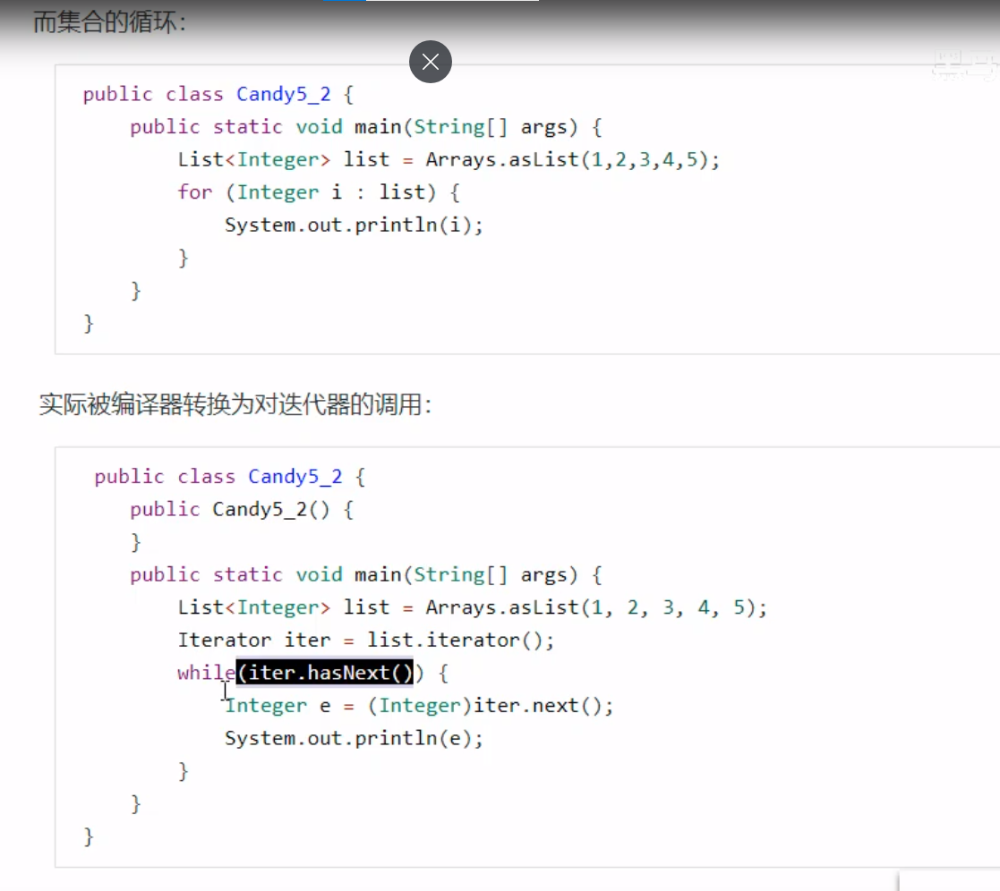
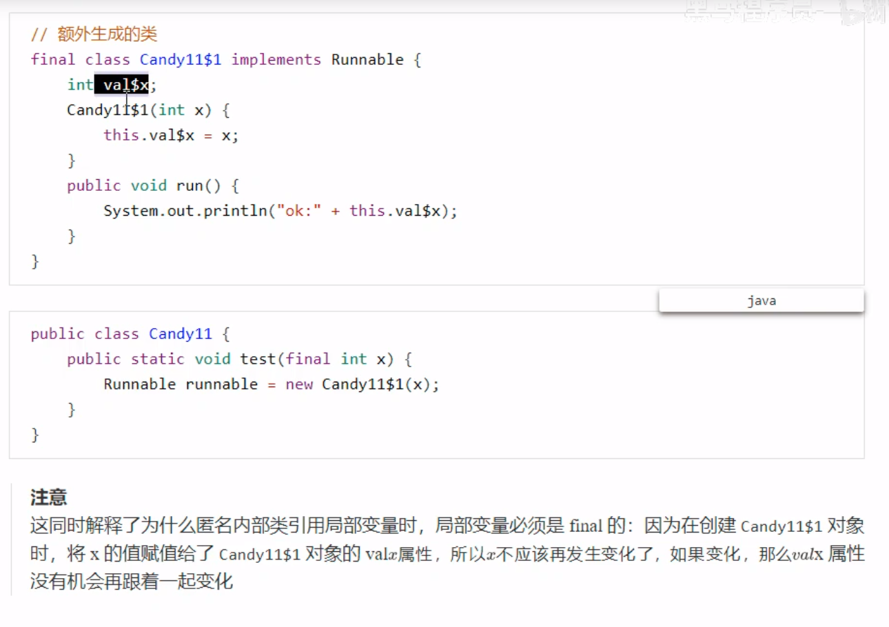

# JAVA基础

## 基本数据类型

### 1.基本数据类型有哪些

java提供了8种基本数据类型,其中分为6,1,1(六种数字类型[四个整数型,两个浮点型],一种字符类型,一种布尔型)

这里采用横向比较:

* 数据类型(都是有符号的,以二进制补码表示的整数)

  > byte: 8位
  >
  > short:16
  >
  > int:32
  >
  > long:64

  这样就意味着数据类型超出范围后会从最小值开始,那有什么处理方案? 这里我的思路是如果要求100%精确,转成long,否则考虑用布隆过滤器或者bitmap之类的数据结构来存储

### 2.包装器类型

首先提出疑问: 为什么要使用包装器类型 ,其有哪些?

> Boolean，Character，Integer，Byte，Short，Long，Float，Double
>
> 因为有了包装器类型的话,一个数字就可以看做是一个对象,从而赋予它其他属性和功能


那接下来的问题是: 啥是装箱和拆箱,其实现方法?

> 装箱：自动将基本数据类型转换为包装器类型。
>
> 拆箱：自动将包装器类型转换为基本数据类型。


装箱的实现方式:

> * 使用构造器(这种方式就没办法利用缓存 , Integer的缓存是 -128 ~ 127)
> * Integer.valueOf(int)
> * 自动装箱:Integer i=8;


拆箱的实现方式:

> * 使用包装类的intValue()方法,eg: int a=i.intValue();
> * 自动拆箱


哪些地方触发自动拆装箱 : 

​	[int 和 integer ：装箱和拆箱的过程，会用到什么方法，你觉得这个会对性能有影响吗，原因是什么（百度一面） - 云+社区 - 腾讯云 (tencent.com)](https://cloud.tencent.com/developer/article/1690009)

1. 往集合类中存基本数据类型

2. 包装类型与基本数据类型进行大小的比较,包装类型自动拆箱(通过反编译看到)

3. 包装类型的运算

4. 三目运算符的使用

   >这其实是三目运算符的语法规范：当第二，第三位操作数分别为基本类型和对象时，其中的对象就会拆箱为基本类型进行操作。

   ```java
   boolean flag = true;
   Integer i = 0;
   int j = 1;
   int k = flag ? i : j;
   
   boolean flag = true;
   Integer i = Integer.valueOf(0);
   int j = 1;
   int k = flag ? i.intValue() : j;
   ```

5. 函数参数与返回值


**缓存机制**

为什么 Integer的缓存范围是[-128,127] ?

>因为这个范围的数字是最被广泛使用的。在程序中，第一次使用Integer的时候也需要一定的额外时间来初始化这个缓存。


性能方面: 对速度和内存有一定影响的


### 3. 逻辑运算符 和 三元运算符

- &: 逻辑与

- &&：短路与

  >当符号左边是false时，& 继续执行符号右边的运算，&&不再执行符号右边的运算

- |： 逻辑或
- ||：短路或
- ! ：逻辑非
- ^ : 逻辑异或


三元表达式

> 一: 格式：(条件表达式)?表达式1:表达式2
> 1.条件表达式为 true ,运算后的结果是表达式1
> 2.条件表达式为 false ,运算后的结果是表达式2
>
> 二: 表达式1和表达式2位同种类型
>
> 三: 三元运算符与if-else的联系与区别：
> 1.三元运算符可简化为 if-else 语句
> 2.三元运算符要求必须返回一个结果
> 3.if后的代码块可有多个语句
> 4.如果程序可以使用三元运算符，又可以使用if-else结构，那么优先选择三元运算符。原因：简单，执行效率高。


### 4. throw 和 throws 的区别？

throw:

在方法内抛出某种异常对象,如果异常对象是非RuntimeException ,则需要在方法申明时加上该异常的抛出,即 throws 语句 或在方法体内 try catch 处理该异常,若不对该异常进行处理,则编译报错. 在 try-catch 过程中,如果捕捉到该异常,则throw异常语句后面的语句块都不执行,直接执行catch中的语句块

throws：

方法的定义上使用 throws 表示这个方法可能抛出某种异常
需要由方法的调用者进行异常处理

### 5.  Java异常处理中try-catch-finally代码块与return语句

[(27条消息) Java异常处理中try，catch，finally代码块与return语句_rolling_kitten的博客-CSDN博客](https://blog.csdn.net/rolling_kitten/article/details/105737923)


> JVM层面中多个异常是用同一个槽位来存储的,原因是异常出现时,只能进入Exception table 中的一个分支,JDK1.7后出现multi-catch的情况,也就是 catch(异常1 | 异常2 | 异常3 e), finally中的代码其实在字节码层面我们可以看到都是复制一份放到 try,catch中的后面,所以一共有三份,最后一份是防止catch不到异常,如Error,就执行最后一份代码

从下面这段代码看,只要finally有 return 语句 ,那么这个方法的结束就是在 finally的return语句执行后,**并且还会吞掉异常**(try中 10/0的异常将被吞掉)

这里提出个问题:如果catch里面有return语句，请问finally的代码还会执行吗?如果会，请问是在return前还是return后？

答案从上面的链接找

```java
public static void main(String[] args) {
        System.out.println(testFinally());
    }
    public static int testFinally(){
        int i=0;
        {
            try {
                System.out.println(10/i);
                i=10;
                return i;
            } catch (Exception e) {
                i=20;
                return i;
            }
            finally {
                i=30;
                System.out.println("finally代码块执行了");
                return i;
            }
        }
		//这里假设没出现异常,那么要返回的i将会被放进 slot,这里假设就是放到slot1,这一步目的是为了固定返回值,然后执行finally的语句,若是finally没有return语句的话,那么finally执行完后将会载入slot1的值到栈顶,接着返回栈顶的值
        // ans = 30
```


### 6. final，finally，finalize

[Java中final、finally、finalize的区别与用法 - smart_hwt - 博客园 (cnblogs.com)](https://www.cnblogs.com/smart-hwt/p/8257330.html)

final

> final是java中的关键字,下面分为几点来介绍:
>
> 对于加上 final的类,意味着该类无法被其他类所继承,也就是没有子类,String就是例子
>
> 变量加上final就意味着成为常量
>
> *方法加上final就代表只能使用,无法重载这个得查查*

finally

> 是java的一种异常处理机制,无论是否出现异常都会执行finally中的代码,所以一般非内存资源的关闭都是放在finally中

finalize

> Java中的方法名,在垃圾收集器将对象从内存中清除前所要做的工作.
>
> 何时调用? 在垃圾收集器判断这个对象已经没被引用时调用该对象的finalize()方法,但只有第一次调用有效(也就是第一次调用可以自救成功),**第二次要清除该对象不会再调用该方法**

### 7. == 和equals，深拷贝和浅拷贝


### 8. 两个for循环，如何跳出

## String

### 1. String 不可变性的好处

1. 便于实现String常量池

   > 该常量池的实现使得不同字符串变量都可以指向池中的同一个字符串,大大减少 heap空间

2. 避免网络安全问题

   > 由于字符串的不可变性,其指向对象的值是无法改变的,这就避免了其值被黑客修改

3. 保证了在多线程环境下的并发安全问题

   > 同一个字符串实例可以被多个线程共用,不用担心线程安全问题而使用同步

4. 避免本地安全性问题

   > 原本要加载的类被修改成其他,可能会对jvm或数据库造成影响

5. 加快字符串处理速度

   > 因为字符串是不可变的，所以在它创建的时候hashcode就被缓存了，不需要重新计算。这就使得字符串很适合作为Map中的键，字符串的处理速度要快过其它的键对象。这就是HashMap中的键往往都使用字符串。


### 2. string，stringBuilder(jdk1.0)，StringBuffer(jdk1.5)区别

1. 可变性与不可变性方面

   > string是不可变
   >
   > 后两个是可变

2. 线程安全方面

   > 前两个是线程安全的,string是由于其不可变性,stringBuilder的线程安全是由于公共方法都是同步的
   >
   > StringBuffer是线程不安全的

3. 字符串连接符 '+'在内部用的是stringBuilder类


### 3. String和byte的转换

1. 构造器

   ```java
   String s=new String(bytes, StandardCharsets.UTF_8)
   ```

2. 用String.getBytes()方法将字符串转换为byte数组，通过String构造函数将byte数组转换成String

   注意：这种方式使用平台默认字符集

   ```java
   //string 转 byte[]
   
   String str = "Hello";
   
   byte[] srtbyte = str.getBytes();
   
   // byte[] 转 string
   
   String res = new String(srtbyte);
   
   System.out.println(res);
   
   
   
   //当然还有可以设定编码方式
   的
   
   String str = "hello";
   
   byte[] srtbyte = null;
   
   try {
   
   	srtbyte = str.getBytes("UTF-8");
   
   	String res = new String(srtbyte,"UTF-8");
   
   	System.out.println(res);
   
       } catch (UnsupportedEncodingException e) {
   
   	// TODO Auto-generated catch block
   
   	e.printStackTrace();
   
       }
   
   ```

   


## 容器

### 1. ArrayList 和 LinkedList 的区别

1. 数据结构方面

   > ArrayList是实现了基于动态数组的数据结构，LinkedList是基于链表结构
   >
   > 对于随机访问(的get和set方法)，ArrayList要优于LinkedList，因为LinkedList要不断移动指针查找。
   >
   > 对于新增和删除操作(add和remove)，LinkedList比较占优势，因为ArrayList要移动数据。

2. 浪费空间方面

   > ArrayList的空间浪费是在 数组的结尾留有一定的空闲位置,而LinkedList则是每一个元素都需要消耗一定的空间

3. 扩容方面

   > LinkedList 是链表结构,不需要扩容

   ArrayList扩容机制 : 

   添加元素时会使用 ensureCapacityInternal()方法来保证容量足够,如果不够,需要使用 grow()方法进行扩容,新容量大小为原来容量的1.5倍,底层使用**Arrays.copyOf()这个方法来拷贝原数组,该方法是浅拷贝**


4. 增删查改

   LinkedList:

   > 内部维护着 first 和 last 结点,一开始均为null

### 2. fail-fast(快速失败机制)

当迭代集合的过程中发现该集合在结构上发生改变(增,删)时,就有可能发生 fail-fast,即抛出ConcurrentModificationException异常

这里举 ArrayList 为例子:

增删就不说了,这里要讲的是 在使用 Iterator 遍历 集合的过程中,发生 fail-fast的情况

单线程环境:

```java
public static void main(String[] args) {
    List<String> list = new ArrayList<>();
    for (int i = 0 ; i < 10 ; i++ ) {
        list.add(i + "");
    }
    Iterator<String> iterator = list.iterator();
    int i = 0 ;
    while(iterator.hasNext()) {
        if (i == 3) {
             list.remove(3);
        }
        System.out.println(iterator.next());
        i ++;
    }
} 
```

这里使用 集合的remove()方法为什么就会发生fail-fast呢?


下面这段代码,每一个方法都用到了checkForComodification();来检查expectedModCount == modCount是否成立,直接用 ArrayList的remove方法删除一个元素,是会造成 modCount更新,这样一来 内部类Itr的expectedModCount没有跟着更新自然就造成了两个数不等于,从而抛出异常.

这里的解决办法是: 调用 Itr自己的remove方法,为什么这个方法就没问题了呢? 该方法虽然也是调用 ArrayList的remove方法,但在最后是会更新 expectedModCount 的值,使其和当前 modCount的值一样,这样就不会出现两值不相等的情况从而抛出异常了

(调用了集合类的remove()方法，modCount在remove()中是被重新赋值了的。expectedModCount在迭代器的remove()方法里被重新赋值ModCount保证的相等成立,这句话也可以)

```java
    /**
     * An optimized version of AbstractList.Itr
     */
    private class Itr implements Iterator<E> {
        int cursor;       // index of next element to return
        int lastRet = -1; // index of last element returned; -1 if no such
        int expectedModCount = modCount;
 
        public boolean hasNext() {
            return cursor != size;
        }
 
        @SuppressWarnings("unchecked")
        public E next() {
            checkForComodification();
            int i = cursor;
            if (i >= size)
                throw new NoSuchElementException();
            Object[] elementData = ArrayList.this.elementData;
            if (i >= elementData.length)
                throw new ConcurrentModificationException();
            cursor = i + 1;
            return (E) elementData[lastRet = i];
        }
 
        public void remove() {
            if (lastRet < 0)
                throw new IllegalStateException();
            checkForComodification();
 
            try {
                ArrayList.this.remove(lastRet);
                cursor = lastRet;
                lastRet = -1;
                expectedModCount = modCount;
            } catch (IndexOutOfBoundsException ex) {
                throw new ConcurrentModificationException();
            }
        }
 
        @Override
        @SuppressWarnings("unchecked")
        public void forEachRemaining(Consumer<? super E> consumer) {
            Objects.requireNonNull(consumer);
            final int size = ArrayList.this.size;
            int i = cursor;
            if (i >= size) {
                return;
            }
            final Object[] elementData = ArrayList.this.elementData;
            if (i >= elementData.length) {
                throw new ConcurrentModificationException();
            }
            while (i != size && modCount == expectedModCount) {
                consumer.accept((E) elementData[i++]);
            }
            // update once at end of iteration to reduce heap write traffic
            cursor = i;
            lastRet = i - 1;
            checkForComodification();
        }
 
        final void checkForComodification() {
            if (modCount != expectedModCount)
                throw new ConcurrentModificationException();
        }
    }
```


### 3. fast-safe(安全失败)

使用java并发包(java.util.concurrent)中的类来代替 ArrayList 和hashMap。
比如使用 CopyOnWriterArrayList代替 ArrayList， CopyOnWriterArrayList在是使用上跟 ArrayList几乎一样， CopyOnWriter是写时复制的容器(COW)，在读写时是线程安全的。该容器在对add和remove等操作时，并不是在原数组上进行修改，而是将原数组拷贝一份，在新数组上进行修改，待完成后，才将指向旧数组的引用指向新数组，所以对于 CopyOnWriterArrayList在迭代过程并不会发生fail-fast现象。但 CopyOnWrite容器只能保证数据的最终一致性，不能保证数据的实时一致性。
对于HashMap，可以使用ConcurrentHashMap， ConcurrentHashMap采用了锁机制，是线程安全的。在迭代方面，ConcurrentHashMap使用了一种不同的迭代方式。在这种迭代方式中，当iterator被创建后集合再发生改变就不再是抛出ConcurrentModificationException，取而代之的是在改变时new新的数据从而不影响原有的数据 ，iterator完成后再将头指针替换为新的数据 ，这样iterator线程可以使用原来老的数据，而写线程也可以并发的完成改变。即迭代不会发生fail-fast，但不保证获取的是最新的数据。


## 对象的创建和引用

大多数对象是存放于堆中,**(讲讲JVM层面对象的创建初始化)**,在执行引擎看来,引用就是告诉他从哪里获取到对象。有了大多数，那就有小部分，这里提出个问题，存放堆中不好吗？那这里我的理解是若是对象存放于堆中，想要被垃圾回收只能通过GC，若是该对象只有很短的生命周期，那这样就加重了GC的负担。这里可以提出设想：如果该对象不会造成内存泄漏的前提下，是不是可以将其分配到栈上，随着栈帧出栈而销毁。


这就是栈上分配对象，其实现前提是：

1. 逃逸分析 ： 判断对象的作用域是否逃逸出函数体
2. 标量替换 ： 将对象字段视为局部变量分配在栈中


栈上创建对象失败后,这就只能来到堆中创建,此处还有再优化的空间(再抢救一下)。

在堆上为对象分配内存就是把一块大小确定的内存从堆内存中划分出来，将对象放进去。常用的分配方法有指针碰撞和空闲列表两种实现方式。

这里着重说 指针碰撞 ：什么是指针碰撞？假设JVM虚拟机上，堆内存都是规整的。堆内存被一个指针一分为二。指针的左边都被塞满了对象，指针的右边是未使用的区域。每一次有新的对象创建，指针就会向右移动一个对象size的距离。这就被称为指针碰撞。

这个指针碰撞在并发环境下有个问题：如果线程A正在给对象分配内存，还没来得及修改指针，同时线程B也在为一个对象分配内存，用的指针是没修改过的，这样就出现问题了，那要如何做？ **在分配内存的时候堆上锁**（这部分再补充），另一种就是每个线程都有自己的一块内存分配区域，只有自己能在该空间上分配内存，其他线程只能访问，不能写，这块内存占用的是堆中Eden的内存


总的来说：创建对象的流程首先是尝试在栈上创建，不行就尝试在TLAB上创建，对象过大就尝试在Eden创建，对象还是过大就通过内存担保机制分配到老年代【[(30条消息) 为什么大对象要直接放入到老年代_绅士jiejie的博客-CSDN博客_大对象为什么直接在老年代](https://blog.csdn.net/weixin_38106322/article/details/109035529)】，对于老年代来说空间还是不足就触发一次Full GC，仍然无法存下就报OOM


四种引用：

首先提出问题：为啥要有这四种引用？JDK1.2之后引入了强引用、软引用、弱引用、虚引用。目的是更加灵活地控制对象的生命周期。他们的不同之处就是GC对待他们的处理方式。除了强引用外，软弱虚都在java.lang.ref包下，同时还有一个包下可见的finalReference终结引用，用于实现finalize()调用。

好，接下来四种引用详细介绍下。 - -！[(30条消息) 聊聊四大引用和引用对象_❀神花❀的博客-CSDN博客](https://blog.csdn.net/qq_44793993/article/details/117572702?spm=1001.2014.3001.5501)

强引用：Object指针指向new出来的对象一般情况下就是强引用，该对象什么时候被回收呢？当Object指针指向别的内存区域或设置为null时，new Object（）对象不再被任何一个指针指向时，就可以被GC回收


软引用：用来描述一些有用但不是必须的对象，内存空间够，垃圾收集器就不回收他，否则回收。适用于缓存，不会OOM。

软引用可以和一个引用队列（referenceQueue）联合使用，如果软引用所引用的对象被JVM回收，这个软引用（软引用对象本身的引用）就会被加入到与之关联的引用队列中。

应用场景：用作缓存，指向被缓存的对象。
当垃圾回收器在某个时刻决定回收软可达对象时，会将软引用放入一个引用队列，然后由GC线程释放指向的对象。

如果内存足够，直接通过软引用取值，无需从繁忙的真实来源查询数据，提升速度（类似缓存）。当内存不足的时候，自动删除这部分缓存数据，从真正的来源查询这些数据

```java
Object o = new Object();
SoftReference<Object> soft = new SoftReference<>(o);
o=null;//释放强引用
System.out.println(soft.get());//有时候会返回null

```

软引用有一个时钟字段clock，由GC更新。timestamp在每次get()时会更新。也就是说内存是否吃紧，**GC时间间隔**是其中一个考虑因素（jvm代码底层也会考虑到当前可用堆内存之类的）。


弱引用：用来描述非必需对象，被虚引用关联的对象其生命周期只能到下一次垃圾回收，无论内存是否充足

```java
WeakReference<String> ss = new WeakReference<String>(new String("hello"));
System.out.println(ss.get());//hello
System.gc(); //通知JVM的gc进行垃圾回收
System.out.println(ss.get());//null

```


虚引用：虚引用主要用来跟踪对象被垃圾回收的活动（唯一目的就是跟踪垃圾回收进程，能够在对象被收集器回收时收到一个jvm通知），在任何时候都可能被垃圾回收器回收，**必须与引用队列关联使用**。使用java.lang.ref.PhantomReference类表示


finalize（）方法：

java的对象起初只有两种状态：生或死。
而通过引用finalize方法，对象的状态可以分为三种：可达、复活、不可达。
Java提供了对象终止（finalization）机制来允许开发人员提供对象被销毁之前的自定义处理逻辑
当垃圾回收器发现没有引用指向一个对象时，会调用该对象的finalize方法。

当一个对象是“根结点可达”的，那么它便是可达状态。当jvm发现一个根结点不可达的对象时，会调用该对象的finalize()方法。finalize方法的执行，给了不可达对象一次尝试复活的机会，如果finalize中具有给对象添加引用的逻辑，那么该对象将进入复活状态。（finalize如果没有被重写，那么调用finalize方法将是没有意义的，因此JVM可能不会调用“没有必要”调用的finalize方法）
一个对象的finalize方法最多之后执行一次（最多只能复活一次，如果每次都调用finalize方法，那么很可能出现内存泄露的情况）。
如果一个不可达对象的finalize没有被重写，或者已经被调用过一次，那么它将被视为垃圾对象被回收。

对象的回收
一个对象被回收之前，至少需要经过两次标记。
【1】如果对象处于根结点不可达状态，它将经过第一次标记
【2】对于被第一次标记的对象，如果它的finalize方法没有被重写，或者已经被调用过一次，那么它将被标记为垃圾对象并被回收。

如果finalize方法被重写，但是没有被执行，将会被插入到finalize队列，java的一个专门负责扫描finalize队列的后台线程，会在某个时间段对存放在finalize队列的对象，调用finalize方法。不过这个线程的优先级很低，因此finalize方法的执行是无法被包装的（无法保证什么时候执行，甚至是否被执行）

finalize队列其实也是一个引用队列，finalize方法的调用依赖终结器引用对象，而存入finalize队列前的对象将会被封装为终结器引用对象。


## 内存泄露

[(30条消息) 聊聊四大引用和引用对象_❀神花❀的博客-CSDN博客](https://blog.csdn.net/qq_44793993/article/details/117572702?spm=1001.2014.3001.5501)

对象都是有生命周期的，如果**长生命周期的对象持有短生命周期的引用**，就有可能出现内存泄露。
例如一个对象仅仅在方法内使用一次，但是由于外部的成员引用了该对象，因此这个对象无法被释放，生命周期被强行拉长（但是却没有被再次使用）。流操作、一些框架、JDBC等我们都必须记得调用close（）方法，实质上就是防止内存泄露。


## ThreadLocal

[(30条消息) 聊聊四大引用和引用对象_❀神花❀的博客-CSDN博客](https://blog.csdn.net/qq_44793993/article/details/117572702?spm=1001.2014.3001.5501)


项目使用时由于线程复用，所以记得remove，不然容易造成 先get再set出事故


threadLocal是一种线程隔离机制，每个线程内部都维护着一个独立的ThreadLocalMap，其中的entry的key指向threadLocal，这里是弱引用；entry的value就是要存储的值。

threadLocal的set（xxx）方法就是往ThreadLocalMap底层数组放入一个key为当前threadLocal对象，值为xxx的entry对象

threadLocal的get方法就是通过当前threadLocal对象计算出index，然后从该线程维护的ThreadLocalMap取到对应的entry，再取到value

上面强调了 entry里面的key是弱引用，这意味着每一次GC都会使得key=null，释放threadLocal，但entry和value的引用都是强引用，因此他们的生命周期实际上是与线程绑定的。这段内存泄露发生在key指针指向null，同时线程对象没有被回收的时间。

解决办法你提提？ 那我的想法如下：既然value的生命周期和线程同步，那线程撤销不就行了。。。--！但大多数情况下多线程是会使用线程池**（线程池的好处展开）**，线程不会被真正销毁，那这种情况下真的可能出现内存泄漏，所以可以使用**remove方法（这块不熟）**

Java为了最小化内存泄露的可能性和影响，在ThreadLocal的get、set的时候，都会检查当前key所指的对象是否为null，是则删除对应的value，让它能被GC回收


## 泛型

### 1. 泛型擦除

局部变量信息虽然没有被擦除但也没有办法通过反射拿到,方法的参数和返回值带的泛型信息才可以用反射得到


## 语法糖

可变参数 String... args其实就是String[] args,假设 foo(String... args)调用的时候用foo(),那么不会传递一个null,而是等价于 foo(new String[]{}),创建一个空数组


foreach

配合数组以及所有实现了Iterable接口的集合类一起使用,其中Iterable用来获取集合的迭代器(Iterator)




swith(String/枚举)


枚举


try-with-resources


方法重写时的桥接方法(子类的返回值可以是父类返回值的子类)


匿名内部类




魔数


## sleep()和wait()的区别

wai()是Object的方法，而sleep()是Thread的静态方法

wait()会释放锁，sleep()不会

使用wait()挂起期间，线程会释放锁，因为如果不释放锁，其他线程就无法进入对象的同步方法或同步控制块中，无法执行notify或nitifyAll来唤醒挂起的线程，这就造成死锁

wait，notify，nitifyAll只能在同步方法或同步控制块中使用，否则会在运行时抛出IllegalMonitorStateException

sleep在任何地方都可以使用

[Java中sleep()和wait()的区别 - 简书 (jianshu.com)](https://www.jianshu.com/p/87a7f24c45d4)
