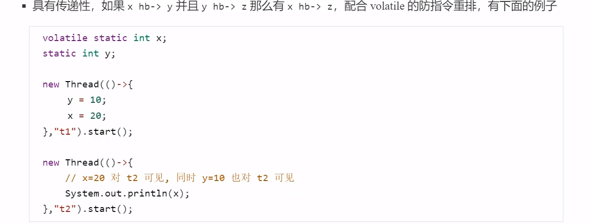

# JMM

## 琐碎

i++：如果是static i的话，JVM字节码指令把静态变量和常量1都放到操作数栈，修改后的值再存入静态变量i；如果局部变量 i 的话，就是调用iinc在局部变量槽上更新

System.out.println()用了 synchronized（）使得工作内存直接到主存读取数据

在线程数少于cpu核数的时候,CAS划算

## 特性

原子性

可见性

有序性

## 指令重排序

为什么有这个东西?

因为现代CPU支持多级指令流水线,例如支持同时执行 取指令 - 指令译码 - 执行指令 - 内存访问 - 数据写回的处理器 , 就可以称为 五级指令流水线,变相提高指令地吞吐率

## volatile 原理

volatile的底层实现原理是**内存屏障**，Memory Barrier（Memory Fence）

- 对 volatile 变量的写指令后会加入写屏障
- 对 volatile 变量的读指令前会加入读屏障

## happens-before

规定了对共享变量的写操作对其他线程的读操作可见

* 线程解锁m之前对变量的写,对于接下来对m加锁的其他线程对该变量的读可见
* 线程对 volatile变量的写,对接下来其他线程对该变量的读可见
* 线程start前对变量的写,对该线程开始后对该变量的读可见
* 线程结束前对变量的写,对其他线程得知他结束后的读可见(比如其他线程调用 t1.isAlive() 或 t1.join()等待他结束)
* 线程t1打断t2前对变量的写,对于其他线程得知t2被打断后对变量的读可见(通过 t2.interrupted , t2.isInterrupted)
* 对变量默认值(0,null,false)的写,对其他线程对该变量的读可见
* 具有传递性

