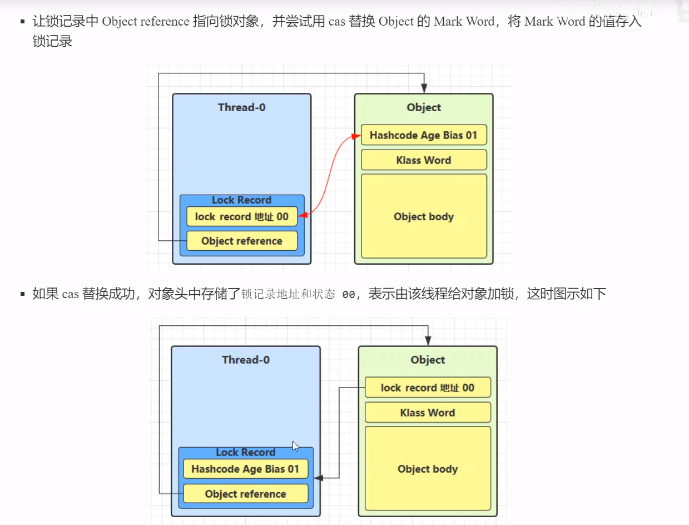

# JUC


## interrupt 

如果是sleep时被打断会出现异常,且其打断标记会被清除,所以得调用当前线程的interrupt设置打断标记为true,如果是处于运行状态,那么其打断标记会设置为true

线程1先将对象的mark复制到自身的锁记录,再将对象的mark word设置成线程的锁记录地址

lamada表达式在接口上加注解@FunctionalInterface,该接口的抽象方法只能有一个

slf4j:

log.debug("{}",task.get())//{}表示占位符,值为后面的get


**两阶段终止模式**


## 查看进程线程的方法

ps -fe 查看所有进程

> ps -fe | grep java

ps -fT -p \<PID\> 查看某个进程(PID)的所有线程

kill 杀死进程

top 按大写H切换是否显示线程

top -H -p \<PID\> 查看某个进程(PID)的所有线程


jps 命令查看所有Java进程

jstack \<PID\> 查看某个Java进程(PID)的所有线程状态

jconsole 查看某个Java进程中线程的运行情况(图形界面)


## 线程上下文切换(Thread Context Switch)

1. 线程的cpu时间片用完
2. 垃圾回收
3. 有更高优先级的线程需要运行
4. 线程自己调用了 sleep , yield , wait , join , park , synchronized , lock等方法


Context Switch发生时,需要由操作系统保存当前线程的状态,并恢复另一个线程的状态,Java中对应的概念就是程序计数器,其作用是记录了下一条JVM指令的执行地址

* 状态包括程序计数器、虚拟机栈中每个栈帧的信息，如局部变量、操作数栈、返回地址等
* Context Switch 频繁发生会影响性能


### 线程在操作系统的5种状态和Java中的6种状态


## 共享模型之管程

临界区线程安全问题:

阻塞式解决方案: synchronized(对象锁) ,Lock

非阻塞式: 原子变量


### synchronized

实际用对象锁保证了临界区内代码的原子性,尝试获取锁才会阻塞,如果一个线程使用synchronized,一个不用,那等于没用,因为不获取锁就不会阻塞

1. 加载公共对象上

2. 加载成员方法上

   ```java
   public class Demo {
   	//在方法上加上synchronized关键字
   	public synchronized void test() {
   	
   	}
   	//等价于
   	public void test() {
   		synchronized(this) {
   		
   		}
   	}
   }
   ```

3. 加载静态方法上

   ```java
   public class Demo {
   	//在静态方法上加上synchronized关键字
   	public synchronized static void test() {
   	
   	}
   	//等价于
   	public void test() {
   		synchronized(Demo.class) {
   		
   		}
   	}
   }
   ```

   


### 变量的线程安全分析

成员变量和静态变量是否线程安全?

若没共享,则安全

若被共享,根据其状态是否能够改变? 只读:安全 ; 读写:则是临界区,需要考虑线程安全


常见线程安全类

- String
- Integer
- StringBuffer
- Random
- Vector （List的线程安全实现类）
- Hashtable （Hash的线程安全实现类）
- java.util.concurrent 包下的类


这里说它们是线程安全的是指，多个线程调用它们**同一个实例的某个方法时**，是线程安全的(多个线程同时调用 hashtable.put,不会被线程上下文切换干扰)

- 它们的每个方法是原子的（都被加上了synchronized）
- 但注意它们**多个方法的组合不是原子的**，所以可能会出现线程安全问题


外星方法


## Java对象头

32位虚拟机:

普通对象:

Object Header(64 bit): Mark Word (32 bit)   Klass Word(32 bit)


数组对象:

96 bit , 因为最后多出 array length(32 bit)


Mark Word结构


## Minitor

监视器 或 管程


synchronized 字节码层面是 首先拿到引用地址,复制一份存储到一个临时变量(slot 1) , 将 lock对象的 MarkWord 置为 Monitor指针

操作完后 aload_1 拿到lock引用 , monitorexit 将lock对象的MarkWord重置,唤醒EntryList


如果在同步代码块出现异常, 也是会释放锁的(拿到引用地址,重置,唤醒,抛出异常)


## 轻量级锁

创建锁记录(Lock Record) 对象 , 每个线程的栈帧都会包含一个锁记录的结构,内部可以存储锁定对象的Mark Word




轻量级锁在没有竞争时(也就是当前只有自己一个线程),每次重入都需要执行CAS操作,JDK6引入了偏向锁来做优化 : 只有第一次使用CAS将线程ID设置到对象的Mark Word头, 之后发现这个线程ID是自己的就表示没有竞争,不用重新CAS.以后只要不发生竞争,这个对象就归该线程所有


调用一个对象的hashcode会撤销掉该对象的偏向锁,但其他锁没影响,因为有存储锁信息的地方(线程栈帧的锁记录里,Monitor对象里)


### 批量重偏向

当撤销超过20次后（超过阈值），JVM会觉得是不是偏向错了，这时会在给对象加锁时，重新偏向至加锁线程


### 批量撤销

当撤销偏向锁的阈值超过40以后，就会将**整个类的对象都改为不可偏向的**

### 锁膨胀

尝试加轻量级锁过程中,CAS操作无法成功,需要进行锁膨胀,将轻量级锁变为重量级锁


Monitor获取失败到陷入阻塞中间有自旋优化,如果成功则避免阻塞

自旋会占用cpu,得多核才有优势


## wait sleep

sleep(long n) 和 wait(long n)的状态都是 TIMED_WAITING,不带参数的wait进入的是 WAITING状态


## 同步模式之保护性暂停

Guarded Suspension , 用一个线程等待另一个线程执行的结果

一 一对应模式,


### join原理用了保护性暂停模式


## park 和 unpark

与 wait/notify的区别

- wait，notify 和 notifyAll 必须配合**Object Monitor**一起使用，而park，unpark不必
- park ，unpark 是以**线程为单位**来**阻塞**和**唤醒**线程，而 notify 只能随机唤醒一个等待线程，notifyAll 是唤醒所有等待线程，就不那么精确
- park & unpark 可以**先 unpark**，而 wait & notify 不能先 notify
- **park不会释放锁**，而wait会释放锁


## 定位死锁

jps+jstack ThreadID

jconsole检测死锁


## 活锁

死锁: 两线程都持有对方的锁,导致两线程都阻塞住了


活锁: 两线程都不阻塞,但都改变对方的结束条件

解决办法: 执行时间有一定的交错,睡眠随机数


饥饿: 某些线程因为优先级太低，导致一直无法获得资源的现象。

在使用顺序加锁时，可能会出现饥饿现象


## ReentrantLock

**和synchronized相比具有的的特点**

- 可中断
- 可以设置超时时间
- 可以设置为公平锁 (先到先得)
- 支持多个条件变量( 具有**多个**waitset)


## CAS

ABA问题 用版本号


# LongAdder

缓存行 和 伪共享


# 共享模型之不可变

String构造器传入一个 char数组,调用Arrays.copyOf拷贝出新的一个数组,防止被修改


保护性拷贝


## 自定义数据连接池


## 线程池

### 线程池状态


## AQS

### 介绍


lambda表达式只能引用局部的常量,不能局部的变量


## HashMap 并发死链


1.7头插法的死锁:

假设一个链表只有两个节点,如果一个线程在

```java
Entry<K,V> next = e.next;
```

这里挂起


另一个线程扩充完,这就导致执行

```java
e.next = newTable[i];
```

这一句代码是去共享的table拿头节点,这样就坏了,本来就做的就是头节点变尾结点,其next应该为null,但现在头节点的next链接了被反转(头插法的原因)的尾结点,现在成了一个循环链,头关注尾,尾关注头,永远不会出现e = = null 的情况


# 分割线


## synchronized

### 特点:

1. 原子性

   > 线程操作同步块代码时，是**原子**的（即使OS层面存在线程切换，但是java层面我们将线程访问共享变量的整套同步代码的操作看作是原子的

2. 可见性

   > 同步块具有**可见性**，线程**写共享同步块内的共享变量**，会使得其他线程保存该共享变量的对应缓存行**失效**，读共享变量则会重新从主存中去读取。

3. 有序性

   > synchronized块内的代码不会被重排序到synchronized块外。（synchronized同步块可以看作单线程，遵循as-if-serial，会进行重排序优化）


### monitor

synchronized包裹的内容可以是字符串、class对象、this（synchronized实例方法包裹的是this，而synchronized类方法包裹的是class对象）等。不管它包裹的什么，那一定是一个对象。


monitor在底层，对应C++定义的objectMonitor。

**synchronized关联的是monitor结构，而monitor和Object对象绑定**


- 当线程执行到临界区代码时，如果使用了synchronized，会先查询synchronized中所指定的对象(obj)**是否绑定了Monitor**。

  - 如果**没有绑定**，则会先去去与Monitor绑定，并且将Owner设为当前线程。

  - 如果已经绑定，则会去查询该Monitor是否已经有了Owner

    - 如果没有，则Owner与将当前线程绑定
    - 如果有，则放入EntryList，进入阻塞状态(blocked)

    > 在并发情况下,线程执行到临界区代码时,会尝试一次CAS使自己成为 Owner,如果第一次CAS失败则说明抢占失败, 接着会尝试自适应自旋,在自旋期间如果成功就将Owner修改为自己,并且将count加一。执行完毕将count减一，复位owner，并且唤起entryList阻塞的线程（实现上通常唤醒队头线程，不过如果没抢到还会进入entryList队尾，通常流动性很大，不会出现饥饿）。 如果失败就进入Monitor的EntryList同步队列,并且 调用park()阻塞当前线程,底层对应系统调用**将当前线程对象映射到的操作系统线程挂起，并让出CPU**
    >
    > owner线程调用wait，则进入waitSet并阻塞（同样对应park调用），同时让出CPU。只有其他线程调用notify它才会被唤醒，而且唤醒后进入entryList，当owner被复位后，同entryList其他线程进行竞争，当称为owner将从原执行位置继续向下执行。


- 当Monitor的Owner将临界区中代码执行完毕后，Owner便会被清空，此时EntryList中处于**阻塞**状态的线程会被**叫醒并竞争**，此时的竞争是**非公平的**
- **注意**：
  - 对象在使用了synchronized后与Monitor绑定时，会将对象头中的**Mark Word**置为Monitor指针。
  - 每个对象都会绑定一个**唯一的Monitor**，如果synchronized中所指定的对象(obj)**不同**，则会绑定**不同**的Monitor


### java对象内存组成

每个java对象在内存布局中由三部分组成：**对象头**、**实例数据**和**填充数据/对齐填充**。

其中对象头又可以分为两部分：**标记字段 mark word** 和 **类型指针**


对象头格式:


如果一个对象处于重量级锁状态，那么mark word将具有一个指向重量级锁的指针。


### synchronized的优化(锁升级)

JDK6之后的优化是:

1. 锁升级机制
2. 锁消除。锁消除是一种编译器优化，通过逃逸分析消除部分无必要的同步代码。
3. 锁粗化。在编译期间将相邻的同步代码块合并成一个大的同步代码块，减少反复申请、释放造成的开销。（即使每次都可以获得锁，那么频繁的操作底层同步队列也将造成不必要的消耗）
4. 自适应自旋锁。synchronizedCAS占用owner失败后，会进行自旋尝试，这个时间不是固定的，而是**前一次在同一个锁上的自旋时间以及锁的拥有者的状态来决定的**


锁的状态取决于对象头的mark word低两位。


锁升级是单向的（也不一定，和JVM的实现有关）：


#### 锁升级过程中mark word存储的变化：

当对象状态为**偏向锁**时，mark word存储的是**偏向的线程ID**，当状态为**轻量级锁**的时候，存储的是**指向线程栈中 lock record 的指针**，当状态为**重量级锁**的时候，**指向堆中monitor对象的指针**。


线程在进入同步块之前，JVM会在当前线程的栈帧中创建一个**锁记录 lock record**（不同的锁类型对lock record具有不同的处理，偏向锁中lock record是空的，所以偏向锁调用锁对象的hashcode会撤销偏向锁状态，因为lock record没有创建所以mark word和偏向锁有关的信息就丢失了，而轻量级锁和重量级锁中保存了lock record的地址），这个结构用于保存对象头mark word初始结构的复制，称为**displaced mark word**

其中displaced mark word用于保存对象mark word未锁定状态下的结构（用于替换——**因为mark word的结构依据锁的状态不同动态变化着，因此必须有一个结构用于保存mark word的原始状态**，这个结构就是保存在线程栈帧中的displaced mark word）。


#### 偏向锁

偏向锁——一段同步代码总是被一个线程所访问（不存在另外一个线程），那么该线程会自动获取锁，降低获取锁的代价。（单线程环境下都是偏向锁）
偏向锁在一个线程第一次访问的时候将该线程的id记录下来，下次判断如果还是该线程就不会加锁了。如果有另一个线程也来访问它，说明有可能出现线程并发。此时偏向锁就会升级为轻量级锁。

偏向锁的目的——在某个线程获得锁之后，消除这个线程重入（CAS）的开销，看起来让这个线程得到了偏向。
偏向锁只需要在设置thread ID时进行一次CAS操作，后续发生重入时仅仅进行简单的thread id检查，**并且向线程栈帧中添加一个空的lock record表示重入**，不需要CAS指令。（偏向锁一旦被某个线程获得，除非出现竞争导致撤销，否则线程不会主动释放锁即thread id只能被设定一次）

如果在运行过程中，遇到了其他线程抢占锁，则持有偏向锁的线程会被挂起（走到安全点后stop the world），JVM会消除它身上的偏向锁，将锁恢复到标准的轻量级锁。

偏向锁是对单线程场景下的优化，例如消除第三方框架同步代码带来的性能损失


#### 轻量级锁

线程试图占用轻量级锁时，必须使用CAS指令，这是相对于偏向锁提升的开销。轻量级锁在对象头的mark word体现中，就是一个指向lock record的指针（偏向锁则是thread id）。
线程monitorenter时，栈帧中创建一个锁记录结构，然后将对象的mark word复制过去，然后使用CAS试图修改对象mark word的lock record地址值，成功则代表成功获取锁，失败则要么存在重入，或者存在竞争并通知JVM执行锁升级

轻量级锁适用于线程交替执行同步块的情况，如果存在同一时间访问同一锁即冲突访问的情况，就会导致轻量级锁膨胀为重量级锁。在线程总是能交替执行的场景（并发量小、同步代码执行快速），可以防止monitor对象的创建。

轻量级锁是为了在线程交替执行同步块时提高性能，而偏向锁则是在只有一个线程执行同步块时进一步提高性能


#### 重量级锁

如果显示调用了hashCode()、notify、wait方法则会导致对象直接升级为重量级锁


重量级锁之所以重是因为底层依赖OS的mutex互斥量实现，而依赖堆中的monitor对象（Hotspot对应objectMonitor实现）。
当然了，如果单线程下，或者不存在“竞争明显”的情况下，没有线程会被挂起，也不会出现进程切换，但是仍然需要为使用的锁对象创建绑定的monitor并且频繁CAS设置owner。用户态与内核态的切换主要是由于park()底层涉及系统调用导致的，如果CPU上下文切换的时间接近同步代码的执行时间，那么就显得效率很低下。


### 为什么wait/notify需要被同步块包裹

**从实现的角度**：

wait和notify依赖对象绑定的锁，只有获取锁的线程才能执行该方法（需要借助monitor关联的waitSet），否则将会抛出IllegalMonitorStateException异常（没有获取monitor）。

当一个线程调用一个对象/monitor的notify（）方法时，调度器会从所有处于该对象/monitor等待队列的线程中取出任意一个线程，将其添加到同步队列中（entry list）。然后在同步队列中的多个线程就会竞争对象的锁，得到锁的线程就可以继续执行。如果等待队列中没有线程，notify（）就不会产生作用（相当于对空队列唤醒）。

> 调用wait（）,唤醒的一般是等待队列首线程，如果notifyAll就是依次唤醒队列所有线程。而entryList一般也是从首节点开始唤醒，而竞争主要是**entryList之外线程与entryList刚醒来线程之间的竞争**。

notifyAll()比notify()更加常用， 因为notify()方法只会唤起一个线程（你也不知道等待队列首节点对应哪个线程，因此对用户来说似乎是随机唤醒的）， 且无法指定唤醒哪一个线程，所以只有在多个执行相同任务的线程在并发运行时， 我们不关心哪一个线程被唤醒时，才会使用notify()

**从设计的角度**：

因为wait和notify存在竞争关系，wait和notify的调用顺序必须被严格限定。
而且wait通常伴随着条件语句**if(A)wait()**，而notify则对应**A；notify（）**。同时，为了防止**虚假唤醒**一般将条件语句换成循环**while(A)wait()**
wait和notify用于线程通信，肯定是线程A调用if(A)wait()和线程B调用A；notify（）。
如果A；notify()和if(A)wait()可以被执行，将会出现死等的问题——A ;if(A) ; notify() wait() 最终的结果是wait()没有notify对它进行唤醒，线程一直阻塞在等待队列中。（死锁、死等导致任务无法被处理、相应内存一直被占用、造成内存泄露和浪费线程资源）


### sleep与wait

sleep来自Thread类，而wait来自Object类。
sleep是线程的行为，而每个Object对象都可以关联一个monitor对象，因此wait/notify被设计属于Object。二者都声明了中断异常（throws InterruptedException），由于java天生就是多线程的，因此任何地方（实例方法、主方法）都可以调用Thread.sleep(xxx)，而默认调用方就是主线程。

当然了，这些都是java层面的描述。二者的阻塞JVM底层都依赖park（）函数，这会导致线程放弃CPU被挂起。只不过wait搭配wait set使用，因此增加了释放锁的逻辑。而调用sleep时，JVM不关心当前线程是否持有锁，因此调用sleep并不会释放锁。
调用sleep或wait后，java线程处于wait等待状态。


### yield与join

yield调用使得当前获得CPU的线程让出CPU资源，以便其他线程有机会抢占（有可能当前线程会再次抢占）。sleep(0)和yield()可以达到相同的效果。

> 实现上，底层通常会使当前线程放弃CPU资源，同时加入同等优先级队列的末尾。对于和调用线程相同或者更高优先级的线程来说，yield方法给予他们一次运行的机会

而join底层依靠wait/notify实现，使用场景：父线程需要等待子线程的结果即需要等待子线程运行结束。join方法本身也是一个同步方法，而**子线程对象**本身也是一个Object对象，具有相应的monitor。


主线程中调用son.join（）底层相当于调用son.wait()，这里把son线程对象看作一个Object对象、一个对象锁。父线程调用完son.wait()后进入monitor关联的waitSet中。

以下的伪代码中，son有两层含义：子线程对象和monitor

```java
    public static void main(String[] args) {
        synchronized (son){
            while(son.isAlive()){
                son.wait(0);
            }
        }
	}
```

当son线程执行完毕，会唤醒父线程，同时isAlive()调用结果为false，父线程（主线程）退出等待状态。（notify的调用位于JVM源码中，join的java源码中只能找到wait的调用）


### interrupt

jdk主要提供了三个中断相关方法，这里的中断指的是对java线程阻塞打断，如果一个线程正在正常执行，那么不会做出任何反映。

【1】interrupt。在一个线程中调用另一个线程的interrupt()方法，即会向那个线程发出信号——线程中断状态已被设置（set为true）。至于那个线程何去何从，由具体的代码实现决定
【2】isIntercepted。用来判断当前线程的中断状态(true or false)
【3】interrupted。是个Thread的静态方法，用来恢复中断初始状态（检查中断标志，返回一个布尔值并清除中断状态，第二次调用时，中断状态已经被清除，返回false）——检查当前线程的中断标志并且清除(重置为非中断false)

> interrupted底层调用了isIntercepted()方法，同时清除了标志位，实质上是返回currentThread()。isInterrupted()并且重置中断标志，这也是它作为一个静态方法存在的原因。

底层，当一个线程被调用interrupt()方法时，JVM拿到这个线程对象（C++），然后插入**内存屏障**以保证该线程的中断状态的可见性，**修改线程对象的中断状态为true**。之后对该线程调用**unpark函数**将线程唤醒。


【1】如果这个线程阻塞在wait、yield、sleep等可中断的方法，线程被唤醒后将检查自身中断标记，如果为true则会抛出interruptException。
【2】如果线程仅仅是阻塞在synchronized对应的entryList，那么被唤醒后会再次产生获取锁，失败则进行进入阻塞状态，**不会响应中断**
【3】Lock.lock()方法和synchronized差不多，被唤醒后也会调用unsafe封装的park()继续阻塞。而lockInterruptibly被唤醒后则检查中断标记，并抛出异常。

一般情况下，**抛出异常时，会清空/重置thread的interrupt标记**。

总结：线程中断的底层实现中，实际上是将线程唤醒，但是线程如何响应则取决于此时的调用函数


### park/unpark(有点晕是哪个层面实现的)

LockSupport是Java6(JSR166-JUC)引入的一个类，用来**创建锁和其他同步工具类的基本线程阻塞原语**。底层是对unsafe类对应的park/unpark方法的封装，java实现阻塞与唤醒功能底层绝大多数都依赖了park函数（park底层调用了哪些系统调用和具体平台、操作系统有关）。
park/unpark更加贴近操作系统层面的阻塞与唤醒线程，**不需要获取monitor，以线程为单位进行操作。**

每个java线程底层都绑定了一个Parker对象，主要有三个字段：counter、condition和mutex
counter用于记录“许可”。

**当调用park时，这个变量置为了0；当调用unpark时，这个变量置为1**。（二进制置位）
（unpark提供的许可是一次性的，不能叠加，两个函数的调用使得count在0和1直接切换，底层依赖互斥量mutex 系统调用。当许可为0时，线程被挂起，直到再次获得许可）


park和unpark的灵活之处在于，**unpark函数可以先于park调用**。比如线程B调用unpark函数，给线程A发了一个“许可”，那么当线程A调用park时，它发现已经有“许可”了，那么它会马上再继续运行。但是park()是不可重入的，如果一个线程连续2次调用LockSupport.park()，那么该线程一定会一直阻塞下去（调用的时候，如果资源为1则 不会阻塞线程，如果资源为0则会阻塞进程）


相对于wait/notify，park与unpark的调用顺序不是固定的，而且是以线程为单位的，每个线程需要关联一个Parker对象。而wait需要关联到一个monitor对象的waitSet。park/unpark可以看作wait/notify实现的基础。

> wait、notify、synchronized等底层依赖JVM源码级别的park/unpark实现，而java封装了park/unpark，其中用户可以直接使用lockSupport提供的park和unpark函数，而AQS框架实现阻塞与唤醒底层依赖了unsafe提供的park/unpark（也属于native方法，底层是c++提供的）


### 理解Lock接口

Lock是JUC包下提供的接口，定义了一次锁类型应该具有的行为。
Lock接口的意义就是把锁这个东西抽象为了一个对象拿到台面上来了，而不是像synchronized那样将锁这个东西透明化了。
提供Lock接口，使得一提到锁对象不再只是C++的objectMonitor对象，而也可以是Lock对应的reentrantLock、reentrantReadWriteLock等对象了。

Lock接口提供了与synchronized相似的行为，同时提供了一些额外的特性：
【1】非阻塞获取锁tryLock
【2】可响应中断的上锁方式lockInterruptibly
【3】超时获取锁，在指定的时间内没有获取锁将返回一个布尔值。


另一方面，将Lock从底层抽象出来，也可以使得用户更好的监控锁的行为，如当前的owner是谁？锁是否被获取等。而且可以接着扩展用户子接口，来使得锁可以扩展出更多的行为，使得上锁操作更加灵活可控	


### synchronized与Lock（reentrantLock）对比

Lock毕竟是一个接口，讨论还是需要具体到某一个实现类上的。以最常用的reentrantLock为例。
上面已经提到过Lock接口本身提供的synchronized不具备的特性：支持超时、非阻塞、响应中断、更好的扩展性
synchronized和reentrantLock都是可重入的，实际上AQS大多数锁都是可重入的，这可以在一定程度上避免死锁的发生
synchronized默认就是非公平的，而Lock只是定义了行为，实现类可以基于非公平和公平进行实现，这也反映基于Lock实现锁更加具有扩展性。

synchronized实现线程通信时搭配wait以及monitor的waitSet,reentrantLock搭配condition对象和await方法。一个synchronized对应一个monitor，因此多个线程调用wait()后将会等待在同一个waitSet。而基于高层实现的reentrantLock可以创建多个condition对象，每个condition对应一个等待队列，因此不同的线程根据不同的等待条件，可以等待在不同的队列，可以使得线程唤醒更加精确。

实际上synchronized的优点也不少：
【1】synchronized使得用户不需要关心上锁、解锁的逻辑，甚至不需要关心锁对象的存在，而我如果想使用reentrantLock，那么我必须显示创建一个对象，并且显示的lock和unlock。而且必须写在try/finally中，因为synchronized隐式帮我们释放锁，即使出现了异常，而reentrantLock使用的过程中出现异常，并且没有处理锁对象的释放，那么可能出现死锁。
【2】以concurrentHashMap 1.8为例，万物皆为monitor，因此可以把数组元素本身看作一个锁，而不需要向concurrentHashMap 1.7那样显示创建锁对象，并且锁的粒度更小，并发度更大。

更深一层，synchronized和reentrantLock实现了相同的特性：可见性、原子性、有序性。
其中reentrantLock实现这些特性极大依赖于底层的AQS框架（AQS框架使得reentrantLock更加关注于如何实现可重入锁的逻辑而不是同步、阻塞等工作）
reentrantLock实现可见性和原子性，基于读写volatile变量和CAS指令，同时通过CAS修改锁变量保证原子性。

> 实际上，抛开一些细节，reentrantLock可以看作对synchronized基于java代码的再次实现，一些实现逻辑十分相似，底层都离不开CAS加锁以及直接或间接地插入内存屏障。但是reentrantLock仅仅是Lock/AQS的冰山一角而已。synchronized中的可重入锁是透明的，它只是实现管程synchronized的一个组件，而reentrantLock则是被单独提取，提供给用户，出来以进行复用和扩展。
> 


## AQS 


## 线程状态的转换


1. NEW –> RUNNABLE

   - 当调用了t.start()方法时，由 NEW –> RUNNABLE

2. RUNNABLE <–> WAITING

   - 当调用了t 线程用 synchronized(obj) 获取了对象锁后
     - 调用 obj.wait() 方法时，t 线程从 RUNNABLE –> WAITING
     - 调用 obj.notify() ， obj.notifyAll() ， t.interrupt() 时
       - 竞争锁成功，t 线程从 WAITING –> RUNNABLE
       - 竞争锁失败，t 线程从 WAITING –> BLOCKED

3. RUNNABLE <–> WAITING

   - 当前线程

     调用 t.join() 方法时，当前线程从 RUNNABLE –> WAITING

     - 注意是**当前线程**在t 线程对象的监视器上等待

   - t 线程**运行结束**，或调用了**当前线程**的 interrupt() 时，当前线程从 WAITING –> RUNNABLE

4. RUNNABLE <–> WAITING

   - 当前线程调用 LockSupport.park() 方法会让当前线程从 RUNNABLE –> WAITING
   - 调用 LockSupport.unpark(目标线程) 或调用了线程 的 interrupt() ，会让目标线程从 WAITING –> RUNNABLE

5. RUNNABLE <–> TIMED_WAITING

   t 线程用 synchronized(obj) 获取了对象锁后

   - 调用 obj.wait(**long n**) 方法时，t 线程从 RUNNABLE –> TIMED_WAITING
   - t 线程等待时间超过了 n 毫秒，或调用 obj.notify() ， obj.notifyAll() ， t.interrupt() 时
     - 竞争锁成功，t 线程从 TIMED_WAITING –> RUNNABLE
     - 竞争锁失败，t 线程从 TIMED_WAITING –> BLOCKED

6. RUNNABLE <–> TIMED_WAITING

   - 当前线程调用 t.join

     (long n) 方法时，当前线程从 RUNNABLE –> TIMED_WAITING

     - 注意是当前线程在t 线程对象的监视器上等待

   - 当前线程等待时间超过了 n 毫秒，或t 线程运行结束，或调用了当前线程的 interrupt() 时，当前线程从 TIMED_WAITING –> RUNNABLE

7. RUNNABLE <–> TIMED_WAITING

   - 当前线程调用 Thread.sleep(long n) ，当前线程从 RUNNABLE –> TIMED_WAITING
   - 当前线程等待时间超过了 n 毫秒，当前线程从 TIMED_WAITING –> RUNNABLE

8. RUNNABLE <–> TIMED_WAITING

   - 当前线程调用 LockSupport.parkNanos(long nanos) 或 LockSupport.parkUntil(long millis) 时，当前线 程从 RUNNABLE –> TIMED_WAITING
   - 调用 LockSupport.unpark(目标线程) 或调用了线程 的 interrupt() ，或是等待超时，会让目标线程从 TIMED_WAITING–> RUNNABLE

9. RUNNABLE <–> BLOCKED

   - t 线程用 synchronized(obj) 获取了对象锁时如果**竞争失败**，从 RUNNABLE –> BLOCKED
   - 持 obj 锁线程的同步代码块执行完毕，会唤醒该对象上所有 BLOCKED 的线程重新竞争，如果其中 t 线程竞争 成功，从 BLOCKED –> RUNNABLE ，其它**失败**的线程仍然 BLOCKED

10. RUNNABLE <–> TERMINATED

    当前线**程所有代码运行完毕**，进入 TERMINATED


Java线程状态和操作系统线程有什么不同？

[(39条消息) Java线程和操作系统线程的关系_CringKong的博客-CSDN博客_java线程和操作系统线程](https://blog.csdn.net/CringKong/article/details/79994511)


操作系统中的 Ready 和 Running 状态 合起来对应 java Runnable状态


为什么要合起来呢?

因为 主流JVM的底层系统调度全交给操作系统,所以jvm启动线程后进入runnable,这时候线程处于操作系统调度中,可以处于运行中（内核态）或者阻塞（挂起到用户态），所以jvm并不知道它启动以后的线程是处于操作系统阻塞还是操作系统运行中，因此笼统得称之为runnable。


现在的时分多任务操作系统架构 通常都是用 时间片轮转的方式进行抢占式调度

通常 Java的线程状态是服务于监控的,由于线程的上下文切换速度对于人来说非常快,那么区分ready 与 running 就没什么意义
