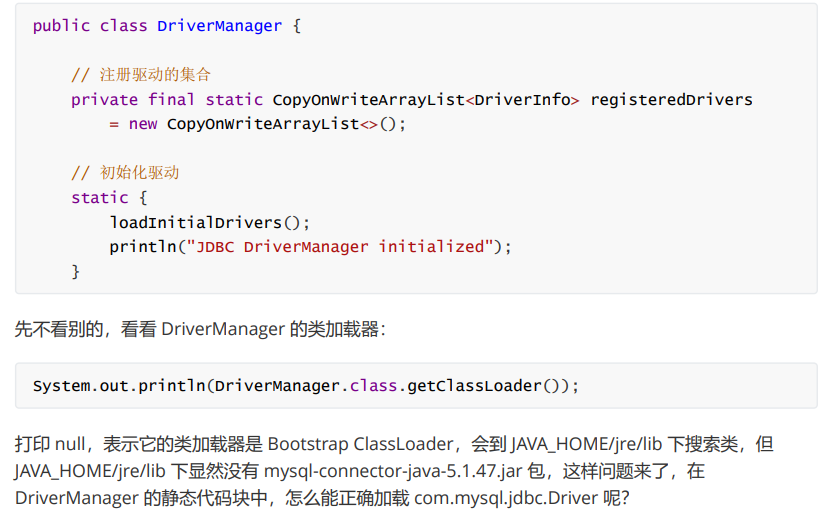

# JVM

## 类初始化

public static final Integer c=20;//在类的初始化阶段完成

public static final int a=10;//在连接的准备阶段完成

执行了 \<clinit\>方法,也就是执行静态方法给静态变量赋值


```java
//线程安全的,由类加载器保证
class Singleton{
	public static void test(){
		System.out.println("test");
	}
	
	private Singleton(){}
    
    private static class LazyHolder{
        private static final Singleton SIGLETON=new Singleton();
        static{
            System.out.println("lazy holder init");
        }
    }
    
    public static Singleton getInstance(){
        return LazyHolder.SINGLETON;
    }
}
```


## 类加载器

类加载阶段中的**“通过一个类的全限定名来获取描述该类的二进制字节流”**这个动作放到Java虚拟机外部去实现，以便让应用程序自己决定如何去获取所需的类。而实现这个动作的代码被称为 “类加载器”。对于任意一个类，其唯一性由加载他的类加载器和这个类本身一起共同确立的，每一个类加载器都有一个独立的类名称空间。也就是说：同一个类文件，若是由不同的类加载器加载，那也是不相等的


```java
public class Load {

    public static void main(String[] args) throws ClassNotFoundException, IllegalAccessException, InstantiationException {
        MyClassLoader myClassLoader = new MyClassLoader();
        Class<?> myMap1 = myClassLoader.loadClass("MyMap");
        Class<?> myMap2 = myClassLoader.loadClass("MyMap");

        MyClassLoader myClassLoader1 = new MyClassLoader();
        Class<?> myMap3 = myClassLoader1.loadClass("MyMap");

        //myMap1 == myMap2  != myMap3
//        Object instance = myMap.newInstance();
    }
}

class MyClassLoader extends ClassLoader{

    @Override
    protected Class<?> findClass(String name) throws ClassNotFoundException {
        String path = "e:\\myclassPath\\" + name + ".class";

        try{

            ByteArrayOutputStream os = new ByteArrayOutputStream();
            Files.copy(Paths.get(path),os);

            //得到字节数组
            byte[] bytes = os.toByteArray();

            //byte[] -> *.class
            return defineClass(name,bytes,0,bytes.length);

        }catch (IOException e){
            e.printStackTrace();
            throw new ClassNotFoundException("类文件未加载到");
        }
    }
}

```


## 双亲委派机制

这个机制有啥好处？

1.避免类的重复加载 2.保护程序安全,防止核心API被随意篡改.eg:java.lang.xxx不能自定义相同包名下的java类


说说怎么执行？

为了详细说明,这里我们首先要探究的是一个ApplicationClassLoader的执行流程

一开始通过拿到一个应用类加载器来加载一个类,利用debug的方式探究

```java
Class<?> aClass = test2.class.getClassLoader().loadClass("test");
```


来到了ClassLoader的loadClass方法,这里首先检查之前是否加载过该类, 如果发现没有,也就是为 null, 来,我们进行下一步: 判断该类加载器有无 parent,

```java
private final ClassLoader parent;//这是ClassLoader里的对象
```

要是发现parent == null,那么就是扩展类加载器,因为他的parent获取不到,所以只能是null，调用findBootstrapClassOrNull方法去找目标类，要是找不到就自己也就是扩展类加载器去对应路径找是否存在目标类，结果赋值给Class类的标识符为c的变量

要是parent != null，那就是应用类加载器，他的parent为扩展类加载器，调用其parent的loadClass方法，用一个Class类的变量c去接收返回值


下一步就是对这个c进行判断了，如果c 还是为空，那就是父加载器没有找到对应的类，得自己去找了，这里调用findClass方法去找，如果找不到就抛异常，直接返回到当前加载器的子加载器catch代码块中，catch代码块中不做处理，代码继续往下走，这下轮到应用类加载器自己调用findClass方法去找目标类，如果找到就解析，然后返回，找不到就抛异常

```java
protected Class<?> loadClass(String name, boolean resolve)
        throws ClassNotFoundException
    {
        synchronized (getClassLoadingLock(name)) {
            // First, check if the class has already been loaded
            Class<?> c = findLoadedClass(name);
            if (c == null) {
                long t0 = System.nanoTime();
                try {
                    if (parent != null) {
                        c = parent.loadClass(name, false);
                    } else {
                        c = findBootstrapClassOrNull(name);//c++实现的，看不到本地源码
                    }
                } catch (ClassNotFoundException e) {
                    // ClassNotFoundException thrown if class not found
                    // from the non-null parent class loader
                }

                if (c == null) {
                    // If still not found, then invoke findClass in order
                    // to find the class.
                    long t1 = System.nanoTime();
                    c = findClass(name);

                    // this is the defining class loader; record the stats
                    sun.misc.PerfCounter.getParentDelegationTime().addTime(t1 - t0);
                    sun.misc.PerfCounter.getFindClassTime().addElapsedTimeFrom(t1);
                    sun.misc.PerfCounter.getFindClasses().increment();
                }
            }
            if (resolve) {
                resolveClass(c);
            }
            return c;
        }
    }
```


### 线程上下文类加载器

这里我们来了解 com.mysql.jdbc.Driver是如何被加载的



再看 loadInitialDrivers() 方法，会发现里面就是用Class.forName()加载的


接口都是由引导类加载器加载,第三方接口的具体实现类是由线程上下文类加载器加载(这个加载器默认为系统类加载器)

### 打破双亲委派机制

首先提出疑问：为什么要打破？

如果我们要加载同一个类的不同版本，比如需要几个不同版本的 jdbc.mysql驱动


怎么打破？

1. 自定义类加载器，重写loadClass方法；
2. 使用线程上下文类加载器；


#### 自定义类加载器

什么时候需要自定义类加载器？

- 想加载非 classpath 随意路径中的类文件
- 通过接口来使用实现，希望解耦时，常用在框架设计
- 这些类希望予以隔离，不同应用的同名类都可以加载，不冲突，常见于 tomcat 容器


怎么写？

- 继承ClassLoader父类
- 要遵从双亲委派机制，重写 findClass 方法
  - 不是重写loadClass方法，否则不会走双亲委派机制
- 读取类文件的字节码
- 调用父类的 defineClass 方法来加载类
- 使用者调用该类加载器的 loadClass 方法


线程上下文类加载器又是啥？

以后再补充

## 运行期优化

方法内联


##  垃圾回收

[JVM - Nyima's Blog (gitee.io)](https://nyimac.gitee.io/2020/07/03/JVM学习/#三、垃圾回收)

JVM是如何判断对象可以回收?

垃圾回收有两种方法,第一种是引用计数法,其弊端是循环引用导致两个对象都无法被释放,啥是循环引用？两个对象都互相持有对方

第二种就是可达性分析算法，也就是JVM中垃圾收集器通过可达性分析来探索所有存活的对象。如何做？扫描堆中的对象，看能否沿着GC Root对象为起点的引用链找到该对象，如果找不到，则表示可以回收。 

嗯，可以作为GC Root的对象有哪些？

- 虚拟机栈（栈帧中的本地变量表）中引用的对象。　
- 方法区中类静态属性引用的对象
- 方法区中常量引用的对象
- 本地方法栈中JNI（即一般说的Native方法）引用的对象


你刚才说的引用链，有哪几种引用类型？

5种，强软弱虚，终结者


下面 讲讲垃圾回收算法

垃圾回收算法有三种：

1. 标记-清除算法

   > 在虚拟机执行垃圾回收的过程中，先采用标记算法确定可回收对象，然后垃圾收集器根据标识清除相应的内容，给堆内存腾出相应的空间。要注意的是：这里的腾出内存空间并不是将内存空间的字节清0，而是记录下这段内存的起始结束地址，下次分配内存的时候，会直接**覆盖**这段内存

   缺点：

   > **容易产生大量的内存碎片**，可能无法满足大对象的内存分配，一旦导致无法分配对象，那就会导致jvm启动gc，一旦启动gc，我们的应用程序就会暂停，这就导致应用的响应速度变慢

2. 标记-整理算法

   > 标记-整理 会将不被GC Root引用的对象回收，让所有存活的对象都向一端移动，然后直接清理掉端边界以外的内存

   缺点：

   > 整理需要较长时间，效率差

3. 标记-复制算法

   > 将内存分为等大小的两个区域，FROM和TO（TO中为空）。先将被GC Root引用的对象从FROM放入TO中，再回收不被GC Root引用的对象。然后交换FROM和TO。这样也可以避免内存碎片的问题，但是会占用双倍的内存空间

