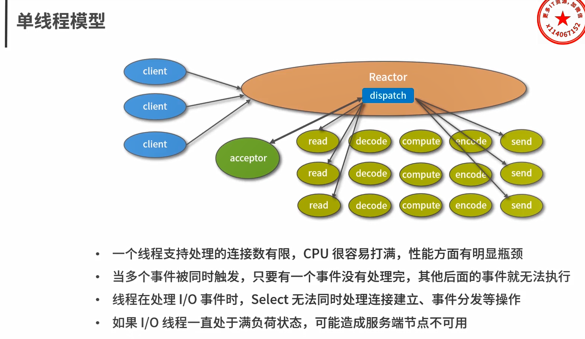
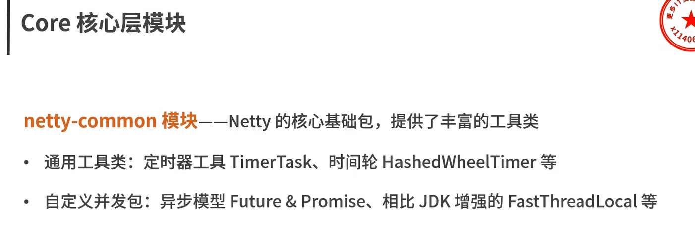
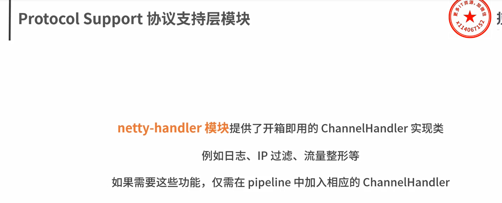
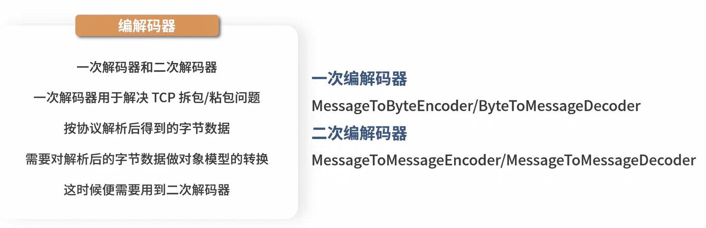
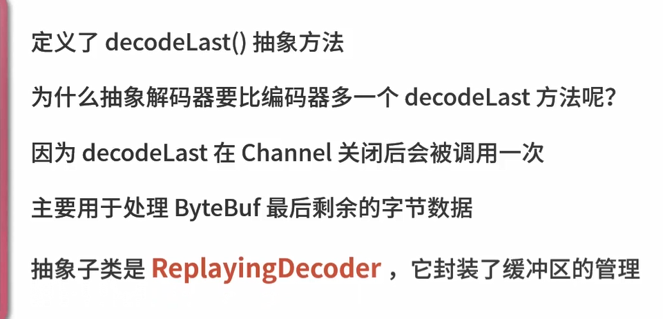

# Netty

## 逻辑架构

# 收纳箱

## 琐碎

### Netty Promise

可以获取结果和异常，如果get到异常没有做处理，那就会交给JVM默认方法处理该异常

## 前置知识

### 什么是 **IO** 和 **NIO**

## Netty组件

### EventLoop

### Channel

### Future与Promise

### Handler与Pipeline

### ByteBuf

## 水平和边缘触发

# 笔记

### Channel状态

### 事件调度层

### EventLoop 与 Channel关系

EventLoopGroup是Netty Reactor线程模型的具体实现方式

 

3种Reactor线程模型

服务编排层

### 服务编排层

#### ChannelPipeline

线程安全

### 组件关系梳理

Boss负责监听网络连接事件，当有新的网络连接事件到达时，就channel注册到Worker EventLoopGroup，然后woker EventLoopGroup会被分配一个EventLoop负责处理该channel读写事件 ，每个EventLoop都是单线程的，由selector进行事件循环。当客户端发起IO事件读写时，服务端EventLoop会进行事件的读取，然后通过PipeLine触发各种监听器进行数据的加工处理，客户端的数据会被传递到ChannelHandler的第一个ChannelInboundHandler中

### 单线程模型

### 多线程模型

### 主从多线程模型

### 功能模块

### EventLoop是什么

### 事件处理机制

**EventLoop和channel pipeline也是线程安全的**

### EventLoop最佳实践

### ChannelPipeline

### 异常传播机制

若InboundHandler出现异常并没有拦截,则最后由tail节点的handler来处理异常

所以推荐在tail前一个节点添加一个Handler来处理异常,也就是channel pipeline的末端

### 为什么有拆包/粘包

消息定长

特定分隔符

消息长度 + 消息内容

### 通信协议设计

### Netty如何实现自定义通信协议

### Pipeline 事件传播回顾

