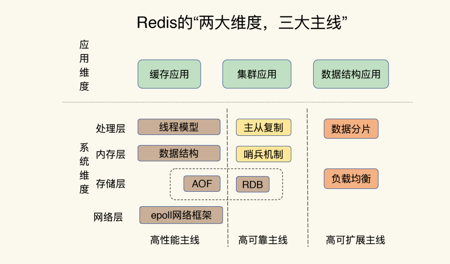
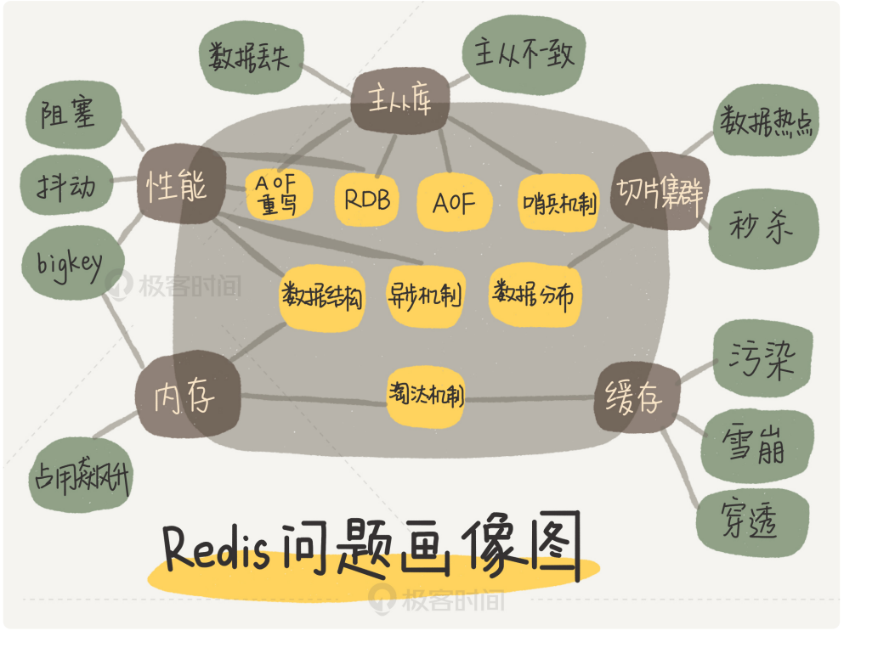
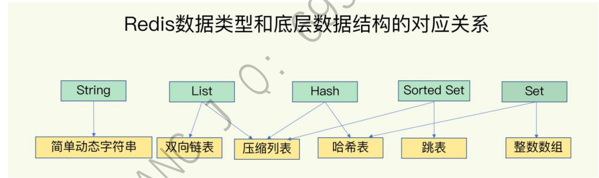
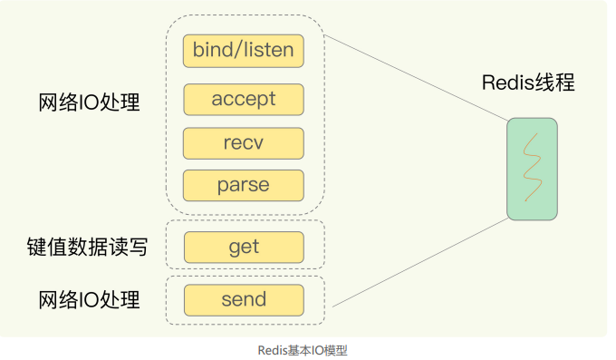
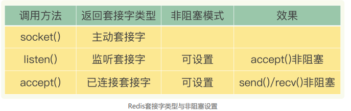
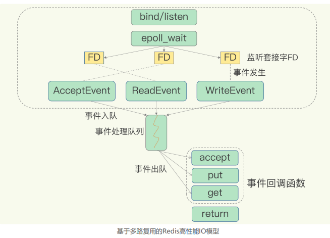

# redis

## 前言






思考：Redis 的长尾延迟维持在一定阈值以下，有哪些思路


## 数据结构

底层数据结构一共有六种，分别是简单动态字符串，双向链表，压缩列表，哈希表，跳表，整体数组

String：通过全局Hash表查到值就能直接操作

集合类型（一个键对应了一个集合的数据）：哈希表和跳表实现快，整体数组和压缩链表节省内存空间




全局哈希表：

Redis对所有键值对，有一个全局的hash表来存储，一个哈希表其实是一个数组，数组中的每一个元素称为一个哈希桶， **哈希桶中的元素保存的并不是值本身，而是指向具体值的指针**


因为是用根据hash值来决定存放数据的位置，若是出现hash冲突怎么办？

若出现冲突则采用拉链法，也就是链式哈希，同一个哈希桶中多个元素用一个链表来保存，他们之间用指针连接

redis还会对哈希表做rehash操作，增加现有的哈希桶数量，让逐渐增多的entry元素能在更多的桶之间分散保存，减少单个桶中的元素数量


rehash前后过程：

redis默认使用两个全局哈希表：哈希表1 和 哈希表2 。 当开始插入数据的时候，默认使用哈希表1，此时哈希表2并没有分配空间。随着数据增多，redis开始执行rehash，过程分三步：

1. 给哈希表2分配更大的空间，例如是当前哈希表1大小的两倍
2. 把哈希表1中的数据重新映射并拷贝到哈希表2中
3. 释放哈希表1的空间

到此我们就可以从哈希表1 切换到 哈希表2， 用增大的哈希表2保存更多的数据，而原来的哈希表1 留作下一次rehash扩容用


第二步的优化：

因为涉及到大量的数据拷贝，如果一次性把哈希表1中的数据都迁移完，会造成redis线程阻塞，无法服务其他请求。为了解决这个问题redis 采用 **渐进式rehash**

渐进式rehash：在第二步拷贝数据时，redis仍然正常处理客户端请求，每处理一个请求时，从哈希表1中的第一个索引位置开始，顺带着将这个索引位置上的所有entries拷贝到哈希表2 。 等处理下一个请求时，再顺带拷贝哈希表1中的下一个索引位置的entries


### 压缩列表

表头三个字段：zlbytes，zltail，zllen 分别表示 列表长度，列表尾的偏移量和列表中的entry个数，在压缩列表表尾还有一个zlend，表示列表结束。


引入压缩列表主要是为了解决内存碎片的问题，当海量数据进来时，用压缩链表比用String少 3/4内存


intset 和 ziplist 如果直接使用确实是时间复杂度上不是很高效，但是结合Redis的使用场 景，大部分Redis的数据都是零散碎片化的，通过这两种数据结构可以提高内存利用率，但 是为了防止过度使用这两种数据结构Redis其实都设有阈值或者搭配使用的，例如：ziplist 是和quicklist一起使用的，在quicklist中ziplist是一个个节点，而且quicklist为每个节点的 大小都设置有阈值避免单个节点过大，从而导致性能下降


数组对cpu缓存友好的原因是: cpu预读取一个cache line大小的数据, 数组数据排列紧凑、 相同大小空间保存的元素更多, 访问下一个元素时、恰好已经在cpu缓存了


## 高性能IO模型

上来就问：redis单线程为什么快？

先讲下：Redis 是单线程，**主要是指 Redis 的网络 IO 和键值对读写是由一个线程来完成的，这也是 Redis 对外提供键值存储服务的主要流程**。 但 Redis 的其他功能，比如持久化、异步删除、集群数据同步等，其实是由额外的线程执 行的。


有I/O操作时用多线程，因为整个程序如果是单线程的话，I/O操作会阻塞住，阻塞时CPU就是空闲的。


redis在数据读写这一个功能下，是不需要I/O的，如果用多线程，涉及到线程切换和线程调度，并没有提高效率，反而造成额外的性能开销。（eg：系统中通常会存在被多线程同时访问的 共享资源，比如一个共享的数据结构。当有多个线程要修改这个共享资源时，为了保证共 享资源的正确性，就需要有额外的机制进行保证，而这个额外的机制，就会带来额外的开 销，**<u>如锁的开销，上下文切换的开销</u>**。拿 Redis 来说，在上节课中，我提到过，Redis 有 List 的数据类型，并提供出队（LPOP） 和入队（LPUSH）操作。假设 Redis 采用多线程设计，如下图所示，现在有两个线程 A 和 B，线程 A 对一个 List 做 LPUSH 操作，并对队列长度加 1。同时，线程 B 对该 List 执行 LPOP 操作，并对队列长度减 1。为了保证队列长度的正确性，Redis 需要让线程 A 和 B 的 LPUSH 和 LPOP 串行执行，这样一来，Redis 可以无误地记录它们对 List 长度的修 改。否则，我们可能就会得到错误的长度结果。这就是多线程编程模式面临的共享资源的 并发访问控制问题。）


理清了为什么用单线程，下面讲讲其网络的基本IO模型和潜在的阻塞点

一方面，Redis 的大部分操作在内存上完成，再加上它采用了高效的数据结构，例如哈希 表和跳表，这是它实现高性能的一个重要原因。另一方面，就是 Redis 采用了多路复用机 制，使其在网络 IO 操作中能并发处理大量的客户端请求，实现高吞吐率。


以 Get 请求为例，SimpleKV 为了处理一个 Get 请求，需要监听客户端请求 （bind/listen），和客户端建立连接（accept），从 socket 中读取请求（recv），解析 客户端发送请求（parse），根据请求类型读取键值数据（get），最后给客户端返回结 果，即向 socket 中写回数据（send）。 下图显示了这一过程，其中，bind/listen、accept、recv、parse 和 send 属于网络 IO 处 理，而 get 属于键值数据操作。



在这里的网络 IO 操作中，有潜在的阻塞点，分别是 accept() 和 recv()。当 Redis 监听到一个客户端有连接请求，但一直未能成功建立起连接时，会阻塞在 accept() 函数这 里，导致其他客户端无法和 Redis 建立连接。类似的，当 Redis 通过 recv() 从一个客户端 读取数据时，如果数据一直没有到达，Redis 也会一直阻塞在 recv()。

**这就导致 Redis 整个线程阻塞，无法处理其他客户端请求，效率很低。不过，幸运的是， socket 网络模型本身支持非阻塞模式。**


非阻塞模式

Socket 网络模型的非阻塞模式设置，主要体现在三个关键的函数调用上

在 socket 模型中，不同操作调用后会返回不同的套接字类型。socket() 方法会返回主动套 接字，然后调用 listen() 方法，将主动套接字转化为监听套接字，此时，可以监听来自客户 端的连接请求。最后，调用 accept() 方法接收到达的客户端连接，并返回已连接套接字。



bind 和 listen 都不会阻塞，调用accept和send，recv都会阻塞，那现在既要等待后续请求，又要返回处理其他操作并在有数据达到时通知 Redis。 这样才能保证 Redis 线程，既不会像基本 IO 模型中一直在阻塞点等待，也不会导致 Redis 无法处理实际到达的连接请求或数据。


所以引入 **Linux 中的 IO 多路复用机制**

**基于多路复用的高性能 I/O 模型**

Linux 中的 IO 多路复用机制是指一个线程处理多个 IO 流，就是我们经常听到的 select/epoll 机制。简单来说，在 Redis 只运行单线程的情况下，**该机制允许内核中，同 时存在多个监听套接字和已连接套接字**。内核会一直监听这些套接字上的连接请求或数据 请求。一旦有请求到达，就会交给 Redis 线程处理，这就实现了一个 Redis 线程处理多个 IO 流的效果。




为了在请求到达时能通知到 Redis 线程，select/epoll 提供了基于事件的回调机制，即针 对不同事件的发生，调用相应的处理函数。

那么，回调机制是怎么工作的呢？其实，select/epoll 一旦监测到 FD 上有请求到达时，就 会触发相应的事件。

**这些事件会被放进一个事件队列**，Redis 单线程对该事件队列不断进行处理。这样一来， Redis 无需一直轮询是否有请求实际发生，这就可以避免造成 CPU 资源浪费。同时， Redis 在对事件队列中的事件进行处理时，会调用相应的处理函数，这就实现了基于事件 的回调。因为 Redis 一直在对事件队列进行处理，所以能及时响应客户端请求，提升 Redis 的响应性能。

eg:这两个请求分别对应 Accept 事件和 Read 事件，Redis 分别对这两个事件注册 accept 和 get 回调函数。当 Linux 内核监听到有连接请求或读数据请求时，就会触发 Accept 事件 和 Read 事件，此时，内核就会回调 Redis 相应的 accept 和 get 函数进行处理。


## AOF日志


## 疑问

### 跳表

```
请问一下老师，Redis中sorted set 底层实现是一个dict + 一个zskiplist， Redis底层为什
么要如此设计。zadd key score value 这样的形式，那如果底层采用了跳表的数据结构zs
et到底是如何存储数据的呢？dict中存储的是什么，跳表中存储的又是什么呢

作者回复: 这个问题非常好，对sorted set的底层实现，观察很仔细。
我们一般用sorted set时，会经常根据集合元素的分数进行范围查询，例如ZRANGEBYSCORE或
者ZREVRANGEBYSCORE，这些操作基于跳表就可以实现O(logN)的复杂度。此时，跳表的每个
节点同时保存了元素值和它的score。感兴趣可以进一步看下，redis源码的server.h中的zskiplist
Node结构体。
然后，就是你说的为什么还设计dict。不知道你有没有注意到，sorted set 还有ZSCORE这样的
操作，而且它的操作复杂度为O(1)。如果只有跳表，这个是做不到O(1)的，之所以可以做到O
(1)，就是因为还用了dict，里面存储的key是sorted set的member，value就是这个member的s
core。

```


# 琐碎

## redis好处,事务,持久化


## ZSet

### 1. 底层实现

跳表:

[跳表(SkipList)设计与实现(Java) - bigsai - 博客园 (cnblogs.com)](https://www.cnblogs.com/bigsai/p/14193225.html)


