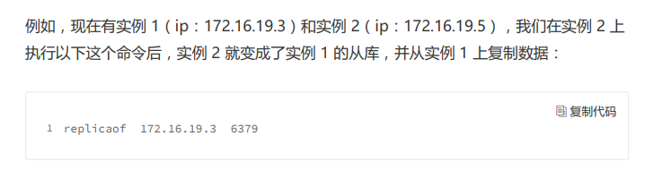
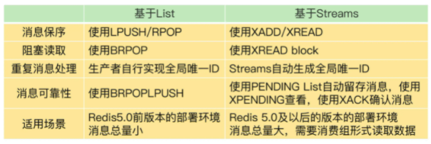
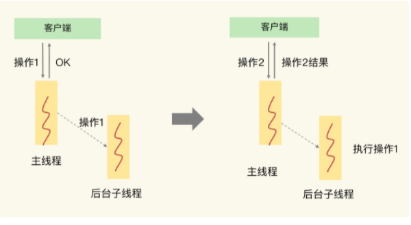

# redis

## 前言


思考：Redis 的长尾延迟维持在一定阈值以下，有哪些思路


## 数据结构

底层数据结构一共有六种，分别是简单动态字符串，双向链表，压缩列表，哈希表，跳表，整体数组

String：通过全局Hash表查到值就能直接操作

集合类型（一个键对应了一个集合的数据）：哈希表和跳表实现快，整体数组和压缩链表节省内存空间


全局哈希表：

Redis对所有键值对，有一个全局的hash表来存储，一个哈希表其实是一个数组，数组中的每一个元素称为一个哈希桶， **哈希桶中的元素保存的并不是值本身，而是指向具体值的指针**


因为是用根据hash值来决定存放数据的位置，若是出现hash冲突怎么办？

若出现冲突则采用拉链法，也就是链式哈希，同一个哈希桶中多个元素用一个链表来保存，他们之间用指针连接

redis还会对哈希表做rehash操作，增加现有的哈希桶数量，让逐渐增多的entry元素能在更多的桶之间分散保存，减少单个桶中的元素数量


rehash前后过程：

redis默认使用两个全局哈希表：哈希表1 和 哈希表2 。 当开始插入数据的时候，默认使用哈希表1，此时哈希表2并没有分配空间。随着数据增多，redis开始执行rehash，过程分三步：

1. 给哈希表2分配更大的空间，例如是当前哈希表1大小的两倍
2. 把哈希表1中的数据重新映射并拷贝到哈希表2中
3. 释放哈希表1的空间

到此我们就可以从哈希表1 切换到 哈希表2， 用增大的哈希表2保存更多的数据，而原来的哈希表1 留作下一次rehash扩容用


第二步的优化：

因为涉及到大量的数据拷贝，如果一次性把哈希表1中的数据都迁移完，会造成redis线程阻塞，无法服务其他请求。为了解决这个问题redis 采用 **渐进式rehash**

渐进式rehash：在第二步拷贝数据时，redis仍然正常处理客户端请求，每处理一个请求时，从哈希表1中的第一个索引位置开始，顺带着将这个索引位置上的所有entries拷贝到哈希表2 。 等处理下一个请求时，再顺带拷贝哈希表1中的下一个索引位置的entries


### 压缩列表

表头三个字段：zlbytes，zltail，zllen 分别表示 列表长度，列表尾的偏移量和列表中的entry个数，在压缩列表表尾还有一个zlend，表示列表结束。


引入压缩列表主要是为了解决内存碎片的问题，当海量数据进来时，用压缩链表比用String少 3/4内存


intset 和 ziplist 如果直接使用确实是时间复杂度上不是很高效，但是结合Redis的使用场 景，大部分Redis的数据都是零散碎片化的，通过这两种数据结构可以提高内存利用率，但 是为了防止过度使用这两种数据结构Redis其实都设有阈值或者搭配使用的，例如：ziplist 是和quicklist一起使用的，在quicklist中ziplist是一个个节点，而且quicklist为每个节点的 大小都设置有阈值避免单个节点过大，从而导致性能下降


数组对cpu缓存友好的原因是: cpu预读取一个cache line大小的数据, 数组数据排列紧凑、 相同大小空间保存的元素更多, 访问下一个元素时、恰好已经在cpu缓存了


## 高性能IO模型

上来就问：redis单线程为什么快？

先讲下：Redis 是单线程，**主要是指 Redis 的网络 IO 和键值对读写是由一个线程来完成的，这也是 Redis 对外提供键值存储服务的主要流程**。 但 Redis 的其他功能，比如持久化、异步删除、集群数据同步等，其实是由额外的线程执 行的。


有I/O操作时用多线程，因为整个程序如果是单线程的话，I/O操作会阻塞住，阻塞时CPU就是空闲的。


redis在数据读写这一个功能下，是不需要I/O的，如果用多线程，涉及到线程切换和线程调度，并没有提高效率，反而造成额外的性能开销。（eg：系统中通常会存在被多线程同时访问的 共享资源，比如一个共享的数据结构。当有多个线程要修改这个共享资源时，为了保证共 享资源的正确性，就需要有额外的机制进行保证，而这个额外的机制，就会带来额外的开 销，**<u>如锁的开销，上下文切换的开销</u>**。拿 Redis 来说，在上节课中，我提到过，Redis 有 List 的数据类型，并提供出队（LPOP） 和入队（LPUSH）操作。假设 Redis 采用多线程设计，如下图所示，现在有两个线程 A 和 B，线程 A 对一个 List 做 LPUSH 操作，并对队列长度加 1。同时，线程 B 对该 List 执行 LPOP 操作，并对队列长度减 1。为了保证队列长度的正确性，Redis 需要让线程 A 和 B 的 LPUSH 和 LPOP 串行执行，这样一来，Redis 可以无误地记录它们对 List 长度的修 改。否则，我们可能就会得到错误的长度结果。这就是多线程编程模式面临的共享资源的 并发访问控制问题。）


理清了为什么用单线程，下面讲讲其网络的基本IO模型和潜在的阻塞点

一方面，Redis 的大部分操作在内存上完成，再加上它采用了高效的数据结构，例如哈希 表和跳表，这是它实现高性能的一个重要原因。另一方面，就是 Redis 采用了多路复用机 制，使其在网络 IO 操作中能并发处理大量的客户端请求，实现高吞吐率。


以 Get 请求为例，SimpleKV 为了处理一个 Get 请求，需要监听客户端请求 （bind/listen），和客户端建立连接（accept），从 socket 中读取请求（recv），解析 客户端发送请求（parse），根据请求类型读取键值数据（get），最后给客户端返回结 果，即向 socket 中写回数据（send）。 下图显示了这一过程，其中，bind/listen、accept、recv、parse 和 send 属于网络 IO 处 理，而 get 属于键值数据操作。


在这里的网络 IO 操作中，有潜在的阻塞点，分别是 accept() 和 recv()。当 Redis 监听到一个客户端有连接请求，但一直未能成功建立起连接时，会阻塞在 accept() 函数这 里，导致其他客户端无法和 Redis 建立连接。类似的，当 Redis 通过 recv() 从一个客户端 读取数据时，如果数据一直没有到达，Redis 也会一直阻塞在 recv()。

**这就导致 Redis 整个线程阻塞，无法处理其他客户端请求，效率很低。不过，幸运的是， socket 网络模型本身支持非阻塞模式。**


非阻塞模式

Socket 网络模型的非阻塞模式设置，主要体现在三个关键的函数调用上

在 socket 模型中，不同操作调用后会返回不同的套接字类型。socket() 方法会返回主动套 接字，然后调用 listen() 方法，将主动套接字转化为监听套接字，此时，可以监听来自客户 端的连接请求。最后，调用 accept() 方法接收到达的客户端连接，并返回已连接套接字。


bind 和 listen 都不会阻塞，调用accept和send，recv都会阻塞，那现在既要等待后续请求，又要返回处理其他操作并在有数据达到时通知 Redis。 这样才能保证 Redis 线程，既不会像基本 IO 模型中一直在阻塞点等待，也不会导致 Redis 无法处理实际到达的连接请求或数据。


所以引入 **Linux 中的 IO 多路复用机制**

**基于多路复用的高性能 I/O 模型**

Linux 中的 IO 多路复用机制是指一个线程处理多个 IO 流，就是我们经常听到的 select/epoll 机制。简单来说，在 Redis 只运行单线程的情况下，**该机制允许内核中，同 时存在多个监听套接字和已连接套接字**。内核会一直监听这些套接字上的连接请求或数据 请求。一旦有请求到达，就会交给 Redis 线程处理，这就实现了一个 Redis 线程处理多个 IO 流的效果。


为了在请求到达时能通知到 Redis 线程，select/epoll 提供了基于事件的回调机制，即针 对不同事件的发生，调用相应的处理函数。

那么，回调机制是怎么工作的呢？其实，select/epoll 一旦监测到 FD 上有请求到达时，就 会触发相应的事件。

**这些事件会被放进一个事件队列**，Redis 单线程对该事件队列不断进行处理。这样一来， Redis 无需一直轮询是否有请求实际发生，这就可以避免造成 CPU 资源浪费。同时， Redis 在对事件队列中的事件进行处理时，会调用相应的处理函数，这就实现了基于事件 的回调。因为 Redis 一直在对事件队列进行处理，所以能及时响应客户端请求，提升 Redis 的响应性能。

eg:这两个请求分别对应 Accept 事件和 Read 事件，Redis 分别对这两个事件注册 accept 和 get 回调函数。当 Linux 内核监听到有连接请求或读数据请求时，就会触发 Accept 事件 和 Read 事件，此时，内核就会回调 Redis 相应的 accept 和 get 函数进行处理。


## AOF日志


运用redis做缓存时如果服务器宕机，那么内存中数据就会丢失。这里有两个解决方案：

1. 从后端数据库重新获取这些数据

   缺点：频繁访问数据库，给数据库带来巨大的压力。数据从数据库中读取，性能比不上redis，应用程序响应速度慢。

2. redis实现数据持久化，避免从后端数据库中进行恢复


AOF日志如何实现：

与数据库的写前日志（WAL)相反，redis是写后日志（先执行命令，将数据写入内存，再记录日志），原因是：**为了避免额外的检查开销**，redis在向AOF里面记录日志的时候并不会对这些命令进行语法检查，所以如果先记日志再执行命令的话，日志中就可能记录了错误的命令，redis在使用日志恢复数据时就可能会出错


先执行命令再记日志有个好处就是**不会阻塞当前操作**

AOF两个潜在的问题：

1. 若写日志之前宕机了，则数据会丢失
2. AOF虽然避免了对当前命令的阻塞，但可能会给下一个操作带来阻塞风险。因为AOF日志是在主线程中执行的，如果在把日志文件写入磁盘时，磁盘读写压力大，那么就会导致写盘很慢，进而影响后续操作


以上两个问题都是和AOF写回磁盘的时机有关


redis有三种写回策略，也就是appendfsync的三个可选值

Always，Everysec，No


**AOF文件过大会出现什么性能问题？**

1. 文件系统本身对文件大小有限制， 无法保存过大的文件
2. 如果文件太大，之后再往里面追加命令记录的话，效率也会 变低
3. 如果发生宕机，AOF 中记录的命令要一个个被重新执行，用于故障恢复，如 果日志文件太大，整个恢复过程就会非常缓慢，这就会影响到 Redis 的正常使用


**如何解决AOF日志文件过大？**

AOF重写机制，由于AOF日志是追加的方式逐一记录写命令的，所以可以将旧日志文件中的多条命令，在重写后的新日志中变成一条命令


**AOF重写会阻塞吗？**

与AOF日志由主线程写回不同，重写过程是又后台线程bgrewriteaof完成的，目的是 **避免阻塞主线程**

重写的过程就是 一个拷贝，两处日志

一个拷贝：fork子进程时，子进程是会拷贝父进程的页表，即虚 实映射关系，而不会拷贝物理内存。子进程复制了父进程页表，也能共享访问父进程的内存数据 了，此时，类似于有了父进程的所有内存数据


两处日志：因为主线程未阻塞，仍然可以处理新来的操作。此时，如果有写操作，第一处日志就是指 正在使用的 AOF 日志，Redis 会把这个操作写到它的缓冲区。这样一来，即使宕机了，这 个 AOF 日志的操作仍然是齐全的，可以用于恢复。 而第二处日志，就是指新的 AOF 重写日志。这个操作也会被写到重写日志的缓冲区。这 样，重写日志也不会丢失最新的操作。等到拷贝数据的所有操作记录重写完成后，重写日 志记录的这些最新操作也会写入新的 AOF 文件，以保证数据库最新状态的记录。此时，我 们就可以用新的 AOF 文件替代旧文件了。


问题1：AOF 日志重写的时候，是由 bgrewriteaof 子进程来完成的，不用主线程参与，我们今 天说的非阻塞也是指子进程的执行不阻塞主线程。但是，你觉得，这个重写过程有没有 其他潜在的阻塞风险呢？如果有的话，会在哪里阻塞？


问题2：AOF 重写也有一个重写日志，为什么它不共享使用 AOF 本身的日志呢？

```
AOF工作原理：
1、Redis 执行 fork() ，现在同时拥有父进程和子进程。
2、子进程开始将新 AOF 文件的内容写入到临时文件。
3、对于所有新执行的写入命令，父进程一边将它们累积到一个内存缓存中，一边将这些改动追加到现有 AOF 文件的末尾,这样样即使在重写的中途发生停机，现有的 AOF 文件也还是安全的。
4、当子进程完成重写工作时，它给父进程发送一个信号，父进程在接收到信号之后，将内存缓存中的所有数据追加到新 AOF 文件的末尾。
5、搞定！现在 Redis 原子地用新文件替换旧文件，之后所有命令都会直接追加到新 AOF 文件的末尾。

试着讨论下留言童鞋的几个问题

一、其中老师在文中提到：“因为主线程未阻塞，仍然可以处理新来的操作。此时，如果有写操作，第一处日志就是指正在使用的 AOF 日志，Redis 会把这个操作写到它的缓冲区。这样一来，即使宕机了，这个 AOF 日志的操作仍然是齐全的，可以用于恢复。”
这里面说到 “Redis 会把这个操作写到它的缓冲区，这样一来，即使宕机了，这个 AOF 日志的操作仍然是齐全的”，其实对于有些人有理解起来可能不是那么好理解，因为写入缓冲区为什么还不都是数据；

我的理解其实这个就是写入缓冲区，只不过是由appendfsync策略决定的，所以说的不丢失数据指的是不会因为子进程额外丢失数据。

二、AOF重新只是回拷贝引用(指针)，不会拷贝数据本身，因此量其实不大，那写入的时候怎么办呢，写时复制，即新开辟空间保存修改的值，因此需要额外的内存，但绝对不是redis现在占有的2倍。

三、AOF对于过期key不会特殊处理，因为Redis keys过期有两种方式：被动和主动方式。
当一些客户端尝试访问它时，key会被发现并主动的过期。

当然，这样是不够的，因为有些过期的keys，永远不会访问他们。 无论如何，这些keys应该过期，所以定时随机测试设置keys的过期时间。所有这些过期的keys将会从删除。
具体就是Redis每秒10次做的事情：
测试随机的20个keys进行相关过期检测。
删除所有已经过期的keys。
如果有多于25%的keys过期，重复步奏1.

至于课后问题，看了 @与路同飞 童鞋的答案，没有更好的答案，就不回答了


1.子线程重新AOF日志完成时会向主线程发送信号处理函数，会完成 （1）将AOF重写缓冲区的内容写入到新的AOF文件中。（2）将新的AOF文件改名，原子地替换现有的AOF文件。完成以后才会重新处理客户端请求。
2.不共享AOF本身的日志是防止锁竞争，类似于redis rehash

问题1回答：如果子进程写入事件过长，并且这段事件，会导致AOF重写日志，积累过多，当新的AOF文件完成后，还是需要写入大量AOF重写日志里的内容，可能会导致阻塞。

问题2回答：我觉得评论区里的大部分回答 防止锁竞争 ，应该是把问题理解错了，父子两个进程本来就没有需要竞争的数据，老师所指的两个日志应该是“AOF缓冲区”和"AOF重写缓冲区"，而不是磁盘上的AOF文件，之所有另外有一个"AOF重写缓冲区"，是因为重写期间，主进程AOF还在继续工作，还是会同步到旧的AOF文件中，同步成功后，“AOF缓冲区”会被清除，会被清除，会被清除！
```


### 问答

1. Redis采用fork子进程重写AOF文件时，潜在的阻塞风险包括：fork子进程 和 AOF重写过程中父进程产生写入的场景

   a、fork子进程，fork这个瞬间一定是会阻塞主线程的（注意，fork时并不会一次性拷贝所有内存数据给子进程，老师文章写的是拷贝所有内存数据给子进程，我个人认为是有歧义的），fork采用操作系统提供的写实复制(Copy On Write)机制，就是为了避免一次性拷贝大量内存数据给子进程造成的长时间阻塞问题，但fork子进程需要拷贝进程必要的数据结构，其中有一项就是拷贝内存页表（虚拟内存和物理内存的映射索引表），这个拷贝过程会消耗大量CPU资源，拷贝完成之前整个进程是会阻塞的，阻塞时间取决于整个实例的内存大小，实例越大，内存页表越大，fork阻塞时间越久。拷贝内存页表完成后，子进程与父进程指向相同的内存地址空间，也就是说此时虽然产生了子进程，但是并没有申请与父进程相同的内存大小。那什么时候父子进程才会真正内存分离呢？“写实复制”顾名思义，就是在写发生时，才真正拷贝内存真正的数据，这个过程中，父进程也可能会产生阻塞的风险，就是下面介绍的场景。

   b、fork出的子进程指向与父进程相同的内存地址空间，此时子进程就可以执行AOF重写，把内存中的所有数据写入到AOF文件中。但是此时父进程依旧是会有流量写入的，如果父进程操作的是一个已经存在的key，那么这个时候父进程就会真正拷贝这个key对应的内存数据，申请新的内存空间，这样逐渐地，父子进程内存数据开始分离，父子进程逐渐拥有各自独立的内存空间。因为内存分配是以页为单位进行分配的，默认4k，如果父进程此时操作的是一个bigkey，重新申请大块内存耗时会变长，可能会产阻塞风险。另外，如果操作系统开启了内存大页机制(Huge Page，页面大小2M)，那么父进程申请内存时阻塞的概率将会大大提高，所以在Redis机器上需要关闭Huge Page机制。Redis每次fork生成RDB或AOF重写完成后，都可以在Redis log中看到父进程重新申请了多大的内存空间。

> Huge page。这个特性大家在使用Redis也要注意。Huge page对提升TLB命 中率比较友好，因为在相同的内存容量下，使用huge page可以减少页表项，TLB就可以缓存更 多的页表项，能减少TLB miss的开销
>
> 但是，这个机制对于Redis这种喜欢用fork的系统来说，的确不太友好，尤其是在Redis的写入请 求比较多的情况下。因为fork后，父进程修改数据采用写时复制，复制的粒度为一个内存页。如 果只是修改一个256B的数据，**父进程需要读原来的内存页，然后再映射到新的物理地址写入**。一 读一写会造成读写放大。如果内存页越大（例如2MB的大页），那么读写放大也就越严重，对Re dis性能造成影响。 Huge page在实际使用Redis时是建议关掉的


2. AOF重写不复用AOF本身的日志，一个原因是父子进程写同一个文件必然会产生竞争问题，控制竞争就意味着会影响父进程的性能。二是如果AOF重写过程中失败了，那么原本的AOF文件相当于被污染了，无法做恢复使用。所以Redis AOF重写一个新文件，重写失败的话，直接删除这个文件就好了，不会对原先的AOF文件产生影响。等重写完成之后，直接替换旧文件即可。


## RDB日志

另一种持久化机制：内存快照，把某一时刻的状态以文件的形式写到磁盘上。记录的是某一时刻的数据，所以数据恢复的时候直接将RDB文件读入内存就可以很快的恢复。


问题来了：

1. 对哪些数据做快照？这关系到快照的执行效率
2. 做快照时，会阻塞主线程吗？数据还能被增删改吗？这关系到 Redis 是否被阻塞，能否同时正常处理请 求。


回答：

1. Redis 的数据都在内存中，为了提供所有数据的可靠性保证，它执行的是全量快照，也就 是说，把内存中的所有数据都记录到磁盘中。

   同样，给内存的全量数据做快照， 把它们全部写入磁盘也会花费很多时间。而且，全量数据越多，RDB 文件就越大，往磁盘 上写数据的时间开销就越大。

2. * Redis 提供了两个命令来生成 RDB 文件，分别是 save 和 bgsave。

     save：在主线程中执行，会导致阻塞；

     bgsave：创建一个子进程，专门用于写入 RDB 文件，避免了主线程的阻塞，这也是 Redis RDB 文件生成的默认配置。

   * 避免阻塞和正常处理写操作并不是一回事。此时，主线程的确没有阻塞，可以正常接收请求，但是，为了保证快照完整性，它只能处理读操作，因为不能修改正在执行快照的数据。

   * 为了解决上述问题，Redis 就会借助操作系统提供的写时复制技术（Copy-On-Write, COW），在执行快照的同时，正常处理写操作(参照AOF)

     > bgsave 子进程是由主线程 fork 生成的，可以共享主线程的所有内存数据。 bgsave 子进程运行后，开始读取主线程的内存数据，并把它们写入 RDB 文件。
     >
     > 此时，如果主线程对这些数据也都是读操作（例如图中的键值对 A），那么，主线程和 bgsave 子进程相互不影响。但是，如果主线程要修改一块数据（例如图中的键值对 C）， 那么，这块数据就会被复制一份，生成该数据的副本。然后，bgsave 子进程会把这个副本 数据写入 RDB 文件，而在这个过程中，主线程仍然可以直接修改原来的数据。
     >
     > 文章中说“这块数据就会被复制一份，生成该数据的副本”，这个操作在实际执行过程中，**是子进程复制了主线程的页表，所以通过页表映射，能读到主线程的原始数据**，而当有新数据写入或数据修改时，**主线程会把新数据或修改后的数据写到一个新的物理内存地址上，并修改主线程自己的页表映射。所以，子进程读到的类似于原始数据的一个副本，而主线程也可以正常进行修改**
     >
     > 第5讲介绍COW时，有点偏于介绍COW的效果了。实际上，**fork本身这个操作执行时，内核需要给子进程拷贝主线程的页表**。如果主线程的内存大，页表也相应大，拷贝页表耗时长，会阻塞主线程。
     >
     > bgsave保存RDB时，如果有写请求，主线程会把新数据写到新的物理地址，此时的阻塞会来自于主线程申请新内存空间以及复制原数据。
     >
     > 
     >
     > **如果是子进程做复制，而主线程直接改数据的话，会有问题：1. 如果子进程还没有把一块数据写入RDB时，主线程就修改了数据，那么就快照完整性就被破坏了；2. 子进程复制数据时，也需要加锁，避免主线程同时修改，如果此时，主线程正好有写请求要处理，主线程同样会被阻塞。**


### 如何做快照

为了防止数据丢失，应让t尽可能小，那是不是可以连续用bgsave做快照？答案是不行的。虽然 bgsave 执行时不阻塞主线程，但是，如果频繁地执行全量 快照，也会带来两方面的开销。原因如下：

1. 频繁将全量数据写入磁盘，会给磁盘带来很大压力，多个快照竞争有限的磁盘带 宽，前一个快照还没有做完，后一个又开始做了，容易造成恶性循环。
2. bgsave 子进程需要通过 fork 操作从主线程创建出来。虽然，子进程在创建后 不会再阻塞主线程，但是，fork 这个创建过程本身会阻塞主线程，而且主线程的内存越 大，阻塞时间越长。如果频繁 fork 出 bgsave 子进程，这就会频繁阻塞主线程了


因此我们选择使用**增量快照**。增量快照，就是指，做了一次全量快照后，后续的快照 只对修改的数据进行快照记录，这样可以避免每次全量快照的开销

eg：在第一次做完全量快照后，T1 和 T2 时刻如果再做快照，我们只需要将被修改的数据写入 快照文件就行。但是，这么做的前提是，我们需要记住哪些数据被修改了。你可不要小瞧 这个“记住”功能，它需要我们使用额外的元数据信息去记录哪些数据被修改了，这会带 来额外的空间开销问题。


Redis 4.0 中提出了一个混合使用 AOF 日志和内存快照的方法。简单来说，内存快照以一 定的频率执行，在两次快照之间，使用 AOF 日志记录这期间的所有命令操作。这样一来，快照不用很频繁地执行，这就避免了频繁 fork 对主线程的影响。而且，AOF 日志也只用记录两次快照间的操作，也就是说，不需要记录所有操作了，因此，就不会出 现文件过大的情况了，也可以避免重写开销。


### 场景

我曾碰到过这么一个场景：我们使用一个 2 核 CPU、4GB 内存、500GB 磁盘的云主机运行 Redis，Redis 数据库的数据量大小差不多是 2GB，我们使用了 RDB 做持久化保证。当时 Redis 的运行负载以修改操作为主，写读比例差不多在 8:2 左右，也就是说，如果有 100 个请求，80 个请求执行的是修改操作。你觉得，在这个场景下，用 RDB 做持久化有什么风险吗？你能帮着一起分析分析吗？


```
2核CPU、4GB内存、500G磁盘，Redis实例占用2GB，写读比例为8:2，此时做RDB持久化，产生的风险主要在于 CPU资源 和 内存资源 这2方面：

a、内存资源风险：Redis fork子进程做RDB持久化，由于写的比例为80%，那么在持久化过程中，“写实复制”会重新分配整个实例80%的内存副本，大约需要重新分配1.6GB内存空间，这样整个系统的内存使用接近饱和，如果此时父进程又有大量新key写入，很快机器内存就会被吃光，如果机器开启了Swap机制，那么Redis会有一部分数据被换到磁盘上，当Redis访问这部分在磁盘上的数据时，性能会急剧下降，已经达不到高性能的标准（可以理解为武功被废）。如果机器没有开启Swap，会直接触发OOM，父子进程会面临被系统kill掉的风险。

b、CPU资源风险：虽然子进程在做RDB持久化，但生成RDB快照过程会消耗大量的CPU资源，虽然Redis处理处理请求是单线程的，但Redis Server还有其他线程在后台工作，例如AOF每秒刷盘、异步关闭文件描述符这些操作。由于机器只有2核CPU，这也就意味着父进程占用了超过一半的CPU资源，此时子进程做RDB持久化，可能会产生CPU竞争，导致的结果就是父进程处理请求延迟增大，子进程生成RDB快照的时间也会变长，整个Redis Server性能下降。

c、另外，可以再延伸一下，老师的问题没有提到Redis进程是否绑定了CPU，如果绑定了CPU，那么子进程会继承父进程的CPU亲和性属性，子进程必然会与父进程争夺同一个CPU资源，整个Redis Server的性能必然会受到影响！所以如果Redis需要开启定时RDB和AOF重写，进程一定不要绑定CPU。

大量的写时复制会产生很多页中断，也会大量的消耗cpu

怎么监控redis的读写比例呢
执行info all命令，可以看到每种命令的请求次数。
```


## 数据同步

Redis 具有高可靠性，是什么意思呢？其实，这里有两层含义：一是数据尽量少丢失，二是服务尽量少中断。AOF 和 RDB 保证了前者，而对于后者，Redis 的做法就是增加副本冗余量，将一份数据同时保存在多个实例上。即使有一个实例出现了故 障，需要过一段时间才能恢复，其他实例也可以对外提供服务，不会影响业务使用。


多实例保存同一份数据，听起来好像很不错，但是，我们必须要考虑一个问题：这么多副本，它们之间的数据如何保持一致呢？数据读写操作可以发给所有的实例吗？

实际上，Redis 提供了主从库模式，以保证数据副本的一致，主从库之间采用的是读写分离的方式。

读操作：主库、从库都可以接收；

写操作：首先到主库执行，然后，主库将写操作同步给从库


为什么要采用读写分离的方式呢？

主要是防止数据不一致的的问题，客户端对同一数据修改3次，每一次修改请求都发到不同实例上，那么数据在这三个实例上的副本就不一致了。


主从库模式一旦采用了读写分离，所有数据的修改只会在主库上进行，不用协调三个实 例。主库有了最新的数据后，会同步给从库，这样，主从库的数据就是一致的。


**那么，主从库同步是如何完成的呢？主库数据是一次性传给从库，还是分批同步？要是主 从库间的网络断连了，数据还能保持一致吗？**


### 主从库间如何进行第一次同步？


当我们启动多个 Redis 实例的时候，它们相互之间就可以通过 replicaof（Redis 5.0 之前 使用 slaveof）命令形成主库和从库的关系，之后会按照三个阶段完成数据的第一次同步。




接下来，我们就要学习主从库间数据第一次同步的三个阶段了。


具体来说，主库执行 bgsave 命令，生成 RDB 文件，接着将文件发给从库。从库接收到 RDB 文件后，会先清空当前数据库，然后加载 RDB 文件。这是因为从库在通过 replicaof 命令开始和主库同步前，可能保存了其他数据。为了避免之前数据的影响，从库需要先把 当前数据库清空。

在主库将数据同步给从库的过程中，主库不会被阻塞，仍然可以正常接收请求。否则， Redis 的服务就被中断了。但是，这些请求中的写操作并没有记录到刚刚生成的 RDB 文件 中。为了保证主从库的数据一致性，主库会在内存中用专门的 replication buffer，记录 RDB 文件生成后收到的所有写操作。

最后，也就是第三个阶段，主库会把第二阶段执行过程中新收到的写命令，再发送给从 库。具体的操作是，当主库完成 RDB 文件发送后，就会把此时 replication buffer 中的修 改操作发给从库，从库再重新执行这些操作。这样一来，主从库就实现同步了。


### 主从级联模式分担全量复制时的主库压力

通过分析主从库间第一次数据同步的过程，你可以看到，一次全量复制中，对于主库来 说，需要完成两个耗时的操作：生成 RDB 文件和传输 RDB 文件。

如果从库数量很多，而且都要和主库进行全量复制的话，就会导致主库忙于 fork 子进程生 成 RDB 文件，进行数据全量同步。fork 这个操作会阻塞主线程处理正常请求，从而导致 主库响应应用程序的请求速度变慢。此外，传输 RDB 文件也会占用主库的网络带宽，同样 会给主库的资源使用带来压力。那么，有没有好的解决方法可以分担主库压力呢？

其实是有的，这就是“主 - 从 - 从”模式。

在刚才介绍的主从库模式中，所有的从库都是和主库连接，所有的全量复制也都是和主库 进行的。现在，我们可以通过“主 - 从 - 从”模式将主库生成 RDB 和传输 RDB 的压力， 以级联的方式分散到从库上。

简单来说，我们在部署主从集群的时候，可以手动选择一个从库（比如选择内存资源配置 较高的从库），用于级联其他的从库。然后，我们可以再选择一些从库（例如三分之一的 从库），在这些从库上执行如下命令，让它们和刚才所选的从库，建立起主从关系。

这样一来，这些从库就会知道，在进行同步时，不用再和主库进行交互了，只要和级联的 从库进行写操作同步就行了，这就可以减轻主库上的压力，如下图所示：

好了，到这里，我们了解了主从库间通过全量复制实现数据同步的过程，以及通过“主 - 从 - 从”模式分担主库压力的方式。那么，一旦主从库完成了全量复制，它们之间就会一 直维护一个网络连接，主库会通过这个连接将后续陆续收到的命令操作再同步给从库，这 个过程也称为基于长连接的命令传播，可以避免频繁建立连接的开销。

听上去好像很简单，但不可忽视的是，这个过程中存在着风险点，最常见的就是网络断连 或阻塞。如果网络断连，主从库之间就无法进行命令传播了，从库的数据自然也就没办法 和主库保持一致了，客户端就可能从从库读到旧数据。


### 主从库间网络断了怎么办？

在 Redis 2.8 之前，如果主从库在命令传播时出现了网络闪断，那么，从库就会和主库重 新进行一次全量复制，开销非常大。

从 Redis 2.8 开始，网络断了之后，主从库会采用增量复制的方式继续同步。听名字大概 就可以猜到它和全量复制的不同：全量复制是同步所有数据，而增量复制只会把主从库网 络断连期间主库收到的命令，同步给从库。

那么，增量复制时，主从库之间具体是怎么保持同步的呢？这里的奥妙就在于 repl_backlog_buffer 这个缓冲区。我们先来看下它是如何用于增量命令的同步的。

当主从库断连后，主库会把断连期间收到的写操作命令，写入 replication buffer，同时也 会把这些操作命令也写入 repl_backlog_buffer 这个缓冲区。

repl_backlog_buffer 是一个环形缓冲区，主库会记录自己写到的位置，从库则会记录自己 已经读到的位置。

刚开始的时候，主库和从库的写读位置在一起，这算是它们的起始位置。随着主库不断接 收新的写操作，它在缓冲区中的写位置会逐步偏离起始位置，我们通常用偏移量来衡量这 个偏移距离的大小，对主库来说，对应的偏移量就是 master_repl_offset。主库接收的新 写操作越多，这个值就会越大。

同样，从库在复制完写操作命令后，它在缓冲区中的读位置也开始逐步偏移刚才的起始位 置，此时，从库已复制的偏移量 slave_repl_offset 也在不断增加。正常情况下，这两个偏 移量基本相等。


主从库的连接恢复之后，从库首先会给主库发送 psync 命令，并把自己当前的 slave_repl_offset 发给主库，主库会判断自己的 master_repl_offset 和 slave_repl_offset 之间的差距

在网络断连阶段，主库可能会收到新的写操作命令，所以，一般来说，master_repl_offset 会大于 slave_repl_offset。此时，主库只用把 master_repl_offset 和 slave_repl_offset 之间的命令操作同步给从库就行。

就像刚刚示意图的中间部分，主库和从库之间相差了 put d e 和 put d f 两个操作，在增量 复制时，主库只需要把它们同步给从库，就行了。

说到这里，我们再借助一张图，回顾下增量复制的流程。


不过，有一个地方我要强调一下，因为 repl_backlog_buffer 是一个环形缓冲区，所以在 缓冲区写满后，主库会继续写入，此时，就会覆盖掉之前写入的操作。如果从库的读取速 度比较慢，就有可能导致从库还未读取的操作被主库新写的操作覆盖了，这会导致主从库 间的数据不一致。

因此，我们要想办法避免这一情况，一般而言，我们可以调整 repl_backlog_size 这个参 数。这个参数和所需的缓冲空间大小有关。缓冲空间的计算公式是：缓冲空间大小 = 主库 写入命令速度 * 操作大小 - 主从库间网络传输命令速度 * 操作大小。在实际应用中，考虑 到可能存在一些突发的请求压力，我们通常需要把这个缓冲空间扩大一倍，即 repl_backlog_size = 缓冲空间大小 * 2，这也就是 repl_backlog_size 的最终值

举个例子，如果主库每秒写入 2000 个操作，每个操作的大小为 2KB，网络每秒能传输 1000 个操作，那么，有 1000 个操作需要缓冲起来，这就至少需要 2MB 的缓冲空间。否 则，新写的命令就会覆盖掉旧操作了。为了应对可能的突发压力，我们最终把 repl_backlog_size 设为 4MB。

这样一来，增量复制时主从库的数据不一致风险就降低了。不过，如果并发请求量非常 大，连两倍的缓冲空间都存不下新操作请求的话，此时，主从库数据仍然可能不一致。

针对这种情况，一方面，你可以根据 Redis 所在服务器的内存资源再适当增加 repl_backlog_size 值，比如说设置成缓冲空间大小的 4 倍，另一方面，你可以考虑使用切 片集群来分担单个主库的请求压力。关于切片集群，我会在第 9 讲具体介绍。


### 问答

**怎么判断进行全量复制还是增量复制**

1. 一个从库如果和主库断连时间过长，造成它在主库repl_backlog_buffer的slave_repl_offset位置上的数据已经被覆盖掉了，此时从库和主库间将进行全量复制。
2. 每个从库会记录自己的slave_repl_offset，每个从库的复制进度也不一定相同。在和主库重连进行恢复时，从库会通过psync命令把自己记录的slave_repl_offset发给主库，主库会根据从库各自的复制进度，来决定这个从库可以进行增量复制，还是全量复制。

> 简单来说就是发送给主库的offset，主库查询不到就进行了全量复制，查询的到就进行增量复制


**主从库间的数据复制同步使用的是 RDB 文件，前面我们学习过，AOF 记录的操作命令更全，相比于 RDB 丢失的数据更少。那么，为什么主从库间的复制不使用 AOF 呢？**

```
主从全量同步使用RDB而不使用AOF的原因：

1、RDB文件内容是经过压缩的二进制数据（不同数据类型数据做了针对性优化），文件很小。而AOF文件记录的是每一次写操作的命令，写操作越多文件会变得很大，其中还包括很多对同一个key的多次冗余操作。在主从全量数据同步时，传输RDB文件可以尽量降低对主库机器网络带宽的消耗，从库在加载RDB文件时，一是文件小，读取整个文件的速度会很快，二是因为RDB文件存储的都是二进制数据，从库直接按照RDB协议解析还原数据即可，速度会非常快，而AOF需要依次重放每个写命令，这个过程会经历冗长的处理逻辑，恢复速度相比RDB会慢得多，所以使用RDB进行主从全量同步的成本最低。

2、假设要使用AOF做全量同步，意味着必须打开AOF功能，打开AOF就要选择文件刷盘的策略，选择不当会严重影响Redis性能。而RDB只有在需要定时备份和主从全量同步数据时才会触发生成一次快照。而在很多丢失数据不敏感的业务场景，其实是不需要开启AOF的。

另外，需要指出老师文章的错误：“当主从库断连后，主库会把断连期间收到的写操作命令，写入 replication buffer，同时也会把这些操作命令也写入 repl_backlog_buffer 这个缓冲区。”

1、主从库连接都断开了，哪里来replication buffer呢？

2、应该不是“主从库断连后”主库才把写操作写入repl_backlog_buffer，只要有从库存在，这个repl_backlog_buffer就会存在。主库的所有写命令除了传播给从库之外，都会在这个repl_backlog_buffer中记录一份，缓存起来，只有预先缓存了这些命令，当从库断连后，从库重新发送psync $master_runid $offset，主库才能通过$offset在repl_backlog_buffer中找到从库断开的位置，只发送$offset之后的增量数据给从库即可。

有同学对repl_backlog_buffer和replication buffer理解比较混淆，我大概解释一下：

1、repl_backlog_buffer：就是上面我解释到的，它是为了从库断开之后，如何找到主从差异数据而设计的环形缓冲区，从而避免全量同步带来的性能开销。如果从库断开时间太久，repl_backlog_buffer环形缓冲区被主库的写命令覆盖了，那么从库连上主库后只能乖乖地进行一次全量同步，所以repl_backlog_buffer配置尽量大一些，可以降低主从断开后全量同步的概率。而在repl_backlog_buffer中找主从差异的数据后，如何发给从库呢？这就用到了replication buffer。

2、replication buffer：Redis和客户端通信也好，和从库通信也好，Redis都需要给分配一个 内存buffer进行数据交互，客户端是一个client，从库也是一个client，我们每个client连上Redis后，Redis都会分配一个client buffer，所有数据交互都是通过这个buffer进行的：Redis先把数据写到这个buffer中，然后再把buffer中的数据发到client socket中再通过网络发送出去，这样就完成了数据交互。所以主从在增量同步时，从库作为一个client，也会分配一个buffer，只不过这个buffer专门用来传播用户的写命令到从库，保证主从数据一致，我们通常把它叫做replication buffer。

3、再延伸一下，既然有这个内存buffer存在，那么这个buffer有没有限制呢？如果主从在传播命令时，因为某些原因从库处理得非常慢，那么主库上的这个buffer就会持续增长，消耗大量的内存资源，甚至OOM。所以Redis提供了client-output-buffer-limit参数限制这个buffer的大小，如果超过限制，主库会强制断开这个client的连接，也就是说从库处理慢导致主库内存buffer的积压达到限制后，主库会强制断开从库的连接，此时主从复制会中断，中断后如果从库再次发起复制请求，那么此时可能会导致恶性循环，引发复制风暴，这种情况需要格外注意。


1. repl_backlog_buffer用于主从间的增量同步。主节点只有一个repl_backlog_buffer缓冲区，各个从节点的offset偏移量都是相对该缓冲区而言的。
2. replication buffer用于主节点与各个从节点间 数据的批量交互。主节点为各个从节点分别创建一个缓冲区，由于各个从节点的处理能力差异，各个缓冲区数据可能不同。

repl_backlog_buffer这个缓冲只在主从重连时才起作用，在主从连接正常时，即使master覆盖了slave的数据也没关系，应为数据都在replication_buffer里，只要replication_buffer没溢出，等slave消费完了replication_buffer，slave_offset也追上去了，只有等到主从重连时才会用到repl_backlog_buffer做判断，正常情况下repl_backlog_buffer只是一直循环写

而在repl_backlog_buffer中找主从差异的数据后，如何发给从库呢？这就用到了replication buffer。
这句话的意思是：先在backlog里通过offset差异，找到差异数据，然后将这部分差异数据同步到replication buffer后，replication buffer才专门的将这部分数据发送给从库，达到增量同步的目的

只要有从节点连接上，在主节点就会有一个repl_backlog_buffer，并且无论从节点是否断开连接，主节点都会把收到的命令写入repl_backlog_buffer，如果从节点连接正常，主节点直接走replication buffer，如果从节点断开连接，等再次连接上时判断offset是否被覆盖，没有被覆盖把slave offset和master offset之间的数据通过replication buffer传输，如果被覆盖则再次RDB走replication buffer全量同步.
如果一个slave都没有了，那backlog buffer也会释放了。
```


psync 这个动作 执行 RDB 全量数据，是直接传输到从库上，还是先落到主redis 磁盘上

```
Redis在全量复制时，既支持先生成RDB文件，再把RDB文件传给从库，也支持在主库上直接通过socket把数据传给从库，这称为无盘复制。

如果运行主库的机器磁盘性能不太好，但是网络性能不错的话，可以考虑无盘复制。
```


环形缓冲期再大，也会出问题，那么如果遇到这类问题，导致数据不同步怎么处理？比方说，一个从库长断网以后，长时间没有联网处理。

```
没错，环形缓冲区再大，在某些时候，就如你所说的从库长期断网时，也会出问题。

其实从库正常情况下会每秒给主库发送一个replconf ack命令，主库会根据这个命令的达到时间判断和从库的连网情况。如果距离最后一次ack命令收到的时间已经超过了repl_timeout时间，就会和从库断开连接了。

从库再和主库连接时，会发送自己的复制进度，如果要复制内容在缓冲区中已经被覆盖了，那么就不再做增量复制了，而是进行全量复制。
```


```
repl_backlog_size这个参数很重要，因为如果满了，就需要重新全量复制，默认是1M，所以之前网上就流传1个段子，如果一个公司说自己体量如何大，技术多么牛，要是repl_backlog_size参数是默认值，基本可以认为要不业务体量吹牛逼了，要不就没有真正的技术牛人。

主从复制的另一种方式：基于硬盘和无盘复制
可以通过这个参数设置
repl-diskless-sync
复制集同步策略：磁盘或者socket
新slave连接或者老slave重新连接时候不能只接收不同，得做一个全同步。需要一个新的RDB文件dump出来，然后从master传到slave。可以有两种情况：
 1）基于硬盘（disk-backed）：master创建一个新进程dump RDB，完事儿之后由父进程（即主进程）增量传给slaves。
 2）基于socket（diskless）：master创建一个新进程直接dump RDB到slave的socket，不经过主进程，不经过硬盘。

当基于 disk-backed 复制时，当 RDB 文件生成完毕，多个 replicas 通过排队来同步 RDB 文件。

当基于diskless的时候，master等待一个repl-diskless-sync-delay的秒数，如果没slave来的话，就直接传，后来的得排队等了。否则就可以一起传。适用于disk较慢，并且网络较快的时候，可以用diskless。（默认用disk-based）


回答下课后问题：
    1、RDB读取快，这样从库可以尽快完成RDB的读取，然后入去消费replication buffer的数据。如果是AOF的话，AOF体积大，读取慢，需要更大的replication buffer，如果一个主节点的从节点多的话，就需要更大的内存去处理；
    2、AOF文件是append追加模式，同时读写需要考虑并发安全问题，并且AOF是文本文件，体积较大，浪费网络带宽。

最后问老师个问题哈，就是bgsave生成的rdb文件什么时候“过期”，或者有过期的说法吗？比如我2个从节点执行replicaof（或者slaveof），主节点是同一个，这中情况下，rdb生成1次还是2次？

A从节点向主节点申请全量同步，
在主节点创建完成RDB文件之前，如果B从节点也向主及诶点申请全量同步的话，RDB只会生成一次。
在主节点创建完成RDB文件之后，如果B从节点也向主及诶点申请全量同步的话，主节点会在完成A节点的RDB文件同步之后，再重新创建RDB文件给B节点的同步。
```


## 哨兵机制

主库挂了，如何不间断服务


如果主库挂 了，我们就需要运行一个新主库，比如说把一个从库切换为主库，把它当成主库。这就涉 及到三个问题：

1. 主库真的挂了吗？ 
2. 该选择哪个从库作为主库？ 
3. 怎么把新主库的相关信息通知给从库和客户端呢

在 Redis 主从集群中，哨兵机制是实现主从库自动切换的关键机 制，它有效地解决了主从复制模式下故障转移的这三个问题


**哨兵机制基本流程**

哨兵其实就是一个运行在特殊模式下的 Redis 进程，主从库实例运行的同时，它也在运 行。哨兵主要负责的就是三个任务：监控、选主（选择主库）和通知。


我们先看监控。监控是指哨兵进程在运行时，周期性地给所有的主从库发送 PING 命令， 检测它们是否仍然在线运行。如果从库没有在规定时间内响应哨兵的 PING 命令，哨兵就 会把它标记为“下线状态”；同样，如果主库也没有在规定时间内响应哨兵的 PING 命 令，哨兵就会判定主库下线，然后开始自动切换主库的流程。

这个流程首先是执行哨兵的第二个任务，选主。主库挂了以后，哨兵就需要从很多个从库 里，按照一定的规则选择一个从库实例，把它作为新的主库。这一步完成后，现在的集群 里就有了新主库。

然后，哨兵会执行最后一个任务：通知。在执行通知任务时，哨兵会把新主库的连接信息 发给其他从库，让它们执行 replicaof 命令，和新主库建立连接，并进行数据复制。同时， 哨兵会把新主库的连接信息通知给客户端，让它们把请求操作发到新主库上。


哨兵需要做出的两个决策：

1. 在监控任务中，哨兵需要判断主库是否处于下线状态；
2. 在选主任务中，哨兵也要决定选择哪个从库实例作为主库。


### 如何判断主库的下线状态

哨兵对主库的下线判断有“主观下线”和“客观下线”两种。那么， 为什么会存在两种判断呢？它们的区别和联系是什么呢？


主观下线：

哨兵进程会使用 PING 命令检测它自己和主、从库的网络连接情况，用来判断实例的状 态。如果哨兵发现主库或从库对 PING 命令的响应超时了，那么，哨兵就会先把它标记 为“主观下线”

如果检测的是从库，那么，哨兵简单地把它标记为“主观下线”就行了，因为从库的下线 影响一般不太大，集群的对外服务不会间断。

但是，如果检测的是主库，那么，哨兵还不能简单地把它标记为“主观下线”，开启主从 切换。因为很有可能存在这么一个情况：那就是**哨兵误判**了，其实主库并没有故障。可 是，一旦启动了主从切换，后续的选主和通知操作都会带来额外的计算和通信开销。

为了避免这些不必要的开销，我们要特别注意误判的情况

首先，我们要知道啥叫误判。很简单，就是主库实际并没有下线，但是哨兵误以为它下线 了。误判一般会发生在集群网络压力较大、网络拥塞，或者是主库本身压力较大的情况 下。

一旦哨兵判断主库下线了，就会开始选择新主库，并让从库和新主库进行数据同步，这个 过程本身就会有开销，例如，哨兵要花时间选出新主库，从库也需要花时间和新主库同 步。而在误判的情况下，主库本身根本就不需要进行切换的，所以这个过程的开销是没有 价值的。正因为这样，我们需要判断是否有误判，以及减少误判。

如何减少误判几率？

通常会采用多实例组成的集群模式进行部署，这也被称为哨兵集 群。引入多个哨兵实例一起来判断，就可以避免单个哨兵因为自身网络状况不好，而误判主库下线的情况。同时，多个哨兵的网络同时不稳定的概率较小，由它们一起做决策，误 判率也能降低。

在判断主库是否下线时，不能由一个哨兵说了算，只有大多数的哨兵实例，都判断主库已 经“主观下线”了，主库才会被标记为“客观下线”，这个叫法也是表明主库下线成为一 个客观事实了。这个判断原则就是：少数服从多数。同时，这会进一步触发哨兵开始主从 切换流程。


“客观下线”的标准就是，当有 N 个哨兵实例时，最好要有 N/2 + 1 个实例判 断主库为“主观下线”，才能最终判定主库为“客观下线”。这样一来，就可以减少误判 的概率，也能避免误判带来的无谓的主从库切换。（当然，有多少个实例做出“主观下 线”的判断才可以，可以由 Redis 管理员自行设定）


### 如何选定新主库

一般来说，我把哨兵选择新主库的过程称为“筛选 + 打分”。简单来说，我们在多个从库 中，先按照**一定的筛选条件**，把不符合条件的从库去掉。然后，我们再按照**一定的规则**， 给剩下的从库逐个打分，将得分最高的从库选为新主库，如下图所示：


在刚刚的这段话里，需要注意的是两个“一定”，现在，我们要考虑这里的“一定”具体 是指什么。

首先来看筛选的条件。一般情况下，我们肯定要先保证所选的从库仍然在线运行。不过，在选主时从库正常在 线，这只能表示从库的现状良好，并不代表它就是最适合做主库的。设想一下，如果在选主时，一个从库正常运行，我们把它选为新主库开始使用了。可是， 很快它的网络出了故障，此时，我们就得重新选主了。这显然不是我们期望的结果。所以，在选主时，**除了要检查从库的当前在线状态，还要判断它之前的网络连接状态**。如 果从库总是和主库断连，而且断连次数超出了一定的阈值，我们就有理由相信，这个从库 的网络状况并不是太好，就可以把这个从库筛掉了。

具体怎么判断呢？你使用配置项 down-after-milliseconds * 10。其中，down-aftermilliseconds 是我们认定主从库断连的最大连接超时时间。如果在 down-aftermilliseconds 毫秒内，主从节点都没有通过网络联系上，我们就可以认为主从节点断连 了。如果发生断连的次数超过了 10 次，就说明这个从库的网络状况不好，不适合作为新主 库。

就过滤掉了不适合做主库的从库，完成了筛选工作。

接下来就要给剩余的从库打分了。我们可以分别按照三个规则依次进行三轮打分，这三个 规则分别是从库优先级、从库复制进度以及从库 ID 号。只要在某一轮中，有从库得分最 高，那么它就是主库了，选主过程到此结束。如果没有出现得分最高的从库，那么就继续 进行下一轮。

**第一轮：优先级最高的从库得分高。**

用户可以通过 slave-priority 配置项，给不同的从库设置不同优先级。比如，你有两个从 库，它们的内存大小不一样，你可以手动给内存大的实例设置一个高优先级。在选主时， 哨兵会给优先级高的从库打高分，如果有一个从库优先级最高，那么它就是新主库了。如 果从库的优先级都一样，那么哨兵开始第二轮打分。

**第二轮：和旧主库同步程度最接近的从库得分高。**

这个规则的依据是，如果选择和旧主库同步最接近的那个从库作为主库，那么，这个新主 库上就有最新的数据。

如何判断从库和旧主库间的同步进度呢？

上节课我向你介绍过，主从库同步时有个命令传播的过程。在这个过程中，主库会用 master_repl_offset 记录当前的最新写操作在 repl_backlog_buffer 中的位置，而从库会 用 slave_repl_offset 这个值记录当前的复制进度

此时，我们想要找的从库，它的 slave_repl_offset 需要最接近 master_repl_offset。如果 在所有从库中，有从库的 slave_repl_offset 最接近 master_repl_offset，那么它的得分就 最高，可以作为新主库。

就像下图所示，旧主库的 master_repl_offset 是 1000，从库 1、2 和 3 的 slave_repl_offset 分别是 950、990 和 900，那么，从库 2 就应该被选为新主库。


当然，如果有两个从库的 slave_repl_offset 值大小是一样的（例如，从库 1 和从库 2 的 slave_repl_offset 值都是 990），我们就需要给它们进行第三轮打分了。


**第三轮：ID 号小的从库得分高。**

每个实例都会有一个 ID，这个 ID 就类似于这里的从库的编号。目前，Redis 在选主库 时，有一个默认的规定：在优先级和复制进度都相同的情况下，ID 号最小的从库得分最 高，会被选为新主库。到这里，新主库就被选出来了，“选主”这个过程就完成了。


### 总结

哨兵机制，它是实现 Redis 不间断服务的重要保证。具体来说， 主从集群的数据同步，是数据可靠的基础保证；而在主库发生故障时，自动的主从切换是服务不间断的关键支撑。

Redis 的哨兵机制自动完成了以下三大功能，从而实现了主从库的自动切换，可以降低 Redis 集群的运维开销：

监控主库运行状态，并判断主库是否客观下线； 在主库客观下线后，选取新主库； 选出新主库后，通知从库和客户端。为了降低误判率，在实际应用时，哨兵机制通常采用多实例的方式进行部署，多个哨兵实 例通过“少数服从多数”的原则，来判断主库是否客观下线。


### 问答

通过哨兵机制，可以实现主从库的自动 切换，这是实现服务不间断的关键支撑，同时，我也提到了主从库切换是需要一定时间 的。所以，请你考虑下，在这个切换过程中，客户端能否正常地进行请求操作呢？如果想 要应用程序不感知服务的中断，还需要哨兵或需要客户端再做些什么吗？

```
如果客户端使用了读写分离，那么读请求可以在从库上正常执行，不会受到影响。但是由于此时主库已经挂了，而且哨兵还没有选出新的主库，所以在这期间写请求会失败，失败持续的时间 = 哨兵切换主从的时间 + 客户端感知到新主库 的时间。

如果不想让业务感知到异常，客户端只能把写失败的请求先缓存起来或写入消息队列中间件中，等哨兵切换完主从后，再把这些写请求发给新的主库，但这种场景只适合对写入请求返回值不敏感的业务，而且还需要业务层做适配，另外主从切换时间过长，也会导致客户端或消息队列中间件缓存写请求过多，切换完成之后重放这些请求的时间变长。

哨兵检测主库多久没有响应就提升从库为新的主库，这个时间是可以配置的（down-after-milliseconds参数）。配置的时间越短，哨兵越敏感，哨兵集群认为主库在短时间内连不上就会发起主从切换，这种配置很可能因为网络拥塞但主库正常而发生不必要的切换，当然，当主库真正故障时，因为切换得及时，对业务的影响最小。如果配置的时间比较长，哨兵越保守，这种情况可以减少哨兵误判的概率，但是主库故障发生时，业务写失败的时间也会比较久，缓存写请求数据量越多。

应用程序不感知服务的中断，还需要哨兵和客户端做些什么？当哨兵完成主从切换后，客户端需要及时感知到主库发生了变更，然后把缓存的写请求写入到新库中，保证后续写请求不会再受到影响，具体做法如下：

哨兵提升一个从库为新主库后，哨兵会把新主库的地址写入自己实例的pubsub（switch-master）中。客户端需要订阅这个pubsub，当这个pubsub有数据时，客户端就能感知到主库发生变更，同时可以拿到最新的主库地址，然后把写请求写到这个新主库即可，这种机制属于哨兵主动通知客户端。

如果客户端因为某些原因错过了哨兵的通知，或者哨兵通知后客户端处理失败了，安全起见，客户端也需要支持主动去获取最新主从的地址进行访问。

所以，客户端需要访问主从库时，不能直接写死主从库的地址了，而是需要从哨兵集群中获取最新的地址（sentinel get-master-addr-by-name命令），这样当实例异常时，哨兵切换后或者客户端断开重连，都可以从哨兵集群中拿到最新的实例地址。

一般Redis的SDK都提供了通过哨兵拿到实例地址，再访问实例的方式，我们直接使用即可，不需要自己实现这些逻辑。当然，对于只有主从实例的情况，客户端需要和哨兵配合使用，而在分片集群模式下，这些逻辑都可以做在proxy层，这样客户端也不需要关心这些逻辑了，Codis就是这么做的。

另外再简单回答下哨兵相关的问题：

1、哨兵集群中有实例挂了，怎么办，会影响主库状态判断和选主吗？

这个属于分布式系统领域的问题了，指的是在分布式系统中，如果存在故障节点，整个集群是否还可以提供服务？而且提供的服务是正确的？

这是一个分布式系统容错问题，这方面最著名的就是分布式领域中的“拜占庭将军”问题了，“拜占庭将军问题”不仅解决了容错问题，还可以解决错误节点的问题，虽然比较复杂，但还是值得研究的，有兴趣的同学可以去了解下。

简单说结论：存在故障节点时，只要集群中大多数节点状态正常，集群依旧可以对外提供服务。具体推导过程细节很多，大家去查前面的资料了解就好。

2、哨兵集群多数实例达成共识，判断出主库“客观下线”后，由哪个实例来执行主从切换呢？

哨兵集群判断出主库“主观下线”后，会选出一个“哨兵领导者”，之后整个过程由它来完成主从切换。

但是如何选出“哨兵领导者”？这个问题也是一个分布式系统中的问题，就是我们经常听说的共识算法，指的是集群中多个节点如何就一个问题达成共识。共识算法有很多种，例如Paxos、Raft，这里哨兵集群采用的类似于Raft的共识算法。

简单来说就是每个哨兵设置一个随机超时时间，超时后每个哨兵会请求其他哨兵为自己投票，其他哨兵节点对收到的第一个请求进行投票确认，一轮投票下来后，首先达到多数选票的哨兵节点成为“哨兵领导者”，如果没有达到多数选票的哨兵节点，那么会重新选举，直到能够成功选出“哨兵领导者”。


环形缓冲区的位置偏移量是单调递增的。主库的被称为：master_repl_offset，从库的被称为：slave_repl_offset，其实两者本质是相同的，叫不同的名字只是为了区分


master_repl_offset是单调增加的，它的值可以大于repl_backlog_size。Redis会用一个名为repl_backlog_idx的值记录在环形缓冲区中的最新写入位置。
举个例子，例如写入len的数据，那么
master_repl_offset += len
repl_backlog_idx += len
但是，如果repl_backlog_idx等于repl_backlog_size时，repl_backlog_idx会被置为0，表示从环形缓冲区开始位置继续写入。

而在实际的选主代码层面，sentinel是直接比较从库的slave_repl_offset，来选择和主库最接近的从库。
```


## 哨兵集群

如果有哨兵实例在运行时发生了故障，主从库还能正常切换吗？

实际上，一旦多个实例组成了哨兵集群，即使有哨兵实例出现故障挂掉了，其他哨兵还能继续协作完成主从库切换的工作，包括判定主库是不是处于下线状态，选择新主库，以及通知从库和客户端。

如果你部署过哨兵集群的话就会知道，在配置哨兵的信息时，我们只需要用到下面的这个配置项，设置**主库的 IP** 和**端口**，并没有配置其他哨兵的连接信息。

`sentinel monitor <master-name> <ip> <redis-port> <quorum> `

这些哨兵实例既然都不知道彼此的地址，又是怎么组成集群的呢？要弄明白这个问题，我们就需要学习一下哨兵集群的组成和运行机制了。


### 基于 pub/sub 机制的哨兵集群组成

哨兵实例之间可以相互发现，要归功于 Redis 提供的 pub/sub 机制，也就是发布 / 订阅机制。

哨兵只要和主库建立起了连接，就可以在主库上发布消息了，比如说发布它自己的连接信息（IP 和端口）。同时，它也可以从主库上订阅消息，获得其他哨兵发布的连接信息。当多个哨兵实例都在主库上做了发布和订阅操作后，它们之间就能知道彼此的 IP 地址和端口。

除了哨兵实例，我们自己编写的应用程序也可以通过 Redis 进行消息的发布和订阅。所以，为了区分不同应用的消息，Redis 会以**频道**的形式，对这些消息进行分门别类的管理。所谓的频道，实际上就是消息的类别。当消息类别相同时，它们就属于同一个频道。反之，就属于不同的频道。**只有订阅了同一个频道的应用，才能通过发布的消息进行信息交换。**

在主从集群中，主库上有一个名为“__sentinel__:hello”的频道，不同哨兵就是通过它来相互发现，实现互相通信的。


哨兵除了彼此之间建立起连接形成集群外，还需要和从库建立连接。这是因为，在哨兵的监控任务中，它需要对主从库都进行心跳判断，而且在主从库切换完成后，它还需要通知从库，让它们和新主库进行同步。

**哨兵是如何知道从库的 IP 地址和端口的呢？**

这是由哨兵向主库发送 INFO 命令来完成的。就像下图所示，哨兵 2 给主库发送 INFO 命令，主库接受到这个命令后，就会把从库列表返回给哨兵。接着，哨兵就可以根据从库列表中的连接信息，和每个从库建立连接，并在这个连接上持续地对从库进行监控。哨兵 1 和 3 可以通过相同的方法和从库建立连接。

通过 pub/sub 机制，哨兵之间可以组成集群，同时，哨兵又通过 INFO 命令，获得了从库连接信息，也能和从库建立连接，并进行监控了。

但是，哨兵不能只和主、从库连接。因为，主从库切换后，客户端也需要知道新主库的连接信息，才能向新主库发送请求操作。所以，哨兵还需要完成把新主库的信息告诉客户端这个任务。


在实际使用哨兵时，我们有时会遇到这样的问题：如何在客户端通过监控了解哨兵进行主从切换的过程呢？比如说，主从切换进行到哪一步了？这其实就是要求，客户端能够获取到哨兵集群在监控、选主、切换这个过程中发生的各种事件。

我们仍然可以依赖 pub/sub 机制，来帮助我们完成哨兵和客户端间的信息同步


### 基于 pub/sub 机制的客户端事件通知

从本质上说，哨兵就是一个运行在特定模式下的 Redis 实例，只不过它并不服务请求操作，只是完成监控、选主和通知的任务。所以，每个哨兵实例也提供 pub/sub 机制，客户端可以从哨兵订阅消息。哨兵提供的消息订阅频道有很多，不同频道包含了主从库切换过程中的不同关键事件。


知道了这些频道之后，你就可以让客户端从哨兵这里订阅消息了。具体的操作步骤是，客户端读取哨兵的配置文件后，可以获得哨兵的地址和端口，和哨兵建立网络连接。然后，我们可以在客户端执行订阅命令，来获取不同的事件消息。

当哨兵把新主库选择出来后，客户端就会看到下面的 switch-master 事件。这个事件表示主库已经切换了，新主库的 IP 地址和端口信息已经有了。这个时候，客户端就可以用这里面的新主库地址和端口进行通信了。


有了这些事件通知，客户端不仅可以在主从切换后得到新主库的连接信息，还可以监控到主从库切换过程中发生的各个重要事件。这样，客户端就可以知道主从切换进行到哪一步了，有助于了解切换进度。

有了 pub/sub 机制，哨兵和哨兵之间、哨兵和从库之间、哨兵和客户端之间就都能建立起连接了，再加上我们上节课介绍主库下线判断和选主依据，哨兵集群的监控、选主和通知三个任务就基本可以正常工作了


### 主库故障以后，哨兵集群有多个实例，那怎么确定由哪个哨兵来进行实际的主从切换呢？

**“客观下线”具体的判断过程**

任何一个实例只要自身判断主库“主观下线”后，就会给其他实例发送 is-master-down-by-addr 命令。接着，其他实例会根据自己和主库的连接情况，做出 Y 或 N 的响应，Y 相当于赞成票，N 相当于反对票。


一个哨兵获得了仲裁所需的赞成票数后，就可以标记主库为“客观下线”。这个所需的赞成票数是通过哨兵配置文件中的 quorum 配置项设定的。例如，现在有 5 个哨兵，quorum 配置的是 3，那么，一个哨兵需要 3 张赞成票，就可以标记主库为“客观下线”了。这 3 张赞成票包括哨兵自己的一张赞成票和另外两个哨兵的赞成票。

此时，**这个哨兵**就可以再给其他哨兵发送命令，表明希望由自己来执行主从切换，并让所有其他哨兵进行投票。这个投票过程称为“Leader 选举”。因为最终执行主从切换的哨兵称为 Leader，投票过程就是确定 Leader。

在投票过程中，任何一个想成为 Leader 的哨兵，要满足两个条件：第一，拿到半数以上的赞成票；第二，拿到的票数同时还需要大于等于哨兵配置文件中的 quorum 值。以 3 个哨兵为例，假设此时的 quorum 设置为 2，那么，任何一个想成为 Leader 的哨兵只要拿到 2 张赞成票，就可以了。


这轮投票没有产生 Leader的话，哨兵集群会等待一段时间（也就是哨兵故障转移超时时间的 2 倍），再重新选举。这是因为，哨兵集群能够进行成功投票，很大程度上依赖于选举命令的正常网络传播。如果网络压力较大或有短时堵塞，就可能导致没有一个哨兵能拿到半数以上的赞成票。所以，等到网络拥塞好转之后，再进行投票选举，成功的概率就会增加。

需要注意的是，如果哨兵集群只有 2 个实例，此时，一个哨兵要想成为 Leader，**必须获得 2 票**，而不是 1 票。所以，如果有个哨兵挂掉了，那么，此时的集群是无法进行主从库切换的。因此，通常我们至少会配置 3 个哨兵实例。这一点很重要，你在实际应用时可不能忽略了。


**要保证所有哨兵实例的配置是一致的，尤其是主观下线的判断值 down-after-milliseconds。**我们曾经就踩过一个“坑”。当时，在我们的项目中，因为这个值在不同的哨兵实例上配置不一致，导致哨兵集群一直没有对有故障的主库形成共识，也就没有及时切换主库，最终的结果就是集群服务不稳定。所以，你一定不要忽略这条看似简单的经验。


### 问答

假设有一个 Redis 集群，是“一主四从”，同时配置了包含 5 个哨兵实例的集群，quorum 值设为 2。在运行过程中，如果有 3 个哨兵实例都发生故障了，此时，Redis 主库如果有故障，还能正确地判断主库“客观下线”吗？如果可以的话，还能进行主从库自动切换吗？此外，哨兵实例是不是越多越好呢，如果同时调大 down-after-milliseconds 值，对减少误判是不是也有好处呢？

```
1、哨兵集群可以判定主库“主观下线”。由于quorum=2，所以当一个哨兵判断主库“主观下线”后，询问另外一个哨兵后也会得到同样的结果，2个哨兵都判定“主观下线”，达到了quorum的值，因此，哨兵集群可以判定主库为“客观下线”。

2、但哨兵不能完成主从切换。哨兵标记主库“客观下线后”，在选举“哨兵领导者”时，一个哨兵必须拿到超过多数的选票(5/2+1=3票)。但目前只有2个哨兵活着，无论怎么投票，一个哨兵最多只能拿到2票，永远无法达到多数选票的结果。

但是投票选举过程的细节并不是大家认为的：每个哨兵各自1票，这个情况是不一定的。下面具体说一下：

场景a：哨兵A先判定主库“主观下线”，然后马上询问哨兵B（注意，此时哨兵B只是被动接受询问，并没有去询问哨兵A，也就是它还没有进入判定“客观下线”的流程），哨兵B回复主库已“主观下线”，达到quorum=2后哨兵A此时可以判定主库“客观下线”。此时，哨兵A马上可以向其他哨兵发起成为“哨兵领导者”的投票，哨兵B收到投票请求后，由于自己还没有询问哨兵A进入判定“客观下线”的流程，所以哨兵B是可以给哨兵A投票确认的，这样哨兵A就已经拿到2票了。等稍后哨兵B也判定“主观下线”后想成为领导者时，因为它已经给别人投过票了，所以这一轮自己就不能再成为领导者了。

场景b：哨兵A和哨兵B同时判定主库“主观下线”，然后同时询问对方后都得到可以“客观下线”的结论，此时它们各自给自己投上1票后，然后向其他哨兵发起投票请求，但是因为各自都给自己投过票了，因此各自都拒绝了对方的投票请求，这样2个哨兵各自持有1票。

场景a是1个哨兵拿到2票，场景b是2个哨兵各自有1票，这2种情况都不满足大多数选票(3票)的结果，因此无法完成主从切换。

经过测试发现，场景b发生的概率非常小，只有2个哨兵同时进入判定“主观下线”的流程时才可以发生。我测试几次后发现，都是复现的场景a。

哨兵实例是不是越多越好？

并不是，我们也看到了，哨兵在判定“主观下线”和选举“哨兵领导者”时，都需要和其他节点进行通信，交换信息，哨兵实例越多，通信的次数也就越多，而且部署多个哨兵时，会分布在不同机器上，节点越多带来的机器故障风险也会越大，这些问题都会影响到哨兵的通信和选举，出问题时也就意味着选举时间会变长，切换主从的时间变久。

调大down-after-milliseconds值，对减少误判是不是有好处？

是有好处的，适当调大down-after-milliseconds值，当哨兵与主库之间网络存在短时波动时，可以降低误判的概率。但是调大down-after-milliseconds值也意味着主从切换的时间会变长，对业务的影响时间越久，我们需要根据实际场景进行权衡，设置合理的阈值。
```


图示哨兵选举过程中，选举的结果取决于S2的投票，如果S2也投给自己，并且每轮投票都是只投给自己，岂不是无法选出“Leader”，是不是这个过程从了死循环呢？投票投给谁，依据是什么？

```
1.文章中的例子里，要发生S1、S2和S3同时同自己投票的情况，这需要这三个哨兵基本同时判定了主库客观下线。但是，不同哨兵的网络连接、系统压力不完全一样，接收到下线协商消息的时间也可能不同，所以，它们同时做出主库客观下线判定的概率较小，一般都有个先后关系。文章中的例子，就是S1、S3先判定，S2一直没有判定。

其次，哨兵对主从库进行的在线状态检查等操作，是属于一种时间事件，用一个定时器来完成，一般来说每100ms执行一次这些事件。每个哨兵的定时器执行周期都会加上一个小小的随机时间偏移，目的是让每个哨兵执行上述操作的时间能稍微错开些，也是为了避免它们都同时判定主库下线，同时选举Leader。

最后，即使出现了都投给自己一票的情况，导致无法选出Leader，哨兵会停一段时间（一般是故障转移超时时间failover_timeout的2倍），然后再可以进行下一轮投票。

2.哨兵如果没有给自己投票，就会把票投给第一个给它发送投票请求的哨兵。后续再有投票请求来，哨兵就拒接投票了。
```


## 切片集群

数据增多了，是该加内存还是加实例？

背景：大量数据存放于redis中数据持久化采用RDB时，fork子进程这一过程导致主线程阻塞时间较长，结果就是redis响应变慢


所以就出现了切片集群


### 如何保存更多数据？

为了保存大量数据，我们使用了大内存云主机和切片集群两种方法。实际上，这两种方法分别对应着 Redis 应对数据量增多的两种方案：纵向扩展（scale up）和横向扩展（scale out）。

* **纵向扩展**：升级单个 Redis 实例的资源配置，包括增加内存容量、增加磁盘容量、使用更高配置的 CPU。就像下图中，原来的实例内存是 8GB，硬盘是 50GB，纵向扩展后，内存增加到 24GB，磁盘增加到 150GB。
* **横向扩展**：横向增加当前 Redis 实例的个数，就像下图中，原来使用 1 个 8GB 内存、50GB 磁盘的实例，现在使用三个相同配置的实例。


这两种方式的优缺点分别是什么呢？

首先，纵向扩展的好处是，实施起来简单、直接。不过，这个方案也面临两个潜在的问题

第一个问题是，当使用 RDB 对数据进行持久化时，如果数据量增加，需要的内存也会增加，主线程 fork 子进程时就可能会阻塞（比如刚刚的例子中的情况）。不过，如果你不要求持久化保存 Redis 数据，那么，纵向扩展会是一个不错的选择。

不过，这时，你还要面对第二个问题：纵向扩展会受到硬件和成本的限制。这很容易理解，毕竟，把内存从 32GB 扩展到 64GB 还算容易，但是，要想扩充到 1TB，就会面临硬件容量和成本上的限制了。


与纵向扩展相比，横向扩展是一个扩展性更好的方案。这是因为，要想保存更多的数据，采用这种方案的话，只用增加 Redis 的实例个数就行了，不用担心单个实例的硬件和成本限制。在面向百万、千万级别的用户规模时，横向扩展的 Redis 切片集群会是一个非常好的选择。

不过，在只使用单个实例的时候，数据存在哪儿，客户端访问哪儿，都是非常明确的，但是，切片集群不可避免地涉及到多个实例的分布式管理问题。要想把切片集群用起来，我们就需要解决两大问题：

* 数据切片后，在多个实例之间如何分布？
* 客户端怎么确定想要访问的数据在哪个实例上？


### 数据切片和实例的对应分布关系

在切片集群中，数据需要分布在不同实例上，那么，数据和实例之间如何对应呢？这就和接下来我要讲的 Redis Cluster 方案有关了。不过，我们要先弄明白切片集群和 Redis Cluster 的联系与区别。

实际上，切片集群是一种保存大量数据的通用机制，这个机制可以有不同的实现方案。在 Redis 3.0 之前，官方并没有针对切片集群提供具体的方案。从 3.0 开始，官方提供了一个名为 Redis Cluster 的方案，用于实现切片集群。Redis Cluster 方案中就规定了数据和实例的对应规则。

具体来说，Redis Cluster 方案采用哈希槽（Hash Slot，接下来我会直接称之为 Slot），来处理数据和实例之间的映射关系。在 Redis Cluster 方案中，一个切片集群共有 16384 个哈希槽，这些哈希槽类似于数据分区，每个键值对都会根据它的 key，被映射到一个哈希槽中。

具体的映射过程分为两大步：首先根据键值对的 key，按照CRC16 算法计算一个 16 bit 的值；然后，再用这个 16bit 值对 16384 取模，得到 0~16383 范围内的模数，每个模数代表一个相应编号的哈希槽。关于 CRC16 算法，不是这节课的重点，你简单看下链接中的资料就可以了。


那么，这些哈希槽又是如何被映射到具体的 Redis 实例上的呢？

我们在部署 Redis Cluster 方案时，可以使用 cluster create 命令创建集群，此时，Redis 会自动把这些槽平均分布在集群实例上。例如，如果集群中有 N 个实例，那么，每个实例上的槽个数为 16384/N 个。

在集群运行的过程中，key1 和 key2 计算完 CRC16 值后，对哈希槽总个数 5 取模，再根据各自的模数结果，就可以被映射到对应的实例 1 和实例 3 上了。

`在手动分配哈希槽时，需要把 16384 个槽都分配完，否则 Redis 集群无法正常工作。`


通过哈希槽，切片集群就实现了数据到哈希槽、哈希槽再到实例的分配。但是，即使实例有了哈希槽的映射信息，客户端又是怎么知道要访问的数据在哪个实例上呢？


### 客户端如何定位数据？

在定位键值对数据时，它所处的哈希槽是可以通过计算得到的，这个计算可以在客户端发送请求时来执行。但是，要进一步定位到实例，**还需要知道哈希槽分布在哪个实例上。**

一般来说，客户端和集群实例建立连接后，实例就会把哈希槽的分配信息发给客户端。但是，**在集群刚刚创建的时候，每个实例只知道自己被分配了哪些哈希槽**，是不知道其他实例拥有的哈希槽信息的。

那么，客户端为什么可以在访问任何一个实例时，都能获得所有的哈希槽信息呢？这是因为，Redis 实例会把自己的哈希槽信息发给和它相连接的其它实例，来完成哈希槽分配信息的扩散。当实例之间相互连接后，每个实例就有所有哈希槽的映射关系了。

客户端收到哈希槽信息后，会把哈希槽信息缓存在本地。当客户端请求键值对时，会先计算键所对应的哈希槽，然后就可以给相应的实例发送请求了。


但是，在集群中，实例和哈希槽的对应关系并不是一成不变的，最常见的变化有两个:

* 在集群中，实例有新增或删除，Redis 需要重新分配哈希槽；
* 为了负载均衡，Redis 需要把哈希槽在所有实例上重新分布一遍。

实例之间还可以通过相互传递消息，获得最新的哈希槽分配信息，但是，客户端是无法主动感知这些变化的。这就会导致，它缓存的分配信息和最新的分配信息就不一致了，那该怎么办呢？

Redis Cluster 方案提供了一种重定向机制，所谓的“重定向”，就是指，客户端给一个实例发送数据读写操作时，这个实例上并没有相应的数据，客户端要再给一个新实例发送操作命令。

那客户端又是怎么知道重定向时的新实例的访问地址呢？当客户端把一个键值对的操作请求发给一个实例时，如果这个实例上并没有这个键值对映射的哈希槽，那么，这个实例就会给客户端返回下面的 MOVED 命令响应结果，这个结果中就包含了新实例的访问地址。


其中，MOVED 命令表示，客户端请求的键值对所在的哈希槽 13320，实际是在 172.16.19.5 这个实例上。通过返回的 MOVED 命令，就相当于把哈希槽所在的新实例的信息告诉给客户端了。这样一来，客户端就可以直接和 172.16.19.5 连接，并发送操作请求了。

需要注意的是，在上图中，当客户端给实例 2 发送命令时，Slot 2 中的数据已经全部迁移到了实例 3。在实际应用时，如果 Slot 2 中的数据比较多，就可能会出现一种情况：客户端向实例 2 发送请求，但此时，Slot 2 中的数据只有一部分迁移到了实例 3，还有部分数据没有迁移。在这种迁移部分完成的情况下，客户端就会收到一条 ASK 报错信息，如下所示：


这个结果中的 ASK 命令就表示，客户端请求的键值对所在的哈希槽 13320，在 172.16.19.5 这个实例上，但是这个哈希槽正在迁移。此时，客户端需要先给 172.16.19.5 这个实例发送一个 ASKING 命令。这个命令的意思是，让这个实例允许执行客户端接下来发送的命令。然后，客户端再向这个实例发送 GET 命令，以读取数据。


在下图中，Slot 2 正在从实例 2 往实例 3 迁移，key1 和 key2 已经迁移过去，key3 和 key4 还在实例 2。客户端向实例 2 请求 key2 后，就会收到实例 2 返回的 ASK 命令。

ASK 命令表示两层含义：第一，表明 Slot 数据还在迁移中；第二，ASK 命令把客户端所请求数据的最新实例地址返回给客户端，此时，客户端需要给实例 3 发送 ASKING 命令，然后再发送操作命令。


和 MOVED 命令不同，ASK 命令并不会更新客户端缓存的哈希槽分配信息。所以，在上图中，如果客户端再次请求 Slot 2 中的数据，它还是会给实例 2 发送请求。这也就是说，ASK 命令的作用只是让客户端能给新实例发送一次请求，而不像 MOVED 命令那样，会更改本地缓存，让后续所有命令都发往新实例。


### 问答

Redis Cluster 方案通过哈希槽的方式把键值对分配到不同的实例上，这个过程需要对键值对的 key 做 CRC 计算，然后再和哈希槽做映射，这样做有什么好处吗？如果用一个表直接把键值对和实例的对应关系记录下来（例如键值对 1 在实例 2 上，键值对 2 在实例 1 上），这样就不用计算 key 和哈希槽的对应关系了，只用查表就行了，Redis 为什么不这么做呢？

```java
1、整个集群存储key的数量是无法预估的，key的数量非常多时，直接记录每个key对应的实例映射关系，这个映射表会非常庞大，这个映射表无论是存储在服务端还是客户端都占用了非常大的内存空间。

2、Redis Cluster采用无中心化的模式（无proxy，客户端与服务端直连），客户端在某个节点访问一个key，如果这个key不在这个节点上，这个节点需要有纠正客户端路由到正确节点的能力（MOVED响应），这就需要节点之间互相交换路由表，每个节点拥有整个集群完整的路由关系。如果存储的都是key与实例的对应关系，节点之间交换信息也会变得非常庞大，消耗过多的网络资源，而且就算交换完成，相当于每个节点都需要额外存储其他节点的路由表，内存占用过大造成资源浪费。

3、当集群在扩容、缩容、数据均衡时，节点之间会发生数据迁移，迁移时需要修改每个key的映射关系，维护成本高。

4、而在中间增加一层哈希槽，可以把数据和节点解耦，key通过Hash计算，只需要关心映射到了哪个哈希槽，然后再通过哈希槽和节点的映射表找到节点，相当于消耗了很少的CPU资源，不但让数据分布更均匀，还可以让这个映射表变得很小，利于客户端和服务端保存，节点之间交换信息时也变得轻量。

5、当集群在扩容、缩容、数据均衡时，节点之间的操作例如数据迁移，都以哈希槽为基本单位进行操作，简化了节点扩容、缩容的难度，便于集群的维护和管理。

另外，我想补充一下Redis集群相关的知识，以及我的理解：

Redis使用集群方案就是为了解决单个节点数据量大、写入量大产生的性能瓶颈的问题。多个节点组成一个集群，可以提高集群的性能和可靠性，但随之而来的就是集群的管理问题，最核心问题有2个：请求路由、数据迁移（扩容/缩容/数据平衡）。

1、请求路由：一般都是采用哈希槽的映射关系表找到指定节点，然后在这个节点上操作的方案。

Redis Cluster在每个节点记录完整的映射关系(便于纠正客户端的错误路由请求)，同时也发给客户端让客户端缓存一份，便于客户端直接找到指定节点，客户端与服务端配合完成数据的路由，这需要业务在使用Redis Cluster时，必须升级为集群版的SDK才支持客户端和服务端的协议交互。

其他Redis集群化方案例如Twemproxy、Codis都是中心化模式（增加Proxy层），客户端通过Proxy对整个集群进行操作，Proxy后面可以挂N多个Redis实例，Proxy层维护了路由的转发逻辑。操作Proxy就像是操作一个普通Redis一样，客户端也不需要更换SDK，而Redis Cluster是把这些路由逻辑做在了SDK中。当然，增加一层Proxy也会带来一定的性能损耗。

2、数据迁移：当集群节点不足以支撑业务需求时，就需要扩容节点，扩容就意味着节点之间的数据需要做迁移，而迁移过程中是否会影响到业务，这也是判定一个集群方案是否成熟的标准。

Twemproxy不支持在线扩容，它只解决了请求路由的问题，扩容时需要停机做数据重新分配。而Redis Cluster和Codis都做到了在线扩容（不影响业务或对业务的影响非常小），重点就是在数据迁移过程中，客户端对于正在迁移的key进行操作时，集群如何处理？还要保证响应正确的结果？

Redis Cluster和Codis都需要服务端和客户端/Proxy层互相配合，迁移过程中，服务端针对正在迁移的key，需要让客户端或Proxy去新节点访问（重定向），这个过程就是为了保证业务在访问这些key时依旧不受影响，而且可以得到正确的结果。由于重定向的存在，所以这个期间的访问延迟会变大。等迁移完成之后，Redis Cluster每个节点会更新路由映射表，同时也会让客户端感知到，更新客户端缓存。Codis会在Proxy层更新路由表，客户端在整个过程中无感知。

除了访问正确的节点之外，数据迁移过程中还需要解决异常情况（迁移超时、迁移失败）、性能问题（如何让数据迁移更快、bigkey如何处理），这个过程中的细节也很多。

Redis Cluster的数据迁移是同步的，迁移一个key会同时阻塞源节点和目标节点，迁移过程中会有性能问题。而Codis提供了异步迁移数据的方案，迁移速度更快，对性能影响最小，当然，实现方案也比较复杂。
    
    
    
    
1. 引入哈希槽，将key的分布与具体的Redis实例解耦，有利于Redis数据的均衡分布。
2. 不采用哈希槽的话，Redis实例的扩容和缩容，需要针对无规则的key进行处理，实现数据迁移。此外，需要引入负载均衡中间件来协调各个Redis实例的均衡响应，确保数据的均匀分布；中间件需要保存key的分布状态，保证key的查询能够得到响应。
增加了Redis系统的复杂性 与 可维护性。
    
    
 一致性hash通常用来解决当集群节点数变化时，大量缓存无法命中的情况，因为hashcode/节点数，节点数的变化使得大部分计算结果都发生了变化。一致性hash可以保证同一个key在节点数变化的时候，大部分“hashcode/节点数”仍然能计算出相同结果。
而redis的槽设计，将节点数设定为16384，每个节点分配一定的槽数，客户端也可以缓存槽与节点的对应关系，节点与节点之间也知道槽与节点的对应关系。槽的设计就像是客户端与redis集群的一个中间层，它将集群中存储空间的分配具象化了。你可以让节点A多分配几个槽，以增大节点A承受的压力，也可以对节点B少分配几个槽，以降低节点B承受的压力，当然，一致性hash也可以实现，但没有槽来得这么具体。
想象一下没有槽的设计，客户端需要去服务器获取一个key，首先需要计算key的hash值，然后获取hash环，定位key所在的redis节点（如果需要增加平衡度，可能还需要引入虚拟节点，根据虚拟节点再找真实节点）。在这个过程中，槽比hash环的设计，性能是更高的，同时在压力分配问题上也更加灵活。

我的结论是：都可以，但槽更加合适。不管是性能上，还是可维护性，灵活性都更高。
```


## 占位 --！


## 数据结构

### String

### 压缩列表


## 海量数据情况下如何选择合适的集合

四种统计模式，包括聚合统计、排序统计、二值状态统计和基数统计


聚合统计，就是指统计多个集合元素的聚合结果，包括：统计多个集合的共有元素（交集统计）；把两个集合相比，统计其中一个集合独有的元素（差集统计）；统计多个集合的所有元素（并集统计）。

Set 的差集、并集和交集的计算复杂度较高，在数据量较大的情况下，如果直接执行这些计算，会导致 Redis 实例阻塞。所以，我给你分享一个小建议：你可以从主从集群中选择一个从库，让它专门负责聚合计算，或者是把数据读取到客户端，在客户端来完成聚合统计，这样就可以规避阻塞主库实例和其他从库实例的风险了。


排序统计,要求集合类型能对元素保序，也就是说，集合中的元素可以按序排列，这种对元素保序的集合类型叫作有序集合。在 Redis 常用的 4 个集合类型中（List、Hash、Set、Sorted Set），List 和 Sorted Set 就属于有序集合。


二值状态统计.这里的二值状态就是指集合元素的取值就只有 0 和 1 两种。在签到打卡的场景中，我们只用记录签到（1）或未签到（0），所以它就是非常典型的二值状态


基数统计.基数统计就是指统计一个集合中不重复的元素个数。对应到我们刚才介绍的场景中，就是统计网页的 UV。网页 UV 的统计有个独特的地方，就是需要去重，一个用户一天内的多次访问只能算作一次。

HyperLogLog 的统计规则是基于概率完成的，所以它给出的统计结果是有一定误差的，标准误算率是 0.81%。这也就意味着，你使用 HyperLogLog 统计的 UV 是 100 万，但实际的 UV 可能是 101 万。虽然误差率不算大，但是，如果你需要精确统计结果的话，最好还是继续用 Set 或 Hash 类型。


### 问答

这节课，我们学习了 4 种典型的统计模式，以及各种集合类型的支持情况和优缺点，我想请你聊一聊，你还遇到过其他的统计场景吗？用的是怎样的集合类型呢？

```
使用Sorted Set可以实现统计一段时间内的在线用户数：用户上线时使用zadd online_users $timestamp $user_id把用户添加到Sorted Set中，使用zcount online_users $start_timestamp $end_timestamp就可以得出指定时间段内的在线用户数。

如果key是以天划分的，还可以执行zinterstore online_users_tmp 2 online_users_{date1} online_users_{date2} aggregate max，把结果存储到online_users_tmp中，然后通过zrange online_users_tmp 0 -1 withscores就可以得到这2天都在线过的用户，并且score就是这些用户最近一次的上线时间。

还有一个有意思的方式，使用Set记录数据，再使用zunionstore命令求并集。例如sadd user1 apple orange banana、sadd user2 apple banana peach记录2个用户喜欢的水果，使用zunionstore fruits_union 2 user1 user2把结果存储到fruits_union这个key中，zrange fruits_union 0 -1 withscores可以得出每种水果被喜欢的次数。

使用HyperLogLog计算UV时，补充一点，还可以使用pfcount page1:uv page2:uv page3:uv或pfmerge page_union:uv page1:uv page2:uv page3:uv得出3个页面的UV总和。

另外，需要指出老师文章描述不严谨的地方：“Set数据类型，使用SUNIONSTORE、SDIFFSTORE、SINTERSTORE做并集、差集、交集时，选择一个从库进行聚合计算”。这3个命令都会在Redis中生成一个新key，而从库默认是readonly不可写的，所以这些命令只能在主库使用。想在从库上操作，可以使用SUNION、SDIFF、SINTER，这些命令可以计算出结果，但不会生成新key。

最后需要提醒一下：

1、如果是在集群模式使用多个key聚合计算的命令，一定要注意，因为这些key可能分布在不同的实例上，多个实例之间是无法做聚合运算的，这样操作可能会直接报错或者得到的结果是错误的！

2、当数据量非常大时，使用这些统计命令，因为复杂度较高，可能会有阻塞Redis的风险，建议把这些统计数据与在线业务数据拆分开，实例单独部署，防止在做统计操作时影响到在线业务。
```


## 如何在Redis中保存时间序列数据

时间序列数据。**这些数据的特点是没有严格的关系模型**，记录的信息可以表示成键和值的关系（例如，一个设备 ID 对应一条记录），所以，并不需要专门用关系型数据库（例如 MySQL）来保存。而 Redis 的键值数据模型，正好可以满足这里的数据存取需求。Redis 基于自身数据结构以及扩展模块，提供了两种解决方案。


第一种方案

基于 Hash 和 Sorted Set 保存时间序列数据

Hash 类型，我们都知道，它有一个特点是，可以实现对单键的快速查询

Hash 类型有个短板：它并不支持对数据进行范围查询。

为了能同时支持按时间戳范围的查询，可以用 Sorted Set 来保存时间序列数据，因为它能够根据元素的权重分数来排序。我们可以把时间戳作为 Sorted Set 集合的元素分数，把时间点上记录的数据作为元素本身。


现在我们知道了，同时使用 Hash 和 Sorted Set，可以满足单个时间点和一个时间范围内的数据查询需求了，但是我们又会面临一个新的问题，也就是我们要解答的**第二个问题**：如何保证写入 Hash 和 Sorted Set 是一个原子性的操作呢？


为什么要原子性操作?

只有保证了写操作的原子性，才能保证同一个时间序列数据，在 Hash 和 Sorted Set 中，要么都保存了，要么都没保存。否则，就可能出现 Hash 集合中有时间序列数据，而 Sorted Set 中没有，那么，在进行范围查询时，就没有办法满足查询需求了。


怎么做?

Redis 用来实现简单的事务的 MULTI 和 EXEC 命令。当多个命令及其参数本身无误时，MULTI 和 EXEC 命令可以保证执行这些命令时的原子性。


**第三个问题**：如何对时间序列数据进行聚合计算？

聚合计算一般被用来周期性地统计时间窗口内的数据汇总状态，在实时监控与预警等场景下会频繁执行。

因为 Sorted Set 只支持范围查询，无法直接进行聚合计算，所以，我们只能先把时间范围内的数据取回到客户端，然后在客户端自行完成聚合计算。这个方法虽然能完成聚合计算，但是会带来一定的潜在风险，也就是大量数据在 Redis 实例和客户端间频繁传输，这会和其他操作命令竞争网络资源，导致其他操作变慢。


为了避免客户端和 Redis 实例间频繁的大量数据传输，我们可以使用 RedisTimeSeries 来保存时间序列数据。

RedisTimeSeries 支持直接在 Redis 实例上进行聚合计算

所以，如果我们只需要进行单个时间点查询或是对某个时间范围查询的话，适合使用 Hash 和 Sorted Set 的组合，它们都是 Redis 的内在数据结构，性能好，稳定性高。但是，如果我们需要进行大量的聚合计算，同时网络带宽条件不是太好时，Hash 和 Sorted Set 的组合就不太适合了。此时，使用 RedisTimeSeries 就更加合适一些。


**缺点**:

第一种方案也有两个不足：一个是，在执行聚合计算时，我们需要把数据读取到客户端再进行聚合，当有大量数据要聚合时，数据传输开销大；另一个是，所有的数据会在两个数据类型中各保存一份，内存开销不小。不过，我们可以通过设置适当的数据过期时间，释放内存，减小内存压力。


第二种方案

**基于 RedisTimeSeries 模块保存时间序列数据**

RedisTimeSeries 是 Redis 的一个扩展模块。它专门面向时间序列数据提供了数据类型和访问接口，并且支持在 Redis 实例上直接对数据进行按时间范围的聚合计算。

当用于时间序列数据存取时，RedisTimeSeries 的操作主要有 5 个：

用 TS.CREATE 命令创建时间序列数据集合；用 TS.ADD 命令插入数据；用 TS.GET 命令读取最新数据；用 TS.MGET 命令按标签过滤查询数据集合；用 TS.RANGE 支持聚合计算的范围查询。


与使用 Hash 和 Sorted Set 来保存时间序列数据相比，RedisTimeSeries 是专门为时间序列数据访问设计的扩展模块，能支持在 Redis 实例上直接进行聚合计算，以及按标签属性过滤查询数据集合，当我们需要频繁进行聚合计算，以及从大量集合中筛选出特定设备或用户的数据集合时，RedisTimeSeries 就可以发挥优势了。


**缺点:**

这是专门为存取时间序列数据而设计的扩展模块。和第一种方案相比，RedisTimeSeries 能支持直接在 Redis 实例上进行多种数据聚合计算，避免了大量数据在实例和客户端间传输。不过，RedisTimeSeries 的底层数据结构使用了链表，它的范围查询的复杂度是 O(N) 级别的，同时，它的 TS.GET 查询只能返回最新的数据，没有办法像第一种方案的 Hash 类型一样，可以返回任一时间点的数据。


选择:

如果你的部署环境中网络带宽高、Redis 实例内存大，可以优先考虑第一种方案；如果你的部署环境中网络、内存资源有限，而且数据量大，聚合计算频繁，需要按数据集合属性查询，可以优先考虑第二种方案。每课一问


### 问答

我们可以使用 Sorted Set 保存时间序列数据，把时间戳作为 score，把实际的数据作为 member，你觉得这样保存数据有没有潜在的风险？另外，如果你是 Redis 的开发维护者，你会把聚合计算也设计为 Sorted Set 的一个内在功能吗？

```
使用Sorted Set保存时序数据，把时间戳作为score，把实际的数据作为member，有什么潜在的风险？

我目前能想到的风险是，如果对某一个对象的时序数据记录很频繁的话，那么这个key很容易变成一个bigkey，在key过期释放内存时可能引发阻塞风险。所以不能把这个对象的所有时序数据存储在一个key上，而是需要拆分存储，例如可以按天/周/月拆分（根据具体查询需求来定）。当然，拆分key的缺点是，在查询时，可能需要客户端查询多个key后再做聚合才能得到结果。

如果你是Redis的开发维护者，你会把聚合计算也设计为Sorted Set的内在功能吗？

不会。因为聚合计算是CPU密集型任务，Redis在处理请求时是单线程的，也就是它在做聚合计算时无法利用到多核CPU来提升计算速度，如果计算量太大，这也会导致Redis的响应延迟变长，影响Redis的性能。Redis的定位就是高性能的内存数据库，要求访问速度极快。所以对于时序数据的存储和聚合计算，我觉得更好的方式是交给时序数据库去做，时序数据库会针对这些存储和计算的场景做针对性优化。

另外，在使用MULTI和EXEC命令时，建议客户端使用pipeline，当使用pipeline时，客户端会把命令一次性批量发送给服务端，然后让服务端执行，这样可以减少客户端和服务端的来回网络IO次数，提升访问性能。
```


## redis做消息队列

Redis 适合做消息队列吗？

这个问题的背后，隐含着两方面的核心问题：

* 消息队列的消息存取需求是什么？
* Redis 如何实现消息队列的需求？


我先介绍一下消息队列存取消息的过程。在分布式系统中，当两个组件要基于消息队列进行通信时，一个组件会把要处理的数据以消息的形式传递给消息队列，然后，这个组件就可以继续执行其他操作了；远端的另一个组件从消息队列中把消息读取出来，再在本地进行处理。

在使用消息队列时，消费者可以异步读取生产者消息，然后再进行处理。这样一来，即使生产者发送消息的速度远远超过了消费者处理消息的速度，生产者已经发送的消息也可以缓存在消息队列中，避免阻塞生产者，这是消息队列作为分布式组件通信的一大优势。


不过，**消息队列在存取消息时，必须要满足三个需求，分别是消息保序、处理重复的消息和保证消息可靠性。**

Redis 的 List 和 Streams 两种数据类型，就可以满足消息队列的这三个需求。我们先来了解下基于 List 的消息队列实现方法。


**基于 Streams 的消息队列解决方案**

* XADD：插入消息，保证有序，可以自动生成全局唯一 ID；
* XREAD：用于读取消息，可以按 ID 读取数据；
* XREADGROUP：按消费组形式读取消息；
* XPENDING 和 XACK：XPENDING 命令可以用来查询每个消费组内所有消费者已读取但尚未确认的消息，而 XACK 命令用于向消息队列确认消息处理已完成。


XREAD 在读取消息时，可以指定一个消息 ID，并从这个消息 ID 的**下一条消息**开始进行读取。

消费者也可以在调用 XRAED 时设定 block 配置项，实现类似于 BRPOP 的阻塞读取操作。当消息队列中没有消息时，一旦设置了 block 配置项，XREAD 就会阻塞，阻塞的时长可以在 block 配置项进行设置。


举个例子，我们来看一下下面的命令，其中，命令最后的“$”符号表示读取最新的消息，同时，我们设置了 block 10000 的配置项，10000 的单位是毫秒，表明 XREAD 在读取最新消息时，如果没有消息到来，XREAD 将阻塞 10000 毫秒（即 10 秒），然后再返回。下面命令中的 XREAD 执行后，消息队列 mqstream 中一直没有消息，所以，XREAD 在 10 秒后返回空值（nil）。`XREAD block 10000 streams mqstream $      (nil)   (10.00s)`


这些操作是 List 也支持的，接下来，我们再来学习下 Streams 特有的功能。


Streams 本身可以使用 XGROUP 创建消费组，创建消费组之后，Streams 可以使用 XREADGROUP 命令让消费组内的消费者读取消息

消息队列中的消息一旦被消费组里的一个消费者读取了，就不能再被该消费组内的其他消费者读取了。比如说，我们执行完刚才的 XREADGROUP 命令后，再执行下面的命令，让 group1 内的 consumer2 读取消息时，consumer2 读到的就是空值，因为消息已经被 consumer1 读取完了


使用消费组的目的是让组内的多个消费者共同分担读取消息，所以，我们通常会让每个消费者读取部分消息，从而实现消息读取负载在多个消费者间是均衡分布的。


为了保证消费者在发生故障或宕机再次重启后，仍然可以读取未处理完的消息，Streams 会自动使用内部队列（也称为 PENDING List）留存消费组里每个消费者读取的消息，直到消费者使用 XACK 命令通知 Streams“消息已经处理完成”。如果消费者没有成功处理消息，它就不会给 Streams 发送 XACK 命令，消息仍然会留存。此时，消费者可以在重启后，用 XPENDING 命令查看已读取、但尚未确认处理完成的消息。

Streams 是 Redis 5.0 专门针对消息队列场景设计的数据类型，如果你的 Redis 是 5.0 及 5.0 以后的版本，就可以考虑把 Streams 用作消息队列了。





### 问答

如果一个生产者发送给消息队列的消息，需要被多个消费者进行读取和处理（例如，一个消息是一条从业务系统采集的数据，既要被消费者 1 读取进行实时计算，也要被消费者 2 读取并留存到分布式文件系统 HDFS 中，以便后续进行历史查询），你会使用 Redis 的什么数据类型来解决这个问题呢？

```java
如果一个生产者发送给消息队列的消息，需要被多个消费者进行读取和处理，你会使用Redis的什么数据类型来解决这个问题？

这种情况下，只能使用Streams数据类型来解决。使用Streams数据类型，创建多个消费者组，就可以实现同时消费生产者的数据。每个消费者组内可以再挂多个消费者分担读取消息进行消费，消费完成后，各自向Redis发送XACK，标记自己的消费组已经消费到了哪个位置，而且消费组之间互不影响。

另外，老师在介绍使用List用作队列时，为了保证消息可靠性，使用BRPOPLPUSH命令把消息取出的同时，还把消息插入到备份队列中，从而防止消费者故障导致消息丢失。

这种情况下，还需要额外做一些工作，也就是维护这个备份队列：每次执行BRPOPLPUSH命令后，因为都会把消息插入一份到备份队列中，所以当消费者成功消费取出的消息后，最好把备份队列中的消息删除，防止备份队列存储过多无用的数据，导致内存浪费。

这篇文章主要是讲消息队列的使用，借这个机会，也顺便总结一下使用消息队列时的注意点：

在使用消息队列时，重点需要关注的是如何保证不丢消息？

那么下面就来分析一下，哪些情况下，会丢消息，以及如何解决？

1、生产者在发布消息时异常：

a) 网络故障或其他问题导致发布失败（直接返回错误，消息根本没发出去）
b) 网络抖动导致发布超时（可能发送数据包成功，但读取响应结果超时了，不知道结果如何）

情况a还好，消息根本没发出去，那么重新发一次就好了。但是情况b没办法知道到底有没有发布成功，所以也只能再发一次。所以这两种情况，生产者都需要重新发布消息，直到成功为止（一般设定一个最大重试次数，超过最大次数依旧失败的需要报警处理）。这就会导致消费者可能会收到重复消息的问题，所以消费者需要保证在收到重复消息时，依旧能保证业务的正确性（设计幂等逻辑），一般需要根据具体业务来做，例如使用消息的唯一ID，或者版本号配合业务逻辑来处理。

2、消费者在处理消息时异常：

也就是消费者把消息拿出来了，但是还没处理完，消费者就挂了。这种情况，需要消费者恢复时，依旧能处理之前没有消费成功的消息。使用List当作队列时，也就是利用老师文章所讲的备份队列来保证，代价是增加了维护这个备份队列的成本。而Streams则是采用ack的方式，消费成功后告知中间件，这种方式处理起来更优雅，成熟的队列中间件例如RabbitMQ、Kafka都是采用这种方式来保证消费者不丢消息的。

3、消息队列中间件丢失消息

上面2个层面都比较好处理，只要客户端和服务端配合好，就能保证生产者和消费者都不丢消息。但是，如果消息队列中间件本身就不可靠，也有可能会丢失消息，毕竟生产者和消费这都依赖它，如果它不可靠，那么生产者和消费者无论怎么做，都无法保证数据不丢失。

a) 在用Redis当作队列或存储数据时，是有可能丢失数据的：一个场景是，如果打开AOF并且是每秒写盘，因为这个写盘过程是异步的，Redis宕机时会丢失1秒的数据。而如果AOF改为同步写盘，那么写入性能会下降。另一个场景是，如果采用主从集群，如果写入量比较大，从库同步存在延迟，此时进行主从切换，也存在丢失数据的可能（从库还未同步完成主库发来的数据就被提成主库）。总的来说，Redis不保证严格的数据完整性和主从切换时的一致性。我们在使用Redis时需要注意。

b) 而采用RabbitMQ和Kafka这些专业的队列中间件时，就没有这个问题了。这些组件一般是部署一个集群，生产者在发布消息时，队列中间件一般会采用写多个节点+预写磁盘的方式保证消息的完整性，即便其中一个节点挂了，也能保证集群的数据不丢失。当然，为了做到这些，方案肯定比Redis设计的要复杂（毕竟是专们针对队列场景设计的）。

综上，Redis可以用作队列，而且性能很高，部署维护也很轻量，但缺点是无法严格保数据的完整性（个人认为这就是业界有争议要不要使用Redis当作队列的地方）。而使用专业的队列中间件，可以严格保证数据的完整性，但缺点是，部署维护成本高，用起来比较重。

所以我们需要根据具体情况进行选择，如果对于丢数据不敏感的业务，例如发短信、发通知的场景，可以采用Redis作队列。如果是金融相关的业务场景，例如交易、支付这类，建议还是使用专业的队列中间件。
```


## 影响 Redis 性能的 5 大方面的潜在因素


### Redis 内部的阻塞式操作；

**和客户端交互时的阻塞点**

1. 网络 IO 有时候会比较慢，但是 Redis 使用了 IO 多路复用机制，避免了主线程一直处在等待网络连接或请求到来的状态，所以，网络 IO 不是导致 Redis 阻塞的因素。

   键值对的增删改查操作是 Redis 和客户端交互的主要部分，也是 Redis 主线程执行的主要任务。所以，复杂度高的增删改查操作肯定会阻塞 Redis。

   Redis 中涉及集合的操作复杂度通常为 O(N)，我们要在使用时重视起来。例如集合元素全量查询操作 HGETALL、SMEMBERS，以及集合的聚合统计操作，例如求交、并和差集。这些操作可以作为 Redis 的**第一个阻塞点：集合全量查询和聚合操作。**

2. 除此之外，集合自身的删除操作同样也有潜在的阻塞风险。你可能会认为，删除操作很简单，直接把数据删除就好了，为什么还会阻塞主线程呢？

   其实，删除操作的本质是要释放键值对占用的内存空间。你可不要小瞧内存的释放过程。释放内存只是第一步，为了更加高效地管理内存空间，在应用程序释放内存时，操作系统需要把释放掉的内存块插入一个空闲内存块的链表，以便后续进行管理和再分配。这个过程本身需要一定时间，而且会阻塞当前释放内存的应用程序，所以，如果一下子释放了大量内存，空闲内存块链表操作时间就会增加，相应地就会造成 Redis 主线程的阻塞。(虽然网络io有多路复用，对于用户态的应用程序是非阻塞的。但是当用户态的应用程序，执行redis删除等操作时，会去调用系统调用；如果内存释放过程太长，用户态的应用程序就会阻塞在这个系统调用上面，一直没有得到返回(return)。).**bigkey 删除操作就是 Redis 的第二个阻塞点**

   那么，什么时候会释放大量内存呢？其实就是在删除大量键值对数据的时候，最典型的就是删除包含了大量元素的集合，也称为 bigkey 删除。

3. 既然频繁删除键值对都是潜在的阻塞点了，那么，在 Redis 的数据库级别操作中，清空数据库（例如 FLUSHDB 和 FLUSHALL 操作）必然也是一个潜在的阻塞风险，因为它涉及到删除和释放所有的键值对。所以，这就是 Redis 的**第三个阻塞点：清空数据库。**


**和磁盘交互时的阻塞点**

Redis 开发者早已认识到磁盘 IO 会带来阻塞，所以就把 Redis 进一步设计为采用子进程的方式生成 RDB 快照文件，以及执行 AOF 日志重写操作。这样一来，这两个操作由子进程负责执行，慢速的磁盘 IO 就不会阻塞主线程了。

但是，Redis 直接记录 AOF 日志时，会根据不同的写回策略对数据做落盘保存。一个同步写磁盘的操作的耗时大约是 1～2ms，如果有大量的写操作需要记录在 AOF 日志中，并同步写回的话，就会阻塞主线程了。这就得到了 Redis 的**第四个阻塞点了：AOF 日志同步写**。


**主从节点交互时的阻塞点**

在主从集群中，主库需要生成 RDB 文件，并传输给从库。主库在复制的过程中，创建和传输 RDB 文件都是由子进程来完成的，不会阻塞主线程。但是，对于从库来说，它在接收了 RDB 文件后，需要使用 FLUSHDB 命令清空当前数据库，这就正好撞上了刚才我们分析的第三个阻塞点。

此外，从库在清空当前数据库后，还需要把 RDB 文件加载到内存，这个过程的快慢和 RDB 文件的大小密切相关，RDB 文件越大，加载过程越慢，所以，加载 RDB 文件就成为了 Redis 的第五个阻塞点。


**切片集群实例交互时的阻塞点**

最后，当我们部署 Redis 切片集群时，每个 Redis 实例上分配的哈希槽信息需要在不同实例间进行传递，同时，当需要进行负载均衡或者有实例增删时，数据会在不同的实例间进行迁移。不过，哈希槽的信息量不大，而数据迁移是渐进式执行的，所以，一般来说，这两类操作对 Redis 主线程的阻塞风险不大。

不过，如果你使用了 Redis Cluster 方案，而且同时正好迁移的是 bigkey 的话，就会造成主线程的阻塞，因为 Redis Cluster 使用了同步迁移。我将在第 33 讲中向你介绍不同切片集群方案对数据迁移造成的阻塞的解决方法，这里你只需要知道，当没有 bigkey 时，切片集群的各实例在进行交互时不会阻塞主线程，就可以了。


**五格阻塞点:**

* 集合全量查询和聚合操作；
* bigkey 删除；
* 清空数据库；
* AOF 日志同步写；
* 从库加载 RDB 文件。


如果在主线程中执行这些操作，必然会导致主线程长时间无法服务其他请求。为了避免阻塞式操作，Redis 提供了异步线程机制。所谓的异步线程机制，就是指，Redis 会启动一些子线程，然后把一些任务交给这些子线程，让它们在后台完成，而不再由主线程来执行这些任务。使用异步线程机制执行操作，可以避免阻塞主线程。

问题来了：这五大阻塞式操作都可以被异步执行吗？

**哪些阻塞点可以异步执行？**

在分析阻塞式操作的异步执行的可行性之前，我们先来了解下异步执行对操作的要求。

如果一个操作能被异步执行，就意味着，它并不是 Redis 主线程的关键路径上的操作。我再解释下关键路径上的操作是啥。这就是说，客户端把请求发送给 Redis 后，等着 Redis 返回数据结果的操作。



主线程接收到操作 1 后，因为操作 1 并不用给客户端返回具体的数据，所以，主线程可以把它交给后台子线程来完成，同时只要给客户端返回一个“OK”结果就行。在子线程执行操作 1 的时候，客户端又向 Redis 实例发送了操作 2，而此时，客户端是需要使用操作 2 返回的数据结果的，如果操作 2 不返回结果，那么，客户端将一直处于等待状态。

在这个例子中，操作 1 就不算关键路径上的操作，因为它不用给客户端返回具体数据，所以可以由后台子线程异步执行。而操作 2 需要把结果返回给客户端，它就是关键路径上的操作，所以主线程必须立即把这个操作执行完。

对于 Redis 来说，**读操作是典型的关键路径操作**，因为客户端发送了读操作之后，就会等待读取的数据返回，以便进行后续的数据处理。而 Redis 的第一个阻塞点“集合全量查询和聚合操作”都涉及到了读操作，所以，它们是不能进行异步操作了。

我们再来看看删除操作。删除操作并不需要给客户端返回具体的数据结果，所以不算是关键路径操作。而我们刚才总结的第二个阻塞点“bigkey 删除”，和第三个阻塞点“清空数据库”，都是对数据做删除，并不在关键路径上。因此，我们可以使用后台子线程来异步执行删除操作。

对于第四个阻塞点“AOF 日志同步写”来说，为了保证数据可靠性，Redis 实例需要保证 AOF 日志中的操作记录已经落盘，这个操作虽然需要实例等待，但它并不会返回具体的数据结果给实例。所以，我们也可以启动一个子线程来执行 AOF 日志的同步写，而不用让主线程等待 AOF 日志的写完成。

最后，我们再来看下“从库加载 RDB 文件”这个阻塞点。从库要想对客户端提供数据存取服务，就必须把 RDB 文件加载完成。所以，这个操作也属于关键路径上的操作，我们必须让从库的主线程来执行。

对于 Redis 的五大阻塞点来说，除了“集合全量查询和聚合操作”和“从库加载 RDB 文件”，其他三个阻塞点涉及的操作都不在关键路径上，所以，我们可以使用 Redis 的异步子线程机制来实现 bigkey 删除，清空数据库，以及 AOF 日志同步写。


Redis 实现的异步子线程机制具体是怎么执行呢？

**异步的子线程机制**

Redis 主线程启动后，会使用操作系统提供的 pthread_create 函数创建 3 个子线程，分别由它们负责 AOF 日志写操作、键值对删除以及文件关闭的异步执行。

主线程通过一个链表形式的任务队列和子线程进行交互。当收到键值对删除和清空数据库的操作时，主线程会把这个操作封装成一个任务，放入到任务队列中，然后给客户端返回一个完成信息，表明删除已经完成。

但实际上，这个时候删除还没有执行，等到后台子线程从任务队列中读取任务后，才开始实际删除键值对，并释放相应的内存空间。因此，我们把这种异步删除也称为惰性删除（lazy free）。此时，删除或清空操作不会阻塞主线程，这就避免了对主线程的性能影响。

和惰性删除类似，当 AOF 日志配置成 everysec 选项后，主线程会把 AOF 写日志操作封装成一个任务，也放到任务队列中。后台子线程读取任务后，开始自行写入 AOF 日志，这样主线程就不用一直等待 AOF 日志写完了。


异步的键值对删除和数据库清空操作是 Redis 4.0 后提供的功能，Redis 也提供了新的命令来执行这两个操作。

* 键值对删除：当你的集合类型中有大量元素（例如有百万级别或千万级别元素）需要删除时，我建议你使用 UNLINK 命令。
* 清空数据库：可以在 FLUSHDB 和 FLUSHALL 命令后加上 ASYNC 选项，这样就可以让后台子线程异步地清空数据库，如下所示：


异步删除操作是 Redis 4.0 以后才有的功能，如果你使用的是 4.0 之前的版本，当你遇到 bigkey 删除时，我给你个小建议：先使用集合类型提供的 SCAN 命令读取数据，然后再进行删除。因为用 SCAN 命令可以每次只读取一部分数据并进行删除，这样可以避免一次性删除大量 key 给主线程带来的阻塞。

> 例如，对于 Hash 类型的 bigkey 删除，你可以使用 HSCAN 命令，每次从 Hash 集合中获取一部分键值对（例如 200 个），再使用 HDEL 删除这些键值对，这样就可以把删除压力分摊到多次操作中，那么，每次删除操作的耗时就不会太长，也就不会阻塞主线程了。


集合全量查询和聚合操作、从库加载 RDB 文件是在关键路径上，无法使用异步操作来完成。对于这两个阻塞点，我也给你两个小建议。

* 集合全量查询和聚合操作：可以使用 SCAN 命令，分批读取数据，再在客户端进行聚合计算；
* 从库加载 RDB 文件：把主库的数据量大小控制在 2~4GB 左右，以保证 RDB 文件能以较快的速度加载。


#### 问答

我们今天学习了关键路径上的操作，你觉得，Redis 的写操作（例如 SET、HSET、SADD 等）是在关键路径上吗？

```
Redis的写操作（例如SET，HSET，SADD等）是在关键路径上吗？

我觉得这需要客户端根据业务需要来区分：

1、如果客户端依赖操作返回值的不同，进而需要处理不同的业务逻辑，那么HSET和SADD操作算关键路径，而SET操作不算关键路径。因为HSET和SADD操作，如果field或member不存在时，Redis结果会返回1，否则返回0。而SET操作返回的结果都是OK，客户端不需要关心结果有什么不同。

2、如果客户端不关心返回值，只关心数据是否写入成功，那么SET/HSET/SADD不算关键路径，多次执行这些命令都是幂等的，这种情况下可以放到异步线程中执行。

3、但是有种例外情况，如果Redis设置了maxmemory，但是却没有设置淘汰策略，这三个操作也都算关键路径。因为如果Redis内存超过了maxmemory，再写入数据时，Redis返回的结果是OOM error，这种情况下，客户端需要感知有错误发生才行。

另外，我查阅了lazy-free相关的源码，发现有很多细节需要补充下：

1、lazy-free是4.0新增的功能，但是默认是关闭的，需要手动开启。

2、手动开启lazy-free时，有4个选项可以控制，分别对应不同场景下，要不要开启异步释放内存机制：
a) lazyfree-lazy-expire：key在过期删除时尝试异步释放内存
b) lazyfree-lazy-eviction：内存达到maxmemory并设置了淘汰策略时尝试异步释放内存
c) lazyfree-lazy-server-del：执行RENAME/MOVE等命令或需要覆盖一个key时，删除旧key尝试异步释放内存
d) replica-lazy-flush：主从全量同步，从库清空数据库时异步释放内存

3、即使开启了lazy-free，如果直接使用DEL命令还是会同步删除key，只有使用UNLINK命令才会可能异步删除key。

4、这也是最关键的一点，上面提到开启lazy-free的场景，除了replica-lazy-flush之外，其他情况都只是*可能*去异步释放key的内存，并不是每次必定异步释放内存的。

开启lazy-free后，Redis在释放一个key的内存时，首先会评估代价，如果释放内存的代价很小，那么就直接在主线程中操作了，没必要放到异步线程中执行（不同线程传递数据也会有性能消耗）。

什么情况才会真正异步释放内存？这和key的类型、编码方式、元素数量都有关系（详细可参考源码中的lazyfreeGetFreeEffort函数）：

a) 当Hash/Set底层采用哈希表存储（非ziplist/int编码存储）时，并且元素数量超过64个
b) 当ZSet底层采用跳表存储（非ziplist编码存储）时，并且元素数量超过64个
c) 当List链表节点数量超过64个（注意，不是元素数量，而是链表节点的数量，List的实现是在每个节点包含了若干个元素的数据，这些元素采用ziplist存储）

只有以上这些情况，在删除key释放内存时，才会真正放到异步线程中执行，其他情况一律还是在主线程操作。

也就是说String（不管内存占用多大）、List（少量元素）、Set（int编码存储）、Hash/ZSet（ziplist编码存储）这些情况下的key在释放内存时，依旧在主线程中操作。

可见，即使开启了lazy-free，String类型的bigkey，在删除时依旧有阻塞主线程的风险。所以，即便Redis提供了lazy-free，我建议还是尽量不要在Redis中存储bigkey。

个人理解Redis在设计评估释放内存的代价时，不是看key的内存占用有多少，而是关注释放内存时的工作量有多大。从上面分析基本能看出，如果需要释放的内存是连续的，Redis作者认为释放内存的代价比较低，就放在主线程做。如果释放的内存不连续（大量指针类型的数据），这个代价就比较高，所以才会放在异步线程中去执行。


个人理解 三种写回策略已经固定了交给哪个线程做，Always主线程，Everysec子线程，第三种No 我想应该也是子线程完成的（这个老师没有提到）


如果是异步删除的话，在没有真正删除之前查询怎么办
放到异步线程之前，先在主线程中把这个key从数据库中删掉，再进来的查询请求就查不到这个key了。

Redis的异步子线程机制就跟java里面的线程池原理差不多，都是主线程封装任务到队列中，子线程到队列中拉取任务异步执行，运用了生产者消费者的模型

```


### CPU 核和 NUMA 架构的影响；

一个 CPU 处理器中一般有多个运行核心，我们把一个运行核心称为一个物理核，每个物理核都可以运行应用程序。每个物理核都拥有私有的一级缓存（Level 1 cache，简称 L1 cache），包括一级指令缓存和一级数据缓存，以及私有的二级缓存（Level 2 cache，简称 L2 cache）。

这里提到了一个概念，就是物理核的私有缓存。它其实是指缓存空间只能被当前的这个物理核使用，其他的物理核无法对这个核的缓存空间进行数据存取。我们来看一下 CPU 物理核的架构。


因为 L1 和 L2 缓存是每个物理核私有的，所以，当数据或指令保存在 L1、L2 缓存时，物理核访问它们的延迟不超过 10 纳秒，速度非常快。那么，如果 Redis 把要运行的指令或存取的数据保存在 L1 和 L2 缓存的话，就能高速地访问这些指令和数据。

但是，这些 L1 和 L2 缓存的大小受限于处理器的制造技术，一般只有 KB 级别，存不下太多的数据。如果 L1、L2 缓存中没有所需的数据，应用程序就需要访问内存来获取数据。而应用程序的访存延迟一般在百纳秒级别，是访问 L1、L2 缓存的延迟的近 10 倍，不可避免地会对性能造成影响。

所以，不同的物理核还会**共享一个共同的三级缓存**（Level 3 cache，简称为 L3 cache）。L3 缓存能够使用的存储资源比较多，所以一般比较大，能达到几 MB 到几十 MB，这就能让应用程序缓存更多的数据。当 L1、L2 缓存中没有数据缓存时，可以访问 L3，尽可能避免访问内存。

另外，现在主流的 CPU 处理器中，每个物理核通常都会运行两个超线程，也叫作逻辑核。同一个物理核的逻辑核会共享使用 L1、L2 缓存。


在主流的服务器上，一个 CPU 处理器会有 10 到 20 多个物理核。同时，为了提升服务器的处理能力，服务器上通常还会有多个 CPU 处理器（也称为多 CPU Socket），每个处理器有自己的物理核（包括 L1、L2 缓存），L3 缓存，以及连接的内存，同时，**不同处理器间通过总线连接**。


在多 CPU 架构上，**应用程序可以在不同的处理器上运行**。在刚才的图中，Redis 可以先在 Socket 1 上运行一段时间，然后再被调度到 Socket 2 上运行。

但是，有个地方需要你注意一下：如果应用程序先在一个 Socket 上运行，并且把数据保存到了内存，然后被调度到另一个 Socket 上运行，此时，应用程序再进行内存访问时，就**需要访问之前 Socket 上连接的内存**，这种访问属于远端内存访问。和访问 Socket 直接连接的内存相比，远端内存访问会增加应用程序的延迟。

在多 CPU 架构下，一个应用程序访问所在 Socket 的本地内存和访问远端内存的延迟并不一致，所以，我们也把这个架构称为非统一内存访问架构（Non-Uniform Memory Access，NUMA 架构）。

到这里，我们就知道了主流的 CPU 多核架构和多 CPU 架构，我们来简单总结下 CPU 架构对应用程序运行的影响。

* L1、L2 缓存中的指令和数据的访问速度很快，所以，充分利用 L1、L2 缓存，可以有效缩短应用程序的执行时间；
* 在 NUMA 架构下，如果应用程序从一个 Socket 上调度到另一个 Socket 上，就可能会出现远端内存访问的情况，这会直接增加应用程序的执行时间。


**CPU 多核对 Redis 性能的影响**

在一个 CPU 核上运行时，应用程序需要记录自身使用的软硬件资源信息（例如栈指针、CPU 核的寄存器值等），我们把这些信息称为运行时信息。同时，应用程序访问最频繁的指令和数据还会被缓存到 L1、L2 缓存上，以便提升执行速度。

但是，在多核 CPU 的场景下，一旦应用程序需要在一个新的 CPU 核上运行，那么，**运行时信息就需要重新加载到新的 CPU 核上。而且，新的 CPU 核的 L1、L2 缓存也需要重新加载数据和指令**，这会导致程序的运行时间增加。


```
说到这儿，我想跟你分享一个我曾经在多核 CPU 环境下对 Redis 性能进行调优的案例。希望借助这个案例，帮你全方位地了解到多核 CPU 对 Redis 的性能的影响。

当时，我们的项目需求是要对 Redis 的 99% 尾延迟进行优化，要求 GET 尾延迟小于 300 微秒，PUT 尾延迟小于 500 微秒。
可能有同学不太清楚 99% 尾延迟是啥，我先解释一下。我们把所有请求的处理延迟从小到大排个序，99% 的请求延迟小于的值就是 99% 尾延迟。比如说，我们有 1000 个请求，假设按请求延迟从小到大排序后，第 991 个请求的延迟实测值是 1ms，而前 990 个请求的延迟都小于 1ms，所以，这里的 99% 尾延迟就是 1ms。
刚开始的时候，我们使用 GET/PUT 复杂度为 O(1) 的 String 类型进行数据存取，同时关闭了 RDB 和 AOF，而且，Redis 实例中没有保存集合类型的其他数据，也就没有 bigkey 操作，避免了可能导致延迟增加的许多情况。
但是，即使这样，我们在一台有 24 个 CPU 核的服务器上运行 Redis 实例，GET 和 PUT 的 99% 尾延迟分别是 504 微秒和 1175 微秒，明显大于我们设定的目标。
后来，我们仔细检测了 Redis 实例运行时的服务器 CPU 的状态指标值，这才发现，CPU 的 context switch 次数比较多。

(vmstat也可以查看总的上下文切换情况，其中 cs 表示上下文切换次数。 pidstat -w 每个进程的context switching情况。 pidstat -wt 细分到每个threads。 使用 grep 过滤自己想查的应用的 pid。 cswch 表示自愿的上下文切换，进程运行时由于系统资源不足，如IO,内存等原因不得不进行切换。 nvcswch 表示非自愿的上下文切换，比如时间片用完，系统调度让其他任务运行，或者竞争CPU的时候也会发生。 cswch/s 表示每秒上下文切换次数，另一个也是如此。 [更多内容](http://www.361way.com/linux-context-switch/5131.html))

context switch 是指线程的上下文切换，这里的上下文就是线程的运行时信息。在 CPU 多核的环境中，一个线程先在一个 CPU 核上运行，之后又切换到另一个 CPU 核上运行，这时就会发生 context switch。

当 context switch 发生后，Redis 主线程的运行时信息需要被重新加载到另一个 CPU 核上，而且，此时，另一个 CPU 核上的 L1、L2 缓存中，并没有 Redis 实例之前运行时频繁访问的指令和数据，所以，这些指令和数据都需要重新从 L3 缓存，甚至是内存中加载。这个重新加载的过程是需要花费一定时间的。而且，Redis 实例需要等待这个重新加载的过程完成后，才能开始处理请求，所以，这也会导致一些请求的处理时间增加。

如果在 CPU 多核场景下，Redis 实例被频繁调度到不同 CPU 核上运行的话，那么，对 Redis 实例的请求处理时间影响就更大了。每调度一次，一些请求就会受到运行时信息、指令和数据重新加载过程的影响，这就会导致某些请求的延迟明显高于其他请求。分析到这里，我们就知道了刚刚的例子中 99% 尾延迟的值始终降不下来的原因。

所以，我们要避免 Redis 总是在不同 CPU 核上来回调度执行。于是，我们尝试着把 Redis 实例和 CPU 核绑定了，让一个 Redis 实例固定运行在一个 CPU 核上。我们可以使用 taskset 命令把一个程序绑定在一个核上运行。

在 CPU 多核的环境下，通过绑定 Redis 实例和 CPU 核，可以有效降低 Redis 的尾延迟。当然，绑核不仅对降低尾延迟有好处，同样也能降低平均延迟、提升吞吐率，进而提升 Redis 性能。
```


**CPU 的 NUMA 架构对 Redis 性能的影响**

在实际应用 Redis 时，我经常看到一种做法，为了提升 Redis 的网络性能，把操作系统的网络中断处理程序和 CPU 核绑定。这个做法可以避免网络中断处理程序在不同核上来回调度执行，的确能有效提升 Redis 的网络处理性能。

但是，网络中断程序是要和 Redis 实例进行网络数据交互的，一旦把网络中断程序绑核后，我们就需要注意 Redis 实例是绑在哪个核上了，这会关系到 Redis 访问网络数据的效率高低。

我们先来看下 Redis 实例和网络中断程序的数据交互：网络中断处理程序从网卡硬件中读取数据，并把数据写入到操作系统内核维护的一块内存缓冲区。内核会通过 epoll 机制触发事件，通知 Redis 实例，Redis 实例再把数据从内核的内存缓冲区拷贝到自己的内存空间，如下图所示：


那么，在 CPU 的 NUMA 架构下，当网络中断处理程序、Redis 实例分别和 CPU 核绑定后，就会有一个潜在的风险：如果网络中断处理程序和 Redis 实例各自所绑的 CPU 核不在同一个 CPU Socket 上，那么，Redis 实例读取网络数据时，就需要跨 CPU Socket 访问内存，这个过程会花费较多时间。


可以看到，图中的网络中断处理程序被绑在了 CPU Socket 1 的某个核上，而 Redis 实例则被绑在了 CPU Socket 2 上。此时，网络中断处理程序读取到的网络数据，被保存在 CPU Socket 1 的本地内存中，当 Redis 实例要访问网络数据时，就需要 Socket 2 通过总线把内存访问命令发送到 Socket 1 上，进行远程访问，时间开销比较大。

我们曾经做过测试，和访问 CPU Socket 本地内存相比，跨 CPU Socket 的内存访问延迟增加了 18%，这自然会导致 Redis 处理请求的延迟增加。

所以，为了避免 Redis 跨 CPU Socket 访问网络数据，我们最好把网络中断程序和 Redis 实例绑在同一个 CPU Socket 上，这样一来，Redis 实例就可以直接从本地内存读取网络数据了，如下图所示：


需要注意的是，在 CPU 的 NUMA 架构下，对 CPU 核的编号规则，并不是先把一个 CPU Socket 中的所有逻辑核编完，再对下一个 CPU Socket 中的逻辑核编码，而是先给每个 CPU Socket 中每个物理核的第一个逻辑核依次编号，再给每个 CPU Socket 中的物理核的第二个逻辑核依次编号。


**小总结**

在 CPU 多核的场景下，用 taskset 命令把 Redis 实例和一个核绑定，可以减少 Redis 实例在不同核上被来回调度执行的开销，避免较高的尾延迟；在多 CPU 的 NUMA 架构下，如果你对网络中断程序做了绑核操作，建议你同时把 Redis 实例和网络中断程序绑在同一个 CPU Socket 的不同核上，这样可以避免 Redis 跨 Socket 访问内存中的网络数据的时间开销。


**绑核的风险和解决方案**

Redis 除了主线程以外，还有用于 RDB 生成和 AOF 重写的子进程（可以回顾看下第 4 讲和第 5 讲）。此外，我们还在第 16 讲学习了 Redis 的后台线程。

当我们把 **Redis 实例绑到一个 CPU 逻辑核上**时，就会导致子进程、后台线程和 Redis 主线程竞争 CPU 资源，一旦子进程或后台线程占用 CPU 时，主线程就会被阻塞，导致 Redis 请求延迟增加。

针对这种情况，我来给你介绍两种解决方案，分别是一个 Redis 实例对应绑一个物理核和优化 Redis 源码。

**方案一：一个 Redis 实例对应绑一个物理核**

在给 Redis 实例绑核时，我们不要把一个实例和一个逻辑核绑定，而要和一个物理核绑定，也就是说，把一个物理核的 2 个逻辑核都用上。

和只绑一个逻辑核相比，把 Redis 实例和物理核绑定，可以让主线程、子进程、后台线程共享使用 2 个逻辑核，可以在一定程度上缓解 CPU 资源竞争。但是，因为只用了 2 个逻辑核，它们相互之间的 CPU 竞争仍然还会存在。如果你还想进一步减少 CPU 竞争，我再给你介绍一种方案。


**方案二：优化 Redis 源码**

这个方案就是通过修改 Redis 源码，把子进程和后台线程绑到不同的 CPU 核上。

操作过程自己去看redis核心技术与实战里面


### 问答

在一台有 2 个 CPU Socket（每个 Socket 8 个物理核）的服务器上，我们部署了有 8 个实例的 Redis 切片集群（8 个实例都为主节点，没有主备关系），现在有两个方案：

1. 在同一个 CPU Socket 上运行 8 个实例，并和 8 个 CPU 核绑定；

2. 在 2 个 CPU Socket 上各运行 4 个实例，并和相应 Socket 上的核绑定。

   

如果不考虑网络数据读取的影响，你会选择哪个方案呢？

```
这篇文章收获很大！对于CPU结构和如何绑核有了进一步了解。其实在NUMA架构下，不光对于CPU的绑核需要注意，对于内存的使用，也有很多注意点，下面回答课后问题，也会提到NUMA架构下内存方面的注意事项。

在一台有2个CPU Socket（每个Socket 8个物理核）的服务器上，我们部署了有8个实例的Redis切片集群（8个实例都为主节点，没有主备关系），采用哪种方案绑核最佳？

我更倾向于的方案是：在两个CPU Socket上各运行4个实例，并和相应Socket上的核绑定。这么做的原因主要从L3 Cache的命中率、内存利用率、避免使用到Swap这三个方面考虑：

1、由于CPU Socket1和2分别有自己的L3 Cache，如果把所有实例都绑定在同一个CPU Socket上，相当于这些实例共用这一个L3 Cache，另一个CPU Socket的L3 Cache浪费了。这些实例共用一个L3 Cache，会导致Cache中的数据频繁被替换，访问命中率下降，之后只能从内存中读取数据，这会增加访问的延迟。而8个实例分别绑定CPU Socket，可以充分使用2个L3 Cache，提高L3 Cache的命中率，减少从内存读取数据的开销，从而降低延迟。

2、如果这些实例都绑定在一个CPU Socket，由于采用NUMA架构的原因，所有实例会优先使用这一个节点的内存，当这个节点内存不足时，再经过总线去申请另一个CPU Socket下的内存，此时也会增加延迟。而8个实例分别使用2个CPU Socket，各自在访问内存时都是就近访问，延迟最低。

3、如果这些实例都绑定在一个CPU Socket，还有一个比较大的风险是：用到Swap的概率将会大大提高。如果这个CPU Socket对应的内存不够了，也可能不会去另一个节点申请内存（操作系统可以配置内存回收策略和Swap使用倾向：本节点回收内存/其他节点申请内存/内存数据换到Swap的倾向程度），而操作系统可能会把这个节点的一部分内存数据换到Swap上从而释放出内存给进程使用（如果没开启Swap可会导致直接OOM）。因为Redis要求性能非常高，如果从Swap中读取数据，此时Redis的性能就会急剧下降，延迟变大。所以8个实例分别绑定CPU Socket，既可以充分使用2个节点的内存，提高内存使用率，而且触发使用Swap的风险也会降低。

其实我们可以查一下，在NUMA架构下，也经常发生某一个节点内存不够，但其他节点内存充足的情况下，依旧使用到了Swap，进而导致软件性能急剧下降的例子。所以在运维层面，我们也需要关注NUMA架构下的内存使用情况（多个内存节点使用可能不均衡），并合理配置系统参数（内存回收策略/Swap使用倾向），尽量去避免使用到Swap。


每一个CPU都有L3cache，而CPU内又有多个物理核，每一个物理核有自己的L1cache，L2cache但是同一个CPU内的物理核共享一个L3cache。关于L3cache是否共享，Intel和ARM还不同。


进程是以时间片为单位获得占用CPU的时长的，当时间片用完或者是阻塞等待的时候会让出CPU，这个时候需要保存这个进程执行的状态进度例如程序计数器，寄存器，堆栈指针等；当该进程再次被调度程序选中执行时，从PCB中重新记载该程序上次执行的状态即要恢复现场。所以在进程的角度来看这个进程就像是一直在执行，逻辑上它一直占用CPU资源。这就是context switch


网络中断处理程序是指什么呢？
当网卡接收到数据后，会触发网卡中断，用来通知操作系统内核进行数据处理。因此，操作系统内核中用来处理网卡中断事件，把数据从内核的缓冲区拷贝到应用程序缓冲区的程序就是指网卡中断处理程序。
```


## 如何应对变慢的Redis？

在实际解决问题之前，我们首先要弄清楚，如何判断 Redis 是不是真的变慢了。

一个最直接的方法，就是查看 Redis 的响应延迟。

第二个方法了，也就是基于当前环境下的 Redis 基线性能做判断。所谓的基线性能呢，也就是一个系统在低压力、无干扰下的基本性能，这个性能只由当前的软硬件配置决定。

实际上，从 2.8.7 版本开始，redis-cli 命令提供了–intrinsic-latency 选项，可以用来监测和统计测试期间内的最大延迟，这个延迟可以作为 Redis 的基线性能。其中，测试时长可以用–intrinsic-latency 选项的参数来指定。

举个例子，比如说，我们运行下面的命令，该命令会打印 120 秒内监测到的最大延迟。可以看到，这里的最大延迟是 119 微秒，也就是基线性能为 119 微秒。一般情况下，运行 120 秒就足够监测到最大延迟了，所以，我们可以把参数设置为 120。

需要注意的是，基线性能和当前的操作系统、硬件配置相关。因此，我们可以把它和 Redis 运行时的延迟结合起来，再进一步判断 Redis 性能是否变慢了。

一般来说，你要**把运行时延迟和基线性能进行对比，如果你观察到的 Redis 运行时延迟是其基线性能的 2 倍及以上，就可以认定 Redis 变慢了。**

判断基线性能这一点，对于在虚拟化环境下运行的 Redis 来说，非常重要。这是因为，在虚拟化环境（例如虚拟机或容器）中，由于增加了虚拟化软件层，与物理机相比，虚拟机或容器本身就会引入一定的性能开销，所以基线性能会高一些

不过，我们通常是通过客户端和网络访问 Redis 服务，为了避免网络对基线性能的影响，刚刚说的这个命令需要在服务器端直接运行，这也就是说，我们只考虑服务器端软硬件环境的影响。

如果你想了解网络对 Redis 性能的影响，一个简单的方法是用 iPerf 这样的工具，测量从 Redis 客户端到服务器端的网络延迟。如果这个延迟有几十毫秒甚至是几百毫秒，就说明，Redis 运行的网络环境中很可能有大流量的其他应用程序在运行，导致网络拥塞了。这个时候，你就需要协调网络运维，调整网络的流量分配了。


**Redis 自身的操作特性、文件系统和操作系统，它们是影响 Redis 性能的三大要素。**


### Redis 自身操作特性的影响

首先，我们来学习下 Redis 提供的键值对命令操作对延迟性能的影响。我重点介绍两类关键操作：**慢查询命令和过期 key 操作。**

**慢查询命令**

慢查询命令，就是指在 Redis 中执行速度慢的命令，这会导致 Redis 延迟增加。Redis 提供的命令操作很多，并不是所有命令都慢，这和命令操作的复杂度有关。

> [18 | 波动的响应延迟：如何应对变慢的Redis？（上） (geekbang.org)](https://time.geekbang.org/column/article/286549)可以看下命令复杂度

当你发现 Redis 性能变慢时，可以通过 Redis 日志，或者是 latency monitor 工具，查询变慢的请求，根据请求对应的具体命令以及官方文档，确认下是否采用了复杂度高的慢查询命令。

如果的确有大量的慢查询命令，有两种处理方式：

1. 用其他高效命令代替。比如说，如果你需要返回一个 SET 中的所有成员时，不要使用 SMEMBERS 命令，而是要使用 SSCAN 多次迭代返回，避免一次返回大量数据，造成线程阻塞。
2. 当你需要执行排序、交集、并集操作时，可以在客户端完成，而不要用 SORT、SUNION、SINTER 这些命令，以免拖慢 Redis 实例。

还有一个比较容易忽略的慢查询命令，就是 KEYS。它用于返回和输入模式匹配的所有 key，例如，以下命令返回所有包含“name”字符串的 keys。

`redis> KEYS *name*`

`1) "lastname"`

`2) "firstname"`

因为 KEYS 命令需要遍历存储的键值对，所以操作延时高。如果你不了解它的实现而使用了它，就会导致 Redis 性能变慢。所以，KEYS 命令一般不被建议用于生产环境中。


**过期 key 操作**

过期 key 的自动删除机制。它是 Redis 用来回收内存空间的常用机制，应用广泛，本身就会引起 Redis 操作阻塞，导致性能变慢，所以，你必须要知道该机制对性能的影响。

Redis 键值对的 key 可以设置过期时间。默认情况下，Redis 每 100 毫秒会删除一些过期 key，具体的算法如下：

1. 采样 ACTIVE_EXPIRE_CYCLE_LOOKUPS_PER_LOOP 个数的 key，并将其中过期的 key 全部删除；
2. 如果超过 25% 的 key 过期了，则重复删除的过程，直到过期 key 的比例降至 25% 以下。

ACTIVE_EXPIRE_CYCLE_LOOKUPS_PER_LOOP 是 Redis 的一个参数，默认是 20，那么，一秒内基本有 200 个过期 key 会被删除。这一策略对清除过期 key、释放内存空间很有帮助。如果每秒钟删除 200 个过期 key，并不会对 Redis 造成太大影响。

但是，如果**触发了上面这个算法的第二条，Redis 就会一直删除以释放内存空间**。注意，**删除操作是阻塞的**（Redis 4.0 后可以用异步线程机制来减少阻塞影响）。所以，一旦该条件触发，Redis 的线程就会一直执行删除，这样一来，就没办法正常服务其他的键值操作了，就会进一步引起其他键值操作的延迟增加，Redis 就会变慢。

那么，算法的第二条是怎么被触发的呢？其中一个重要来源，就是频繁使用带有相同时间参数的 EXPIREAT 命令设置过期 key，这就会导致，在同一秒内有大量的 key 同时过期。

现在，我就要给出**第二条排查建议和解决方法**了。你要检查业务代码在使用 EXPIREAT 命令设置 key 过期时间时，是否使用了相同的 UNIX 时间戳，有没有使用 EXPIRE 命令给批量的 key 设置相同的过期秒数。因为，这都会造成大量 key 在同一时间过期，导致性能变慢。

遇到这种情况时，千万不要嫌麻烦，你首先要根据实际业务的使用需求，决定 EXPIREAT 和 EXPIRE 的过期时间参数。其次，如果一批 key 的确是同时过期，你还可以在 EXPIREAT 和 EXPIRE 的过期时间参数上，加上一个一定大小范围内的随机数，这样，既保证了 key 在一个邻近时间范围内被删除，又避免了同时过期造成的压力。


### 问答

这节课，我提到了 KEYS 命令，因为它的复杂度很高，容易引起 Redis 线程操作阻塞，不适用于生产环境。但是，KEYS 命令本身提供的功能是上层业务应用经常需要的，即返回与输入模式匹配的 keys。请思考一下，在 Redis 中，还有哪些其他命令可以代替 KEYS 命令，实现同样的功能呢？这些命令的复杂度会导致 Redis 变慢吗？

```
在 Redis 中，还有哪些其他命令可以代替 KEYS 命令，实现同样的功能呢？这些命令的复杂度会导致 Redis 变慢吗？

如果想要获取整个实例的所有key，建议使用SCAN命令代替。客户端通过执行SCAN $cursor COUNT $count可以得到一批key以及下一个游标$cursor，然后把这个$cursor当作SCAN的参数，再次执行，以此往复，直到返回的$cursor为0时，就把整个实例中的所有key遍历出来了。

关于SCAN讨论最多的问题就是，Redis在做Rehash时，会不会漏key或返回重复的key。

在使用SCAN命令时，不会漏key，但可能会得到重复的key，这主要和Redis的Rehash机制有关。Redis的所有key存在一个全局的哈希表中，如果存入的key慢慢变多，在达到一定阈值后，为了避免哈希冲突导致查询效率降低，这个哈希表会进行扩容。与之对应的，key数量逐渐变少时，这个哈希表会缩容以节省空间。

1、为什么不会漏key？Redis在SCAN遍历全局哈希表时，采用*高位进位法*的方式遍历哈希桶（可网上查询图例，一看就明白），当哈希表扩容后，通过这种算法遍历，旧哈希表中的数据映射到新哈希表，依旧会保留原来的先后顺序，这样就可以保证遍历时不会遗漏也不会重复。

2、为什么SCAN会得到重复的key？这个情况主要发生在哈希表缩容。已经遍历过的哈希桶在缩容时，会映射到新哈希表没有遍历到的位置，所以继续遍历就会对同一个key返回多次。

SCAN是遍历整个实例的所有key，另外Redis针对Hash/Set/Sorted Set也提供了HSCAN/SSCAN/ZSCAN命令，用于遍历一个key中的所有元素，建议在获取一个bigkey的所有数据时使用，避免发生阻塞风险。

但是使用HSCAN/SSCAN/ZSCAN命令，返回的元素数量与执行SCAN逻辑可能不同。执行SCAN $cursor COUNT $count时一次最多返回count个数的key，数量不会超过count。

但Hash/Set/Sorted Set元素数量比较少时，底层会采用intset/ziplist方式存储，如果以这种方式存储，在执行HSCAN/SSCAN/ZSCAN命令时，会无视count参数，直接把所有元素一次性返回，也就是说，得到的元素数量是会大于count参数的。当底层转为哈希表或跳表存储时，才会真正使用发count参数，最多返回count个元素。


分片集群场景下 SCAN 命令是无法跨节点扫描的，只能是一个节点一个节点的进行扫描。
分片切割必定要自己查询 或者自行聚合

scan会一直遍历哈希桶，一个哈希桶会有多个元素，当scan拿到的结果一旦超过count后，就会停止遍历了，所以会有超过count结果集的情况。
```


如果上节课的方法不管用，那就说明，你要关注影响性能的其他机制了，也就是**文件系统和操作系统。**

### 文件系统和操作系统

Redis 会持久化保存数据到磁盘，这个过程要依赖文件系统来完成，所以，文件系统将数据写回磁盘的机制，会直接影响到 Redis 持久化的效率。而且，在持久化的过程中，Redis 也还在接收其他请求，持久化的效率高低又会影响到 Redis 处理请求的性能。

另一方面，Redis 是内存数据库，内存操作非常频繁，所以，操作系统的内存机制会直接影响到 Redis 的处理效率。比如说，如果 Redis 的内存不够用了，操作系统会启动 swap 机制，这就会直接拖慢 Redis。


**文件系统：AOF 模式**

Redis 是个内存数据库，为什么它的性能还和文件系统有关呢？

为了保证数据可靠性，Redis 会采用 AOF 日志或 RDB 快照。其中，AOF 日志提供了三种日志写回策略：no、everysec、always。这三种写回策略依赖文件系统的两个系统调用完成，也就是 write 和 fsync。

write 只要把日志记录写到内核缓冲区，就可以返回了，并不需要等待日志实际写回到磁盘；而 fsync 需要把日志记录写回到磁盘后才能返回，时间较长。下面这张表展示了三种写回策略所执行的系统调用。

当写回策略配置为 everysec 和 always 时，Redis 需要调用 fsync 把日志写回磁盘。但是，这两种写回策略的具体执行情况还不太一样。

在使用 everysec 时，Redis 允许丢失一秒的操作记录，所以，Redis 主线程并不需要确保每个操作记录日志都写回磁盘。而且，fsync 的执行时间很长，如果是在 Redis 主线程中执行 fsync，就容易阻塞主线程。所以，当写回策略配置为 everysec 时，Redis 会使用后台的子线程异步完成 fsync 的操作。

而对于 always 策略来说，Redis 需要确保每个操作记录日志都写回磁盘，如果用后台子线程异步完成，主线程就无法及时地知道每个操作是否已经完成了，这就不符合 always 策略的要求了。所以，always 策略并不使用后台子线程来执行。

另外，在使用 AOF 日志时，为了避免日志文件不断增大，Redis 会执行 AOF 重写，生成体量缩小的新的 AOF 日志文件。AOF 重写本身需要的时间很长，也容易阻塞 Redis 主线程，所以，Redis 使用子进程来进行 AOF 重写。

但是，这里有一个潜在的风险点：**AOF 重写会对磁盘进行大量 IO 操作，同时，fsync 又需要等到数据写到磁盘后才能返回，所以，当 AOF 重写的压力比较大时，就会导致 fsync 被阻塞。虽然 fsync 是由后台子线程负责执行的，但是，主线程会监控 fsync 的执行进度。当主线程使用后台子线程执行了一次 fsync，需要再次把新接收的操作记录写回磁盘时，如果主线程发现上一次的 fsync 还没有执行完，那么它就会阻塞**。所以，如果后台子线程执行的 fsync 频繁阻塞的话（比如 AOF 重写占用了大量的磁盘 IO 带宽），主线程也会阻塞，导致 Redis 性能变慢。


如果业务应用对延迟非常敏感，但同时允许一定量的数据丢失，那么，可以把配置项 no-appendfsync-on-rewrite 设置为 yes

这个配置项设置为 yes 时，表示在 AOF 重写时，不进行 fsync 操作。也就是说，Redis 实例把写命令写到内存后，不调用后台线程进行 fsync 操作，就可以直接返回了。当然，如果此时实例发生宕机，就会导致数据丢失。反之，如果这个配置项设置为 no（也是默认配置），在 AOF 重写时，Redis 实例仍然会调用后台线程进行 fsync 操作，这就会给实例带来阻塞。

如果的确需要高性能，同时也需要高可靠数据保证，我建议你考虑采用高速的固态硬盘作为 AOF 日志的写入设备。

高速固态盘的带宽和并发度比传统的机械硬盘的要高出 10 倍及以上。在 AOF 重写和 fsync 后台线程同时执行时，固态硬盘可以**提供较为充足的磁盘 IO 资源**，让 AOF 重写和 fsync 后台线程的磁盘 IO 资源竞争减少，从而降低对 Redis 的性能影响。


**操作系统：swap**

如果 Redis 的 AOF 日志配置只是 no，或者就没有采用 AOF 模式，那么，还会有什么问题导致性能变慢吗？

内存 swap 是操作系统里将内存数据在内存和磁盘间来回换入和换出的机制，涉及到磁盘的读写，所以，一旦触发 swap，无论是被换入数据的进程，还是被换出数据的进程，其性能都会受到慢速磁盘读写的影响。

Redis 是内存数据库，内存使用量大，如果没有控制好内存的使用量，或者和其他内存需求大的应用一起运行了，就可能受到 swap 的影响，而导致性能变慢。

这一点对于 Redis 内存数据库而言，显得更为重要：正常情况下，Redis 的操作是直接通过访问内存就能完成，一旦 swap 被触发了，Redis 的请求操作需要等到磁盘数据读写完成才行。而且，和我刚才说的 AOF 日志文件读写使用 fsync 线程不同，swap 触发后影响的是 Redis 主 IO 线程，这会极大地增加 Redis 的响应时间。(swap 触发之后会影响到Redis主线程，即主线程对数据的请求会退化成磁盘IO)


那么，什么时候会触发 swap 呢？

通常，触发 swap 的原因主要是物理机器内存不足，对于 Redis 而言，有两种常见的情况：

* Redis 实例**自身使用了大量的内存**，导致物理机器的可用内存不足；
* 和 Redis 实例在同一台机器上运行的**其他进程，在进行大量的文件读写操作**。文件读写本身会占用系统内存，这会导致分配给 Redis 实例的内存量变少，进而触发 Redis 发生 swap。

我也给你提供一个解决思路：增加机器的内存或者使用 Redis 集群。

操作系统本身会在后台记录每个进程的 swap 使用情况，即有多少数据量发生了 swap。你可以先通过下面的命令查看 Redis 的进程号，这里是 5332。

> [19 | 波动的响应延迟：如何应对变慢的Redis？（下） (geekbang.org)](https://time.geekbang.org/column/article/287819)自己去看具体操作

一旦发生内存 swap，**最直接的解决方法就是增加机器内存**。如果该实例在一个 Redis 切片集群中，可以增加 Redis 集群的实例个数，来分摊每个实例服务的数据量，进而减少每个实例所需的内存量。

当然，如果 Redis 实例和其他操作大量文件的程序（例如数据分析程序）共享机器，你可以将 Redis 实例迁移到单独的机器上运行，以满足它的内存需求量。如果该实例正好是 Redis 主从集群中的主库，而从库的内存很大，也可以考虑进行主从切换，把大内存的从库变成主库，由它来处理客户端请求。


**操作系统：内存大页**

除了内存 swap，还有一个和内存相关的因素，即内存大页机制（Transparent Huge Page, THP），也会影响 Redis 性能。

Linux 内核从 2.6.38 开始支持内存大页机制，该机制支持 2MB 大小的内存页分配，而常规的内存页分配是按 4KB 的粒度来执行的。

系统的设计通常是一个取舍过程，我们称之为 trade-off。很多机制通常都是优势和劣势并存的。Redis 使用内存大页就是一个典型的例子。

虽然内存大页可以给 Redis 带来内存分配方面的收益，但是，不要忘了，Redis 为了提供数据可靠性保证，需要将数据做持久化保存。这个写入过程由额外的线程执行，所以，此时，Redis 主线程仍然可以接收客户端写请求。**客户端的写请求可能会修改正在进行持久化的数据**。在这一过程中，Redis 就会采用**写时复制机制**，也就是说，一旦有数据要被修改，Redis 并不会直接修改内存中的数据，而是将这些数据拷贝一份，然后再进行修改。

如果采用了内存大页，那么，即使客户端请求只修改 100B 的数据，Redis 也需要拷贝 2MB 的大页。相反，如果是常规内存页机制，只用拷贝 4KB。两者相比，你可以看到，当客户端请求修改或新写入数据较多时，内存大页机制将导致大量的拷贝，这就会影响 Redis 正常的访存操作，最终导致性能变慢。


### 问答

这两节课，我向你介绍了系统性定位、排查和解决 Redis 变慢的方法。所以，我想请你聊一聊，你遇到过 Redis 变慢的情况吗？如果有的话，你是怎么解决的呢？

```
关于如何分析、排查、解决Redis变慢问题，我总结的checklist如下：

1、使用复杂度过高的命令（例如SORT/SUION/ZUNIONSTORE/KEYS），或一次查询全量数据（例如LRANGE key 0 N，但N很大）

分析：a) 查看slowlog是否存在这些命令 b) Redis进程CPU使用率是否飙升（聚合运算命令导致）

解决：a) 不使用复杂度过高的命令，或用其他方式代替实现（放在客户端做） b) 数据尽量分批查询（LRANGE key 0 N，建议N<=100，查询全量数据建议使用HSCAN/SSCAN/ZSCAN）

2、操作bigkey

分析：a) slowlog出现很多SET/DELETE变慢命令（bigkey分配内存和释放内存变慢） b) 使用redis-cli -h $host -p $port --bigkeys扫描出很多bigkey

解决：a) 优化业务，避免存储bigkey b) Redis 4.0+可开启lazy-free机制

3、大量key集中过期

分析：a) 业务使用EXPIREAT/PEXPIREAT命令 b) Redis info中的expired_keys指标短期突增

解决：a) 优化业务，过期增加随机时间，把时间打散，减轻删除过期key的压力 b) 运维层面，监控expired_keys指标，有短期突增及时报警排查

4、Redis内存达到maxmemory

分析：a) 实例内存达到maxmemory，且写入量大，淘汰key压力变大 b) Redis info中的evicted_keys指标短期突增

解决：a) 业务层面，根据情况调整淘汰策略（随机比LRU快） b) 运维层面，监控evicted_keys指标，有短期突增及时报警 c) 集群扩容，多个实例减轻淘汰key的压力

5、大量短连接请求

分析：Redis处理大量短连接请求，TCP三次握手和四次挥手也会增加耗时

解决：使用长连接操作Redis

6、生成RDB和AOF重写fork耗时严重

分析：a) Redis变慢只发生在生成RDB和AOF重写期间 b) 实例占用内存越大，fork拷贝内存页表越久 c) Redis info中latest_fork_usec耗时变长

解决：a) 实例尽量小 b) Redis尽量部署在物理机上 c) 优化备份策略（例如低峰期备份） d) 合理配置repl-backlog和slave client-output-buffer-limit，避免主从全量同步 e) 视情况考虑关闭AOF f) 监控latest_fork_usec耗时是否变长

7、AOF使用awalys机制

分析：磁盘IO负载变高

解决：a) 使用everysec机制 b) 丢失数据不敏感的业务不开启AOF

8、使用Swap

分析：a) 所有请求全部开始变慢 b) slowlog大量慢日志 c) 查看Redis进程是否使用到了Swap

解决：a) 增加机器内存 b) 集群扩容 c) Swap使用时监控报警

9、进程绑定CPU不合理

分析：a) Redis进程只绑定一个CPU逻辑核 b) NUMA架构下，网络中断处理程序和Redis进程没有绑定在同一个Socket下

解决：a) Redis进程绑定多个CPU逻辑核 b) 网络中断处理程序和Redis进程绑定在同一个Socket下

10、开启透明大页机制

分析：生成RDB和AOF重写期间，主线程处理写请求耗时变长（拷贝内存副本耗时变长）

解决：关闭透明大页机制

11、网卡负载过高

分析：a) TCP/IP层延迟变大，丢包重传变多 b) 是否存在流量过大的实例占满带宽

解决：a) 机器网络资源监控，负载过高及时报警 b) 提前规划部署策略，访问量大的实例隔离部署

总之，Redis的性能与CPU、内存、网络、磁盘都息息相关，任何一处发生问题，都会影响到Redis的性能。

主要涉及到的包括业务使用层面和运维层面：业务人员需要了解Redis基本的运行原理，使用合理的命令、规避bigke问题和集中过期问题。运维层面需要DBA提前规划好部署策略，预留足够的资源，同时做好监控，这样当发生问题时，能够及时发现并尽快处理。


关于如何分析、排查、解决 Redis 变慢问题，我新写了篇文章，基本覆盖了会遇到的所有性能问题，应该对大家很有帮助，《Redis为什么变慢了？一文讲透如何排查Redisi性能问题》：https://mp.weixin.qq.com/s/Qc4t_-_pL4w8VlSoJhRDcg
```


### Redis 内存碎片

删除数据后，为什么内存占用率还是很高？

在使用 Redis 时，我们经常会遇到这样一个问题：明明做了数据删除，数据量已经不大了，为什么使用 top 命令查看时，还会发现 Redis 占用了很多内存呢？

实际上，这是因为，当数据删除后，**Redis 释放的内存空间会由内存分配器管理，并不会立即返回给操作系统**。所以，操作系统仍然会记录着给 Redis 分配了大量内存。

但是，这往往会伴随一个潜在的风险点：Redis 释放的内存空间可能并不是连续的，那么，这些**不连续的内存空间很有可能处于一种闲置的状态**。这就会导致一个问题：虽然有空闲空间，Redis 却无法用来保存数据，不仅会减少 Redis 能够实际保存的数据量，还会降低 Redis 运行机器的成本回报率。


**什么是内存碎片?**

虽然操作系统的剩余内存空间总量足够，但是，应用申请的是一块连续地址空间的 N 字节，但在剩余的内存空间中，没有大小为 N 字节的连续空间了，那么，这些剩余空间就是内存碎片


**内存碎片是如何形成的？**

其实，内存碎片的形成有内因和外因两个层面的原因。简单来说，内因是操作系统的内存分配机制，外因是 Redis 的负载特征。

**内因：内存分配器的分配策略**

内存分配器的分配策略就决定了操作系统无法做到“按需分配”。这是因为，内存分配器一般是按固定大小来分配内存，而不是完全按照应用程序申请的内存空间大小给程序分配。

Redis 可以使用 libc、jemalloc、tcmalloc 多种内存分配器来分配内存，默认使用 jemalloc。接下来，我就以 jemalloc 为例，来具体解释一下。其他分配器也存在类似的问题。

jemalloc 的分配策略之一，是按照一系列固定的大小划分内存空间，例如 8 字节、16 字节、32 字节、48 字节，…, 2KB、4KB、8KB 等。当程序申请的内存最接近某个固定值时，jemalloc 会给它分配相应大小的空间。

这样的分配方式本身是为了减少分配次数。例如，Redis 申请一个 20 字节的空间保存数据，jemalloc 就会分配 32 字节，此时，如果应用还要写入 10 字节的数据，Redis 就不用再向操作系统申请空间了，因为刚才分配的 32 字节已经够用了，这就避免了一次分配操作。

但是，如果 Redis 每次向分配器申请的内存空间大小不一样，这种分配方式就会有形成碎片的风险，而这正好来源于 Redis 的外因了。


**外因：键值对大小不一样和删改操作**

Redis 通常作为共用的缓存系统或键值数据库对外提供服务，所以，不同业务应用的数据都可能保存在 Redis 中，这就会带来不同大小的键值对。这样一来，Redis 申请内存空间分配时，本身就会有大小不一的空间需求。这是第一个外因。

但是咱们刚刚讲过，内存分配器只能按固定大小分配内存，所以，分配的内存空间一般都会比申请的空间大一些，不会完全一致，这本身就会造成一定的碎片，降低内存空间存储效率。

第二个外因是，这些键值对会被修改和删除，这会导致空间的扩容和释放。具体来说，一方面，如果修改后的键值对变大或变小了，就需要占用额外的空间或者释放不用的空间。另一方面，删除的键值对就不再需要内存空间了，此时，就会把空间释放出来，形成空闲空间


**大量内存碎片的存在，会造成 Redis 的内存实际利用率变低**，接下来，我们就要来解决这个问题了。不过，在解决问题前，**我们要先判断 Redis 运行过程中是否存在内存碎片。**

如何判断是否有内存碎片？

> [20 | 删除数据后，为什么内存占用率还是很高？ (geekbang.org)](https://time.geekbang.org/column/article/289140)


如何清理内存碎片？

当 Redis 发生内存碎片后，一个“简单粗暴”的方法就是重启 Redis 实例。当然，这并不是一个“优雅”的方法，毕竟，重启 Redis 会带来两个后果：

* 如果 Redis 中的数据没有持久化，那么，数据就会丢失；
* 即使 Redis 数据持久化了，我们还需要通过 AOF 或 RDB 进行恢复，恢复时长取决于 AOF 或 RDB 的大小，如果只有一个 Redis 实例，恢复阶段无法提供服务。


从 4.0-RC3 版本以后，Redis 自身提供了一种内存碎片自动清理的方法，我们先来看这个方法的基本机制

当有数据把一块连续的内存空间分割成好几块不连续的空间时，操作系统就会把数据拷贝到别处。此时，数据拷贝需要能把这些数据原来占用的空间都空出来，把原本不连续的内存空间变成连续的空间(我理解是连续存放)。否则，如果数据拷贝后，并没有形成连续的内存空间，这就不能算是清理了。

**碎片清理是有代价的**，操作系统需要把多份数据拷贝到新位置，把原有空间释放出来，这会带来时间开销。因为 Redis 是单线程，在数据拷贝时，Redis 只能等着，这就导致 Redis 无法及时处理请求，性能就会降低。而且，有的时候，数据拷贝还需要注意顺序，就像刚刚说的清理内存碎片的例子，操作系统需要先拷贝 D，并释放 D 的空间后，才能拷贝 B。这种对顺序性的要求，会进一步增加 Redis 的等待时间，导致性能降低。

那么，有什么办法可以尽量缓解这个问题吗？这就要提到，Redis 专门为自动内存碎片清理功机制设置的参数了。我们可以通过设置参数，来控制碎片清理的开始和结束时机，以及占用的 CPU 比例，从而减少碎片清理对 Redis 本身请求处理的性能影响。

首先，Redis 需要启用自动内存碎片清理，可以把 activedefrag 配置项设置为 yes,还有四个参数

> [20 | 删除数据后，为什么内存占用率还是很高？ (geekbang.org)](https://time.geekbang.org/column/article/289140)


**总结**

info memory 命令是一个好工具，可以帮助你查看碎片率的情况；碎片率阈值是一个好经验，可以帮忙你有效地判断是否要进行碎片清理了；内存碎片自动清理是一个好方法，可以避免因为碎片导致 Redis 的内存实际利用率降低，提升成本收益率。


内存碎片自动清理涉及内存拷贝，这对 Redis 而言，是个潜在的风险。如果你在实践过程中遇到 Redis 性能变慢，记得通过日志看下是否正在进行碎片清理。如果 Redis 的确正在清理碎片，那么，我建议你调小 active-defrag-cycle-max 的值，以减轻对正常请求处理的影响。


### 问答

按照惯例，我给你提一个小问题。在这节课中，我提到，可以使用 mem_fragmentation_ratio 来判断 Redis 当前的内存碎片率是否严重，我给出的经验阈值都是大于 1 的。那么，我想请你来聊一聊，如果 mem_fragmentation_ratio 小于 1 了，Redis 的内存使用是什么情况呢？会对 Redis 的性能和内存空间利用率造成什么影响呢？

```
如果 mem_fragmentation_ratio 小于 1 了，Redis 的内存使用是什么情况呢？会对 Redis 的性能和内存空间利用率造成什么影响？

mem_fragmentation_ratio小于1，说明used_memory_rss小于了used_memory，这意味着操作系统分配给Redis进程的物理内存，要小于Redis实际存储数据的内存，也就是说Redis没有足够的物理内存可以使用了，这会导致Redis一部分内存数据会被换到Swap中，之后当Redis访问Swap中的数据时，延迟会变大，性能下降。

通过这篇文章了解到，Redis在进行内存碎片整理时，由于是主线程操作的，所以这块也是一个影响Redis性能的风险点。

其中active-defrag-ignore-bytes和active-defrag-threshold-lower参数主要用于控制达到什么阈值后开始碎片整理，如果配置的碎片大小和碎片率在可接受的范围内，那么Redis不会进行碎片整理，也就不会对Redis产生性能影响。

而达到设定阈值开始碎片整理后，active-defrag-cycle-min和active-defrag-cycle-max参数则用来控制在这期间，Redis主线程资源使用的上下限，这个需要根据碎片整理的时间、Redis的响应延迟进行权衡，合理配置。

我个人认为，应该优先保证Redis性能尽量不受影响，让碎片整理期间的资源消耗控制在稳定的范围内，并尽量缩短碎片整理的时间。


会不会存在机器内存是够的，但是还是用到了swap，并且碎片率小于1呢？
存在，比如NUMA架构一个内存节点不够了，但是其他节点还有内存，有可能依旧使用到了Swap。
```


## Redis 缓冲区。

缓冲区的功能其实很简单，主要就是用一块内存空间来暂时存放命令数据，以免出现因为数据和命令的处理速度慢于发送速度而导致的数据丢失和性能问题。但因为缓冲区的内存空间有限，如果往里面写入数据的速度持续地大于从里面读取数据的速度，就会导致缓冲区需要越来越多的内存来暂存数据。当缓冲区占用的内存超出了设定的上限阈值时，就会出现**缓冲区溢出**。

如果发生了溢出，就会丢数据了。那是不是不给缓冲区的大小设置上限，就可以了呢？显然不是，随着累积的数据越来越多，缓冲区占用内存空间越来越大，一旦耗尽了 Redis 实例所在机器的可用内存，就会导致 Redis 实例崩溃。

所以毫不夸张地说，**缓冲区是用来避免请求或数据丢失的惨案的，但也只有用对了，才能真正起到“避免”的作用。**


Redis 是典型的 client-server 架构，所有的操作命令都需要通过客户端发送给服务器端。所以，缓冲区在 Redis 中的一个主要应用场景，就是在客户端和服务器端之间进行通信时，用来暂存客户端发送的命令数据，或者是服务器端返回给客户端的数据结果。此外，缓冲区的另一个主要应用场景，是在主从节点间进行数据同步时，用来暂存主节点接收的写命令和数据。


### 客户端输入和输出缓冲区

为了避免客户端和服务器端的请求发送和处理速度不匹配，服务器端给每个连接的客户端都设置了一个输入缓冲区和输出缓冲区，我们称之为客户端输入缓冲区和输出缓冲区。

输入缓冲区会先把客户端发送过来的命令暂存起来，Redis 主线程再从输入缓冲区中读取命令，进行处理。当 Redis 主线程处理完数据后，会把结果写入到输出缓冲区，再通过输出缓冲区返回给客户端，如下图所示：


#### 如何应对输入缓冲区溢出？

我们前面已经分析过了，输入缓冲区就是用来暂存客户端发送的请求命令的，所以可能导致溢出的情况主要是下面两种：

* 写入了 bigkey，比如一下子写入了多个百万级别的集合类型数据；
* 服务器端处理请求的速度过慢，例如，Redis 主线程出现了间歇性阻塞，无法及时处理正常发送的请求，导致客户端发送的请求在缓冲区越积越多。


接下来，我们就从如何查看输入缓冲区的内存使用情况，以及如何避免溢出这两个问题出发，来继续学习吧。

> 自己去看


有了 CLIENT LIST 命令，我们就可以通过输出结果来判断客户端输入缓冲区的内存占用情况了。如果 qbuf 很大，而同时 qbuf-free 很小，就要引起注意了，因为这时候输入缓冲区已经占用了很多内存，而且没有什么空闲空间了。此时，客户端再写入大量命令的话，就会引起客户端输入缓冲区溢出，**Redis 的处理办法就是把客户端连接关闭，结果就是业务程序无法进行数据存取了。**

通常情况下，Redis 服务器端不止服务一个客户端，当多个客户端连接占用的内存总量，超过了 Redis 的 maxmemory 配置项时（例如 4GB），就会触发 Redis 进行数据淘汰。一旦数据被淘汰出 Redis，再要访问这部分数据，就需要去后端数据库读取，这就降低了业务应用的访问性能。此外，更糟糕的是，如果使用多个客户端，导致 Redis 内存占用过大，也会导致内存溢出（out-of-memory）问题，进而会引起 Redis 崩溃，给业务应用造成严重影响。


所以，我们必须得想办法避免输入缓冲区溢出。**我们可以从两个角度去考虑如何避免，一是把缓冲区调大，二是从数据命令的发送和处理速度入手。**

我们先看看，到底有没有办法通过参数调整输入缓冲区的大小呢？答案是没有。

Redis 的客户端输入缓冲区大小的上限阈值，在代码中就设定为了 1GB。也就是说，Redis 服务器端允许为每个客户端最多暂存 1GB 的命令和数据。1GB 的大小，对于一般的生产环境已经是比较合适的了。一方面，这个大小对于处理绝大部分客户端的请求已经够用了；另一方面，如果再大的话，Redis 就有可能因为客户端占用了过多的内存资源而崩溃。

所以，**Redis 并没有提供参数让我们调节客户端输入缓冲区的大小。如果要避免输入缓冲区溢出，那我们就只能从数据命令的发送和处理速度入手**，也就是前面提到的避免客户端写入 bigkey，以及避免 Redis 主线程阻塞。


#### 如何应对输出缓冲区溢出？

Redis 的输出缓冲区暂存的是 Redis 主线程要返回给客户端的数据。一般来说，主线程返回给客户端的数据，既有简单且大小固定的 OK 响应（例如，执行 SET 命令）或报错信息，也有大小不固定的、包含具体数据的执行结果（例如，执行 HGET 命令）。

因此，Redis 为每个客户端设置的输出缓冲区也包括两部分：一部分，是一个大小为 16KB 的固定缓冲空间，用来暂存 OK 响应和出错信息；另一部分，是一个可以动态增加的缓冲空间，用来暂存大小可变的响应结果。


那什么情况下会发生输出缓冲区溢出呢？ 我为你总结了三种：

* 服务器端返回 bigkey 的大量结果；
* 执行了 MONITOR 命令；
* 缓冲区大小设置得不合理。


其中，bigkey 原本就会占用大量的内存空间，所以服务器端返回的结果包含 bigkey，必然会影响输出缓冲区。接下来，我们就重点看下，执行 MONITOR 命令和设置缓冲区大小这两种情况吧。(具体的操作自己去看)

MONITOR 命令是用来监测 Redis 执行的。执行这个命令之后，就会持续输出监测到的各个命令操作

到这里，你有没有看出什么问题呢？**MONITOR 的输出结果会持续占用输出缓冲区**，并越占越多，最后的结果就是发生溢出。所以，我要给你一个小建议：MONITOR 命令主要用在调试环境中，不要在线上生产环境中持续使用 MONITOR。当然，如果在线上环境中偶尔使用 MONITOR 检查 Redis 的命令执行情况，是没问题的。


接下来，我们看下**输出缓冲区大小设置的问题**。和输入缓冲区不同，我们可以通过 client-output-buffer-limit 配置项，来设置缓冲区的大小。具体设置的内容包括两方面：

* 设置缓冲区大小的上限阈值；
* 设置输出缓冲区持续写入数据的数量上限阈值，和持续写入数据的时间的上限阈值。

在具体使用 client-output-buffer-limit 来设置缓冲区大小的时候，我们需要先区分下客户端的类型。

对于**和 Redis 实例进行交互的应用程序来说，主要使用两类客户端和 Redis 服务器端交互**，分别是常规和 Redis 服务器端进行读写命令交互的普通客户端，以及订阅了 Redis 频道的订阅客户端。此外，在 Redis 主从集群中，主节点上也有一类客户端（从节点客户端）用来和从节点进行数据同步，我会在介绍主从集群中的缓冲区时，向你具体介绍。


当我们给普通客户端设置缓冲区大小时，通常可以在 Redis 配置文件中进行这样的设置：`client-output-buffer-limit normal 0 0 0`

其中，normal 表示当前设置的是普通客户端，第 1 个 0 设置的是缓冲区大小限制，第 2 个 0 和第 3 个 0 分别表示缓冲区持续写入量限制和持续写入时间限制。

对于普通客户端来说，它每发送完一个请求，会等到请求结果返回后，再发送下一个请求，这种发送方式称为阻塞式发送。在这种情况下，如果不是读取体量特别大的 bigkey，服务器端的输出缓冲区一般不会被阻塞的。所以，我们通常把普通客户端的缓冲区大小限制，以及持续写入量限制、持续写入时间限制都设置为 0，也就是不做限制。


对于订阅客户端来说，一旦订阅的 Redis 频道有消息了，服务器端都会通过输出缓冲区把消息发给客户端。所以，订阅客户端和服务器间的消息发送方式，不属于阻塞式发送。不过，如果频道消息较多的话，也会占用较多的输出缓冲区空间。因此，我们会给订阅客户端设置缓冲区大小限制、缓冲区持续写入量限制，以及持续写入时间限制，可以在 Redis 配置文件中这样设置：`client-output-buffer-limit pubsub 8mb 2mb 60`

其中，pubsub 参数表示当前是对订阅客户端进行设置；8mb 表示输出缓冲区的大小上限为 8MB，一旦实际占用的缓冲区大小要超过 8MB，服务器端就会直接关闭客户端的连接；2mb 和 60 表示，如果连续 60 秒内对输出缓冲区的写入量超过 2MB 的话，服务器端也会关闭客户端连接。


好了，我们来总结下如何**应对输出缓冲区溢出**：

* 避免 bigkey 操作返回大量数据结果；
* 避免在线上环境中持续使用 MONITOR 命令。
* 使用 client-output-buffer-limit 设置合理的缓冲区大小上限，或是缓冲区连续写入时间和写入量上限。


### 主从集群中的缓冲区

主从集群间的数据复制包括全量复制和增量复制两种。全量复制是同步所有数据，而增量复制只会把主从库网络断连期间主库收到的命令，同步给从库。无论在哪种形式的复制中，为了保证主从节点的数据一致，都会用到缓冲区。但是，这两种复制场景下的缓冲区，在溢出影响和大小设置方面并不一样。所以，我们分别来学习下吧。


#### 复制缓冲区的溢出问题

在全量复制过程中，主节点在向从节点传输 RDB 文件的同时，会继续接收客户端发送的写命令请求。这些写命令就会先保存在复制缓冲区中，等 RDB 文件传输完成后，再发送给从节点去执行。主节点上会为**每个从节点**都维护一个复制缓冲区，来保证主从节点间的数据同步。


所以，如果在全量复制时，从节点接收和加载 RDB 较慢，同时主节点接收到了大量的写命令，写命令在复制缓冲区中就会越积越多，最终导致溢出。

其实，主节点上的复制缓冲区，本质上也是一个用于和从节点连接的客户端（我们称之为从节点客户端），使用的输出缓冲区。复制缓冲区一旦发生溢出，主节点也会直接关闭和从节点进行复制操作的连接，导致全量复制失败。那如何避免复制缓冲区发生溢出呢？

一方面，我们可以控制主节点保存的数据量大小。按通常的使用经验，我们会把主节点的数据量控制在 2~4GB，这样可以让全量同步执行得更快些，避免复制缓冲区累积过多命令。

另一方面，我们可以使用 client-output-buffer-limit 配置项，来设置合理的复制缓冲区大小。设置的依据，就是主节点的数据量大小、主节点的写负载压力和主节点本身的内存大小。

我们通过一个具体的例子，来学习下具体怎么设置。在主节点执行如下命令：`config set client-output-buffer-limit slave 512mb 128mb 60`

其中，slave 参数表明该配置项是针对复制缓冲区的。512mb 代表将缓冲区大小的上限设置为 512MB；128mb 和 60 代表的设置是，如果连续 60 秒内的写入量超过 128MB 的话，也会触发缓冲区溢出。

我们再继续看看这个设置对我们有啥用。假设一条写命令数据是 1KB，那么，复制缓冲区可以累积 512K 条（512MB/1KB = 512K）写命令。同时，主节点在全量复制期间，可以承受的写命令速率上限是 2000 条 /s（128MB/1KB/60 约等于 2000）。

这样一来，我们就得到了一种方法：在实际应用中设置复制缓冲区的大小时，可以根据写命令数据的大小和应用的实际负载情况（也就是写命令速率），来粗略估计缓冲区中会累积的写命令数据量；然后，再和所设置的复制缓冲区大小进行比较，判断设置的缓冲区大小是否足够支撑累积的写命令数据量。

关于复制缓冲区，我们还会遇到一个问题。主节点上复制缓冲区的内存开销，会是**每个从节点客户端输出缓冲区占用内存的总和**。如果集群中的从节点数非常多的话，主节点的内存开销就会非常大。所以，我们还必须得控制和主节点连接的从节点个数，不要使用大规模的主从集群。


好了，我们先总结一下这部分的内容。为了避免复制缓冲区累积过多命令造成溢出，引发全量复制失败，我们可以控制主节点保存的数据量大小，并设置合理的复制缓冲区大小。同时，我们需要控制从节点的数量，来避免主节点中复制缓冲区占用过多内存的问题。


#### 复制积压缓冲区的溢出问题

接下来，我们再来看下增量复制时使用的缓冲区，这个缓冲区称为复制积压缓冲区。

主节点在把接收到的写命令同步给从节点时，同时会把这些写命令写入复制积压缓冲区。一旦从节点发生网络闪断，再次和主节点恢复连接后，从节点就会从复制积压缓冲区中，读取断连期间主节点接收到的写命令，进而进行增量同步，如下图所示：


看到这里你是不是感觉有些熟悉？没错，我们在第 6 讲时已经学过复制积压缓冲区了，只不过我当时告诉你的是它的英文名字 repl_backlog_buffer。所以这一讲，我们从缓冲区溢出的角度再来回顾下两个重点：复制积压缓冲区溢出的影响，以及如何应对复制积压缓冲区的溢出问题。

首先，复制积压缓冲区是一个大小有限的环形缓冲区。当主节点把复制积压缓冲区写满后，会覆盖缓冲区中的旧命令数据。如果从节点还没有同步这些旧命令数据，就会造成主从节点间重新开始执行全量复制。

其次，为了应对复制积压缓冲区的溢出问题，我们可以调整复制积压缓冲区的大小，也就是设置 repl_backlog_size 这个参数的值。具体的调整依据，你可以再看下第 6 讲中提供的 repl_backlog_size 大小的计算依据。


#### 总结和问答

这节课，我们一起学习了 Redis 中使用的缓冲区。使用缓冲区以后，当命令数据的接收方处理速度跟不上发送方的发送速度时，缓冲区可以避免命令数据的丢失。

按照缓冲区的用途，例如是用于客户端通信还是用于主从节点复制，我把缓冲区分成了客户端的输入和输出缓冲区，以及主从集群中主节点上的复制缓冲区和复制积压缓冲区。这样学习的好处是，你可以很清楚 Redis 中到底有哪些地方使用了缓冲区，那么在排查问题的时候，就可以快速找到方向——从客户端和服务器端的通信过程以及主从节点的复制过程中分析原因。

现在，从缓冲区溢出对 Redis 的影响的角度，我再把这四个缓冲区分成两类做个总结。

* 缓冲区溢出导致网络连接关闭：普通客户端、订阅客户端，以及从节点客户端，它们使用的缓冲区，本质上都是 Redis 客户端和服务器端之间，或是主从节点之间为了传输命令数据而维护的。这些缓冲区一旦发生溢出，处理机制都是直接把客户端和服务器端的连接，或是主从节点间的连接关闭。网络连接关闭造成的直接影响，就是业务程序无法读写 Redis，或者是主从节点全量同步失败，需要重新执行。
* 缓冲区溢出导致命令数据丢失：主节点上的复制积压缓冲区属于环形缓冲区，一旦发生溢出，新写入的命令数据就会覆盖旧的命令数据，导致旧命令数据的丢失，进而导致主从节点重新进行全量复制。

从本质上看，缓冲区溢出，无非就是三个原因：命令数据发送过快过大；命令数据处理较慢；缓冲区空间过小。明白了这个，我们就可以有针对性地拿出应对策略了。

* 针对命令数据发送过快过大的问题，对于普通客户端来说可以避免 bigkey，而对于复制缓冲区来说，就是避免过大的 RDB 文件。
* 针对命令数据处理较慢的问题，解决方案就是减少 Redis 主线程上的阻塞操作，例如使用异步的删除操作。
* 针对缓冲区空间过小的问题，解决方案就是使用 client-output-buffer-limit 配置项设置合理的输出缓冲区、复制缓冲区和复制积压缓冲区大小。当然，我们不要忘了，输入缓冲区的大小默认是固定的，我们无法通过配置来修改它，除非直接去修改 Redis 源码。


在这节课上，我们提到 Redis 采用了 client-server 架构，服务器端会为每个客户端维护输入、输出缓冲区。那么，应用程序和 Redis 实例交互时，应用程序中使用的客户端需要使用缓冲区吗？如果使用的话，对 Redis 的性能和内存使用会有影响吗？

```
应用程序和Redis实例交互时，应用程序中使用的客户端需要使用缓冲区吗？如果使用的话，对Redis的性能和内存使用有什么影响？

客户端需要使用缓冲区，好处如下。

1、客户端和服务端交互，一般都会制定一个交互协议，客户端给服务端发数据时，都会按照这个协议把数据拼装好，然后写到客户端buffer中，客户端再一次性把buffer数据写到操作系统的网络缓冲区中，最后由操作系统发送给服务端。这样服务端就能从网络缓冲区中读取到一整块数据，然后按照协议解析数据即可。使用buffer发送数据会比一个个发送数据到服务端效率要高很多。

2、客户端还可以使用Pipeline批量发送命令到服务端，以提高访问性能。不使用Pipeline时，客户端是发送一个命令、读取一次结果。而使用Pipeline时，客户端先把一批命令暂存到buffer中，然后一次性把buffer中的命令发送到服务端，服务端处理多个命令后批量返回结果，这样做的好处是可以减少来回网络IO的次数，降低延迟，提高访问性能。当然，Redis服务端的buffer内存也会相应增长，可以控制好Pipeline命令的数量防止buffer超限。

缓冲区其实无处不在，客户端缓冲区、服务端缓冲区、操作系统网络缓冲区等等，凡是进行数据交互的两端，一般都会利用缓冲区来降低两端速度不匹配的影响。没有缓冲区，就好比一个个工人搬运货物到目的地，每个工人不仅成本高，而且运输效率低。而有了缓冲区后，相当于把这些货物先装到一个集装箱里，然后以集装箱为单位，开车运送到目的地，这样既降低了成本，又提高了运输效率。缓冲区相当于把需要运送的零散数据，进行一块块规整化，然后分批运输。

另外，关于Redis服务端为客户端分配的输出缓冲区，我想补充一点：主库上的从库输出缓冲区（slave client-output-buffer）是不计算在Redis使用的总内存中的，也就是说主从同步延迟，数据积压在主库上的从库输出缓冲区中，这个缓冲区内存占用变大，不会超过maxmemory导致淘汰数据。只有普通客户端和订阅客户端的输出缓冲区内存增长，超过maxmemory时，才会淘汰数据。
repl_backlog算。


有几个问题希望老师帮忙解答一下
1、TCP已经有读写缓冲区，redis为何还要单独维护读写缓冲区，两者的作用看起来是一致的
2、缓冲区类似队列，读写变成异步，主线程跟缓冲区交互，是什么线程负责缓冲区跟tcp的数据同步

1、TCP的缓冲区是运行在Ring0内核态，这部分是内核和网卡驱动控制的，应用程序控制不到，而内核和网卡驱动，是不会关心发送接收了什么内容的，更不会有应用层面的收发控制策略。2、而redis的缓冲区运行在Ring3，只关心应用层需要做什么策略，是不太关心TCP层面做了什么东西的。3、redis数据与TCP发生读写，是通过内核来调度的，网卡收到数据后，发送中断告知内核数据来了，内核将数据搬送到Redis的应用层内存，然后告诉redis数据来了，redis就收到通知，可以读取数据了。

tcp的缓冲区是系统内核维护的，负责tcp的可靠传输，确认机制，窗口大小，流量控制和拥塞控制等都需要缓冲区。redis的缓冲区是redis自己用，用于client-server机制，就是老师讲的。redis主线程发送数据时就是把自己缓存区的数据拷贝到内核的tcp缓冲区，之后由内核负责发送数据到网卡，内核是通过epoll机制知道有数据要发送的。

tcp 的缓冲区面向的是网络的不可靠，redis 的缓冲区面向的是程序处理性能的不可靠

两者解决的虽然都是速率不一致，缓冲问题。
tcp缓存解决的是客户端和服务端的网络以及处理速度问题，这个更偏向于网络速率缓冲。这部分是一个全局的配置，修改后对于这台宿主机上的应用都会生效。
redis的缓存则是解决redis服务器的处理速度与客户端的发送速度的问题。这部分redis应用是可以修改的。可以只针对这个redis应用进度修改。

其实不然，正常多线程的服务处理，都会有个队列，来保存接收的套接字。之后交给work线程来处理。所以redis一样也会，创建一个client保存客户端的状态信息，之后放到list队列处理


老师这里“全量复制、增量复制”，“复制”容易造成误解，改为“同步”就好了。而且官方文档里就是”synchronization “。


应用程序的客户端通常是不需要缓冲区 因为往往我们会用池化技术来缓存连接。我们通常更关注请求的延迟 而不是命令的缓冲。因为redis使用场景大多数是低时延而不是高吞吐。
看了下jedis处理 ：
1. 普通连接是当场生成一个outputstream 这显然是阻塞型的
2.clusterPool 这一步取的是池里的连接 也没有缓存
3.只有显式使用pipelined才会缓存命令
别只看应用层，再往下挖一层看看？把数据通过网络发出去，不会一个字节一个字节发吧？
```


## 旁路缓存：Redis是如何工作的？

正因为 Redis 用作缓存的普遍性以及它在业务应用中的重要作用，所以，我们需要系统地掌握缓存的一系列内容，包括工作原理、替换策略、异常处理和扩展机制。具体来说，我们需要解决四个关键问题：

* Redis 缓存具体是怎么工作的？
* Redis 缓存如果满了，该怎么办？
* 为什么会有缓存一致性、缓存穿透、缓存雪崩、缓存击穿等异常，该如何应对？
* Redis 的内存毕竟有限，如果用快速的固态硬盘来保存数据，可以增加缓存的数据量，那么，Redis 缓存可以使用快速固态硬盘吗？


计算机系统中，默认有两种缓存：

* CPU 里面的末级缓存，即 LLC，用来缓存内存中的数据，避免每次从内存中存取数据；
* 内存中的高速页缓存，即 page cache，用来缓存磁盘中的数据，避免每次从磁盘中存取数据。


跟内存相比，LLC 的访问速度更快，而跟磁盘相比，内存的访问是更快的。所以，我们可以看出来**缓存的第一个特征**：在一个层次化的系统中，缓存一定是一个快速子系统，数据存在缓存中时，能避免每次从慢速子系统中存取数据。对应到互联网应用来说，Redis 就是快速子系统，而数据库就是慢速子系统了。

知道了这一点，你就能理解，为什么我们必须想尽办法让 Redis 提供高性能的访问，因为，如果访问速度很慢，Redis 作为缓存的价值就不大了。

我们再看一下刚才的计算机分层结构。LLC 的大小是 MB 级别，page cache 的大小是 GB 级别，而磁盘的大小是 TB 级别。这其实包含了**缓存的第二个特征**：缓存系统的容量大小总是小于后端慢速系统的，我们不可能把所有数据都放在缓存系统中。

这个很有意思，它表明，缓存的容量终究是有限的，缓存中的数据量也是有限的，肯定是没法时刻都满足访问需求的。所以，缓存和后端慢速系统之间，必然存在数据写回和再读取的交互过程。简单来说，缓存中的数据需要按一定规则淘汰出去，写回后端系统，而新的数据又要从后端系统中读取进来，写入缓存。

好了，我们现在了解了缓存的两个重要特征，那么，接下来，我们就来学习下，缓存是怎么处理请求的。实际上，业务应用在访问 Redis 缓存中的数据时，数据不一定存在，因此，处理的方式也不同。


### Redis 缓存处理请求的两种情况

把 Redis 用作缓存时，我们会把 Redis 部署在数据库的前端，业务应用在访问数据时，会先查询 Redis 中是否保存了相应的数据。此时，根据数据是否存在缓存中，会有两种情况。

* 缓存命中：Redis 中有相应数据，就直接读取 Redis，性能非常快。
* Redis 中没有保存相应数据，就从后端数据库中读取数据，性能就会变慢。而且，一旦发生缓存缺失，为了让后续请求能从缓存中读取到数据，我们需要把缺失的数据写入 Redis，这个过程叫作缓存更新。**缓存更新操作会涉及到保证缓存和数据库之间的数据一致性问题**


使用 Redis 缓存时，我们基本有三个操作：

* 应用读取数据时，需要先读取 Redis；
* 发生缓存缺失时，需要从数据库读取数据；
* 发生缓存缺失时，还需要更新缓存。

那么，这些操作具体是由谁来做的呢？这和 Redis 缓存的使用方式相关。接下来，我就来和你聊聊 Redis 作为旁路缓存的使用操作方式。

### Redis 作为旁路缓存的使用操作

Redis 是一个独立的系统软件，和业务应用程序是两个软件，当我们部署了 Redis 实例后，它只会被动地等待客户端发送请求，然后再进行处理。所以，**如果应用程序想要使用 Redis 缓存，我们就要在程序中增加相应的缓存操作代码。所以，我们也把 Redis 称为旁路缓存，也就是说，读取缓存、读取数据库和更新缓存的操作都需要在应用程序中来完成。**

这和我刚才讲的计算机系统中的 LLC 和 page cache 不一样。你可以回想下，平时在开发程序时，我们是没有专门在代码中显式地创建 LLC 或 page cache 的实例的，也没有显式调用过它们的 GET 接口。这是因为，我们在构建计算机硬件系统时，已经把 LLC 和 page cache 放在了应用程序的数据访问路径上，应用程序访问数据时直接就能用上缓存。


使用 Redis 缓存时，具体来说，我们需要在应用程序中增加三方面的代码：

* 当应用程序需要读取数据时，我们需要在代码中显式调用 Redis 的 GET 操作接口，进行查询；
* 如果缓存缺失了，应用程序需要再和数据库连接，从数据库中读取数据；
* 当缓存中的数据需要更新时，我们也需要在应用程序中显式地调用 SET 操作接口，把更新的数据写入缓存。

那么，代码应该怎么加呢？我给你展示一段 Web 应用中使用 Redis 缓存的伪代码示例。

```java

String cacheKey = “productid_11010003”;
String cacheValue = redisCache.get(cacheKey)；
//缓存命中
if ( cacheValue != NULL)
   return cacheValue;
//缓存缺失
else
   cacheValue = getProductFromDB();
   redisCache.put(cacheValue)  //缓存更新
```

可以看到，为了使用缓存，Web 应用程序需要有一个表示缓存系统的实例对象 redisCache，还需要主动调用 Redis 的 GET 接口，并且要处理缓存命中和缓存缺失时的逻辑，例如在缓存缺失时，需要更新缓存。

了解了这一点，我们在使用 Redis 缓存时，有一个地方就需要注意了：因为需要新增程序代码来使用缓存，所以，Redis 并不适用于那些无法获得源码的应用，例如一些很早之前开发的应用程序，它们的源码已经没有再维护了，或者是第三方供应商开发的应用，没有提供源码，所以，我们就没有办法在这些应用中进行缓存操作。(我理解就是没源码你就别想着引入redis了,因为得写代码进去,现在都没得地方写)

在使用旁路缓存时，我们需要在应用程序中增加操作代码，增加了使用 Redis 缓存的额外工作量，但是，也正**因为 Redis 是旁路缓存，是一个独立的系统，我们可以单独对 Redis 缓存进行扩容或性能优化。而且，只要保持操作接口不变，我们在应用程序中增加的代码就不用再修改**了。


**Redis 缓存的两种类型**：只读缓存和读写缓存。只读缓存能加速读请求，而读写缓存可以同时加速读写请求。而且，读写缓存又有两种数据写回策略，可以让我们根据业务需求，在保证性能和保证数据可靠性之间进行选择。所以，接下来，我们来具体了解下 Redis 的缓存类型和相应的写回策略。


### 缓存的类型

**按照 Redis 缓存是否接受写请求**，我们可以把它分成只读缓存和读写缓存。先来了解下只读缓存。


**只读缓存**

当 Redis 用作只读缓存时，应用要读取数据的话，会先调用 Redis GET 接口，查询数据是否存在。而所有的数据写请求，会直接发往后端的数据库，在数据库中增删改。对于删改的数据来说，如果 Redis 已经缓存了相应的数据，应用需要把这些缓存的数据删除，Redis 中就没有这些数据了。

当应用再次读取这些数据时，会发生缓存缺失，应用会把这些数据从数据库中读出来，并写到缓存中。这样一来，这些数据后续再被读取时，就可以直接从缓存中获取了，能起到加速访问的效果。

**只读缓存直接在数据库中更新数据的好处**是，所有最新的数据都在数据库中，而数据库是提供数据可靠性保障的，这些数据不会有丢失的风险。当我们需要缓存图片、短视频这些用户只读的数据时，就可以使用只读缓存这个类型了。


**读写缓存**

对于读写缓存来说，除了读请求会发送到缓存进行处理（直接在缓存中查询数据是否存在)，所有的写请求也会发送到缓存，在缓存中直接对数据进行增删改操作。此时，得益于 Redis 的高性能访问特性，数据的增删改操作可以在缓存中快速完成，处理结果也会快速返回给业务应用，这就可以**提升业务应用的响应速度**。但是，和只读缓存不一样的是，在使用读写缓存时，最新的数据是在 Redis 中，而 Redis 是内存数据库，一旦出现掉电或宕机，内存中的数据就会丢失。这也就是说，应用的最新数据可能会丢失，给应用业务带来风险。


所以，**根据业务应用对数据可靠性和缓存性能的不同要求，我们会有同步直写和异步写回两种策略**。其中，同步直写策略优先保证数据可靠性，而异步写回策略优先提供快速响应。学习了解这**两种策略**，可以帮助我们根据业务需求，做出正确的设计选择。

同步直写是指，写请求发给缓存的同时，也会发给后端数据库进行处理，等到缓存和数据库都写完数据，才给客户端返回。这样，即使缓存宕机或发生故障，最新的数据仍然保存在数据库中，这就提供了数据可靠性保证。

不过，**同步直写会降低缓存的访问性能**。这是因为缓存中处理写请求的速度是很快的，而数据库处理写请求的速度较慢。即使缓存很快地处理了写请求，也需要等待数据库处理完所有的写请求，才能给应用返回结果，这就增加了缓存的响应延迟。


而**异步写回策略，则是优先考虑了响应延迟。此时，所有写请求都先在缓存中处理。等到这些增改的数据要被从缓存中淘汰出来时，缓存将它们写回后端数据库**。这样一来，处理这些数据的操作是在缓存中进行的，很快就能完成。只不过，如果发生了掉电，而它们还没有被写回数据库，就会有丢失的风险了。


关于是选择只读缓存，还是读写缓存，主要看我们对写请求是否有加速的需求。

* 如果需要对写请求进行加速，我们选择读写缓存；
* 如果写请求很少，或者是只需要提升读请求的响应速度的话，我们选择只读缓存。


举个例子，在商品大促的场景中，商品的库存信息会一直被修改。如果每次修改都需到数据库中处理，就会拖慢整个应用，此时，我们通常会选择读写缓存的模式。而在短视频 App 的场景中，虽然视频的属性有很多，但是，一般确定后，修改并不频繁，此时，在数据库中进行修改对缓存影响不大，所以只读缓存模式是一个合适的选择。


### 问答和总结

Redis 做缓存时，还有两种模式，分别是只读缓存和读写缓存。其中，读写缓存还提供了同步直写和异步写回这两种模式，同步直写模式侧重于保证数据可靠性，而异步写回模式则侧重于提供低延迟访问，我们要根据实际的业务场景需求来进行选择。


这节课，我提到了 Redis 只读缓存和使用直写策略的读写缓存，这两种缓存都会把数据同步写到后端数据库中，你觉得，它们有什么区别吗？

```
Redis只读缓存和使用直写策略的读写缓存，这两种缓存都会把数据同步写到后端数据库中，它们的区别在于：

1、使用只读缓存时，是先把修改写到后端数据库中，再把缓存中的数据删除。当下次访问这个数据时，会以后端数据库中的值为准，重新加载到缓存中。这样做的优点是，数据库和缓存可以保证完全一致，并且缓存中永远保留的是经常访问的热点数据。缺点是每次修改操作都会把缓存中的数据删除，之后访问时都会先触发一次缓存缺失，然后从后端数据库加载数据到缓存中，这个过程访问延迟会变大。

2、使用读写缓存时，是同时修改数据库和缓存中的值。这样做的优点是，被修改后的数据永远在缓存中存在，下次访问时，能够直接命中缓存，不用再从后端数据库中查询，这个过程拥有比较好的性能，比较适合先修改又立即访问的业务场景。但缺点是在高并发场景下，如果存在多个操作同时修改同一个值的情况，可能会导致缓存和数据库的不一致。

3、当使用只读缓存时，如果修改数据库失败了，那么缓存中的数据也不会被删除，此时数据库和缓存中的数据依旧保持一致。而使用读写缓存时，如果是先修改缓存，后修改数据库，如果缓存修改成功，而数据库修改失败了，那么此时数据库和缓存数据就不一致了。如果先修改数据库，再修改缓存，也会产生上面所说的并发场景下的不一致。

我个人总结，只读缓存是牺牲了一定的性能，优先保证数据库和缓存的一致性，它更适合对于一致性要求比较要高的业务场景。而如果对于数据库和缓存一致性要求不高，或者不存在并发修改同一个值的情况，那么使用读写缓存就比较合适，它可以保证更好的访问性能。


对只读缓存方式的操作，先删redis，再修改db，最后删redis。用双删保证数据一致性。
我的理解是在数据要求强一致性时，只要数据落库，那么从此时开始无论从哪里获取时间，都必须要和数据库保持一致，假如某个线程操作数据库后还没来得及删缓存，这时候发生gc停留了60s，那么这60s内读取的数据就是脏数据，后删只能保证最终一致性
这个解释靠谱，这就说清楚了双删中的第一删的作用。当然，还是不能避免数据不一致，但是已经把概率降低了。


区别在于：只读缓存，是以数据库的数据为基准同步缓存的方案，读写缓存是同时修改数据库和缓存中的数据，这两种方案都存在数据一致性的问题。比如只读缓存在写回数据库删除缓存时这个时间段的读请求交易，读写缓存缓存的并发访问问题。
数据一致性问题：1.最终一致性方案，优先修改缓存数据，通过队列解耦修改请求到数据库，后台单独处理队列数据保证数据库数据最终一致性。
2.通过分布式事务，把缓存操作和数据库操作通过一个事务完成。这种情况数据能够强一致性
这两种情况都没办法保证，数据脏读的情况，只能保缓存和数据库的数据一致性，如何在保证缓存和数据的数据一致性的情况下，避免脏读的问题，还请大家讨论！


这里有两点问题 老师没有说清楚：
1. 缓存更新模式 常见的就是cache aside 就是老师介绍的只读缓存
2. 读写缓存 有点类似write through 但从老师的叙述中只是特征部分吻合 所以这里要明确指出
 因为这并不是主流的四种更新缓存套路，分别是：cahce aside , write through, read through, write behind.

读写一般是和只读缓存共用的 用于分担热点压力 比如说eureka


分享一个自己在使用缓存的时候遇到的坑：
1、Redis 的缓存数据来自数据库
2、在业务系统上快速对数据进行处理，Redis 是一个热点更新对象
生产环境会遇到这样一个问题：缓存数据从数据库拉取上来的时候，会和任务数据更新Redis冲突，这时候需要分布式锁救场。
工程实践一般用先删后懒加载。write ahead与write through两种策略，这方面文章很多你可以搜索看看


针对 Redis 和异步写回策略，等待 Redis 淘汰数据再写回数据库，那 Redis 处理缓存，一定程度上还承担着队列的任务，即向上接受业务的数据，向下把数据写到数据库。

这个情况下，考虑到 Redis 的掉电带来数据丢失的风险，我觉得可以把 Redis 任务方面的需求转移到专业的消息队列中去使用。

这样就需要这样处理：
1、Obj 写 Redis；
2、Obj 入队 Kafka；

由于 Kafka 可以做到数据不丢失，所以这样数据可以更加安全一点，还可以扩展吞吐量。缺点是：引入一个新的中间件，意味着更多更复杂的业务代码结构。


老师，我们平时经常将缓存一致性中的Cache Aside模式翻译为旁路缓存，具体为：写是更新数据库删除缓存，读是miss后读db+回写。
但是专栏里面 “旁路缓存就意味着需要在应用程序中新增缓存逻辑处理的代码”。旁路缓存可以理解为缓存中数据与db中数据的更新需要我们自己通过代码去实现，而不是由缓存自己实现的。
也就是 cache aside模式与专栏中的旁路缓存指的不是一个东西，这样理解对吗？
是一个东西
```


## 替换策略：缓存满了怎么办？

为了保证较高的性价比，缓存的空间容量必然要小于后端数据库的数据总量。不过，内存大小毕竟有限，随着要缓存的数据量越来越大，有限的缓存空间不可避免地会被写满。此时，该怎么办呢

解决这个问题就涉及到缓存系统的一个重要机制，即**缓存数据的淘汰机制**。简单来说，数据淘汰机制包括两步：第一，根据一定的策略，筛选出对应用访问来说“不重要”的数据；第二，将这些数据从缓存中删除，为新来的数据腾出空间，

这节课上，我就来和你聊聊缓存满了之后的数据淘汰机制。通常，我们也把它叫作缓存替换机制，同时还会讲到一系列选择淘汰数据的具体策略。了解了数据淘汰机制和相应策略，我们才可以选择合理的 Redis 配置，提高缓存命中率，提升应用的访问性能。

不过，在学习淘汰策略之前，我们首先要知道设置缓存容量的依据和方法。毕竟，在实际使用缓存时，我们需要决定用多大的空间来缓存数据。

缓存容量设置得是否合理，会直接影响到使用缓存的性价比。我们通常希望以最小的代价去获得最大的收益，所以，把昂贵的内存资源用在关键地方就非常重要了。


巴拉巴拉


### Redis 缓存有哪些淘汰策略？

Redis 4.0 之前一共实现了 6 种内存淘汰策略，在 4.0 之后，又增加了 2 种策略。我们可以按照是否会进行数据淘汰把它们分成两类：

* 不进行数据淘汰的策略，只有 noeviction 这一种。
* 会进行淘汰的 7 种其他策略。

会进行淘汰的 7 种策略，我们可以再进一步根据淘汰候选数据集的范围把它们分成两类：

* 在设置了过期时间的数据中进行淘汰，包括 volatile-random、volatile-ttl、volatile-lru、volatile-lfu（Redis 4.0 后新增）四种。

* 在所有数据范围内进行淘汰，包括 allkeys-lru、allkeys-random、allkeys-lfu（Redis 4.0 后新增）三种。

默认情况下，Redis 在使用的内存空间超过 maxmemory 值时，并不会淘汰数据，也就是设定的 noeviction 策略。对应到 Redis 缓存，也就是指，一旦缓存被写满了，再有写请求来时，Redis 不再提供服务，而是直接返回错误。Redis 用作缓存时，实际的数据集通常都是大于缓存容量的，总会有新的数据要写入缓存，这个策略本身不淘汰数据，也就不会腾出新的缓存空间，我们不把它用在 Redis 缓存中。

我们再分析下 volatile-random、volatile-ttl、volatile-lru 和 volatile-lfu 这四种淘汰策略。它们筛选的候选数据范围，被限制在已经设置了过期时间的键值对上。也正因为此，即使缓存没有写满，这些数据如果过期了，也会被删除。

例如，我们使用 EXPIRE 命令对一批键值对设置了过期时间后，无论是这些键值对的过期时间是快到了，还是 Redis 的内存使用量达到了 maxmemory 阈值，Redis 都会进一步按照 volatile-ttl、volatile-random、volatile-lru、volatile-lfu 这四种策略的具体筛选规则进行淘汰。(两种情况出现一种即可触发)

* volatile-ttl 在筛选时，会针对设置了过期时间的键值对，根据过期时间的先后进行删除，越早过期的越先被删除。
* volatile-random 就像它的名称一样，在设置了过期时间的键值对中，进行随机删除。
* volatile-lru 会使用 LRU 算法筛选设置了过期时间的键值对。
* volatile-lfu 会使用 LFU 算法选择设置了过期时间的键值对。


可以看到，volatile-ttl 和 volatile-random 筛选规则比较简单，而 volatile-lru 因为涉及了 LRU 算法，所以我会在分析 allkeys-lru 策略时再详细解释。volatile-lfu 使用了 LFU 算法，我会在第 27 讲中具体解释，现在你只需要知道，它**是在 LRU 算法的基础上，同时考虑了数据的访问时效性和数据的访问次数**，可以看作是对淘汰策略的优化。

相对于 volatile-ttl、volatile-random、volatile-lru、volatile-lfu 这四种策略淘汰的是设置了过期时间的数据，allkeys-lru、allkeys-random、allkeys-lfu 这三种淘汰策略的备选淘汰数据范围，就扩大到了所有键值对，无论这些键值对是否设置了过期时间。它们筛选数据进行淘汰的规则是：

* allkeys-random 策略，从所有键值对中随机选择并删除数据；
* allkeys-lru 策略，使用 LRU 算法在所有数据中进行筛选。
* allkeys-lfu 策略，使用 LFU 算法在所有数据中进行筛选。

这也就是说，如果一个键值对被删除策略选中了，即使它的过期时间还没到，也需要被删除。当然，如果它的过期时间到了但未被策略选中，同样也会被删除。

接下来，我们就看看 volatile-lru 和 allkeys-lru 策略都用到的 LRU 算法吧。LRU 算法工作机制并不复杂，我们一起学习下。

LRU 算法的全称是 Least Recently Used，从名字上就可以看出，这是按照最近最少使用的原则来筛选数据，最不常用的数据会被筛选出来，而最近频繁使用的数据会留在缓存中。

那具体是怎么筛选的呢？LRU 会把所有的数据组织成一个链表，链表的头和尾分别表示 MRU 端和 LRU 端，分别代表最近最常使用的数据和最近最不常用的数据。我们看一个例子。


我们现在有数据 6、3、9、20、5。如果数据 20 和 3 被先后访问，它们都会从现有的链表位置移到 MRU 端，而链表中在它们之前的数据则相应地往后移一位。因为，LRU 算法选择删除数据时，都是从 LRU 端开始，所以把刚刚被访问的数据移到 MRU 端，就可以让它们尽可能地留在缓存中。

如果有一个新数据 15 要被写入缓存，但此时已经没有缓存空间了，也就是链表没有空余位置了，那么，LRU 算法做两件事：

1. 数据 15 是刚被访问的，所以它会被放到 MRU 端；
2. 算法把 LRU 端的数据 5 从缓存中删除，相应的链表中就没有数据 5 的记录了。

**不过，LRU 算法在实际实现时，需要用链表管理所有的缓存数据，这会带来额外的空间开销。而且，当有数据被访问时，需要在链表上把该数据移动到 MRU 端，如果有大量数据被访问，就会带来很多链表移动操作，会很耗时，进而会降低 Redis 缓存性能。**

所以，在 Redis 中，LRU 算法被做了简化，以**减轻数据淘汰对缓存性能的影响**。**具体来说，Redis 默认会记录每个数据的最近一次访问的时间戳（由键值对数据结构 RedisObject 中的 lru 字段记录）。然后，Redis 在决定淘汰的数据时，第一次会随机选出 N 个数据，把它们作为一个候选集合。接下来，Redis 会比较这 N 个数据的 lru 字段，把 lru 字段值最小的数据从缓存中淘汰出去。**

Redis 提供了一个配置参数 maxmemory-samples，这个参数就是 Redis 选出的数据个数 N。例如，我们执行如下命令，可以让 Redis 选出 100 个数据作为候选数据集：`CONFIG SET maxmemory-samples 100`

当需要再次淘汰数据时，Redis 需要挑选数据进入第一次淘汰时创建的候选集合。**这儿的挑选标准是：能进入候选集合的数据的 lru 字段值必须小于候选集合中最小的 lru 值**。当有新数据进入候选数据集后，如果候选数据集中的数据个数达到了 maxmemory-samples，Redis 就把候选数据集中 lru 字段值最小的数据淘汰出去。

这样一来，**Redis 缓存不用为所有的数据维护一个大链表，也不用在每次数据访问时都移动链表项，提升了缓存的性能。**


到这里，我们就学完了除了使用 LFU 算法以外的 5 种缓存淘汰策略，我再给你三个使用建议。

* 优先使用 allkeys-lru 策略。这样，可以充分利用 LRU 这一经典缓存算法的优势，把最近最常访问的数据留在缓存中，提升应用的访问性能。
* 如果你的业务数据中有明显的冷热数据区分，我建议你使用 allkeys-lru 策略。如果业务应用中的数据访问频率相差不大，没有明显的冷热数据区分，建议使用 allkeys-random 策略，随机选择淘汰的数据就行。
* 如果你的业务中有置顶的需求，比如置顶新闻、置顶视频，那么，可以使用 volatile-lru 策略，同时不给这些置顶数据设置过期时间。这样一来，这些需要置顶的数据一直不会被删除，而其他数据会在过期时根据 LRU 规则进行筛选。

一旦被淘汰的数据被选定后，Redis 怎么处理这些数据呢？这就要说到缓存替换时的具体操作了。


### 如何处理被淘汰的数据？

一般来说，一旦被淘汰的数据选定后，如果这个数据是干净数据，那么我们就直接删除；如果这个数据是脏数据，我们需要把它写回数据库

那怎么判断一个数据到底是干净的还是脏的呢？

干净数据和脏数据的区别就在于，和最初从后端数据库里读取时的值相比，有没有被修改过。干净数据一直没有被修改，所以后端数据库里的数据也是最新值。在替换时，它可以被直接删除。

而脏数据就是曾经被修改过的，已经和后端数据库中保存的数据不一致了。此时，如果不把脏数据写回到数据库中，这个数据的最新值就丢失了，就会影响应用的正常使用。

不过，对于 Redis 来说，它决定了被淘汰的数据后，会把它们删除。即使淘汰的数据是脏数据，Redis 也不会把它们写回数据库。所以，我们在使用 Redis 缓存时，如果数据被修改了，需要在数据修改时就将它写回数据库。否则，这个脏数据被淘汰时，会被 Redis 删除，而数据库里也没有最新的数据了。


### 总结与问答

我给你的建议是，先根据是否有始终会被频繁访问的数据（例如置顶消息），来选择淘汰数据的候选集，也就是决定是针对所有数据进行淘汰，还是针对设置了过期时间的数据进行淘汰。候选数据集范围选定后，建议优先使用 LRU 算法，也就是，allkeys-lru 或 volatile-lru 策略。

当然，设置缓存容量的大小也很重要，我的建议是：结合实际应用的数据总量、热数据的体量，以及成本预算，把缓存空间大小设置在总数据量的 15% 到 30% 这个区间就可以。


这节课，我向你介绍了 Redis 缓存在应对脏数据时，需要在数据修改的同时，也把它写回数据库，针对我们上节课介绍的缓存读写模式：只读缓存，以及读写缓存中的两种写回策略，请你思考下，Redis 缓存对应哪一种或哪几种模式？

```
Redis在用作缓存时，使用只读缓存或读写缓存的哪种模式？

1、只读缓存模式：每次修改直接写入后端数据库，如果Redis缓存不命中，则什么都不用操作，如果Redis缓存命中，则删除缓存中的数据，待下次读取时从后端数据库中加载最新值到缓存中。

2、读写缓存模式+同步直写策略：由于Redis在淘汰数据时，直接在内部删除键值对，外部无法介入处理脏数据写回数据库，所以使用Redis作读写缓存时，只能采用同步直写策略，修改缓存的同时也要写入到后端数据库中，从而保证修改操作不被丢失。但这种方案在并发场景下会导致数据库和缓存的不一致，需要在特定业务场景下或者配合分布式锁使用。

当一个系统引入缓存时，需要面临最大的问题就是，如何保证缓存和后端数据库的一致性问题，最常见的3个解决方案分别是Cache Aside、Read/Write Throught和Write Back缓存更新策略。

1、Cache Aside策略：就是文章所讲的只读缓存模式。读操作命中缓存直接返回，否则从后端数据库加载到缓存再返回。写操作直接更新数据库，然后删除缓存。这种策略的优点是一切以后端数据库为准，可以保证缓存和数据库的一致性。缺点是写操作会让缓存失效，再次读取时需要从数据库中加载。这种策略是我们在开发软件时最常用的，在使用Memcached或Redis时一般都采用这种方案。

2、Read/Write Throught策略：应用层读写只需要操作缓存，不需要关心后端数据库。应用层在操作缓存时，缓存层会自动从数据库中加载或写回到数据库中，这种策略的优点是，对于应用层的使用非常友好，只需要操作缓存即可，缺点是需要缓存层支持和后端数据库的联动。

3、Write Back策略：类似于文章所讲的读写缓存模式+异步写回策略。写操作只写缓存，比较简单。而读操作如果命中缓存则直接返回，否则需要从数据库中加载到缓存中，在加载之前，如果缓存已满，则先把需要淘汰的缓存数据写回到后端数据库中，再把对应的数据放入到缓存中。这种策略的优点是，写操作飞快（只写缓存），缺点是如果数据还未来得及写入后端数据库，系统发生异常会导致缓存和数据库的不一致。这种策略经常使用在操作系统Page Cache中，或者应对大量写操作的数据库引擎中。

除了以上提到的缓存和数据库的更新策略之外，还有一个问题就是操作缓存或数据库发生异常时如何处理？例如缓存操作成功，数据库操作失败，或者反过来，还是有可能会产生不一致的情况。

比较简单的解决方案是，根据业务设计好更新缓存和数据库的先后顺序来降低影响，或者给缓存设置较短的有效期来降低不一致的时间。如果需要严格保证缓存和数据库的一致性，即保证两者操作的原子性，这就涉及到分布式事务问题了，常见的解决方案就是我们经常听到的两阶段提交（2PC）、三阶段提交（3PC）、TCC、消息队列等方式来保证了，方案也会比较复杂，一般用在对于一致性要求较高的业务场景中。


我发现一个问题，在淘汰策略上，我的记忆中，他一直是默认volatile-lru，而且在百度上搜索，大多数也都是默认volatile-lru。而我在前几周也看到与你有相同的说法，默认是noeviction，所以我查看了多个版本的配置文件，从中了解到，在redis3.0之前，默认是volatile-lru；在redis3.0之后（包括3.0），默认淘汰策略则是noeviction。所以这个地方需要强调一下。


能进入候选集合的数据的 lru 字段值必须小于候选集合中最小的 lru 值。
感觉这句话有问题，如果能进入候选集合的数据的lru字段值都小于候选集合中的最小的lru值的话，每次淘汰的肯定是刚进入候选集合的这条数据啊，这样这条被选择进行候选集合的数据就没有必要再进入候选集合了啊，直接删除就可以了吧????
在实际运行时，每次往候选集中插入的数据可能不止一个，而在淘汰数据时，也是会根据使用内存量超过maxmemory的情况，来决定要淘汰的数据量，所以可能也不止一个数据被淘汰。候选集的作用是先把符合条件（lru值小）的数据准备好。候选集本身是会按照lru值大小排序的，等待要淘汰时，会根据要淘汰的量，从候选集中淘汰数据。所以，并不是刚进入候选集就立马就淘汰了。准备候选集和淘汰数据实际是两个解耦的逻辑操作。


能进入候选集合的数据的 lru 字段值必须小于候选集合中最小的 lru 值。
这里有个疑问，请教老师，这样第二次及后续进入的备选淘汰集合中的数据lru都小于第一次的，淘汰的也是lru最小的，那第一次进入淘汰集合的数据这样不就不会被选中淘汰了呢?
是有这种可能的，第一次进入候选集合的数据是随机选取的，数据的lru值可能大可能小。第二次及后续再进入候选集的数据的lru值需要小于候选集中的最小lru值。
同时，候选集的实现是一个链表，数据是按照lru值排序的，链表头是lru值最大的，链表尾是lru值最小的。当第二次及后续进入候选集的数据lru更小，但是候选集中已经没有空位置时，候选集链表头的数据会被移出候选集，把位置空出来，给新进入的数据。这样的话，这个被移出的数据就不会作为被淘汰的候选数据了。
```


## 缓存异常

### 如何解决缓存和数据库的数据不一致问题？

在实际应用 Redis 缓存时，我们经常会遇到一些异常问题，概括来说有 4 个方面：缓存中的数据和数据库中的不一致；缓存雪崩；缓存击穿和缓存穿透。只要我们使用 Redis 缓存，就必然会面对缓存和数据库间的一致性保证问题，这也算是 Redis 缓存应用中的“必答题”了。最重要的是，如果数据不一致，那么业务应用从缓存中读取的数据就不是最新数据，这会导致严重的错误。比如说，我们把电商商品的库存信息缓存在 Redis 中，如果库存信息不对，那么业务层下单操作就可能出错，这当然是不能接受的


缓存和数据库的数据不一致是如何发生的？

首先，我们得清楚“**数据的一致性”具体是啥意思。其实，这里的“一致性”包含了两种情况：**

* 缓存中有数据，那么，缓存的数据值需要和数据库中的值相同；
* 缓存中本身没有数据，那么，数据库中的值必须是最新值。

不符合这两种情况的，就属于缓存和数据库的数据不一致问题了。不过，当缓存的读写模式不同时，缓存数据不一致的发生情况不一样，我们的应对方法也会有所不同，所以，我们先按照缓存读写模式，来分别了解下不同模式下的缓存不一致情况。我在第 23 讲中讲过，根据是否接收写请求，我们可以把**缓存分成读写缓存和只读缓存。**


对于读写缓存来说，如果要对数据进行增删改，就需要在缓存中进行，同时还要根据采取的写回策略，决定是否同步写回到数据库中。

* 同步直写策略：写缓存时，也同步写数据库，缓存和数据库中的数据一致；
* 异步写回策略：写缓存时不同步写数据库，等到数据从缓存中淘汰时，再写回数据库。使用这种策略时，如果数据还没有写回数据库，缓存就发生了故障，那么，此时，数据库就没有最新的数据了。

所以，对于读写缓存来说，要想保证缓存和数据库中的数据一致，就要采用同步直写策略。不过，需要注意的是，如果采用这种策略，就**需要同时更新缓存和数据库。所以，我们要在业务应用中使用事务机制，来保证缓存和数据库的更新具有原子性**，也就是说，两者要不一起更新，要不都不更新，返回错误信息，进行重试。否则，我们就无法实现同步直写。

当然，在有些场景下，我们对数据一致性的要求可能不是那么高，比如说缓存的是电商商品的非关键属性或者短视频的创建或修改时间等，那么，我们可以使用异步写回策略。

下面我们再来说说只读缓存。对于只读缓存来说，如果有数据新增，会直接写入数据库；而有数据删改时，就需要把只读缓存中的数据标记为无效。这样一来，应用后续再访问这些增删改的数据时，因为缓存中没有相应的数据，就会发生缓存缺失。此时，应用再从数据库中把数据读入缓存，这样后续再访问数据时，就能够直接从缓存中读取了。	


那么，这个过程中会不会出现数据不一致的情况呢？考虑到新增数据和删改数据的情况不一样，所以我们分开来看。

1. 新增数据

   如果是新增数据，数据会直接写到数据库中，不用对缓存做任何操作，此时，缓存中本身就没有新增数据，而数据库中是最新值，这种情况符合我们刚刚所说的一致性的第 2 种情况，所以，此时，缓存和数据库的数据是一致的。

2. 删改数据

   如果发生删改操作，应用既要更新数据库，也要在缓存中删除数据。这两个操作如果无法保证原子性，也就是说，要不都完成，要不都没完成，此时，就会出现数据不一致问题了。这个问题比较复杂，我们来分析一下。

   

如何解决数据不一致问题？

首先，我给你介绍一种方法：重试机制。

具体来说，可以把要删除的缓存值或者是要更新的数据库值暂存到消息队列中（例如使用 Kafka 消息队列）。当应用没有能够成功地删除缓存值或者是更新数据库值时，可以从消息队列中重新读取这些值，然后再次进行删除或更新。

如果能够成功地删除或更新，我们就要把这些值从消息队列中去除，以免重复操作，此时，我们也可以保证数据库和缓存的数据一致了。否则的话，我们还需要再次进行重试。如果重试超过的一定次数，还是没有成功，我们就需要向业务层发送报错信息了。

刚刚说的是在更新数据库和删除缓存值的过程中，其中一个操作失败的情况，实际上，即使这两个操作第一次执行时都没有失败，当有大量并发请求时，应用还是有可能读到不一致的数据。


同样，我们按照不同的删除和更新顺序，分成两种情况来看。在这两种情况下，我们的解决方法也有所不同。


**情况一：先删除缓存，再更新数据库。**


这该怎么办呢？我来给你提供一种解决方案。在线程 A 更新完数据库值以后，我们可以让它先 sleep 一小段时间，再进行一次缓存删除操作。

之所以要加上 sleep 的这段时间，就是为了让线程 B 能够先从数据库读取数据，再把缺失的数据写入缓存，然后，线程 A 再进行删除。所以，**线程 A sleep 的时间，就需要大于线程 B 读取数据再写入缓存的时间**。这个时间怎么确定呢？建议你在业务程序运行的时候，统计下线程读数据和写缓存的操作时间，以此为基础来进行估算。

这样一来，其它线程读取数据时，会发现缓存缺失，所以会从数据库中读取最新值。因为这个方案会在第一次删除缓存值后，延迟一段时间再次进行删除，所以我们也把它叫做“延迟双删”。


**情况二：先更新数据库值，再删除缓存值。**

如果线程 A 删除了数据库中的值，但还没来得及删除缓存值，线程 B 就开始读取数据了，那么此时，线程 B 查询缓存时，发现缓存命中，就会直接从缓存中读取旧值。不过，在这种情况下，如果其他线程并发读缓存的请求不多，那么，就不会有很多请求读取到旧值。而且，线程 A 一般也会很快删除缓存值，这样一来，其他线程再次读取时，就会发生缓存缺失，进而从数据库中读取最新值。所以，这种情况对业务的影响较小。


好了，到这里，我们了解到了，**缓存和数据库的数据不一致一般是由两个原因导致的**，我给你提供了相应的解决方案。

* 删除缓存值或更新数据库失败而导致数据不一致，你可以使用重试机制确保删除或更新操作成功。
* 在删除缓存值、更新数据库的这两步操作中，有其他线程的并发读操作，导致其他线程读取到旧值，应对方案是延迟双删。


### 总结和问答

先来自己理解一下这四个问题的表现吧: 1，缓存数据与数据库数据不一致，这个就很容易理解了，就是数据出现偏差了，导致的原因应该是在数据变动时只更新了其中一个 2，缓存雪崩呢？我觉得这种影响最大，所有将请求都打到了数据库上，导致系统不可用 3，缓存击穿，要查询的key在缓存中过期了，直接到数据库去读取，然后再写缓存，少量正常，但一旦量大会给数据库造成很大压力，当多个key失效过期时会产生 4，缓存穿透，key根本就存在无论是缓存还是数据库，但是请求一直来，这就很恶心 为什么要起这么多装逼的名字，不就是**因为流量大了，缓存因自身限制而导致的一些现象**吗？


在这节课，我们学习了在使用 Redis 缓存时，最常遇见的一个问题，也就是缓存和数据库不一致的问题。针对这个问题，我们可以分成读写缓存和只读缓存两种情况进行分析。

**对于读写缓存来说，如果我们采用同步写回策略，那么可以保证缓存和数据库中的数据一致。只读缓存的情况比较复杂，我总结了一张表，以便于你更加清晰地了解数据不一致的问题原因、现象和应对方案。**


最后，我还想再多说几句。**在大多数业务场景下，我们会把 Redis 作为只读缓存使用。针对只读缓存来说，我们既可以先删除缓存值再更新数据库，也可以先更新数据库再删除缓存。我的建议是，优先使用先更新数据库再删除缓存的方法，原因主要有两个：**

1. 先删除缓存值再更新数据库，有可能导致请求因缓存缺失而访问数据库，给数据库带来压力；
2. 如果业务应用中读取数据库和写缓存的时间不好估算，那么，延迟双删中的等待时间就不好设置。

不过，**当使用先更新数据库再删除缓存时，也有个地方需要注意，如果业务层要求必须读取一致的数据，那么，我们就需要在更新数据库时，先在 Redis 缓存客户端暂存并发读请求，等数据库更新完、缓存值删除后，再读取数据，从而保证数据一致性**。**如果是强一致性的业务要求，只能暂存请求**


我给你提个小问题。这节课，我提到，在只读缓存中进行数据的删改操作时，需要在缓存中删除相应的缓存值。我想请你思考一下，如果在这个过程中，我们不是删除缓存值，而是直接更新缓存的值，你觉得和删除缓存值相比，有什么好处和不足吗？

```
数据在删改操作时，如果不是删除缓存值，而是直接更新缓存的值，你觉得和删除缓存值相比，有什么好处和不足？

这种情况相当于把Redis当做读写缓存使用，删改操作同时操作数据库和缓存。

1、先更新数据库，再更新缓存：如果更新数据库成功，但缓存更新失败，此时数据库中是最新值，但缓存中是旧值，后续的读请求会直接命中缓存，得到的是旧值。

2、先更新缓存，再更新数据库：如果更新缓存成功，但数据库更新失败，此时缓存中是最新值，数据库中是旧值，后续读请求会直接命中缓存，但得到的是最新值，短期对业务影响不大。但是，一旦缓存过期或者满容后被淘汰，读请求就会从数据库中重新加载旧值到缓存中，之后的读请求会从缓存中得到旧值，对业务产生影响。

同样地，针对这种其中一个操作可能失败的情况，也可以使用重试机制解决，把第二步操作放入到消息队列中，消费者从消息队列取出消息，再更新缓存或数据库，成功后把消息从消息队列删除，否则进行重试，以此达到数据库和缓存的最终一致。

以上是没有并发请求的情况。如果存在并发读写，也会产生不一致，分为以下4种场景。

1、先更新数据库，再更新缓存，写+读并发：线程A先更新数据库，之后线程B读取数据，此时线程B会命中缓存，读取到旧值，之后线程A更新缓存成功，后续的读请求会命中缓存得到最新值。这种场景下，线程A未更新完缓存之前，在这期间的读请求会短暂读到旧值，对业务短暂影响。

2、先更新缓存，再更新数据库，写+读并发：线程A先更新缓存成功，之后线程B读取数据，此时线程B命中缓存，读取到最新值后返回，之后线程A更新数据库成功。这种场景下，虽然线程A还未更新完数据库，数据库会与缓存存在短暂不一致，但在这之前进来的读请求都能直接命中缓存，获取到最新值，所以对业务没影响。

3、先更新数据库，再更新缓存，写+写并发：线程A和线程B同时更新同一条数据，更新数据库的顺序是先A后B，但更新缓存时顺序是先B后A，这会导致数据库和缓存的不一致。

4、先更新缓存，再更新数据库，写+写并发：与场景3类似，线程A和线程B同时更新同一条数据，更新缓存的顺序是先A后B，但是更新数据库的顺序是先B后A，这也会导致数据库和缓存的不一致。

场景1和2对业务影响较小，场景3和4会造成数据库和缓存不一致，影响较大。也就是说，在读写缓存模式下，写+读并发对业务的影响较小，而写+写并发时，会造成数据库和缓存的不一致。

针对场景3和4的解决方案是，对于写请求，需要配合分布式锁使用。写请求进来时，针对同一个资源的修改操作，先加分布式锁，这样同一时间只允许一个线程去更新数据库和缓存，没有拿到锁的线程把操作放入到队列中，延时处理。用这种方式保证多个线程操作同一资源的顺序性，以此保证一致性。

综上，使用读写缓存同时操作数据库和缓存时，因为其中一个操作失败导致不一致的问题，同样可以通过消息队列重试来解决。而在并发的场景下，读+写并发对业务没有影响或者影响较小，而写+写并发时需要配合分布式锁的使用，才能保证缓存和数据库的一致性。

另外，读写缓存模式由于会同时更新数据库和缓存，优点是，缓存中一直会有数据，如果更新操作后会立即再次访问，可以直接命中缓存，能够降低读请求对于数据库的压力（没有了只读缓存的删除缓存导致缓存缺失和再加载的过程）。缺点是，如果更新后的数据，之后很少再被访问到，会导致缓存中保留的不是最热的数据，缓存利用率不高（只读缓存中保留的都是热数据），所以读写缓存比较适合用于读写相当的业务场景。
```


上节课，我们学习了缓存和数据库的数据不一致问题和应对方法。除了数据不一致问题，我们常常还会面临缓存异常的三个问题，分别是缓存雪崩、缓存击穿和缓存穿透。这三个问题一旦发生，会导致大量的请求积压到数据库层。如果请求的并发量很大，就会导致数据库宕机或是故障，这就是很严重的生产事故了。


### 缓存雪崩

缓存雪崩是指大量的应用请求无法在 Redis 缓存中进行处理，紧接着，应用将大量请求发送到数据库层，导致数据库层的压力激增。

缓存雪崩一般是由两个原因导致的，应对方案也有所不同，我们一个个来看。

第一个原因是：缓存中有大量数据同时过期，导致大量请求无法得到处理。(亲身经历的一个场景就是：to b 办公工具，在长假过后，缓存大量失效，到假期结束后，db 的压力上升。)

具体来说，当数据保存在缓存中，并且设置了过期时间时，如果在某一个时刻，大量数据同时过期，此时，应用再访问这些数据的话，就会发生缓存缺失。紧接着，应用就会把请求发送给数据库，从数据库中读取数据。如果应用的并发请求量很大，那么数据库的压力也就很大，这会进一步影响到数据库的其他正常业务请求处理。我们来看一个简单的例子，如下图所示：


针对大量数据同时失效带来的缓存雪崩问题，我给你提供两种解决方案。

* 当业务应用访问的是非核心数据（例如电商商品属性）时，暂时停止从缓存中查询这些数据，而是直接返回预定义信息、空值或是错误信息；
* 当业务应用访问的是核心数据（例如电商商品库存）时，仍然允许查询缓存，如果缓存缺失，也可以继续通过数据库读取。

这样一来，只有部分过期数据的请求会发送到数据库，数据库的压力就没有那么大了。下面这张图显示的是服务降级时数据请求的执行情况，你可以看下。


**除了大量数据同时失效会导致缓存雪崩，还有一种情况也会发生缓存雪崩，那就是，Redis 缓存实例发生故障宕机了，无法处理请求，这就会导致大量请求一下子积压到数据库层，从而发生缓存雪崩。**

一般来说，一个 Redis 实例可以支持数万级别的请求处理吞吐量，而单个数据库可能只能支持数千级别的请求处理吞吐量，它们两个的处理能力可能相差了近十倍。由于缓存雪崩，Redis 缓存失效，所以，数据库就可能要承受近十倍的请求压力，从而因为压力过大而崩溃。


此时，**因为 Redis 实例发生了宕机，我们需要通过其他方法来应对缓存雪崩了。我给你提供两个建议。**

**第一个建议，是在业务系统中实现服务熔断或请求限流机制。**

所谓的服务熔断，是指在发生缓存雪崩时，为了防止引发连锁的数据库雪崩，甚至是整个系统的崩溃，我们暂停业务应用对缓存系统的接口访问。再具体点说，就是业务应用调用缓存接口时，缓存客户端并不把请求发给 Redis 缓存实例，而是直接返回，等到 Redis 缓存实例重新恢复服务后，再允许应用请求发送到缓存系统。这样一来，我们就避免了大量请求因缓存缺失，而积压到数据库系统，保证了数据库系统的正常运行。

在业务系统运行时，我们可以监测 Redis 缓存所在机器和数据库所在机器的负载指标，例如每秒请求数、CPU 利用率、内存利用率等。如果我们发现 Redis 缓存实例宕机了，而数据库所在机器的负载压力突然增加（例如每秒请求数激增），此时，就发生缓存雪崩了。大量请求被发送到数据库进行处理。我们可以启动服务熔断机制，暂停业务应用对缓存服务的访问，从而降低对数据库的访问压力，如下图所示：


服务熔断虽然可以保证数据库的正常运行，但是暂停了整个缓存系统的访问，对业务应用的影响范围大。为了尽可能减少这种影响，我们也可以进行请求限流。这里说的请求限流，就是指，我们在业务系统的请求入口前端控制每秒进入系统的请求数，避免过多的请求被发送到数据库。

我给你举个例子。假设业务系统正常运行时，请求入口前端允许每秒进入系统的请求是 1 万个，其中，9000 个请求都能在缓存系统中进行处理，只有 1000 个请求会被应用发送到数据库进行处理。一旦发生了缓存雪崩，数据库的每秒请求数突然增加到每秒 1 万个，此时，我们就可以启动请求限流机制，在请求入口前端只允许每秒进入系统的请求数为 1000 个，再多的请求就会在入口前端被直接拒绝服务。所以，使用了请求限流，就可以避免大量并发请求压力传递到数据库层。

使用服务熔断或是请求限流机制，来应对 Redis 实例宕机导致的缓存雪崩问题，是属于“事后诸葛亮”，也就是已经发生缓存雪崩了，**我们使用这两个机制，来降低雪崩对数据库和整个业务系统的影响。**


当一段时间间隔内，多次发生访问redis失败，就进入熔断状态。一段时间之后允许少量请求通过，如果请求都执行成功，则退出熔断状态，如果请求仍旧失败，在下一个时间段，再次允许少量请求通过，试探服务是否恢复。


**我给你的第二个建议就是事前预防。**

通过主从节点的方式构建 Redis 缓存高可靠集群。如果 Redis 缓存的主节点故障宕机了，从节点还可以切换成为主节点，继续提供缓存服务，避免了由于缓存实例宕机而导致的缓存雪崩问题。


缓存雪崩是发生在大量数据同时失效的场景下，而接下来我要向你介绍的缓存击穿，是发生在某个热点数据失效的场景下。和缓存雪崩相比，缓存击穿失效的数据数量要小很多，应对方法也不一样，我们来看下。

### 缓存击穿

缓存击穿是指，**针对某个访问非常频繁的热点数据的请求，无法在缓存中进行处理**，紧接着，访问该数据的大量请求，一下子都发送到了后端数据库，导致了数据库压力激增，会影响数据库处理其他请求。缓存击穿的情况，经常发生在热点数据过期失效时，如下图所示：


为了避免缓存击穿给数据库带来的激增压力，我们的解决方法也比较直接，对于访问特别频繁的热点数据，我们就不设置过期时间了。这样一来，对热点数据的访问请求，都可以在缓存中进行处理，而 Redis 数万级别的高吞吐量可以很好地应对大量的并发请求访问。

好了，到这里，你了解了缓存雪崩和缓存击穿问题，以及它们的应对方案。当发生缓存雪崩或击穿时，数据库中还是保存了应用要访问的数据。接下来，我向你介绍的缓存穿透问题，和雪崩、击穿问题不一样，缓存穿透发生时，数据也不在数据库中，这会同时给缓存和数据库带来访问压力，那该怎么办呢？我们来具体看下。


缓存击穿，个人感觉跟缓存雪崩概念很像，击穿应该算雪崩的一个子集吧。血崩是大量内容redis无法处理【key过期（redis中一片经常访问的内容没有了）、实例挂了】，击穿是redis中没有所需的热点数据（某几个key过期导致“击穿”，而redis还能用）。两者都是没有内容导致数据库访问激增，具体表现不同，所以处理方式也不同：击穿只需要针对热点不设置过期时间，而雪崩需要合理的key过期时间、高可用集群的和服务降级、熔断和限流等技术解决。


### 缓存穿透

缓存穿透是指要访问的数据既不在 Redis 缓存中，也不在数据库中，导致请求在访问缓存时，发生缓存缺失，再去访问数据库时，发现数据库中也没有要访问的数据。此时，应用也无法从数据库中读取数据再写入缓存，来服务后续请求，这样一来，缓存也就成了“摆设”，如果应用持续有大量请求访问数据，就会同时给缓存和数据库带来巨大压力，如下图所示：


那么，缓存穿透会发生在什么时候呢？一般来说，有两种情况。

* 业务层误操作：缓存中的数据和数据库中的数据被误删除了，所以缓存和数据库中都没有数据；
* 恶意攻击：专门访问数据库中没有的数据。

为了避免缓存穿透的影响，我来给你提供三种应对方案。

**第一种方案是，缓存空值或缺省值。**

一旦发生缓存穿透，我们就可以针对查询的数据，在 Redis 中缓存一个空值或是和业务层协商确定的缺省值（例如，库存的缺省值可以设为 0）。紧接着，应用发送的后续请求再进行查询时，就可以直接从 Redis 中读取空值或缺省值，返回给业务应用了，避免了把大量请求发送给数据库处理，保持了数据库的正常运行。


**第二种方案是，使用布隆过滤器快速判断数据是否存在，避免从数据库中查询数据是否存在，减轻数据库压力。**

正是基于布隆过滤器的快速检测特性，我们可以在把数据写入数据库时，使用布隆过滤器做个标记。当缓存缺失后，应用查询数据库时，可以通过查询布隆过滤器快速判断数据是否存在。如果不存在，就不用再去数据库中查询了。这样一来，即使发生缓存穿透了，大量请求只会查询 Redis 和布隆过滤器，而不会积压到数据库，也就不会影响数据库的正常运行。布隆过滤器可以使用 Redis 实现，本身就能承担较大的并发访问压力。


**最后一种方案是，在请求入口的前端进行请求检测**。

缓存穿透的一个原因是有大量的恶意请求访问不存在的数据，所以，一个有效的应对方案是在请求入口前端，对业务系统接收到的请求进行合法性检测，把恶意的请求（例如请求参数不合理、请求参数是非法值、请求字段不存在）直接过滤掉，不让它们访问后端缓存和数据库。这样一来，也就不会出现缓存穿透问题了。


### 总结和问答

这节课，我们学习了缓存雪崩、击穿和穿透这三类异常问题。从问题成因来看，缓存雪崩和击穿主要是因为数据不在缓存中了，而缓存穿透则是因为数据既不在缓存中，也不在数据库中。所以，缓存雪崩或击穿时，一旦数据库中的数据被再次写入到缓存后，应用又可以在缓存中快速访问数据了，数据库的压力也会相应地降低下来，而缓存穿透发生时，Redis 缓存和数据库会同时持续承受请求压力。


最后，我想强调一下，服务熔断、服务降级、请求限流这些方法都是属于“有损”方案，在保证数据库和整体系统稳定的同时，会对业务应用带来负面影响。例如使用服务降级时，有部分数据的请求就只能得到错误返回信息，无法正常处理。如果使用了服务熔断，那么，整个缓存系统的服务都被暂停了，影响的业务范围更大。而使用了请求限流机制后，整个业务系统的吞吐率会降低，能并发处理的用户请求会减少，会影响到用户体验。


所以，我给你的建议是，**尽量使用预防式方案**：

* 针对缓存雪崩，合理地设置数据过期时间，以及搭建高可靠缓存集群；
* 针对缓存击穿，在缓存访问非常频繁的热点数据时，不要设置过期时间；
* 针对缓存穿透，提前在入口前端实现恶意请求检测，或者规范数据库的数据删除操作，避免误删除。


按照惯例，我给你提个小问题。在讲到缓存雪崩时，我提到，可以采用服务熔断、服务降级、请求限流的方法来应对。请你思考下，这三个机制可以用来应对缓存穿透问题吗？

```
是否可以采用服务熔断、服务降级、请求限流的方法来应对缓存穿透问题？

我觉得需要区分场景来看。

如果缓存穿透的原因是恶意攻击，攻击者故意访问数据库中不存在的数据。这种情况可以先使用服务熔断、服务降级、请求限流的方式，对缓存和数据库层增加保护，防止大量恶意请求把缓存和数据库压垮。在这期间可以对攻击者进行防护，例如封禁IP等操作。

如果缓存穿透的原因是，业务层误操作把数据从缓存和数据库都删除了，如果误删除的数据很少，不会导致大量请求压到数据库的情况，那么快速恢复误删的数据就好了，不需要使用服务熔断、服务降级、请求限流。如果误操作删除的数据范围比较广，导致大量请求压到数据库层，此时使用服务熔断、服务降级、请求限流的方法来应对是有帮助的，使用这些方法先把缓存和数据库保护起来，然后使用备份库快速恢复数据，在数据恢复期间，这些保护方法可以为数据库恢复提供保障。

还有一种缓存穿透的场景，我们平时会遇到的，和大家分享一下。

对于一个刚上线的新业务模块，如果还没有用户在这个模块内产生业务数据，当用户需要查询这个业务模块自己的数据时，由于缓存和数据库都没有这个用户的数据，此时也会产生缓存穿透，但这种场景不像误删数据和恶意攻击那样，而是属于正常的用户行为。

这种场景采用服务熔断、服务降级、请求限流的方式就没有任何意义了，反而会影响正常用户的访问。这种场景只能使用缓存回种空值、布隆过滤器来解决。

可见，服务熔断、服务降级、请求限流的作用是，当系统内部发生故障或潜在问题时，为了防止系统内部的问题进一步恶化，所以会采用这些方式对系统增加保护，待系统内部故障恢复后，可以依旧继续对外提供服务，这些方法属于服务治理的范畴，在任何可能导致系统故障的场景下，都可以选择性配合使用。

另外，关于文章所讲的由于“Redis缓存实例发生故障宕机”导致缓存雪崩的问题，我觉得一个可以优化的方案是，当Redis实例故障宕机后，业务请求可以直接返回错误，没必要再去请求数据库了，这样就不会导致数据库层压力变大。当然，最好的方式还是Redis部署主从集群+哨兵，主节点宕机后，哨兵可以及时把从节点提升为主，继续提供服务。

关于布隆过滤器的使用，还有几点和大家分享。

1、布隆过滤器会有误判：由于采用固定bit的数组，使用多个哈希函数映射到多个bit上，有可能会导致两个不同的值都映射到相同的一组bit上。虽然有误判，但对于业务没有影响，无非就是还存在一些穿透而已，但整体上已经过滤了大多数无效穿透请求。

2、布隆过滤器误判率和空间使用的计算：误判本质是因为哈希冲突，降低误判的方法是增加哈希函数 + 扩大整个bit数组的长度，但增加哈希函数意味着影响性能，扩大数组长度意味着空间占用变大，所以使用布隆过滤器，需要在误判率和性能、空间作一个平衡，具体的误判率是有一个计算公式可以推导出来的（比较复杂）。但我们在使用开源的布隆过滤器时比较简单，通常会提供2个参数：预估存入的数据量大小、要求的误判率，输入这些参数后，布隆过滤器会有自动计算出最佳的哈希函数数量和数组占用的空间大小，直接使用即可。

3、布隆过滤器可以放在缓存和数据库的最前面：把Redis当作布隆过滤器时（4.0提供了布隆过滤器模块，4.0以下需要引入第三方库），当用户产生业务数据写入缓存和数据库后，同时也写入布隆过滤器，之后当用户访问自己的业务数据时，先检查布隆过滤器，如果过滤器不存在，就不需要查询缓存和数据库了，可以同时降低缓存和数据库的压力。

4、Redis实现的布隆过滤器bigkey问题：Redis布隆过滤器是使用String类型实现的，存储的方式是一个bigkey，建议使用时单独部署一个实例，专门存放布隆过滤器的数据，不要和业务数据混用，否则在集群环境下，数据迁移时会导致Redis阻塞问题。


1）、缓存雪崩还有一个场景，是一致性hash环的集群特性导致的。集群中 某个主从节点挂掉了，请求分散到其他集群，但是量极大，把其他集群也都冲垮了。
解决办法，如果场景是热的极热 冷的极冷，不建议使用 一致性hash环的集群玩法，直接使用逻辑分组，挂掉的就暂时挂掉，后续人工恢复。 总比打垮整个系统的好

2）、缓存击穿 不只有不写过期时间，也可以对读数据做预判，例如主动给某些热的数据做 过期时间延期操作。

3）、布隆过滤器介绍 最后一部分 关于命中这部分缺少了，如果都是1 那么结果返回 存在，但是真正存在吗？ 不一定，可能是由于其他value的hash函数填充的，所以 对于 布隆过滤器 返回存在的，我们要穿透到缓存与db中查询。
像一个极端情况，如果 整个bit数组 都是1 或者大部分都是1的场景，这说明什么？ 说明布隆过期已经基本被填满了，也说明超出了布隆过滤器 一开始预期的大小，没错 布隆过滤器是需要事先预知 总容量大小与误判率预期的，否则就会出现 误判率极高 基本等于 没有作用的情况

4）、redis实现布隆过滤器 是bigKey，但是是string 的数据结构，整体而言 问题不是特别大，从redis4.0 lazy-free 删除string结构 并不是在子线程而主线程直接删除就能看出来，网上也有很多实现 string的删除耗时并没有随着value大小增加而增加太多，当然 如果能单独创建实例最好。

5）、布隆过期率场景应用很常见，例如 hbase的MemStore读之前一定会先查询布隆过滤器。再举一个实际的业务场景，微博 微信 每一条数据都要展示，你是否对某个数据赞过，这点 明显用布隆过滤器 比传统的缓存+db 好多了。因为绝大部分信息你都没有点过赞


建议使用时部署一个实例，是指部署一个redis实例还是指部署布隆过滤器的实例？集群环境下迁移数据为何会导致redis阻塞？是因为数据迁移时，redis缓存无法进行？小白一枚，望指点
布隆过滤器的实例单独部署，不和业务实例混用。

集群多个节点之间迁移一个key会同时阻塞这两个节点，直到这个key迁移完成，如果是bigkey阻塞时间会更久，影响业务。


我觉得并没有必要：采用服务熔断、服务降级、请求限流的方法来应对缓存穿透的场景；
        因为缓存穿透的场景实质上是因为查询到了Redis和数据库中没有的数据。
        熔断、降级、限流，本质上是为了解决Redis实例没有起到缓存层作用这种情况；在损失业务吞吐量的代价下，在时间的作用下，随着过期key慢慢填充，Redis实例可以自行恢复缓存层作用。
        而缓存穿透的场景，是因为用户要让Redis和数据库提供一个它没有的东西。这种场景下，如果没有人工介入，不论时间过去多久，都不太可能会自然恢复。
        采用这种有损业务吞吐量的行为，会拖慢系统响应、降低用户体验、给公司一种系统“勉强能用”的错觉；但对问题的解决没有帮助。
        最好的办法是事前拦截，降低这种类型的请求打到系统上的可能。布隆过滤器虽然判别数据存在可能有误判的情况，但判别数据不存在不会误判。可以降低数据库无效的访问。
```


## 缓存被污染了，该怎么办？

我们应用 Redis 缓存时，如果能缓存会被反复访问的数据，那就能**加速业务应用的访问**。但是，如果发生了缓存污染，那么，缓存对业务应用的加速作用就减少了。


那什么是缓存污染呢？在一些场景下，有些数据被访问的次数非常少，甚至只会被访问一次。当这些数据服务完访问请求后，如果还继续留存在缓存中的话，就只会白白占用缓存空间。

当缓存污染不严重时，只有少量数据占据缓存空间，此时，对缓存系统的影响不大。但是，缓存污染一旦变得严重后，就会有大量不再访问的数据滞留在缓存中。如果这时数据占满了缓存空间，我们再往缓存中写入新数据时，就需要先把这些数据逐步淘汰出缓存，这就会引入额外的操作时间开销，进而会影响应用的性能。


### 如何解决缓存污染问题？

要解决缓存污染，我们也能很容易想到解决方案，那就是得把不会再被访问的数据筛选出来并淘汰掉。这样就不用等到缓存被写满以后，再逐一淘汰旧数据之后，才能写入新数据了。而哪些数据能留存在缓存中，是由缓存的淘汰策略决定的。


在这 8 种策略中，noeviction 策略是不会进行数据淘汰的。所以，它肯定不能用来解决缓存污染问题。其他的 7 种策略，都会按照一定的规则来淘汰数据。这里有个关键词是“一定的规则”，那么问题来了，不同的规则对于解决缓存污染问题，是否都有效呢？

首先，我们看下 volatile-random 和 allkeys-random 这两种策略。它们都是采用随机挑选数据的方式，来筛选即将被淘汰的数据。

既然是随机挑选，那么 Redis 就不会根据数据的访问情况来筛选数据。如果被淘汰的数据又被访问了，就会发生缓存缺失。也就是说，应用需要到后端数据库中访问这些数据，降低了应用的请求响应速度。所以，volatile-random 和 allkeys-random 策略，在避免缓存污染这个问题上的效果非常有限。

虽然 volatile-ttl 策略不再是随机选择淘汰数据了，但是剩余存活时间并不能直接反映数据再次访问的情况。所以，按照 volatile-ttl 策略淘汰数据，和按随机方式淘汰数据类似，也可能出现数据被淘汰后，被再次访问导致的缓存缺失问题。

这时，你可能会想到一种例外的情况：业务应用在给数据设置过期时间的时候，就明确知道数据被再次访问的情况，并根据访问情况设置过期时间。此时，Redis 按照数据的剩余最短存活时间进行筛选，是可以把不会再被访问的数据筛选出来的，进而避免缓存污染。例如，业务部门知道数据被访问的时长就是一个小时，并把数据的过期时间设置为一个小时后。这样一来，被淘汰的数据的确是不会再被访问了。

讲到这里，我们先小结下。**除了在明确知道数据被再次访问的情况下，volatile-ttl 可以有效避免缓存污染。在其他情况下，volatile-random、allkeys-random、volatile-ttl 这三种策略并不能应对缓存污染问题**。

接下来，我们再分别分析下 LRU 策略，以及 Redis 4.0 后实现的 LFU 策略。LRU 策略会按照数据访问的时效性，来筛选即将被淘汰的数据，应用非常广泛。在第 24 讲，我们已经学习了 Redis 是如何实现 LRU 策略的，所以接下来我们就重点看下它在解决缓存污染问题上的效果。


**LRU 缓存策略**

我们先复习下 LRU 策略的核心思想：如果一个数据刚刚被访问，那么这个数据肯定是热数据，还会被再次访问。按照这个核心思想，Redis 中的 LRU 策略，会在每个数据对应的 RedisObject 结构体中设置一个 lru 字段，用来记录数据的访问时间戳。在进行数据淘汰时，LRU 策略会在候选数据集中淘汰掉 lru 字段值最小的数据（也就是访问时间最久的数据）。

所以，在数据被频繁访问的业务场景中，LRU 策略的确能有效留存访问时间最近的数据。而且，因为留存的这些数据还会被再次访问，所以又可以提升业务应用的访问速度。

但是，也正是**因为只看数据的访问时间，使用 LRU 策略在处理扫描式单次查询操作时，无法解决缓存污染**。**(Mysql中通过对lru分为两段来规避遍历造成的冷数据污染)**。所谓的扫描式单次查询操作，就是指应用对大量的数据进行一次全体读取，每个数据都会被读取，而且只会被读取一次。此时，因为这些被查询的数据刚刚被访问过，所以 lru 字段值都很大。

在使用 LRU 策略淘汰数据时，这些数据会留存在缓存中很长一段时间，造成缓存污染。如果查询的数据量很大，这些数据占满了缓存空间，却又不会服务新的缓存请求，此时，再有新数据要写入缓存的话，还是需要先把这些旧数据替换出缓存才行，这会影响缓存的性能。

所以，对于采用了 LRU 策略的 Redis 缓存来说，扫描式单次查询会造成缓存污染。**为了应对这类缓存污染问题，Redis 从 4.0 版本开始增加了 LFU 淘汰策略**。

**与 LRU 策略相比，LFU 策略中会从两个维度来筛选并淘汰数据**：一是，数据访问的时效性（访问时间离当前时间的远近）；二是，数据的被访问次数。


**LFU 缓存策略的优化**

LFU 缓存策略是在 LRU 策略基础上，为每个数据增加了一个计数器，来统计这个数据的访问次数。当使用 LFU 策略筛选淘汰数据时，首先会根据数据的访问次数进行筛选，把访问次数最低的数据淘汰出缓存。如果两个数据的访问次数相同，LFU 策略再比较这两个数据的访问时效性，把距离上一次访问时间更久的数据淘汰出缓存。

为了避免操作链表的开销，Redis 在实现 LRU 策略时使用了两个近似方法：

* Redis 是用 RedisObject 结构来保存数据的，RedisObject 结构中设置了一个 lru 字段，用来记录数据的访问时间戳；
* Redis 并没有为所有的数据维护一个全局的链表，而是通过随机采样方式，选取一定数量（例如 10 个）的数据放入候选集合，后续在候选集合中根据 lru 字段值的大小进行筛选。

**在此基础上，Redis 在实现 LFU 策略的时候，只是把原来 24bit 大小的 lru 字段，又进一步拆分成了两部分**。

1. ldt 值：lru 字段的前 16bit，表示数据的访问时间戳；
2. counter 值：lru 字段的后 8bit，表示数据的访问次数。

总结一下：当 LFU 策略筛选数据时，Redis 会在候选集合中，根据数据 lru 字段的**后 8bit 选择访问次数最少的数据进行淘汰**。当访问次数相同时，再根据 lru 字段的前 16bit 值大小，选择访问时间最久远的数据进行淘汰。

到这里，还没结束，Redis 只使用了 8bit 记录数据的访问次数，而 8bit 记录的最大值是 255，这样可以吗？

在实际应用中，一个数据可能会被访问成千上万次。如果每被访问一次，counter 值就加 1 的话，那么，只要访问次数超过了 255，数据的 counter 值就一样了。在进行数据淘汰时，LFU 策略就无法很好地区分并筛选这些数据，反而还可能会把不怎么访问的数据留存在了缓存中。

在实现 LFU 策略时，Redis 并没有采用数据每被访问一次，就给对应的 counter 值加 1 的计数规则，而是采用了一个更优化的计数规则。

简单来说，LFU 策略实现的计数规则是：每当数据被访问一次时，首先，用计数器当前的值乘以配置项 lfu_log_factor 再加 1，再取其倒数，得到一个 p 值；然后，把这个 p 值和一个取值范围在（0，1）间的随机数 r 值比大小，只有 p 值大于 r 值时，计数器才加 1。

下面这段 Redis 的部分源码，显示了 LFU 策略增加计数器值的计算逻辑。其中，baseval 是计数器当前的值。计数器的初始值默认是 5（由代码中的 LFU_INIT_VAL 常量设置），而不是 0，这样可以**避免数据刚被写入缓存，就因为访问次数少而被立即淘汰**。

使用了这种计算规则后，我们可以通过设置不同的 lfu_log_factor 配置项，来控制计数器值增加的速度，避免 counter 值很快就到 255 了。

可以看到，当 lfu_log_factor 取值为 1 时，实际访问次数为 100K 后，counter 值就达到 255 了，无法再区分实际访问次数更多的数据了。而当 lfu_log_factor 取值为 100 时，当实际访问次数为 10M 时，counter 值才达到 255，此时，实际访问次数小于 10M 的不同数据都可以通过 counter 值区分出来。

正是因为使用了**非线性递增的计数器方法**，**即使缓存数据的访问次数成千上万，LFU 策略也可以有效地区分不同的访问次数，从而进行合理的数据筛选**。从刚才的表中，我们可以看到，当 lfu_log_factor 取值为 10 时，百、千、十万级别的访问次数对应的 counter 值已经有明显的区分了，所以，我们在应用 LFU 策略时，一般可以将 lfu_log_factor 取值为 10。

前面我们也提到了，应用负载的情况是很复杂的。**在一些场景下，有些数据在短时间内被大量访问后就不会再被访问了**。那么再**按照访问次数来筛选的话，这些数据会被留存在缓存中，但不会提升缓存命中率。为此，Redis 在实现 LFU 策略时，还设计了一个 counter 值的衰减机制。**

简单来说，**LFU 策略使用衰减因子配置项 lfu_decay_time 来控制访问次数的衰减**。**LFU 策略会计算当前时间和数据最近一次访问时间的差值，并把这个差值换算成以分钟为单位。然后，LFU 策略再把这个差值除以 lfu_decay_time 值，所得的结果就是数据 counter 要衰减的值。**

简单举个例子，假设 lfu_decay_time 取值为 1，如果数据在 N 分钟内没有被访问，那么它的访问次数就要减 N。如果 lfu_decay_time 取值更大，那么相应的衰减值会变小，衰减效果也会减弱。所以，如果业务应用中有短时高频访问的数据的话，建议把 lfu_decay_time 值设置为 1，这样一来，LFU 策略在它们不再被访问后，会较快地衰减它们的访问次数，尽早把它们从缓存中淘汰出去，避免缓存污染。


### 总结与问答

缓存污染问题指的是留存在缓存中的数据，实际不会被再次访问了，但是又占据了缓存空间。如果这样的数据体量很大，甚至占满了缓存，每次有新数据写入缓存时，还需要把这些数据逐步淘汰出缓存，就会增加缓存操作的时间开销。

因此，要解决缓存污染问题，最关键的技术点就是能识别出这些只访问一次或是访问次数很少的数据，在淘汰数据时，优先把它们筛选出来并淘汰掉。因为 noviction 策略不涉及数据淘汰，所以这节课，我们就从能否有效解决缓存污染这个维度，分析了 Redis 的其他 7 种数据淘汰策略。

volatile-random 和 allkeys-random 是随机选择数据进行淘汰，无法把不再访问的数据筛选出来，可能会造成缓存污染。如果业务层明确知道数据的访问时长，可以给数据设置合理的过期时间，再设置 Redis 缓存使用 volatile-ttl 策略。当缓存写满时，剩余存活时间最短的数据就会被淘汰出缓存，避免滞留在缓存中，造成污染。

当我们使用 LRU 策略时，由于 LRU 策略只考虑数据的访问时效，对于只访问一次的数据来说，LRU 策略无法很快将其筛选出来。而 LFU 策略在 LRU 策略基础上进行了优化，在筛选数据时，首先会筛选并淘汰访问次数少的数据，然后针对访问次数相同的数据，再筛选并淘汰访问时间最久远的数据。

在具体实现上，相对于 LRU 策略，Redis 只是把原来 24bit 大小的 lru 字段，又进一步拆分成了 16bit 的 ldt 和 8bit 的 counter，分别用来表示数据的访问时间戳和访问次数。为了避开 8bit 最大只能记录 255 的限制，LFU 策略设计使用非线性增长的计数器来表示数据的访问次数。

在实际业务应用中，LRU 和 LFU 两个策略都有应用。**LRU 和 LFU 两个策略关注的数据访问特征各有侧重，LRU 策略更加关注数据的时效性，而 LFU 策略更加关注数据的访问频次**。**通常情况下，实际应用的负载具有较好的时间局部性，所以 LRU 策略的应用会更加广泛。但是，在扫描式查询的应用场景中，LFU 策略就可以很好地应对缓存污染问题了，建议你优先使用**。


按照惯例，我给你提个小问题。使用了 LFU 策略后，你觉得缓存还会被污染吗？

```
使用了 LFU 策略后，缓存还会被污染吗？

我觉得还是有被污染的可能性，被污染的概率取决于LFU的配置，也就是lfu-log-factor和lfu-decay-time参数。

1、根据LRU counter计数规则可以得出，counter递增的概率取决于2个因素：

a) counter值越大，递增概率越低
b) lfu-log-factor设置越大，递增概率越低

所以当访问次数counter越来越大时，或者lfu-log-factor参数配置过大时，counter递增的概率都会越来越低，这种情况下可能会导致一些key虽然访问次数较高，但是counter值却递增困难，进而导致这些访问频次较高的key却优先被淘汰掉了。

另外由于counter在递增时，有随机数比较的逻辑，这也会存在一定概率导致访问频次低的key的counter反而大于访问频次高的key的counter情况出现。

2、如果lfu-decay-time配置过大，则counter衰减会变慢，也会导致数据淘汰发生推迟的情况。

3、另外，由于LRU的ldt字段只采用了16位存储，其精度是分钟级别的，在counter衰减时可能会产生同一分钟内，后访问的key比先访问的key的counter值优先衰减，进而先被淘汰掉的情况。

可见，Redis实现的LFU策略，也是近似的LFU算法。Redis在实现时，权衡了内存使用、性能开销、LFU的正确性，通过复用并拆分lru字段的方式，配合算法策略来实现近似的结果，虽然会有一定概率的偏差，但在内存数据库这种场景下，已经做得足够好了。


缓存淘汰是在每次请求时同步去计算这些淘汰机制吗？
是的，达到maxmemory后，请求进来，先淘汰数据，再写入数据。


还有一种情况，淘汰的效率比较慢，比新增的数据速度慢，也会导致缓存被污染


班长你好，请问下衰减因子策略是在主线程执行的还是子线程扫描执行的？
主线程，请求到的key才会触发计算。


请问为了count可以支持更大的值，lfu_log_factor岂不是越大越好，直接设置100不就行了，为什么作者要建议设置10
lfu-log-factor设置过大会使counter递增概率过低，导致counter递增困难，在访问量不高的场景下，很难区分出频次高和频次低的key


这个衰减，是有专门的定时机制进行处理吗？
请求过来，先判断内存是否超过了maxmemory,如果超了，就触发淘汰机制，淘汰机制是采样到待淘汰集合，计算后进行淘汰删除
```


## 无锁的原子操作：Redis如何应对并发访问？

我们在使用 Redis 时，不可避免地会遇到并发访问的问题，比如说如果多个用户同时下单，就会对缓存在 Redis 中的商品库存并发更新。一旦有了并发写操作，数据就会被修改，如果我们没有对并发写请求做好控制，就可能导致数据被改错，影响到业务的正常使用（例如库存数据错误，导致下单异常）。


如果缓存类型是读写缓存的话，我们通常的操作是客户端从服务端获取数据，对该数据进行操作，再将该数据写回服务端，在并发环境下可能造成数据安全问题


**为了保证并发访问的正确性，Redis 提供了两种方法，分别是加锁和原子操作。**

**加锁是一种常用的方法，在读取数据前，客户端需要先获得锁，否则就无法进行操作**。当一个客户端获得锁后，就会一直持有这把锁，直到客户端完成数据更新，才释放这把锁。

看上去好像是一种很好的方案，但是，其实这里会有两个问题：一个是，如果加锁操作多，会降低系统的并发访问性能；第二个是，Redis 客户端要加锁时，需要用到分布式锁，而分布式锁实现复杂，需要用额外的存储系统来提供加解锁操作


**原子操作是另一种提供并发访问控制的方法**。原子操作是指执行过程保持原子性的操作，而且原子操作执行时并不需要再加锁，实现了无锁操作。这样一来，既能保证并发控制，还能减少对系统并发性能的影响。


**并发访问中需要对什么进行控制？**

我们说的并发访问控制，是指对多个客户端访问操作同一份数据的过程进行控制，以保证任何一个客户端发送的操作在 Redis 实例上执行时具有互斥性。例如，客户端 A 的访问操作在执行时，客户端 B 的操作不能执行，需要等到 A 的操作结束后，才能执行。

并发访问控制对应的操作主要是数据修改操作。当客户端需要修改数据时，基本流程分成两步：

1. 客户端先把数据读取到本地，在本地进行修改；
2. 客户端修改完数据后，再写回 Redis。

**我们把这个流程叫做“读取 - 修改 - 写回”操作（Read-Modify-Write，简称为 RMW 操作）。当有多个客户端对同一份数据执行 RMW 操作的话，我们就需要让 RMW 操作涉及的代码以原子性方式执行。访问同一份数据的 RMW 操作代码，就叫做临界区代码。**

不过，当有多个客户端**并发执行**临界区代码时，就会存在一些潜在问题，接下来，我用一个多客户端更新商品库存的例子来解释一下。

出现这个现象的原因是，临界区代码中的客户端读取数据、更新数据、再写回数据涉及了三个操作，而这三个操作在执行时并不具有互斥性，**多个客户端基于相同的初始值进行修改，而不是基于前一个客户端修改后的值再修改**。

为了保证数据并发修改的正确性，我们可以用锁把并行操作变成串行操作，串行操作就具有互斥性。一个客户端持有锁后，其他客户端只能等到锁释放，才能拿锁再进行修改。

虽然加锁保证了互斥性，但是加锁也会导致系统并发性能降低。


和加锁类似，原子操作也能实现并发控制，但是**原子操作对系统并发性能的影响较小**

**Redis 的两种原子操作方法**

为了实现并发控制要求的临界区代码互斥执行，Redis 的原子操作采用了两种方法：

1. 把多个操作在 Redis 中实现成一个操作，也就是单命令操作；
2. 把多个操作写到一个 Lua 脚本中，以原子性方式执行单个 Lua 脚本。

我们先来看下 Redis 本身的单命令操作。


**Redis 是使用单线程来串行处理客户端的请求操作命令的，所以，当 Redis 执行某个命令操作时，其他命令是无法执行的，这相当于命令操作是互斥执行的。当然，Redis 的快照生成、AOF 重写这些操作，可以使用后台线程或者是子进程执行，也就是和主线程的操作并行执行。不过，这些操作只是读取数据，不会修改数据，所以，我们并不需要对它们做并发控制。**

虽然 Redis 的单个命令操作可以原子性地执行，但是在实际应用中，数据修改时可能包含多个操作，至少包括读数据、数据增减、写回数据三个操作，这显然就不是单个命令操作了，那该怎么办呢？

Redis 提供了 INCR/DECR 命令，把这三个操作转变为一个原子操作了。INCR/DECR 命令可以对数据进行增值 / 减值操作，而且它们本身就是单个命令操作，Redis 在执行它们时，本身就具有互斥性。

如果我们执行的 RMW 操作是对数据进行增减值的话，Redis 提供的原子操作 INCR 和 DECR 可以直接帮助我们进行并发控制。

但是，如果我们要执行的操作不是简单地增减数据，而是有更加复杂的判断逻辑或者是其他操作，那么，Redis 的单命令操作已经无法保证多个操作的互斥执行了。所以，这个时候，我们需要使用第二个方法，也就是 Lua 脚本。

Redis 会把整个 Lua 脚本作为一个整体执行，在执行的过程中不会被其他命令打断，从而保证了 Lua 脚本中操作的原子性。如果我们有多个操作要执行，但是又无法用 INCR/DECR 这种命令操作来实现，就可以把这些要执行的操作编写到一个 Lua 脚本中。然后，我们可以使用 Redis 的 EVAL 命令来执行脚本。这样一来，这些操作在执行时就具有了互斥性。

> 我再给你举个例子，来具体解释下 Lua 的使用。
>
> 当一个业务应用的访问用户增加时，我们有时需要限制某个客户端在一定时间范围内的访问次数，比如爆款商品的购买限流、社交网络中的每分钟点赞次数限制等。
>
> 那该怎么限制呢？我们可以把客户端 IP 作为 key，把客户端的访问次数作为 value，保存到 Redis 中。客户端每访问一次后，我们就用 INCR 增加访问次数。
>
> 不过，在这种场景下，客户端限流其实同时包含了对访问次数和时间范围的限制，例如每分钟的访问次数不能超过 20。所以，我们可以在客户端第一次访问时，给对应键值对设置过期时间，例如设置为 60s 后过期。同时，在客户端每次访问时，我们读取客户端当前的访问次数，如果次数超过阈值，就报错，限制客户端再次访问。你可以看下下面的这段代码，它实现了对客户端每分钟访问次数不超过 20 次的限制。//获取ip对应的访问次数current = GET(ip)//如果超过访问次数超过20次，则报错IF current != NULL AND current > 20 THEN ERROR "exceed 20 accesses per second"ELSE //如果访问次数不足20次，增加一次访问计数 value = INCR(ip) //如果是第一次访问，将键值对的过期时间设置为60s后 IF value == 1 THEN EXPIRE(ip,60) END //执行其他操作 DO THINGSEND
>
> ```lua
> 
> //获取ip对应的访问次数
> current = GET(ip)
> //如果超过访问次数超过20次，则报错
> IF current != NULL AND current > 20 THEN
>     ERROR "exceed 20 accesses per second"
> ELSE
>     //如果访问次数不足20次，增加一次访问计数
>     value = INCR(ip)
>     //如果是第一次访问，将键值对的过期时间设置为60s后
>     IF value == 1 THEN
>         EXPIRE(ip,60)
>     END
>     //执行其他操作
>     DO THINGS
> END
> ```
>
> 在这个例子中，我们已经使用了 INCR 来原子性地增加计数。但是，客户端限流的逻辑不只有计数，还包括访问次数判断和过期时间设置。
>
> 对于这些操作，我们同样需要保证它们的原子性。否则，如果客户端使用多线程访问，访问次数初始值为 0，第一个线程执行了 INCR(ip) 操作后，第二个线程紧接着也执行了 INCR(ip)，此时，ip 对应的访问次数就被增加到了 2，我们就无法再对这个 ip 设置过期时间了。这样就会导致，这个 ip 对应的客户端访问次数达到 20 次之后，就无法再进行访问了。即使过了 60s，也不能再继续访问，显然不符合业务要求。
>
> 所以，这个例子中的操作无法用 Redis 单个命令来实现，此时，我们就可以使用 Lua 脚本来保证并发控制。我们可以把访问次数加 1、判断访问次数是否为 1，以及设置过期时间这三个操作写入一个 Lua 脚本，如下所示：
>
> ```Lua
> 
> local current
> current = redis.call("incr",KEYS[1])
> if tonumber(current) == 1 then
>     redis.call("expire",KEYS[1],60)
> end
> ```
>
> 假设我们编写的脚本名称为 lua.script，我们接着就可以使用 Redis 客户端，带上 eval 选项，来执行该脚本。脚本所需的参数将通过以下命令中的 keys 和 args 进行传递。
>
> ```lua
> 
> redis-cli  --eval lua.script  keys , args
> ```
>
> 这样一来，访问次数加 1、判断访问次数是否为 1，以及设置过期时间这三个操作就可以原子性地执行了。即使客户端有多个线程同时执行这个脚本，Redis 也会依次串行执行脚本代码，避免了并发操作带来的数据错误。


### 总结与问答

在并发访问时，并发的 RMW 操作会导致数据错误，所以需要进行并发控制。所谓并发控制，就是要保证临界区代码的互斥执行。

Redis 提供了两种原子操作的方法来实现并发控制，分别是单命令操作和 Lua 脚本。因为原子操作本身不会对太多的资源限制访问，可以维持较高的系统并发性能。但是，单命令原子操作的适用范围较小，并不是所有的 RMW 操作都能转变成单命令的原子操作（例如 INCR/DECR 命令只能在读取数据后做原子增减），当我们需要对读取的数据做更多判断，或者是我们对数据的修改不是简单的增减时，单命令操作就不适用了。

而 Redis 的 Lua 脚本可以包含多个操作，这些操作都会以原子性的方式执行，绕开了单命令操作的限制。不过，**如果把很多操作都放在 Lua 脚本中原子执行，会导致 Redis 执行脚本的时间增加，同样也会降低 Redis 的并发性能。所以，我给你一个小建议：在编写 Lua 脚本时，你要避免把不需要做并发控制的操作写入脚本中。**

当然，加锁也能实现临界区代码的互斥执行，只是如果有多个客户端加锁时，就需要分布式锁的支持了


Redis 在执行 Lua 脚本时，是可以保证原子性的，那么，在我举的 Lua 脚本例子（lua.script）中，你觉得是否需要把读取客户端 ip 的访问次数，也就是 GET(ip)，以及判断访问次数是否超过 20 的判断逻辑，也加到 Lua 脚本中吗？

```
是否需要把读取客户端 ip 的访问次数 GET(ip)，以及判断访问次数是否超过 20 的判断逻辑，也加到 Lua 脚本中？

我觉得不需要，理由主要有2个。

1、这2个逻辑都是读操作，不会对资源临界区产生修改，所以不需要做并发控制。

2、减少 lua 脚本中的命令，可以降低Redis执行脚本的时间，避免阻塞 Redis。

另外使用lua脚本时，还有一些注意点：

1、lua 脚本尽量只编写通用的逻辑代码，避免直接写死变量。变量通过外部调用方传递进来，这样 lua 脚本的可复用度更高。

2、建议先使用SCRIPT LOAD命令把 lua 脚本加载到 Redis 中，然后得到一个脚本唯一摘要值，再通过EVALSHA命令 + 脚本摘要值来执行脚本，这样可以避免每次发送脚本内容到 Redis，减少网络开销。


我可能描述的不是很准确，这里再详细说一下。

文章中的限流问题，如果业务并发不是很大，可以不把读取客户端 ip 访问次数和判断次逻辑放在 lua 脚本中。如果客户端并发量很大，为了保证逻辑正确性，是需要把逻辑放到 lua 脚本中的。

不把判断逻辑放到 lua 脚本中的处理流程如下：

1、客户端先读取 ip 访问次数，然后判断次数是否过 20
2、如果没超过 20，则执行lua脚本（增加次数、判断是否第一次访问、设置过期）
3、如果超过 20，业务直接返回错误，不执行后续流程

如果并发程度不高，当访问次数超过 20 时，基本都会走到步骤3。

不过有一种情况会导致客户端访问次数超过 20，例如超过 20 个线程并发访问，都走到了步骤1，然后客户端都认为次数没有超过限制，之后都执行了步骤2，进入后续业务流程。在这种情况下，访问次数会超过 20，但下次再有线程请求进来时，会直接走到步骤3后返回。

这种方案会存在少量请求没有限制住的情况，但是我们平时业务遇到这种持续性并发的场景并不多，所以采用这种方案对业务的影响不大。而且不把判断逻辑放在 lua 脚本中，这样做另外的好处是，可以减少脚本执行的时间，从而降低 Redis 阻塞时间。

但是，如果发生了极端情况（例如恶意请求），并发量很大，并发数经常远超过 20，那么最好还是把读取次数和判断次数的逻辑放到 lua 脚本中，保证在服务端能够串行执行每个线程的操作。但这种方案的缺点是，会增加 Redis 阻塞时间，对系统性能有一定影响。


如果需要更精确的控制，可以先执行lua脚本（incr/set ttl），然后lua脚本返回incr后的次数，业务上根据返回次数决定是否继续操作。等于先消费一个token，然后再执行。

好处是可以更精确的控制；坏处是超过阈值后，incr操作就浪费了，不如get操作来的高效。在并发高的情况下，很容易超限，性能没有先read，在incr的两阶段处理方式好。

所以总结起来，读取逻辑确实不用放在lua中，写逻辑需要原子，读可以并行。


请教一下，lua脚本在数据分片集群使用有没有注意事项呢？比如访问的缓存数据不在一个分片上的情况会咋样？
不在一个分片上，会直接报错，这点也需要注意。


对于这些操作，我们同样需要保证它们的原子性。否则，如果客户端使用多线程访问，访问次数初始值为 0，第一个线程执行了 INCR(ip) 操作后，第二个线程紧接着也执行了 INCR(ip)，此时，ip 对应的访问次数就被增加到了 2，我们就无法再对这个 ip 设置过期时间了。这样就会导致，这个 ip 对应的客户端访问次数达到 20 次之后，就无法再进行访问了。即使过了 60s，也不能再继续访问，显然不符合业务要求。
我认为这段话怪怪的，无论在不在lua脚本中执行这个 incr指令都是会返回1的结果，那怎么可能出现直接到达2的现象呢
```


## 如何使用Redis实现分布式锁？

在应对并发问题时，除了原子操作，Redis 客户端还可以通过加锁的方式，来控制并发写操作对共享数据的修改，从而保证数据的正确性。

但是，**Redis 属于分布式系统，当有多个客户端需要争抢锁时，我们必须要保证，这把锁不能是某个客户端本地的锁**。否则的话，其它客户端是无法访问这把锁的，当然也就不能获取这把锁了。

所以，在分布式系统中，当有多个客户端需要获取锁时，我们需要分布式锁。此时，**锁是保存在一个共享存储系统中的，可以被多个客户端共享访问和获取**。

Redis 本身可以被多个客户端共享访问，正好就是一个共享存储系统，可以用来保存分布式锁。而且 Redis 的读写性能高，可以应对高并发的锁操作场景。


**单机上的锁和分布式锁的联系与区别**

和单机上的锁类似，分布式锁同样可以用一个变量来实现。客户端加锁和释放锁的操作逻辑，也和单机上的加锁和释放锁操作逻辑一致：加锁时同样需要判断锁变量的值，根据锁变量值来判断能否加锁成功；释放锁时需要把锁变量值设置为 0，表明客户端不再持有锁。

但是，和线程在单机上操作锁不同的是，在分布式场景下，锁变量需要由一个共享存储系统来维护，只有这样，多个客户端才可以通过访问共享存储系统来访问锁变量。相应的，加锁和释放锁的操作就变成了读取、判断和设置共享存储系统中的锁变量值。

这样一来，我们就可以得出实现分布式锁的两个要求。

* 要求一：分布式锁的加锁和释放锁的过程，涉及多个操作。所以，在实现分布式锁时，我们需要保证这些锁操作的原子性；
* 要求二：共享存储系统保存了锁变量，如果共享存储系统发生故障或宕机，那么客户端也就无法进行锁操作了。在实现分布式锁时，我们需要考虑保证共享存储系统的可靠性，进而保证锁的可靠性。


接下来，我们就来学习下 Redis 是怎么实现分布式锁的

其实，我们既可以基于单个 Redis 节点来实现，也可以使用多个 Redis 节点实现。在这两种情况下，锁的可靠性是不一样的。我们先来看基于单个 Redis 节点的实现方法。


**基于单个 Redis 节点实现分布式锁**

作为分布式锁实现过程中的共享存储系统，Redis 可以使用键值对来保存锁变量，再接收和处理不同客户端发送的加锁和释放锁的操作请求。那么，键值对的键和值具体是怎么定的呢？

我们要赋予锁变量一个变量名，把这个变量名作为键值对的键，而锁变量的值，则是键值对的值，这样一来，Redis 就能保存锁变量了，客户端也就可以通过 Redis 的命令操作来实现锁操作。

> 我们再来分析下加锁操作。在图中，客户端 A 和 C 同时请求加锁。因为 Redis 使用单线程处理请求，所以，即使客户端 A 和 C 同时把加锁请求发给了 Redis，Redis 也会串行处理它们的请求。
>
> 我们假设 Redis 先处理客户端 A 的请求，读取 lock_key 的值，发现 lock_key 为 0，所以，Redis 就把 lock_key 的 value 置为 1，表示已经加锁了。紧接着，Redis 处理客户端 C 的请求，此时，Redis 会发现 lock_key 的值已经为 1 了，所以就返回加锁失败的信息。
>
> 刚刚说的是加锁的操作，那释放锁该怎么操作呢？其实，释放锁就是直接把锁变量值设置为 0。

因为加锁包含了三个操作（读取锁变量、判断锁变量值以及把锁变量值设置为 1），而这三个操作在执行时需要保证原子性。那怎么保证原子性呢？

要想保证操作的原子性，有两种通用的方法，分别是使用 Redis 的单命令操作和使用 Lua 脚本。那么，在分布式加锁场景下，该怎么应用这两个方法呢？

Redis 可以用哪些单命令操作实现加锁操作。

首先是 SETNX 命令，它用于设置键值对的值。具体来说，就是这个命令在执行时会判断键值对是否存在，如果不存在，就设置键值对的值，如果存在，就不做任何设置。

举个例子，如果执行下面的命令时，key 不存在，那么 key 会被创建，并且值会被设置为 value；如果 key 已经存在，SETNX 不做任何赋值操作。

`SETNX key value`

对于释放锁操作来说，我们可以在执行完业务逻辑后，使用 DEL 命令删除锁变量。不过，你不用担心锁变量被删除后，其他客户端无法请求加锁了。因为 SETNX 命令在执行时，如果要设置的键值对（也就是锁变量）不存在，SETNX 命令会先创建键值对，然后设置它的值。所以，释放锁之后，再有客户端请求加锁时，SETNX 命令会创建保存锁变量的键值对，并设置锁变量的值，完成加锁。

总结来说，我们就可以用 SETNX 和 DEL 命令组合来实现加锁和释放锁操作。

`// 加锁
SETNX lock_key 1
// 业务逻辑
DO THINGS
// 释放锁
DEL lock_key`

不过，使用 SETNX 和 DEL 命令组合实现分布锁，**存在两个潜在的风险**。

第一个风险是，假如某个客户端在执行了 SETNX 命令、加锁之后，紧接着却在操作共享数据时发生了异常，结果一直没有执行最后的 DEL 命令释放锁。因此，锁就一直被这个客户端持有，其它客户端无法拿到锁，也无法访问共享数据和执行后续操作，这会给业务应用带来影响。

针对这个问题，一个有效的解决方法是，给**锁变量设置一个过期时间**。这样一来，即使持有锁的客户端发生了异常，无法主动地释放锁，Redis 也会根据锁变量的过期时间，在锁变量过期后，把它删除。其它客户端在锁变量过期后，就可以重新请求加锁，这就不会出现无法加锁的问题了。

我们再来看第二个风险。如果客户端 A 执行了 SETNX 命令加锁后，假设客户端 B 执行了 DEL 命令释放锁，此时，客户端 A 的锁就被误释放了。如果客户端 C 正好也在申请加锁，就可以成功获得锁，进而开始操作共享数据。这样一来，客户端 A 和 C 同时在对共享数据进行操作，数据就会被修改错误，这也是业务层不能接受的。

为了应对这个问题，我们需要能**区分来自不同客户端的锁操作**，具体咋做呢？其实，我们可以在锁变量的值上想想办法。

在使用 SETNX 命令进行加锁的方法中，我们通过把锁变量值设置为 1 或 0，表示是否加锁成功。1 和 0 只有两种状态，无法表示究竟是哪个客户端进行的锁操作。所以，我们**在加锁操作时，可以让每个客户端给锁变量设置一个唯一值，这里的唯一值就可以用来标识当前操作的客户端。在释放锁操作时，客户端需要判断，当前锁变量的值是否和自己的唯一标识相等，只有在相等的情况下，才能释放锁**。这样一来，就不会出现误释放锁的问题了。

知道了解决方案，那么，在 Redis 中，具体是怎么实现的呢？我们再来了解下。

> 我们刚刚在说 SETNX 命令的时候提到，对于不存在的键值对，它会先创建再设置值（也就是“不存在即设置”），为了能达到和 SETNX 命令一样的效果，Redis 给 SET 命令提供了类似的选项 NX，用来实现“不存在即设置”。如果使用了 NX 选项，SET 命令只有在键值对不存在时，才会进行设置，否则不做赋值操作。此外，SET 命令在执行时还可以带上 EX 或 PX 选项，用来设置键值对的过期时间。
>
> 举个例子，执行下面的命令时，只有 key 不存在时，SET 才会创建 key，并对 key 进行赋值。另外，key 的存活时间由 seconds 或者 milliseconds 选项值来决定。
>
> `SET key value [EX seconds | PX milliseconds]  [NX]`
>
> 有了 SET 命令的 NX 和 EX/PX 选项后，我们就可以用下面的命令来实现加锁操作了。
>
> ```
> // 加锁, unique_value作为客户端唯一性的标识
> SET lock_key unique_value NX PX 10000
> ```
>
> 其中，unique_value 是客户端的唯一标识，可以用一个随机生成的字符串来表示，PX 10000 则表示 lock_key 会在 10s 后过期，以免客户端在这期间发生异常而无法释放锁。
>
> 因为在加锁操作中，每个客户端都使用了一个唯一标识，所以在释放锁操作时，我们需要判断锁变量的值，是否等于执行释放锁操作的客户端的唯一标识，如下所示：
>
> ```lua
> 
> //释放锁 比较unique_value是否相等，避免误释放
> if redis.call("get",KEYS[1]) == ARGV[1] then
>     return redis.call("del",KEYS[1])
> else
>     return 0
> end
> ```
>
> 这是使用 Lua 脚本（unlock.script）实现的释放锁操作的伪代码，其中，KEYS[1]表示 lock_key，ARGV[1]是当前客户端的唯一标识，这两个值都是我们在执行 Lua 脚本时作为参数传入的。
>
> 最后，我们执行下面的命令，就可以完成锁释放操作了。
>
> `redis-cli  --eval  unlock.script lock_key , unique_value `

在释放锁操作中，我们使用了 Lua 脚本，这是**因为，释放锁操作的逻辑也包含了读取锁变量、判断值、删除锁变量的多个操作，而 Redis 在执行 Lua 脚本时，可以以原子性的方式执行，从而保证了锁释放操作的原子性**。


好了，到这里，你了解了如何使用 SET 命令和 Lua 脚本在 Redis **单节点上实现分布式锁**。但是，我们现在只用了一个 Redis 实例来保存锁变量，如果这个 Redis 实例发生故障宕机了，那么锁变量就没有了。此时，客户端也无法进行锁操作了，这就会影响到业务的正常执行。所以，我们在实现分布式锁时，还需要保证锁的可靠性。那怎么提高呢？这就要提到基于多个 Redis 节点实现分布式锁的方式了。


**基于多个 Redis 节点实现高可靠的分布式锁**

当我们要实现高可靠的分布式锁时，就不能只依赖单个的命令操作了，我们需要按照一定的步骤和规则进行加解锁操作，否则，就可能会出现锁无法工作的情况。“一定的步骤和规则”是指啥呢？其实就是分布式锁的算法。

**为了避免 Redis 实例故障而导致的锁无法工作的问题，Redis 的开发者 Antirez 提出了分布式锁算法 Redlock。**

Redlock 算法的基本思路，是让客户端和多个独立的 Redis 实例依次请求加锁，如果客户端能够和半数以上的实例成功地完成加锁操作，那么我们就认为，客户端成功地获得分布式锁了，否则加锁失败。这样一来，即使有单个 Redis 实例发生故障，因为锁变量在其它实例上也有保存，所以，客户端仍然可以正常地进行锁操作，锁变量并不会丢失。

我们来具体看下 Redlock 算法的执行步骤。Redlock 算法的实现需要有 N 个独立的 Redis 实例。接下来，我们可以分成 3 步来完成加锁操作。

**第一步是**，客户端获取当前时间。

**第二步是**，客户端按顺序依次向 N 个 Redis 实例执行加锁操作。

这里的加锁操作和在单实例上执行的加锁操作一样，使用 SET 命令，带上 NX，EX/PX 选项，以及带上客户端的唯一标识。当然，如果某个 Redis 实例发生故障了，为了保证在这种情况下，Redlock 算法能够继续运行，我们需要给加锁操作设置一个超时时间。

**如果客户端在和一个 Redis 实例请求加锁时，一直到超时都没有成功，那么此时，客户端会和下一个 Redis 实例继续请求加锁。加锁操作的超时时间需要远远地小于锁的有效时间，一般也就是设置为几十毫秒。**

**第三步是**，一旦客户端完成了和所有 Redis 实例的加锁操作，客户端就要计算整个加锁过程的总耗时。

客户端只有在满足下面的这两个条件时，才能认为是加锁成功。

* 条件一：客户端从超过半数（大于等于 N/2+1）的 Redis 实例上成功获取到了锁；
* 条件二：客户端获取锁的总耗时没有超过锁的有效时间。

在满足了这两个条件后，我们需要重新计算这把锁的有效时间，计算的结果是锁的最初有效时间减去客户端为获取锁的总耗时。如果锁的有效时间已经来不及完成共享数据的操作了，我们可以释放锁，以免出现还没完成数据操作，锁就过期了的情况。

> 这样做是因为同时与多个实例通信，出现网络故障的情况比较多，如果不加入时间的判断，很容易出现加锁时间过长的问题，进而影响业务系统

当然，如果客户端在和所有实例执行完加锁操作后，没能同时满足这两个条件，那么，客户端向所有 Redis 节点发起释放锁的操作。

在 Redlock 算法中，释放锁的操作和在单实例上释放锁的操作一样，只要执行释放锁的 Lua 脚本就可以了。这样一来，只要 N 个 Redis 实例中的半数以上实例能正常工作，就能保证分布式锁的正常工作了。

所以，在实际的业务应用中，如果你想要提升分布式锁的可靠性，就可以通过 Redlock 算法来实现。


### 总结与问答

分布式锁是由共享存储系统维护的变量，多个客户端可以向共享存储系统发送命令进行加锁或释放锁操作。Redis 作为一个共享存储系统，可以用来实现分布式锁。

在基于单个 Redis 实例实现分布式锁时，对于加锁操作，我们需要满足三个条件。

1. 加锁包括了读取锁变量、检查锁变量值和设置锁变量值三个操作，但需要以原子操作的方式完成，所以，我们使用 SET 命令带上 NX 选项来实现加锁；
2. 锁变量需要设置过期时间，以免客户端拿到锁后发生异常，导致锁一直无法释放，所以，我们在 SET 命令执行时加上 EX/PX 选项，设置其过期时间；
3. 锁变量的值需要能区分来自不同客户端的加锁操作，以免在释放锁时，出现误释放操作，所以，我们使用 SET 命令设置锁变量值时，每个客户端设置的值是一个唯一值，用于标识客户端。

和加锁类似，释放锁也包含了读取锁变量值、判断锁变量值和删除锁变量三个操作，不过，我们无法使用单个命令来实现，所以，我们可以采用 Lua 脚本执行释放锁操作，通过 Redis 原子性地执行 Lua 脚本，来保证释放锁操作的原子性。

不过，基于单个 Redis 实例实现分布式锁时，会面临实例异常或崩溃的情况，这会导致实例无法提供锁操作，正因为此，Redis 也提供了 Redlock 算法，用来实现基于多个实例的分布式锁。这样一来，锁变量由多个实例维护，即使有实例发生了故障，锁变量仍然是存在的，客户端还是可以完成锁操作。Redlock 算法是实现高可靠分布式锁的一种有效解决方案，你可以在实际应用中把它用起来。


我们可以使用 SET 命令带上 NX 和 EX/PX 选项进行加锁操作，那么，我想请你再思考一下，我们是否可以用下面的方式来实现加锁操作呢？

```lua
// 加锁
SETNX lock_key unique_value
EXPIRE lock_key 10S
// 业务逻辑
DO THINGS
```

```
是否可以使用 SETNX + EXPIRE 来完成加锁操作？

不可以这么使用。使用 2 个命令无法保证操作的原子性，在异常情况下，加锁结果会不符合预期。异常情况主要分为以下几种情况：

1、SETNX 执行成功，执行 EXPIRE 时由于网络问题设置过期失败

2、SETNX 执行成功，此时 Redis 实例宕机，EXPIRE 没有机会执行

3、SETNX 执行成功，客户端异常崩溃，EXPIRE 没有机会执行

如果发生以上情况，并且客户端在释放锁时发生异常，没有正常释放锁，那么这把锁就会一直无法释放，其他线程都无法再获得锁。

下面说一下关于 Redis 分布式锁可靠性的问题。

使用单个 Redis 节点（只有一个master）使用分布锁，如果实例宕机，那么无法进行锁操作了。那么采用主从集群模式部署是否可以保证锁的可靠性？

答案是也很难保证。如果在 master 上加锁成功，此时 master 宕机，由于主从复制是异步的，加锁操作的命令还未同步到 slave，此时主从切换，新 master 节点依旧会丢失该锁，对业务来说相当于锁失效了。

所以 Redis 作者才提出基于多个 Redis 节点（master节点）的 Redlock 算法，但这个算法涉及的细节很多，作者在提出这个算法时，业界的分布式系统专家还与 Redis 作者发生过一场争论，来评估这个算法的可靠性，争论的细节都是关于异常情况可能导致 Redlock 失效的场景，例如加锁过程中客户端发生了阻塞、机器时钟发生跳跃等等。

感兴趣的可以看下这篇文章，详细介绍了争论的细节，以及 Redis 分布式锁在各种异常情况是否安全的分析，收益会非常大：http://zhangtielei.com/posts/blog-redlock-reasoning.html。

简单总结，基于 Redis 使用分布锁的注意点：

1、使用 SET $lock_key $unique_val EX $second NX 命令保证加锁原子性，并为锁设置过期时间

2、锁的过期时间要提前评估好，要大于操作共享资源的时间

3、每个线程加锁时设置随机值，释放锁时判断是否和加锁设置的值一致，防止自己的锁被别人释放

4、释放锁时使用 Lua 脚本，保证操作的原子性

5、基于多个节点的 Redlock，加锁时超过半数节点操作成功，并且获取锁的耗时没有超过锁的有效时间才算加锁成功

6、Redlock 释放锁时，要对所有节点释放（即使某个节点加锁失败了），因为加锁时可能发生服务端加锁成功，由于网络问题，给客户端回复网络包失败的情况，所以需要把所有节点可能存的锁都释放掉

7、使用 Redlock 时要避免机器时钟发生跳跃，需要运维来保证，对运维有一定要求，否则可能会导致 Redlock 失效。例如共 3 个节点，线程 A 操作 2 个节点加锁成功，但其中 1 个节点机器时钟发生跳跃，锁提前过期，线程 B 正好在另外 2 个节点也加锁成功，此时 Redlock 相当于失效了（Redis 作者和分布式系统专家争论的重要点就在这）

8、如果为了效率，使用基于单个 Redis 节点的分布式锁即可，此方案缺点是允许锁偶尔失效，优点是简单效率高

9、如果是为了正确性，业务对于结果要求非常严格，建议使用 Redlock，但缺点是使用比较重，部署成本高
```


## 事务机制：Redis能实现ACID属性吗？

事务是数据库的一个重要功能。所谓的事务，就是指对数据进行读写的一系列操作。事务在执行时，会提供专门的属性保证，包括原子性（Atomicity）、一致性（Consistency）、隔离性（Isolation）和持久性（Durability），也就是 ACID 属性。这些属性既包括了对事务执行结果的要求，也有对数据库在事务执行前后的数据状态变化的要求。


可以理解一致性就是，应用系统从一个正确的状态到另一个正确的状态，而ACID就是说事务能够通过AID来保证这个C的过程。C是目的，AID都是手段。


**Redis 如何实现事务？**

事务的执行过程包含三个步骤，Redis 提供了 MULTI、EXEC 两个命令来完成这三个步骤。

第一步，客户端要使用一个命令显式地表示一个事务的开启。在 Redis 中，这个命令就是 MULTI。

第二步，客户端把事务中本身要执行的具体操作（例如增删改数据）发送给服务器端。这些操作就是 Redis 本身提供的数据读写命令，例如 GET、SET 等。不过，这些命令虽然被客户端发送到了服务器端，但 Redis 实例只是把这些命令暂存到一个命令队列中，并不会立即执行。

第三步，客户端向服务器端发送提交事务的命令，让数据库实际执行第二步中发送的具体操作。Redis 提供的 EXEC 命令就是执行事务提交的。当服务器端收到 EXEC 命令后，才会实际执行命令队列中的所有命令。


```markdown

#开启事务
127.0.0.1:6379> MULTI
OK
#将a:stock减1，
127.0.0.1:6379> DECR a:stock
QUEUED
#将b:stock减1
127.0.0.1:6379> DECR b:stock
QUEUED
#实际执行事务
127.0.0.1:6379> EXEC
1) (integer) 4
2) (integer) 9


```

它们执行后的返回结果都是 QUEUED，这就表示，这些操作都被暂存到了命令队列，还没有实际执行。等到执行了 EXEC 命令后，可以看到返回了 4、9，这就表明，两个 DECR 命令已经成功地执行了。好了，通过使用 MULTI 和 EXEC 命令，我们可以实现多个操作的共同执行，但是这符合事务要求的 ACID 属性吗？接下来，我们就来具体分析下。Redis 的事务机制能保证哪些属性？


**Redis 的事务机制能保证哪些属性？**

**原子性**

如果事务正常执行，没有发生任何错误，那么，MULTI 和 EXEC 配合使用，就可以保证多个操作都完成。但是，如果事务执行发生错误了，原子性还能保证吗？我们需要分三种情况来看。

第一种情况是，**在执行 EXEC 命令前，客户端发送的操作命令本身就有错误（比如语法错误，使用了不存在的命令），在命令入队时就被 Redis 实例判断出来了**。对于这种情况，在命令入队时，Redis 就会报错并且记录下这个错误。此时，我们还能继续提交命令操作。**等到执行了 EXEC 命令之后，Redis 就会拒绝执行所有提交的命令操作，返回事务失败的结果**。这样一来，事务中的所有命令都不会再被执行了，保证了原子性。

```

#开启事务
127.0.0.1:6379> MULTI
OK
#发送事务中的第一个操作，但是Redis不支持该命令，返回报错信息
127.0.0.1:6379> PUT a:stock 5
(error) ERR unknown command `PUT`, with args beginning with: `a:stock`, `5`, 
#发送事务中的第二个操作，这个操作是正确的命令，Redis把该命令入队
127.0.0.1:6379> DECR b:stock
QUEUED
#实际执行事务，但是之前命令有错误，所以Redis拒绝执行
127.0.0.1:6379> EXEC
(error) EXECABORT Transaction discarded because of previous errors.
```

在这个例子中，事务里包含了一个 Redis 本身就不支持的 PUT 命令，所以，在 PUT 命令入队时，Redis 就报错了。虽然，事务里还有一个正确的 DECR 命令，但是，在最后执行 EXEC 命令后，整个事务被放弃执行了。


第二种情况和第一种情况不同的是，事务操作入队时，**命令和操作的数据类型不匹配**，但 Redis 实例没有检查出错误。但是，在执行完 EXEC 命令以后，Redis 实际执行这些事务操作时，就会报错。不过，需要注意的是，**虽然 Redis 会对错误命令报错，但还是会把正确的命令执行完**。在这种情况下，事务的原子性就无法得到保证了。

举个小例子。事务中的 LPOP 命令对 String 类型数据进行操作，入队时没有报错，但是，在 EXEC 执行时报错了。LPOP 命令本身没有执行成功，但是事务中的 DECR 命令却成功执行了。

```

#开启事务
127.0.0.1:6379> MULTI
OK
#发送事务中的第一个操作，LPOP命令操作的数据类型不匹配，此时并不报错
127.0.0.1:6379> LPOP a:stock
QUEUED
#发送事务中的第二个操作
127.0.0.1:6379> DECR b:stock
QUEUED
#实际执行事务，事务第一个操作执行报错
127.0.0.1:6379> EXEC
1) (error) WRONGTYPE Operation against a key holding the wrong kind of value
2) (integer) 8
```

看到这里，你可能有个疑问，传统数据库（例如 MySQL）在执行事务时，会提供回滚机制，当事务执行发生错误时，事务中的所有操作都会撤销，已经修改的数据也会被恢复到事务执行前的状态，那么，在刚才的例子中，如果命令实际执行时报错了，是不是可以用回滚机制恢复原来的数据呢？

其实，**Redis 中并没有提供回滚机制。虽然 Redis 提供了 DISCARD 命令，但是，这个命令只能用来主动放弃事务执行，把暂存的命令队列清空，起不到回滚的效果。**


DISCARD 命令具体怎么用呢？我们来看下下面的代码。

```

#读取a:stock的值4
127.0.0.1:6379> GET a:stock
"4"
#开启事务
127.0.0.1:6379> MULTI 
OK
#发送事务的第一个操作，对a:stock减1
127.0.0.1:6379> DECR a:stock
QUEUED
#执行DISCARD命令，主动放弃事务
127.0.0.1:6379> DISCARD
OK
#再次读取a:stock的值，值没有被修改
127.0.0.1:6379> GET a:stock
"4"
```


最后，我们再来看下第三种情况：在执行事务的 EXEC 命令时，Redis 实例发生了故障，导致事务执行失败。

在这种情况下，如果 Redis 开启了 AOF 日志，那么，只会有部分的事务操作被记录到 AOF 日志中。我们需要**使用 redis-check-aof 工具检查 AOF 日志文件，这个工具可以把未完成的事务操作从 AOF 文件中去除**。这样一来，我们使用 AOF 恢复实例后，事务操作不会再被执行，从而保证了原子性。

当然，如果 AOF 日志并没有开启，那么实例重启后，数据也都没法恢复了，此时，也就谈不上原子性了。


**小总结**

* 命令入队时就报错，会放弃事务执行，保证原子性；
* 命令入队时没报错，实际执行时报错，不保证原子性；
* EXEC 命令执行时实例故障，如果开启了 AOF 日志，可以保证原子性。


**一致性**

事务的一致性保证会受到错误命令、实例故障的影响。所以，我们按照命令出错和实例故障的发生时机，分成三种情况来看。

**情况一：命令入队时就报错**

在这种情况下，事务本身就会被放弃执行，所以可以保证数据库的一致性。


**情况二：命令入队时没报错，实际执行时报错**

在这种情况下，有错误的命令不会被执行，正确的命令可以正常执行，也不会改变数据库的一致性。


**情况三：EXEC 命令执行时实例发生故障**

在这种情况下，实例故障后会进行重启，这就和数据恢复的方式有关了，我们要根据实例是否开启了 RDB 或 AOF 来分情况讨论下。

如果我们没有开启 RDB 或 AOF，那么，实例故障重启后，数据都没有了，数据库是一致的。

如果我们使用了 RDB 快照，因为 RDB 快照不会在事务执行时执行，所以，事务命令操作的结果不会被保存到 RDB 快照中，使用 RDB 快照进行恢复时，数据库里的数据也是一致的。

如果我们使用了 AOF 日志，而事务操作还没有被记录到 AOF 日志时，实例就发生了故障，那么，使用 AOF 日志恢复的数据库数据是一致的。如果只有部分操作被记录到了 AOF 日志，我们可以使用 redis-check-aof 清除事务中已经完成的操作，数据库恢复后也是一致的。

所以，总结来说，在命令执行错误或 Redis 发生故障的情况下，Redis 事务机制对一致性属性是有保证的。接下来，我们再继续分析下隔离性。


**隔离性**

事务的隔离性保证，会受到和事务一起执行的并发操作的影响。而事务执行又可以分成命令入队（EXEC 命令执行前）和命令实际执行（EXEC 命令执行后）两个阶段，所以，我们就针对这两个阶段，分成两种情况来分析：

1. 并发操作在 EXEC 命令前执行，此时，隔离性的保证要使用 WATCH 机制来实现，否则隔离性无法保证；
2. 并发操作在 EXEC 命令后执行，此时，隔离性可以保证。

我们先来看第一种情况。一个事务的 EXEC 命令还没有执行时，事务的命令操作是暂存在命令队列中的。此时，如果有其它的并发操作，我们就需要看事务是否使用了 WATCH 机制。


**WATCH 机制的作用**是，**在事务执行前**，监控一个或多个键的值变化情况，**当事务调用 EXEC 命令执行时**，WATCH 机制会先检查监控的键是否被其它客户端修改了。如果修改了，就放弃事务执行，避免事务的隔离性被破坏。然后，客户端可以再次执行事务，此时，如果没有并发修改事务数据的操作了，事务就能正常执行，隔离性也得到了保证。


WATCH 机制的具体实现是由 WATCH 命令实现的，我给你举个例子，你可以看下下面的图，进一步理解下 WATCH 命令的使用。


刚刚说的是并发操作在 EXEC 命令前执行的情况，下面我再来说一说第二种情况：并发操作在 EXEC 命令之后被服务器端接收并执行。

因为 Redis 是用单线程执行命令，而且，EXEC 命令执行后，Redis 会保证先把命令队列中的所有命令执行完。所以，在这种情况下，并发操作不会破坏事务的隔离性，如下图所示：


**持久性**

因为 Redis 是内存数据库，所以，数据是否持久化保存完全取决于 Redis 的持久化配置模式。

如果 Redis 没有使用 RDB 或 AOF，那么事务的持久化属性肯定得不到保证。如果 Redis 使用了 RDB 模式，那么，在一个事务执行后，而下一次的 RDB 快照还未执行前，如果发生了实例宕机，这种情况下，事务修改的数据也是不能保证持久化的。

如果 Redis 采用了 AOF 模式，因为 AOF 模式的三种配置选项 no、everysec 和 always 都会存在数据丢失的情况，所以，事务的持久性属性也还是得不到保证。

所以，不管 Redis 采用什么持久化模式，事务的持久性属性是得不到保证的。


### 总结与问答

在这节课上，我们学习了 Redis 中的事务实现。Redis 通过 MULTI、EXEC、DISCARD 和 WATCH 四个命令来支持事务机制，这 4 个命令的作用，我总结在下面的表中，你可以再看下。

事务的 ACID 属性是我们使用事务进行正确操作的基本要求。通过这节课的分析，我们了解到了，Redis 的事务机制可以**保证一致性和隔离性**，但是**无法保证持久性**。不过，因为 **Redis 本身是内存数据库，持久性并不是一个必须的属性，我们更加关注的还是原子性、一致性和隔离性这三个属性**。

原子性的情况比较复杂，只有当事务中使用的命令和操作的数据类型不匹配时，原子性得不到保证，在其它情况下，事务都可以原子性执行。


所以，我给你一个小建议：严格按照 Redis 的命令规范进行程序开发，并且通过 code review 确保命令的正确性。这样一来，Redis 的事务机制就能被应用在实践中，保证多操作的正确执行。每课一问


我给你提个小问题，在执行事务时，如果 Redis 实例发生故障，而 Redis 使用了 RDB 机制，那么，事务的原子性还能得到保证吗？

```markdown
在执行事务时，如果 Redis 实例发生故障，而 Redis 使用的 RDB 机制，事务的原子性还能否得到保证？

我觉得是可以保证原子性的。

如果一个事务只执行了一半，然后 Redis 实例故障宕机了，由于 RDB 不会在事务执行时执行，所以 RDB 文件中不会记录只执行了一部分的结果数据。之后用 RDB 恢复实例数据，恢复的还是事务之前的数据。但 RDB 本身是快照持久化，所以会存在数据丢失，丢失的是距离上一次 RDB 之间的所有更改操作。

关于 Redis 事务的使用，有几个细节我觉得有必要补充下，关于 Pipeline 和 WATCH 命令的使用。

1、在使用事务时，建议配合 Pipeline 使用。

a) 如果不使用 Pipeline，客户端是先发一个 MULTI 命令到服务端，客户端收到 OK，然后客户端再发送一个个操作命令，客户端依次收到 QUEUED，最后客户端发送 EXEC 执行整个事务（文章例子就是这样演示的），这样消息每次都是一来一回，效率比较低，而且在这多次操作之间，别的客户端可能就把原本准备修改的值给修改了，所以无法保证隔离性。

b) 而** 使用 Pipeline 是一次性把所有命令打包好全部发送到服务端，服务端全部处理完成后返回。这么做好的好处，一是减少了来回网络 IO 次数，提高操作性能。二是一次性发送所有命令到服务端，服务端在处理过程中，是不会被别的请求打断的（Redis单线程特性，此时别的请求进不来），这本身就保证了隔离性。 **我们平时使用的 Redis SDK 在使用开启事务时，一般都会默认开启 Pipeline 的，可以留意观察一下。

2、关于 WATCH 命令的使用场景。

a) 在上面 1-a 场景中，也就是使用了事务命令，但没有配合 Pipeline 使用，如果想要保证隔离性，需要使用 WATCH 命令保证，也就是文章中讲 WATCH 的例子。但如果是 1-b 场景，使用了 Pipeline 一次发送所有命令到服务端，那么就不需要使用 WATCH 了，因为服务端本身就保证了隔离性。

b) 如果事务 + Pipeline 就可以保证隔离性，那 WATCH 还有没有使用的必要？答案是有的。对于一个资源操作为读取、修改、写回这种场景，如果需要保证事物的原子性，此时就需要用到 WATCH 了。例如想要修改某个资源，但需要事先读取它的值，再基于这个值进行计算后写回，如果在这期间担心这个资源被其他客户端修改了，那么可以先 WATCH 这个资源，再读取、修改、写回，如果写回成功，说明其他客户端在这期间没有修改这个资源。如果其他客户端修改了这个资源，那么这个事务操作会返回失败，不会执行，从而保证了原子性。

pipeline不保证原子，lua保证

读取你得拿回数据到客户端，所以读取、修改、写回没办法做成一个事务。所以才需要先Watch，后修改的时候如果发现被别人改了，自己就放弃掉此次修改。


• 原子性就是一批操作，要不全部完成，要不一个也不执行。
• 原子性的结果就是中间结果对外不可见，如果中间结果对外可见，则一致性就不会得到满足（比如操作）。
• 而隔离性，指一个事务内部的操作及使用的数据对正在进行的其他事务是隔离的，并发执行的各个事务之间不能互相干扰，正是它保证了原子操作的过程中，中间结果对其它事务不可见。

本文在讨论一致性的时候，说到“ 命令入队时没报错，实际执行时报错在这种情况下，有错误的命令不会被执行，正确的命令可以正常执行，也不会改变数据库的一致性。”，我觉得这一点是存疑的，不保证原子性就保证不了一致性。比如转账操作，扣减转出账户的操作成功，增加转入账户的操作失败，则原子性和一致性都被破坏。


Redis 为什么不支持事务的回滚？可以参考下官网的解释：https://redis.io/topics/transactions


那请问老师，Multi 命令 和 Lua脚本 的功能上有什么区别嘛？（似乎都是保证‘原子性’地执行多命令？）
1. lua脚本最后使用的是multi。
In this replication mode, while Lua scripts are executed, Redis collects all the commands executed by the Lua scripting engine that actually modify the dataset. When the script execution finishes, the sequence of commands that the script generated are wrapped into a MULTI / EXEC transaction and are sent to replicas and AOF.
https://redis.io/commands/eval
2. 你这个说的不全哦，关于原子性，文档里是有这么一段：
Atomicity of scripts
Redis uses the same Lua interpreter to run all the commands. Also Redis guarantees that a script is executed in an atomic way: no other script or Redis command will be executed while a script is being executed. This semantic is similar to the one of MULTI / EXEC. From the point of view of all the other clients the effects of a script are either still not visible or already completed.
3. 肯定有区别啊，举个分布式锁的例子，解锁操作，lua可以进行老师之前讲的解锁的三步走，get check set，这个multi就不行呀，没办法搞。其次上面几位同学拿来原文，我觉得思路很好，从源头触发寻求解答，还是建议再多结合实际case以及上下文给一些全面的解读。针对lua和multi其实从最根本上，原子性这，理念是相同的，一批命令串，不过lua是基于lua解释器进行优化处理，能够更加支持丰富的批量处理。
在这种复制模式下，当Lua脚本执行时，Redis会收集Lua脚本引擎执行的所有修改数据集的命令。当脚本执行完成时，脚本生成的命令序列被包装到一个MULTI / EXEC事务中，并被发送到replicas和AOF。

4原子性的脚本
Redis使用相同的Lua解释器来运行所有的命令。同时，Redis保证脚本以原子方式执行:在执行脚本时，不会执行其他脚本或Redis命令。这个语义类似于MULTI / EXEC的语义。从所有其他客户端的角度来看，脚本的效果要么还不可见，要么已经完成。

watch机制也不一定能完全保证隔离性吧！例如，watch也是离散时间内的监控，执行EXEC 命令过程中最后一刻，其他写请求对队列中的值做了修改，也是有问题的

有个问题，集群情况下，执行事务，主节点突然故障，从机切换到主机，这时候是否可以保证原子性？
```


## 疑问


### 跳表

```
请问一下老师，Redis中sorted set 底层实现是一个dict + 一个zskiplist， Redis底层为什
么要如此设计。zadd key score value 这样的形式，那如果底层采用了跳表的数据结构zs
et到底是如何存储数据的呢？dict中存储的是什么，跳表中存储的又是什么呢

作者回复: 这个问题非常好，对sorted set的底层实现，观察很仔细。
我们一般用sorted set时，会经常根据集合元素的分数进行范围查询，例如ZRANGEBYSCORE或
者ZREVRANGEBYSCORE，这些操作基于跳表就可以实现O(logN)的复杂度。此时，跳表的每个
节点同时保存了元素值和它的score。感兴趣可以进一步看下，redis源码的server.h中的zskiplist
Node结构体。
然后，就是你说的为什么还设计dict。不知道你有没有注意到，sorted set 还有ZSCORE这样的
操作，而且它的操作复杂度为O(1)。如果只有跳表，这个是做不到O(1)的，之所以可以做到O
(1)，就是因为还用了dict，里面存储的key是sorted set的member，value就是这个member的s
core。

```


# 琐碎

## redis好处,事务,持久化


## ZSet

### 1. 底层实现

跳表:

[跳表(SkipList)设计与实现(Java) - bigsai - 博客园 (cnblogs.com)](https://www.cnblogs.com/bigsai/p/14193225.html)


