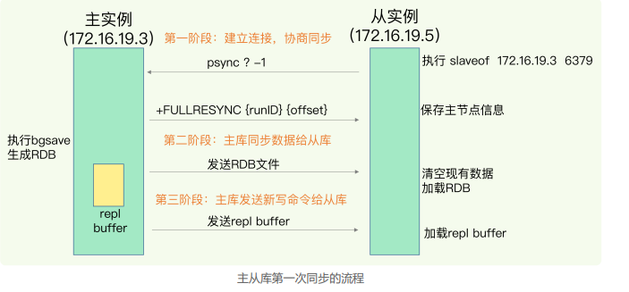
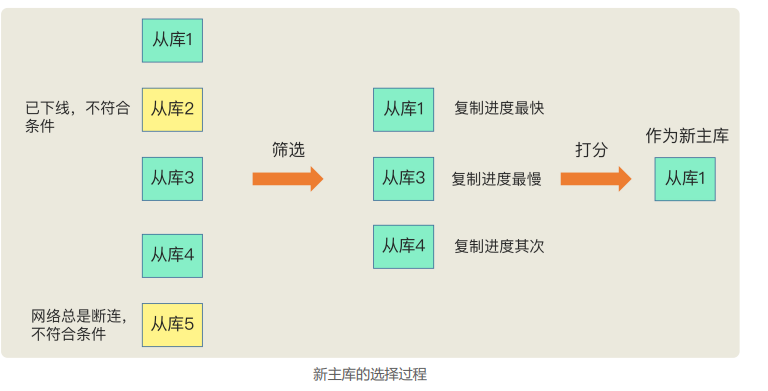

## 持久化机制

### RDB

什么是RDB?

记录redis某一时刻的数据的文件,相当于redis某一时刻数据的快照


阻塞点:

* 当我们使用save命令时,主线程去执行rdb文件的写入,所以会阻塞

* 当我们使用bgsave命令时,又会有哪些阻塞点

  ```markdown
  1. fork本身这个操作执行时,内核需要给子进程拷贝一份父进程的页表,通过页表映射子进程能读取到主进程的原始数据.如果主进程的内存大,页表也相应大,拷贝页表的耗时就会长,这是主线程阻塞的时间就变长
  
  2. 在bgsave保存rdb时,如果有写请求到来,主线程会把新数据或修改后的数据写到新的物理内存地址上,并修改主线程自己的页表映射.主线程阻塞的点是 申请内存空间以及原本数据页数据的拷贝
  
  第2点为什么要这么做捏?
  因为是为了保证数据的完整性,如果主线程直接修改的话,那么就有可能破坏 ** 快照完整性 **, 所以才利用操作系统提供的 写时复制技术(COW)来解决这个问题
  
  那么子进程在写rdb文件时不可以对数据加锁吗?
  如果这样做,虽然能保证 快照完整性, 但会降低redis并发性能, 此时主线程只能处理读请求,而写请求将会阻塞
  
  ```


**如何尽量保证数据不丢失?**

先讲阻塞点,然后为了提高效率与数据的可靠性,我们既要避免通过频繁bgsave来保证数据不丢失,又要避免频繁bgsave带来的主线程阻塞问题, 所以要尽量避免 全量快照,  redis4.0 使用混合 AOF日志和 内存快照的方法, 两次快照, 使用 AOF日志来记录这期间的写操作.

一方面是避免频繁 bgsave 带来的主线程阻塞问题, 另一方面也可以避免 AOF文件过大导致需要重写而消耗一定性能的问题


### AOF

AOF日志记录的是对数据进行新增或修改的操作命令,是写后日志(这点要与MySQL区分)


为什么是日志是写后才记录的

因为 为了**避免额外的检查开销**,redis**在向AOF里面记录日志的时候并不会对这些命令进行语法检查**,所以如果先记录日志再执行命令的话,日志中就可能记录了错误的命令,redis在使用日志恢复数据时就可能出错


写后日志好处和潜在问题

```markdown
好处 : 
1. 不会阻塞当前操作

潜在问题:
1. 写日志之前宕机了,造成数据丢失
2. AOF虽然不会阻塞当前线程, 但会有阻塞下一个操作的风险. AOF日志是由 ** 主线程 ** 执行的,如果把日志文件写入磁盘时,磁盘读写压力大,那么就会导致写盘很慢,	  影响到下一个操作
```


对于以上两个潜在问题,核心问题就是 **AOF写回磁盘的时机**

AOF三种写回策略, appendfsync三个可选值:Always，Everysec，No


除了写回策略,AOF还有哪些注意事项

```markdown
1. AOF日志是追加的方式记录写命令
   这就导致了AOF文件可能过大,那文件过大会出现什么问题?
   		1. 无法保存过大文件,文件系统本身对文件大小有限制
   		2. 效率变低,如果文件太大,再往里面追加命令记录的话就会导致效率变低
   		3. 数据恢复过程慢,如果redis宕机了,恢复数据时要一条条执行AOF日志中的命令记录.
   如何解决?
   		本质就是AOF文件过大,所以目的很明确,减少AOF日志文件大小,引入 AOF重写 来解决这个问题
   AOF重写过程
   		AOF重写是由子进程bgrewriteaof来完成的，不用主线程参与,所以子进程的执行不阻塞主线程
   		一处拷贝,两处日志
   		拷贝指的是子进程拷贝父进程的页表
   		两处日志: 1.当前正在使用的AOF日志
   				 2. 新的AOF重写日志
   		如果有新的写操作命令到来时,既会被写到当前AOF日志缓冲区,也会被写到重写AOF日志的缓冲区
   		
   		为什么日志要两份呢?
   		首先明确一点就是 AOF重写过程中,AOF日志还是依据我们的策略照常写回磁盘,当写回磁盘后 AOF缓冲区将会清空
   		这就是为什么日志要两份的原因,如果只有一份,那么AOF重写就会丢失部分写操作命令
   		
   		子线程重新AOF日志完成时会向主线程发送信号处理函数，会完成 （1）将AOF重写缓冲区的内容写入到新的AOF文件中。（2）将新的AOF文件改名，原子地替换		 现有的AOF文件。完成以后才会重新处理客户端请求。
   		
   		为什么不复用AOF原本的日志文件?
   		AOF重写不复用AOF本身的日志，一个原因是父子进程写同一个文件必然会产生竞争问题，控制竞争就意味着会影响父进程的性能。二是如果AOF重写过程中失败了，		那么原本的AOF文件相当于被污染了，无法做恢复使用。所以Redis AOF重写一个新文件，重写失败的话，直接删除这个文件就好了，不会对原先的AOF文件产生影		  响。等重写完成之后，直接替换旧文件即可。
```

```markdown
2. AOF重写阻塞点有哪些
	1. fork主进程,页表越大,阻塞时间越长
	2. 在AOF重写时,由于主线程正常处理请求,如果有写请求到来并且要修改的key原本就已经存在,那么这个时候父进程就会真正拷贝这个key对应的内存数据，申请新的内		存空间，这样逐渐地，父子进程内存数据开始分离，父子进程逐渐拥有各自独立的内存空间。因为内存分配是以页为单位进行分配的，默认4k，如果父进程此时操作的		 是一个bigkey，重新申请大块内存耗时会变长，可能会产阻塞风险。另外，如果操作系统开启了内存大页机制(Huge Page，页面大小2M)，那么父进程申请内存时阻		 塞的概率将会大大提高，所以在Redis机器上需要关闭Huge Page机制。
```

> Huge page。这个特性大家在使用Redis也要注意。Huge page对提升TLB命 中率比较友好，因为在相同的内存容量下，使用huge page可以减少页表项，TLB就可以缓存更 多的页表项，能减少TLB miss的开销
>
> 但是，这个机制对于Redis这种喜欢用fork的系统来说，的确不太友好，尤其是在Redis的写入请 求比较多的情况下。因为fork后，父进程修改数据采用写时复制，复制的粒度为一个内存页。如 果只是修改一个256B的数据，**父进程需要读原来的内存页，然后再映射到新的物理地址写入**。一 读一写会造成读写放大。如果内存页越大（例如2MB的大页），那么读写放大也就越严重，对Re dis性能造成影响。 Huge page在实际使用Redis时是建议关掉的


## 主从集群

为了实现redis高可靠第二点: 尽量减少服务中断的时间,我们就需要增加冗余副本到不同机器,采取主从集群,读写分离的模式来达到目标,但会触发一个多实例数据同步问题


为什么要采取读写分离?

```markdown
因为如果对数据的写操作发给不同的redis实例,那么就会导致一个数据不一致的问题。
如果对数据的写操作都发给主库，由主库将写操作同步给从库，这样就可以大大减少客户端读取到的数据与实际数据不一致的概率
```


**主从集群的同步过程**

第一次同步过程

```markdown
启动多个redis实例，通过 replicaof（redis5.0之前使用 slaveof）命令形成主库和从库的关系

经过三个阶段后完成数据的第一次同步
1. 建立连接，协商同步
2. 主库同步数据给从库
主库执行bgsave生成RDB文件，将其发送给从库。在这段时间内的写操作命令，主库都会在内存中用专门的replication buffer记录
从库清空现有数据,加载RDB
3. 主库发送同步期间新的写命令给从库
当主库完成RDB文件发送后，就会将此时replication buffer中的修改操作发送给从库，从库再执行这些操作，这样一来主从库就实现同步
从库执行加载repl buffer
```




**主从库间网络断了**

redis2.8之前，如果主从库在命令传播时出现网络闪断，那么从库就会和主库重新进行一次全量复制

redis2.8开始，网络断了之后，主从库会尝试使用 **<font color='orange'>增量复制</font>** 的方式继续同步

> 增量复制就是只会把主从库网络断连期间主库收到的写命令同步给从库


增量复制如何实现的？

~~~markdown
为了找到主从数据差异，主库通过 repl_backlog_buffer 这个环形缓冲区 来判断是否能找到从库断开的位置

repl_backlog_buffer：
主库的写命令除了传播给从库外，还会在这个数据结构中记录一份，缓存起来，只有预先缓存了这些命令，当从库断连后，从库发送自己的id和offset，主库才能通过offset找到从库断开的位置，将offset之后的增量数据发送给从库即可。若找不到offset的位置，则进行全量复制

每个从库会记录自己的slave_repl_offset，每个从库的复制进度也不一定相同。在和主库重连进行恢复时，** 从库会通过psync命令把自己记录的slave_repl_offset发给主库 ** ，主库会根据从库各自的复制进度，来决定这个从库可以进行增量复制，还是全量复制。
~~~


**主从全量同步使用RDB而不用AOF的原因**

~~~markdown
1. RDB文件内容是经过压缩的二进制数据（不同数据类型数据做了针对性优化），文件很小。而AOF文件记录的是每一次写操作的命令，写操作越多文件会变得很大，其中还包括很多对同一个key的多次冗余操作。在主从全量数据同步时，传输RDB文件可以尽量降低对主库机器网络带宽的消耗，从库在加载RDB文件时，一是文件小，读取整个文件的速度会很快，二是因为RDB文件存储的都是二进制数据，从库直接按照RDB协议解析还原数据即可，速度会非常快，而AOF需要依次重放每个写命令，这个过程会经历冗长的处理逻辑，恢复速度相比RDB会慢得多，所以使用RDB进行主从全量同步的成本最低。

2. 假设要使用AOF做全量同步，意味着必须打开AOF功能，打开AOF就要选择文件刷盘的策略，选择不当会严重影响Redis性能。而RDB只有在需要定时备份和主从全量同步数据时才会触发生成一次快照。而在很多丢失数据不敏感的业务场景，其实是不需要开启AOF的。
~~~


**区分repl_backlog_buffer 和 replication buffer**

```markdown
1、repl_backlog_buffer：就是上面我解释到的，它是为了从库断开之后，如何找到主从差异数据而设计的环形缓冲区，从而避免全量同步带来的性能开销。如果从库断开时间太久，repl_backlog_buffer环形缓冲区被主库的写命令覆盖了，那么从库连上主库后只能乖乖地进行一次全量同步，所以repl_backlog_buffer配置尽量大一些，可以降低主从断开后全量同步的概率。而在repl_backlog_buffer中找主从差异的数据后，如何发给从库呢？这就用到了replication buffer。

2、replication buffer：Redis和客户端通信也好，和从库通信也好，Redis都需要给分配一个 内存buffer进行数据交互，客户端是一个client，从库也是一个client，我们每个client连上Redis后，Redis都会分配一个client buffer，所有数据交互都是通过这个buffer进行的：Redis先把数据写到这个buffer中，然后再把buffer中的数据发到client socket中再通过网络发送出去，这样就完成了数据交互。所以主从在增量同步时，从库作为一个client，也会分配一个buffer，只不过这个buffer专门用来传播用户的写命令到从库，保证主从数据一致，我们通常把它叫做replication buffer。

3、再延伸一下，既然有这个内存buffer存在，那么这个buffer有没有限制呢？如果主从在传播命令时，因为某些原因从库处理得非常慢，那么主库上的这个buffer就会持续增长，消耗大量的内存资源，甚至OOM。所以Redis提供了client-output-buffer-limit参数限制这个buffer的大小，如果超过限制，主库会强制断开这个client的连接，也就是说从库处理慢导致主库内存buffer的积压达到限制后，主库会强制断开从库的连接，此时主从复制会中断，中断后如果从库再次发起复制请求，那么此时可能会导致恶性循环，引发复制风暴，这种情况需要格外注意。


1. repl_backlog_buffer用于主从间的增量同步。主节点只有一个repl_backlog_buffer缓冲区，各个从节点的offset偏移量都是相对该缓冲区而言的。
2. replication buffer用于主节点与各个从节点间 数据的批量交互。主节点为各个从节点分别创建一个缓冲区，由于各个从节点的处理能力差异，各个缓冲区数据可能不同。

repl_backlog_buffer这个缓冲只在主从重连时才起作用，在主从连接正常时，即使master覆盖了slave的数据也没关系，应为数据都在replication_buffer里，只要replication_buffer没溢出，等slave消费完了replication_buffer，slave_offset也追上去了，只有等到主从重连时才会用到repl_backlog_buffer做判断，正常情况下repl_backlog_buffer只是一直循环写

而在repl_backlog_buffer中找主从差异的数据后，如何发给从库呢？这就用到了replication buffer。
这句话的意思是：先在backlog里通过offset差异，找到差异数据，然后将这部分差异数据同步到replication buffer后，replication buffer才专门的将这部分数据发送给从库，达到增量同步的目的

只要有从节点连接上，在主节点就会有一个repl_backlog_buffer，并且无论从节点是否断开连接，主节点都会把收到的命令写入repl_backlog_buffer，如果从节点连接正常，主节点直接走replication buffer，如果从节点断开连接，等再次连接上时判断offset是否被覆盖，没有被覆盖把slave offset和master offset之间的数据通过replication buffer传输，如果被覆盖则再次RDB走replication buffer全量同步.
如果一个slave都没有了，那backlog buffer也会释放了。
```


**环形缓冲期很大导致数据不同步怎么处理？比方说，一个从库长断网以后，长时间没有联网处理。**

```markdown
没错，环形缓冲区再大，在某些时候，就如你所说的从库长期断网时，也会出问题。

其实从库正常情况下会每秒给主库发送一个replconf ack命令，主库会根据这个命令的达到时间判断和从库的连网情况。如果距离最后一次ack命令收到的时间已经超过了repl_timeout时间，就会和从库断开连接了。

从库再和主库连接时，会发送自己的复制进度，如果要复制内容在缓冲区中已经被覆盖了，那么就不再做增量复制了，而是进行全量复制。
```


### 疑惑就是同步数据这个过程主线程执行的还是别的线程执行

```markdown
repl_backlog_size这个参数很重要，因为如果满了，就需要重新全量复制，默认是1M，所以之前网上就流传1个段子，如果一个公司说自己体量如何大，技术多么牛，要是repl_backlog_size参数是默认值，基本可以认为要不业务体量吹牛逼了，要不就没有真正的技术牛人。

主从复制的另一种方式：基于硬盘和无盘复制
可以通过这个参数设置
repl-diskless-sync
复制集同步策略：磁盘或者socket
新slave连接或者老slave重新连接时候不能只接收不同，得做一个全同步。需要一个新的RDB文件dump出来，然后从master传到slave。可以有两种情况：
 1）基于硬盘（disk-backed）：master创建一个新进程dump RDB，完事儿之后由父进程（即主进程）增量传给slaves。
 2）基于socket（diskless）：master创建一个新进程直接dump RDB到slave的socket，不经过主进程，不经过硬盘。

当基于 disk-backed 复制时，当 RDB 文件生成完毕，多个 replicas 通过排队来同步 RDB 文件。

当基于diskless的时候，master等待一个repl-diskless-sync-delay的秒数，如果没slave来的话，就直接传，后来的得排队等了。否则就可以一起传。适用于disk较慢，并且网络较快的时候，可以用diskless。（默认用disk-based）


回答下课后问题：
    1、RDB读取快，这样从库可以尽快完成RDB的读取，然后入去消费replication buffer的数据。如果是AOF的话，AOF体积大，读取慢，需要更大的replication buffer，如果一个主节点的从节点多的话，就需要更大的内存去处理；
    2、AOF文件是append追加模式，同时读写需要考虑并发安全问题，并且AOF是文本文件，体积较大，浪费网络带宽。

最后问老师个问题哈，就是bgsave生成的rdb文件什么时候“过期”，或者有过期的说法吗？比如我2个从节点执行replicaof（或者slaveof），主节点是同一个，这中情况下，rdb生成1次还是2次？

A从节点向主节点申请全量同步，
在主节点创建完成RDB文件之前，如果B从节点也向主及诶点申请全量同步的话，RDB只会生成一次。
在主节点创建完成RDB文件之后，如果B从节点也向主及诶点申请全量同步的话，主节点会在完成A节点的RDB文件同步之后，再重新创建RDB文件给B节点的同步。
```


## 哨兵

首先为什么要引入哨兵?

引入哨兵的最终目的是 当前主库挂了，但还是能不间断服务


怎么做到这点？

将一个从库切换为主库


这种方式会涉及哪些问题？

1. 主库真的挂了吗？ 
2. 该选择哪个从库作为主库？ 
3. 怎么把新主库的相关信息通知给从库和客户端呢


在 Redis 主从集群中，哨兵机制是实现主从库自动切换的关键机 制，它有效地解决了**主从复制模式下故障转移**的这三个问题

### 哨兵机制

#### 基本流程

哨兵机制，它是实现 Redis 不间断服务的重要保证。具体来说， 主从集群的数据同步，是数据可靠的基础保证；而在主库发生故障时，自动的主从切换是服务不间断的关键支撑。


哨兵其实就是一个运行在特殊模式下的 Redis 进程，主从库实例运行的同时，它也在运行。哨兵主要负责的就是三个任务：监控、选主（选择主库）和通知。

我们先看监控。监控是指哨兵进程在运行时，周期性地给所有的主从库发送 PING 命令， 检测它们是否仍然在线运行。如果从库没有在规定时间内响应哨兵的 PING 命令，哨兵就会把它标记为“下线状态”；如果主库也没有在规定时间内响应哨兵的 PING 命令，如果是单哨兵模式情况下,哨兵会直接标记主库为主观下线,然后开始新主库的选举工作, 若是部署的是哨兵集群,则会先标记主库主观下线，再进行客观下线的判定，若通过则开始自动切换主库的流程。

这个流程首先是执行哨兵的第二个任务，选主。主库挂了以后，哨兵就需要从很多个从库里，按照一定的规则选择一个从库实例，把它作为新的主库。这一步完成后，现在的集群里就有了新主库。

然后，哨兵会执行最后一个任务：通知。在执行通知任务时，哨兵会把新主库的连接信息发给其他从库，让它们执行 replicaof 命令，和新主库建立连接，并进行数据复制。同时， 哨兵会把新主库的连接信息通知给客户端，让它们把请求操作发到新主库上。


**哨兵需要做出的两个决策：**

1. 在监控任务中，哨兵需要判断主库是否处于下线状态；
2. 在选主任务中，哨兵也要决定选择哪个从库实例作为主库。


##### 监控

哨兵存在误判的情况，若是哨兵误判后启动主从切换，则后续的选主和通知操作都会带来额外的计算和通信开销


**什么是误判？**

主库实际并没有下线，但是哨兵误以为它下线 了。误判一般会发生在集群网络压力较大、网络拥塞，或者是主库本身压力较大的情况 下。


**误判带来的影响？**

一旦哨兵判断主库下线了，就会开始选择新主库，并让从库和新主库进行数据同步，这个 过程本身就会有开销，例如，哨兵要花时间选出新主库，从库也需要花时间和新主库同 步。而在误判的情况下，主库本身根本就不需要进行切换的，所以这个过程的开销是没有价值的。正因为这样，我们需要判断是否有误判，以及减少误判。


**如何减少误判**

概括：集群，少数服从多数

通常会采用多实例组成的集群模式进行部署，这也被称为哨兵集群。引入多个哨兵实例一起来判断，就可以避免单个哨兵因为自身网络状况不好，而误判主库下线的情况。同时，多个哨兵的网络同时不稳定的概率较小，由它们一起做决策，误判率也能降低。

在判断主库是否下线时，不能由一个哨兵说了算，只有大多数的哨兵实例，都判断主库已 经“主观下线”了，主库才会被标记为“客观下线”，这个叫法也是表明主库下线成为一 个客观事实了。这个判断原则就是：少数服从多数。同时，这会进一步触发哨兵开始主从切换流程。


**客观下线的标准**

“客观下线”的标准就是，当有 N 个哨兵实例时，最好要有 N/2 + 1 个实例判 断主库为“主观下线”，才能最终判定主库为“客观下线”。这样一来，就可以减少误判 的概率，也能避免误判带来的无谓的主从库切换。（当然，有多少个实例做出“主观下 线”的判断才可以，可以由 Redis 管理员自行设定）


##### 选主

一般来说，我把哨兵选择新主库的过程称为“筛选 + 打分”。简单来说，我们在多个从库 中，先按照**一定的筛选条件**，把不符合条件的从库去掉。然后，我们再按照**一定的规则**， 给剩下的从库逐个打分，将得分最高的从库选为新主库，如下图所示：




**过滤**

在选主时，**除了要检查从库的当前在线状态，还要判断它之前的网络连接状态**

具体怎么判断呢？你使用配置项 down-after-milliseconds * 10。其中，down-after-milliseconds 是我们认定主从库断连的最大连接超时时间。如果在 down-after-milliseconds 毫秒内，主从节点都没有通过网络联系上，我们就可以认为主从节点断连 了。如果发生断连的次数超过了 10 次，就说明这个从库的网络状况不好，不适合作为新主库。

就过滤掉了不适合做主库的从库，完成了筛选工作。


**打分**

接下来就要给剩余的从库打分了。我们可以分别按照三个规则依次进行三轮打分，这三个 规则分别是从库优先级、从库复制进度以及从库 ID 号。**只要在某一轮中，有从库得分最高，那么它就是主库了**，选主过程到此结束。如果没有出现得分最高的从库，那么就继续 进行下一轮。


**第一轮：优先级最高的从库得分高。**

用户可以通过 slave-priority 配置项，给不同的从库设置不同优先级。比如，你有两个从 库，它们的内存大小不一样，你可以手动给内存大的实例设置一个高优先级。在选主时， 哨兵会给优先级高的从库打高分，如果有一个从库优先级最高，那么它就是新主库了。如 果从库的优先级都一样，那么哨兵开始第二轮打分。


**第二轮：和旧主库同步程度最接近的从库得分高。**

这个规则的依据是，如果选择和旧主库同步最接近的那个从库作为主库，那么，这个新主 库上就有最新的数据。

如何判断从库和旧主库间的同步进度呢？

主从库同步时有个命令传播的过程。在这个过程中，主库会用 master_repl_offset 记录当前的最新写操作在 repl_backlog_buffer 中的位置，而从库会 用 slave_repl_offset 这个值记录当前的复制进度

此时，我们想要找的从库，它的 slave_repl_offset 需要最接近 master_repl_offset。如果 在所有从库中，有从库的 slave_repl_offset 最接近 master_repl_offset，那么它的得分就 最高，可以作为新主库。

如果有两个从库的 slave_repl_offset 值大小是一样的（例如，从库 1 和从库 2 的 slave_repl_offset 值都是 990），我们就需要给它们进行第三轮打分了。


**第三轮：ID 号小的从库得分高。**

每个实例都会有一个 ID，这个 ID 就类似于这里的从库的编号。目前，Redis 在选主库 时，有一个默认的规定：在优先级和复制进度都相同的情况下，ID 号最小的从库得分最 高，会被选为新主库。到这里，新主库就被选出来了，“选主”这个过程就完成了。


**思考**

通过哨兵机制，可以实现主从库的自动 切换，这是实现服务不间断的关键支撑，同时，我也提到了主从库切换是需要一定时间 的。所以，请你考虑下，在这个切换过程中，客户端能否正常地进行请求操作呢？如果想 要应用程序不感知服务的中断，还需要哨兵或需要客户端再做些什么吗？

```markdown
如果客户端使用了读写分离，那么读请求可以在从库上正常执行，不会受到影响。但是由于此时主库已经挂了，而且哨兵还没有选出新的主库，所以在这期间写请求会失败，失败持续的时间 = 哨兵切换主从的时间 + 客户端感知到新主库 的时间。

如果不想让业务感知到异常，客户端只能把写失败的请求先缓存起来或写入消息队列中间件中，等哨兵切换完主从后，再把这些写请求发给新的主库，但这种场景只适合对写入请求返回值不敏感的业务，而且还需要业务层做适配，另外主从切换时间过长，也会导致客户端或消息队列中间件缓存写请求过多，切换完成之后重放这些请求的时间变长。

哨兵检测主库多久没有响应就提升从库为新的主库，这个时间是可以配置的（down-after-milliseconds参数）。配置的时间越短，哨兵越敏感，哨兵集群认为主库在短时间内连不上就会发起主从切换，这种配置很可能因为网络拥塞但主库正常而发生不必要的切换，当然，当主库真正故障时，因为切换得及时，对业务的影响最小。如果配置的时间比较长，哨兵越保守，这种情况可以减少哨兵误判的概率，但是主库故障发生时，业务写失败的时间也会比较久，缓存写请求数据量越多。

应用程序不感知服务的中断，还需要哨兵和客户端做些什么？当哨兵完成主从切换后，客户端需要及时感知到主库发生了变更，然后把缓存的写请求写入到新库中，保证后续写请求不会再受到影响，具体做法如下：

哨兵提升一个从库为新主库后，哨兵会把新主库的地址写入自己实例的pubsub（switch-master）中。客户端需要订阅这个pubsub，当这个pubsub有数据时，客户端就能感知到主库发生变更，同时可以拿到最新的主库地址，然后把写请求写到这个新主库即可，这种机制属于哨兵主动通知客户端。

如果客户端因为某些原因错过了哨兵的通知，或者哨兵通知后客户端处理失败了，安全起见，客户端也需要支持主动去获取最新主从的地址进行访问。

所以，客户端需要访问主从库时，不能直接写死主从库的地址了，而是需要从哨兵集群中获取最新的地址（sentinel get-master-addr-by-name命令），这样当实例异常时，哨兵切换后或者客户端断开重连，都可以从哨兵集群中拿到最新的实例地址。

一般Redis的SDK都提供了通过哨兵拿到实例地址，再访问实例的方式，我们直接使用即可，不需要自己实现这些逻辑。当然，对于只有主从实例的情况，客户端需要和哨兵配合使用，而在分片集群模式下，这些逻辑都可以做在proxy层，这样客户端也不需要关心这些逻辑了，Codis就是这么做的。

另外再简单回答下哨兵相关的问题：

1、哨兵集群中有实例挂了，怎么办，会影响主库状态判断和选主吗？

这个属于分布式系统领域的问题了，指的是在分布式系统中，如果存在故障节点，整个集群是否还可以提供服务？而且提供的服务是正确的？

这是一个分布式系统容错问题，这方面最著名的就是分布式领域中的“拜占庭将军”问题了，“拜占庭将军问题”不仅解决了容错问题，还可以解决错误节点的问题，虽然比较复杂，但还是值得研究的，有兴趣的同学可以去了解下。

简单说结论：存在故障节点时，只要集群中大多数节点状态正常，集群依旧可以对外提供服务。具体推导过程细节很多，大家去查前面的资料了解就好。

2、哨兵集群多数实例达成共识，判断出主库“客观下线”后，由哪个实例来执行主从切换呢？

哨兵集群判断出主库“主观下线”后，会选出一个“哨兵领导者”，之后整个过程由它来完成主从切换。

但是如何选出“哨兵领导者”？这个问题也是一个分布式系统中的问题，就是我们经常听说的共识算法，指的是集群中多个节点如何就一个问题达成共识。共识算法有很多种，例如Paxos、Raft，这里哨兵集群采用的类似于Raft的共识算法。

简单来说就是每个哨兵设置一个随机超时时间，超时后每个哨兵会请求其他哨兵为自己投票，其他哨兵节点对收到的第一个请求进行投票确认，一轮投票下来后，首先达到多数选票的哨兵节点成为“哨兵领导者”，如果没有达到多数选票的哨兵节点，那么会重新选举，直到能够成功选出“哨兵领导者”。


环形缓冲区的位置偏移量是单调递增的。主库的被称为：master_repl_offset，从库的被称为：slave_repl_offset，其实两者本质是相同的，叫不同的名字只是为了区分


master_repl_offset是单调增加的，它的值可以大于repl_backlog_size。Redis会用一个名为repl_backlog_idx的值记录在环形缓冲区中的最新写入位置。
举个例子，例如写入len的数据，那么
master_repl_offset += len
repl_backlog_idx += len
但是，如果repl_backlog_idx等于repl_backlog_size时，repl_backlog_idx会被置为0，表示从环形缓冲区开始位置继续写入。

而在实际的选主代码层面，sentinel是直接比较从库的slave_repl_offset，来选择和主库最接近的从库。
```


##### 通知

从本质上说，哨兵就是一个运行在特定模式下的 Redis 实例，只不过它并不服务请求操作，只是完成监控、选主和通知的任务。所以，每个哨兵实例也提供 pub/sub 机制，客户端可以从哨兵订阅消息。哨兵提供的消息订阅频道有很多，不同频道包含了主从库切换过程中的不同关键事件。


知道了这些频道之后，你就可以让客户端从哨兵这里订阅消息了。具体的操作步骤是，客户端读取哨兵的配置文件后，可以获得哨兵的地址和端口，和哨兵建立网络连接。然后，我们可以在客户端执行订阅命令，来获取不同的事件消息。

当哨兵把新主库选择出来后，客户端就会看到下面的 switch-master 事件。这个事件表示主库已经切换了，新主库的 IP 地址和端口信息已经有了。这个时候，客户端就可以用这里面的新主库地址和端口进行通信了。


有了这些事件通知，客户端不仅可以在主从切换后得到新主库的连接信息，还可以监控到主从库切换过程中发生的各个重要事件。这样，客户端就可以知道主从切换进行到哪一步了，有助于了解切换进度。

有了 pub/sub 机制，哨兵和哨兵之间、哨兵和从库之间、哨兵和客户端之间就都能建立起连接了，再加上我们上节课介绍主库下线判断和选主依据，哨兵集群的监控、选主和通知三个任务就基本可以正常工作了


### 主从切换由哨兵集群中的哪一个进行实际的主从切换

**“客观下线”具体的判断过程**

任何一个实例只要自身判断主库“主观下线”后，就会给其他实例发送 is-master-down-by-addr 命令。接着，其他实例会根据自己和主库的连接情况，做出 Y 或 N 的响应，Y 相当于赞成票，N 相当于反对票。


一个哨兵获得了仲裁所需的赞成票数后，就可以标记主库为“客观下线”。这个所需的赞成票数是通过哨兵配置文件中的 quorum 配置项设定的。例如，现在有 5 个哨兵，quorum 配置的是 3，那么，一个哨兵需要 3 张赞成票，就可以标记主库为“客观下线”了。这 3 张赞成票包括哨兵自己的一张赞成票和另外两个哨兵的赞成票。

此时，**这个哨兵**就可以再给其他哨兵发送命令，表明希望由自己来执行主从切换，并让所有其他哨兵进行投票。这个投票过程称为“Leader 选举”。因为最终执行主从切换的哨兵称为 Leader，投票过程就是确定 Leader。

在投票过程中，任何一个想成为 Leader 的哨兵，要满足两个条件：第一，拿到半数以上的赞成票；第二，拿到的票数同时还需要大于等于哨兵配置文件中的 quorum 值。以 3 个哨兵为例，假设此时的 quorum 设置为 2，那么，任何一个想成为 Leader 的哨兵只要拿到 2 张赞成票，就可以了。


这轮投票没有产生 Leader的话，哨兵集群会等待一段时间（也就是哨兵故障转移超时时间的 2 倍），再重新选举。这是因为，哨兵集群能够进行成功投票，很大程度上依赖于选举命令的正常网络传播。如果网络压力较大或有短时堵塞，就可能导致没有一个哨兵能拿到半数以上的赞成票。所以，等到网络拥塞好转之后，再进行投票选举，成功的概率就会增加。

需要注意的是，如果哨兵集群只有 2 个实例，此时，一个哨兵要想成为 Leader，**必须获得 2 票**，而不是 1 票。所以，如果有个哨兵挂掉了，那么，此时的集群是无法进行主从库切换的。因此，通常我们至少会配置 3 个哨兵实例。这一点很重要，你在实际应用时可不能忽略了。


**要保证所有哨兵实例的配置是一致的，尤其是主观下线的判断值 down-after-milliseconds。**我们曾经就踩过一个“坑”。当时，在我们的项目中，因为这个值在不同的哨兵实例上配置不一致，导致哨兵集群一直没有对有故障的主库形成共识，也就没有及时切换主库，最终的结果就是集群服务不稳定。所以，你一定不要忽略这条看似简单的经验。


### 哨兵集群

如果有哨兵实例在运行时发生了故障，主从库还能正常切换吗？

实际上，一旦多个实例组成了哨兵集群，即使有哨兵实例出现故障挂掉了，其他哨兵还能继续协作完成主从库切换的工作，包括判定主库是不是处于下线状态，选择新主库，以及通知从库和客户端。

如果你部署过哨兵集群的话就会知道，在配置哨兵的信息时，我们只需要用到下面的这个配置项，设置**主库的 IP** 和**端口**，并没有配置其他哨兵的连接信息。

`sentinel monitor <master-name> <ip> <redis-port> <quorum> `

这些哨兵实例既然都不知道彼此的地址，又是怎么组成集群的呢？要弄明白这个问题，我们就需要学习一下哨兵集群的组成和运行机制了。


#### 基于 pub/sub 机制的哨兵集群组成

哨兵实例之间可以相互发现，要归功于 Redis 提供的 pub/sub 机制，也就是发布 / 订阅机制。

哨兵只要和主库建立起了连接，就可以在主库上发布消息了，比如说发布它自己的连接信息（IP 和端口）。同时，它也可以从主库上订阅消息，获得其他哨兵发布的连接信息。当多个哨兵实例都在主库上做了发布和订阅操作后，它们之间就能知道彼此的 IP 地址和端口。

除了哨兵实例，我们自己编写的应用程序也可以通过 Redis 进行消息的发布和订阅。所以，为了区分不同应用的消息，Redis 会以**频道**的形式，对这些消息进行分门别类的管理。所谓的频道，实际上就是消息的类别。当消息类别相同时，它们就属于同一个频道。反之，就属于不同的频道。**只有订阅了同一个频道的应用，才能通过发布的消息进行信息交换。**

在主从集群中，主库上有一个名为“\__sentinel__:hello”的频道，不同哨兵就是通过它来相互发现，实现互相通信的。

> 我来举个例子，具体说明一下。在下图中，哨兵 1 把自己的 IP（172.16.19.3）和端口（26579）发布到“__sentinel__:hello”频道上，哨兵 2 和 3 订阅了该频道。那么此时，哨兵 2 和 3 就可以从这个频道直接获取哨兵 1 的 IP 地址和端口号。然后，哨兵 2、3 可以和哨兵 1 建立网络连接。通过这个方式，哨兵 2 和 3 也可以建立网络连接，这样一来，哨兵集群就形成了。它们相互间可以通过网络连接进行通信，比如说对主库有没有下线这件事儿进行判断和协商

**哨兵除了彼此之间建立起连接形成集群外，还需要和从库建立连接。这是因为，在哨兵的监控任务中，它需要对主从库都进行心跳判断，而且在主从库切换完成后，它还需要通知从库，让它们和新主库进行同步**。


**哨兵是如何知道从库的 IP 地址和端口的呢？**

这是由哨兵向主库发送 INFO 命令来完成的。就像下图所示，哨兵 2 给主库发送 INFO 命令，主库接受到这个命令后，就会把**从库列表返回**给哨兵。接着，哨兵就可以根据从库列表中的连接信息，和每个从库建立连接，并在这个连接上持续地对从库进行监控。哨兵 1 和 3 可以通过相同的方法和从库建立连接。


通过 pub/sub 机制，哨兵之间可以组成集群，同时，哨兵又通过 INFO 命令，获得了从库连接信息，也能和从库建立连接，并进行监控了。

但是，哨兵不能只和主、从库连接。因为，主从库切换后，客户端也需要知道新主库的连接信息，才能向新主库发送请求操作。所以，哨兵还需要完成把新主库的信息告诉客户端这个任务。


在实际使用哨兵时，我们有时会遇到这样的问题：如何在客户端通过监控了解哨兵进行主从切换的过程呢？比如说，主从切换进行到哪一步了？这其实就是要求，客户端能够获取到哨兵集群在监控、选主、切换这个过程中发生的各种事件。

我们仍然可以依赖 pub/sub 机制，来帮助我们完成哨兵和客户端间的信息同步


**思考**

假设有一个 Redis 集群，是“一主四从”，同时配置了包含 5 个哨兵实例的集群，quorum 值设为 2。在运行过程中，如果有 3 个哨兵实例都发生故障了，此时，Redis 主库如果有故障，还能正确地判断主库“客观下线”吗？如果可以的话，还能进行主从库自动切换吗？此外，哨兵实例是不是越多越好呢，如果同时调大 down-after-milliseconds 值，对减少误判是不是也有好处呢？


```markdown
1、哨兵集群可以判定主库“主观下线”。由于quorum=2，所以当一个哨兵判断主库“主观下线”后，询问另外一个哨兵后也会得到同样的结果，2个哨兵都判定“主观下线”，达到了quorum的值，因此，哨兵集群可以判定主库为“客观下线”。

2、但哨兵不能完成主从切换。哨兵标记主库“客观下线后”，在选举“哨兵领导者”时，一个哨兵必须拿到超过多数的选票(5/2+1=3票)。但目前只有2个哨兵活着，无论怎么投票，一个哨兵最多只能拿到2票，永远无法达到多数选票的结果。

但是投票选举过程的细节并不是大家认为的：每个哨兵各自1票，这个情况是不一定的。下面具体说一下：

场景a：哨兵A先判定主库“主观下线”，然后马上询问哨兵B（注意，此时哨兵B只是被动接受询问，并没有去询问哨兵A，也就是它还没有进入判定“客观下线”的流程），哨兵B回复主库已“主观下线”，达到quorum=2后哨兵A此时可以判定主库“客观下线”。此时，哨兵A马上可以向其他哨兵发起成为“哨兵领导者”的投票，哨兵B收到投票请求后，由于自己还没有询问哨兵A进入判定“客观下线”的流程，所以哨兵B是可以给哨兵A投票确认的，这样哨兵A就已经拿到2票了。等稍后哨兵B也判定“客观下线”后想成为领导者时，因为它已经给别人投过票了，所以这一轮自己就不能再成为领导者了。

场景b：哨兵A和哨兵B同时判定主库“主观下线”，然后同时询问对方后都得到可以“客观下线”的结论，此时它们各自给自己投上1票后，然后向其他哨兵发起投票请求，但是因为各自都给自己投过票了，因此各自都拒绝了对方的投票请求，这样2个哨兵各自持有1票。

场景a是1个哨兵拿到2票，场景b是2个哨兵各自有1票，这2种情况都不满足大多数选票(3票)的结果，因此无法完成主从切换。

经过测试发现，场景b发生的概率非常小，只有2个哨兵同时进入判定“主观下线”的流程时才可以发生。我测试几次后发现，都是复现的场景a。

哨兵实例是不是越多越好？

并不是，我们也看到了，哨兵在判定“主观下线”和选举“哨兵领导者”时，都需要和其他节点进行通信，交换信息，哨兵实例越多，通信的次数也就越多，而且部署多个哨兵时，会分布在不同机器上，节点越多带来的机器故障风险也会越大，这些问题都会影响到哨兵的通信和选举，出问题时也就意味着选举时间会变长，切换主从的时间变久。

调大down-after-milliseconds值，对减少误判是不是有好处？

是有好处的，适当调大down-after-milliseconds值，当哨兵与主库之间网络存在短时波动时，可以降低误判的概率。但是调大down-after-milliseconds值也意味着主从切换的时间会变长，对业务的影响时间越久，我们需要根据实际场景进行权衡，设置合理的阈值。


图示哨兵选举过程中，选举的结果取决于S2的投票，如果S2也投给自己，并且每轮投票都是只投给自己，岂不是无法选出“Leader”，是不是这个过程从了死循环呢？投票投给谁，依据是什么？
1.文章中的例子里，要发生S1、S2和S3同时同自己投票的情况，这需要这三个哨兵基本同时判定了主库客观下线。但是，不同哨兵的网络连接、系统压力不完全一样，接收到下线协商消息的时间也可能不同，所以，它们同时做出主库客观下线判定的概率较小，一般都有个先后关系。文章中的例子，就是S1、S3先判定，S2一直没有判定。

其次，哨兵对主从库进行的在线状态检查等操作，是属于一种时间事件，用一个定时器来完成，一般来说每100ms执行一次这些事件。每个哨兵的定时器执行周期都会加上一个小小的随机时间偏移，目的是让每个哨兵执行上述操作的时间能稍微错开些，也是为了避免它们都同时判定主库下线，同时选举Leader。

最后，即使出现了都投给自己一票的情况，导致无法选出Leader，哨兵会停一段时间（一般是故障转移超时时间failover_timeout的2倍），然后再可以进行下一轮投票。

2.哨兵如果没有给自己投票，就会把票投给第一个给它发送投票请求的哨兵。后续再有投票请求来，哨兵就拒接投票了。
```


## 切片集群

数据增多了，是该加内存还是加实例？

背景：大量数据存放于redis中数据持久化采用RDB时，fork子进程这一过程导致主线程阻塞时间较长，结果就是redis响应变慢


所以就出现了切片集群


### 如何保存更多数据？

为了保存大量数据，我们使用了大内存云主机和切片集群两种方法。实际上，这两种方法分别对应着 Redis 应对数据量增多的两种方案：纵向扩展（scale up）和横向扩展（scale out）。

* **纵向扩展**：升级单个 Redis 实例的资源配置，包括增加内存容量、增加磁盘容量、使用更高配置的 CPU。就像下图中，原来的实例内存是 8GB，硬盘是 50GB，纵向扩展后，内存增加到 24GB，磁盘增加到 150GB。
* **横向扩展**：横向增加当前 Redis 实例的个数，就像下图中，原来使用 1 个 8GB 内存、50GB 磁盘的实例，现在使用三个相同配置的实例。


这两种方式的优缺点分别是什么呢？

首先，纵向扩展的好处是，实施起来简单、直接。不过，这个方案也面临两个潜在的问题

第一个问题是，当使用 RDB 对数据进行持久化时，如果数据量增加，需要的内存也会增加，主线程 fork 子进程时就可能会阻塞（比如刚刚的例子中的情况）。不过，如果你不要求持久化保存 Redis 数据，那么，纵向扩展会是一个不错的选择。

不过，这时，你还要面对第二个问题：纵向扩展会受到硬件和成本的限制。这很容易理解，毕竟，把内存从 32GB 扩展到 64GB 还算容易，但是，要想扩充到 1TB，就会面临硬件容量和成本上的限制了。


与纵向扩展相比，横向扩展是一个扩展性更好的方案。这是因为，要想保存更多的数据，采用这种方案的话，只用增加 Redis 的实例个数就行了，不用担心单个实例的硬件和成本限制。在面向百万、千万级别的用户规模时，横向扩展的 Redis 切片集群会是一个非常好的选择。

不过，在只使用单个实例的时候，数据存在哪儿，客户端访问哪儿，都是非常明确的，但是，切片集群不可避免地涉及到多个实例的分布式管理问题。要想把切片集群用起来，我们就需要解决两大问题：

* 数据切片后，在多个实例之间如何分布？
* 客户端怎么确定想要访问的数据在哪个实例上？


### 数据切片和实例的对应分布关系

在切片集群中，数据需要分布在不同实例上，那么，数据和实例之间如何对应呢？这就和接下来我要讲的 Redis Cluster 方案有关了。不过，我们要先弄明白切片集群和 Redis Cluster 的联系与区别。

实际上，切片集群是一种保存大量数据的通用机制，这个机制可以有不同的实现方案。在 Redis 3.0 之前，官方并没有针对切片集群提供具体的方案。从 3.0 开始，官方提供了一个名为 Redis Cluster 的方案，用于实现切片集群。Redis Cluster 方案中就规定了数据和实例的对应规则。

具体来说，Redis Cluster 方案采用哈希槽（Hash Slot，接下来我会直接称之为 Slot），来处理数据和实例之间的映射关系。在 Redis Cluster 方案中，一个切片集群共有 16384 个哈希槽，这些哈希槽类似于数据分区，每个键值对都会根据它的 key，被映射到一个哈希槽中。

具体的映射过程分为两大步：首先根据键值对的 key，按照CRC16 算法计算一个 16 bit 的值；然后，再用这个 16bit 值对 16384 取模，得到 0~16383 范围内的模数，每个模数代表一个相应编号的哈希槽。关于 CRC16 算法，不是这节课的重点，你简单看下链接中的资料就可以了。


那么，这些哈希槽又是如何被映射到具体的 Redis 实例上的呢？

我们在部署 Redis Cluster 方案时，可以使用 cluster create 命令创建集群，此时，Redis 会自动把这些槽平均分布在集群实例上。例如，如果集群中有 N 个实例，那么，每个实例上的槽个数为 16384/N 个。

在集群运行的过程中，key1 和 key2 计算完 CRC16 值后，对哈希槽总个数 5 取模，再根据各自的模数结果，就可以被映射到对应的实例 1 和实例 3 上了。

`在手动分配哈希槽时，需要把 16384 个槽都分配完，否则 Redis 集群无法正常工作。`


通过哈希槽，切片集群就实现了数据到哈希槽、哈希槽再到实例的分配。但是，即使实例有了哈希槽的映射信息，客户端又是怎么知道要访问的数据在哪个实例上呢？


### 客户端如何定位数据？

在定位键值对数据时，它所处的哈希槽是可以通过计算得到的，这个计算可以在客户端发送请求时来执行。但是，要进一步定位到实例，**还需要知道哈希槽分布在哪个实例上。**

一般来说，客户端和集群实例建立连接后，实例就会把哈希槽的分配信息发给客户端。但是，**在集群刚刚创建的时候，每个实例只知道自己被分配了哪些哈希槽**，是不知道其他实例拥有的哈希槽信息的。

那么，客户端为什么可以在访问任何一个实例时，都能获得所有的哈希槽信息呢？这是因为，Redis 实例会把自己的哈希槽信息发给和它相连接的其它实例，来完成哈希槽分配信息的扩散。当实例之间相互连接后，每个实例就有所有哈希槽的映射关系了。

客户端收到哈希槽信息后，会把哈希槽信息缓存在本地。当客户端请求键值对时，会先计算键所对应的哈希槽，然后就可以给相应的实例发送请求了。


但是，在集群中，实例和哈希槽的对应关系并不是一成不变的，最常见的变化有两个:

* 在集群中，实例有新增或删除，Redis 需要重新分配哈希槽；
* 为了负载均衡，Redis 需要把哈希槽在所有实例上重新分布一遍。

实例之间还可以通过相互传递消息，获得最新的哈希槽分配信息，但是，客户端是无法主动感知这些变化的。这就会导致，它缓存的分配信息和最新的分配信息就不一致了，那该怎么办呢？

Redis Cluster 方案提供了一种重定向机制，所谓的“重定向”，就是指，客户端给一个实例发送数据读写操作时，这个实例上并没有相应的数据，客户端要再给一个新实例发送操作命令。

那客户端又是怎么知道重定向时的新实例的访问地址呢？当客户端把一个键值对的操作请求发给一个实例时，如果这个实例上并没有这个键值对映射的哈希槽，那么，这个实例就会给客户端返回下面的 MOVED 命令响应结果，这个结果中就包含了新实例的访问地址。


其中，MOVED 命令表示，客户端请求的键值对所在的哈希槽 13320，实际是在 172.16.19.5 这个实例上。通过返回的 MOVED 命令，就相当于把哈希槽所在的新实例的信息告诉给客户端了。这样一来，客户端就可以直接和 172.16.19.5 连接，并发送操作请求了。

需要注意的是，在上图中，当客户端给实例 2 发送命令时，Slot 2 中的数据已经全部迁移到了实例 3。在实际应用时，如果 Slot 2 中的数据比较多，就可能会出现一种情况：客户端向实例 2 发送请求，但此时，Slot 2 中的数据只有一部分迁移到了实例 3，还有部分数据没有迁移。在这种迁移部分完成的情况下，客户端就会收到一条 ASK 报错信息，如下所示：


这个结果中的 ASK 命令就表示，客户端请求的键值对所在的哈希槽 13320，在 172.16.19.5 这个实例上，但是这个哈希槽正在迁移。此时，客户端需要先给 172.16.19.5 这个实例发送一个 ASKING 命令。这个命令的意思是，让这个实例允许执行客户端接下来发送的命令。然后，客户端再向这个实例发送 GET 命令，以读取数据。


在下图中，Slot 2 正在从实例 2 往实例 3 迁移，key1 和 key2 已经迁移过去，key3 和 key4 还在实例 2。客户端向实例 2 请求 key2 后，就会收到实例 2 返回的 ASK 命令。

ASK 命令表示两层含义：第一，表明 Slot 数据还在迁移中；第二，ASK 命令把客户端所请求数据的最新实例地址返回给客户端，此时，客户端需要给实例 3 发送 ASKING 命令，然后再发送操作命令。


和 MOVED 命令不同，ASK 命令并不会更新客户端缓存的哈希槽分配信息。所以，在上图中，如果客户端再次请求 Slot 2 中的数据，它还是会给实例 2 发送请求。这也就是说，ASK 命令的作用只是让客户端能给新实例发送一次请求，而不像 MOVED 命令那样，会更改本地缓存，让后续所有命令都发往新实例。


### 问答

Redis Cluster 方案通过哈希槽的方式把键值对分配到不同的实例上，这个过程需要对键值对的 key 做 CRC 计算，然后再和哈希槽做映射，这样做有什么好处吗？如果用一个表直接把键值对和实例的对应关系记录下来（例如键值对 1 在实例 2 上，键值对 2 在实例 1 上），这样就不用计算 key 和哈希槽的对应关系了，只用查表就行了，Redis 为什么不这么做呢？

```markdown
1、整个集群存储key的数量是无法预估的，key的数量非常多时，直接记录每个key对应的实例映射关系，这个映射表会非常庞大，这个映射表无论是存储在服务端还是客户端都占用了非常大的内存空间。

2、Redis Cluster采用无中心化的模式（无proxy，客户端与服务端直连），客户端在某个节点访问一个key，如果这个key不在这个节点上，这个节点需要有纠正客户端路由到正确节点的能力（MOVED响应），这就需要节点之间互相交换路由表，每个节点拥有整个集群完整的路由关系。如果存储的都是key与实例的对应关系，节点之间交换信息也会变得非常庞大，消耗过多的网络资源，而且就算交换完成，相当于每个节点都需要额外存储其他节点的路由表，内存占用过大造成资源浪费。

3、当集群在扩容、缩容、数据均衡时，节点之间会发生数据迁移，迁移时需要修改每个key的映射关系，维护成本高。

4、而在中间增加一层哈希槽，可以把数据和节点解耦，key通过Hash计算，只需要关心映射到了哪个哈希槽，然后再通过哈希槽和节点的映射表找到节点，相当于消耗了很少的CPU资源，不但让数据分布更均匀，还可以让这个映射表变得很小，利于客户端和服务端保存，节点之间交换信息时也变得轻量。

5、当集群在扩容、缩容、数据均衡时，节点之间的操作例如数据迁移，都以哈希槽为基本单位进行操作，简化了节点扩容、缩容的难度，便于集群的维护和管理。

另外，我想补充一下Redis集群相关的知识，以及我的理解：

Redis使用集群方案就是为了解决单个节点数据量大、写入量大产生的性能瓶颈的问题。多个节点组成一个集群，可以提高集群的性能和可靠性，但随之而来的就是集群的管理问题，最核心问题有2个：请求路由、数据迁移（扩容/缩容/数据平衡）。

1、请求路由：一般都是采用哈希槽的映射关系表找到指定节点，然后在这个节点上操作的方案。

Redis Cluster在每个节点记录完整的映射关系(便于纠正客户端的错误路由请求)，同时也发给客户端让客户端缓存一份，便于客户端直接找到指定节点，客户端与服务端配合完成数据的路由，这需要业务在使用Redis Cluster时，必须升级为集群版的SDK才支持客户端和服务端的协议交互。

其他Redis集群化方案例如Twemproxy、Codis都是中心化模式（增加Proxy层），客户端通过Proxy对整个集群进行操作，Proxy后面可以挂N多个Redis实例，Proxy层维护了路由的转发逻辑。操作Proxy就像是操作一个普通Redis一样，客户端也不需要更换SDK，而Redis Cluster是把这些路由逻辑做在了SDK中。当然，增加一层Proxy也会带来一定的性能损耗。

2、数据迁移：当集群节点不足以支撑业务需求时，就需要扩容节点，扩容就意味着节点之间的数据需要做迁移，而迁移过程中是否会影响到业务，这也是判定一个集群方案是否成熟的标准。

Twemproxy不支持在线扩容，它只解决了请求路由的问题，扩容时需要停机做数据重新分配。而Redis Cluster和Codis都做到了在线扩容（不影响业务或对业务的影响非常小），重点就是在数据迁移过程中，客户端对于正在迁移的key进行操作时，集群如何处理？还要保证响应正确的结果？

Redis Cluster和Codis都需要服务端和客户端/Proxy层互相配合，迁移过程中，服务端针对正在迁移的key，需要让客户端或Proxy去新节点访问（重定向），这个过程就是为了保证业务在访问这些key时依旧不受影响，而且可以得到正确的结果。由于重定向的存在，所以这个期间的访问延迟会变大。等迁移完成之后，Redis Cluster每个节点会更新路由映射表，同时也会让客户端感知到，更新客户端缓存。Codis会在Proxy层更新路由表，客户端在整个过程中无感知。

除了访问正确的节点之外，数据迁移过程中还需要解决异常情况（迁移超时、迁移失败）、性能问题（如何让数据迁移更快、bigkey如何处理），这个过程中的细节也很多。

Redis Cluster的数据迁移是同步的，迁移一个key会同时阻塞源节点和目标节点，迁移过程中会有性能问题。而Codis提供了异步迁移数据的方案，迁移速度更快，对性能影响最小，当然，实现方案也比较复杂。
    
    
    
    
1. 引入哈希槽，将key的分布与具体的Redis实例解耦，有利于Redis数据的均衡分布。
2. 不采用哈希槽的话，Redis实例的扩容和缩容，需要针对无规则的key进行处理，实现数据迁移。此外，需要引入负载均衡中间件来协调各个Redis实例的均衡响应，确保数据的均匀分布；中间件需要保存key的分布状态，保证key的查询能够得到响应。
增加了Redis系统的复杂性 与 可维护性。
    

    
    
请问下redis集群模式为什么不采用一致性hash，而是用这种槽的方式？
Redis Cluster does not use consistent hashing, but a different form of sharding where every key is conceptually part of what we call a hash slot.

 一致性hash通常用来解决当集群节点数变化时，大量缓存无法命中的情况，因为hashcode/节点数，节点数的变化使得大部分计算结果都发生了变化。一致性hash可以保证同一个key在节点数变化的时候，大部分“hashcode/节点数”仍然能计算出相同结果。
而redis的槽设计，将节点数设定为16384，每个节点分配一定的槽数，客户端也可以缓存槽与节点的对应关系，节点与节点之间也知道槽与节点的对应关系。槽的设计就像是客户端与redis集群的一个中间层，它将集群中存储空间的分配具象化了。你可以让节点A多分配几个槽，以增大节点A承受的压力，也可以对节点B少分配几个槽，以降低节点B承受的压力，当然，一致性hash也可以实现，但没有槽来得这么具体。
想象一下没有槽的设计，客户端需要去服务器获取一个key，首先需要计算key的hash值，然后获取hash环，定位key所在的redis节点（如果需要增加平衡度，可能还需要引入虚拟节点，根据虚拟节点再找真实节点）。在这个过程中，槽比hash环的设计，性能是更高的，同时在压力分配问题上也更加灵活。

我的结论是：都可以，但槽更加合适。不管是性能上，还是可维护性，灵活性都更高。
    
还一个原因，用映射表可能会导致数据分布不均匀。
因为如果要分布均匀，有三种方案：
一个是取余放入，一个是先哈希hash再取余放入（目前redis用此方案），还一个是随机放入，
因为字符串的存在，无法直接取余，而随机放入的效果不如hash取余稳定。


我看《redis设计与实现》中说，如果集群中某个节点下线了，这个节点负责槽会给它的从节点。如果它没有从节点，这些槽会怎么办呢？自动顺时针迁移给下一个节点吗？
还有如果在集群中新增一个节点，是要手动全部重写分配槽，还是怎么样呢？

没有从节点，那这个节点就相当于故障了，内存数据会丢失，只能从RDB或AOF文件中恢复数据，不会自动转移到下一个节点。
新增节点，可以选择只迁移某一个节点的数据，也可以选择自动平衡数据，每个节点都迁移一部分到新节点，这是可配置的。


hash槽里面会存储什么吗，比如说会存keys吗，移动槽的时候怎么知道有哪些数据要迁移呢？或者说每个slot在内存中有一个固定区域吗
每个哈希槽会记录自己处理（占有）哪些槽 slots，还有一个 slots_to_keys 跳跃表记录了槽和键之间的关系（score是槽号，member是键），这样就能找到这个槽/数据库对应的所有数据


这么说一个Redis集群，最多只能有16384个实例，达到这个上限后就不能水平扩容了。16384这个数字是怎么定出来的？
因为集群中每个节点需要交换各自的路由信息，也就是槽位信息，Redis也需要考虑交换的成本，占用的网络资源。
过多的槽位在交换信息时也会变得很重，所以Redis作者在设计时做了权衡，尽量使用少的内存完成信息交换，在设计内存存储时定的16384，作者预估一个集群不会超过1000个实例。github上作者有解释，你可以查一下。
```

