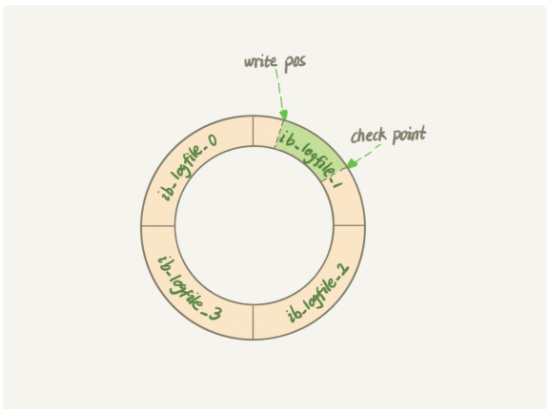

# 整体目录


# JVM

## JVM内存区域(运行时数据区)

## 线程共享:

### 堆

放对象实例的一个内存区域，，**几乎所有**（存在栈上分配） 对象实例和数组都在这里分配内存


#### 堆的划分

新生代和老年代，新生代又分为Eden区，From Survivor区 和 To Survivor区


**<u>为什么要进一步划分呢</u>**？

为了更好的回收内存，或者说更快的分配内存


#### 对象如何从新生代到老年代的

首先一个对象（这里排除大对象）会在Eden区分配内存，经过一次新生代垃圾回收（Minor GC)后，如果对象还存活，对象年龄加1，当其年龄增加到15（默认为15），就会被晋升到老年代

Eden区里存活的对象复制到From Survivor里边，此时to Survivor时空的，在下一次minor GC的时候，将Eden区存活的对象复制到To Survivor区，From区的存活对象要么进入到老年代，要么复制到To Survivor区，然后From（此时是空的） 和 To角色对换 ，并且

### 方法区（待补充）

1.6是永久代,存在于堆中,其大小受JVM限制（JVM本身设置固定大小上限，无法进行调整），在大量使用字符串的情况下会OutOfMemoryError。而在1.8中变成了元空间，移到了直接内存中，其大小受本机可用内存限制


### 常量池（1.6补充）

1.6两个常量池：运行时常量池和字符串常量池都在方法区中；

1.8：运行时常量池（存放类的原信息）放到了直接内存中，而字符串常量池和静态变量放在了堆中


1. class常量池

   编译成class文件产生，class文件种除了包含类的版本，字段，方法，接口等描述信息外，还包含常量池，用于存放编译器生成的各种**字面量（就是常量，String || final）和符号引用**（一组符号来描述所引用的目标）

2. 字符串常量池

   在类加载完成后，经过验证，准备阶段之后在 **堆中生成的字符串对象实例** ，然后将该字符串对象实例的引用值存到string pool**（string pool存的是引用值而不是具体的实例对象，具体的实例在堆中）**，HotSpot VM里实现的string pool功能就是一个StrngTable类，它是一个哈希表，里面存的是驻留字符串的引用，也就是说一旦堆中的某些字符串实例被这个StringTable引用后就等同于被赋予了驻留字符串的身份，这个String Table在每个HotSpot VM的实例只有一份，被所有的类共享

3. 运行时常量池

   当类加载到内存之后，jvm就会将class常量池种的内容存放到运行时常量池中，所以 **每个类都有一个运行时常量池**，class常量池中的符号引用经过解析，将符号引用替换为直接引用，解析过程会去查询字符串常量池，以保证运行时常量池所引用的字符串与字符串常量池所引用的是一致


## 线程单独拥有的:

### 虚拟机栈

每个Java方法执行的时候都会创建一个栈帧来存储**局部变量表，操作数栈，动态链接，方法出口**等信息。方法的从执行到完成对应JVM虚拟机栈的栈帧的入栈和出栈

OOM:

1. StackOverflowError

   > 线程请求的栈的深度大于JVM所允许的最大深度，物理内存仍有足够的空间

2. OutOfMemoryError

   > 无法向操作系统申请到足够的内存空间来拓展栈，操作系统管理的物理内存已没有足够的可用内存分给JVM的栈使用

### 本地方法栈

与虚拟机栈所发挥的作用非常相似，区别就是虚拟机栈为虚拟机执行Java方法（也就是字节码）服务，而本地方法栈则为虚拟机使用到的Native方法服务

在Hotspot虚拟机中和Java虚拟机栈合二为1

### 程序计数器

作用：

1. 字节码解释器通过改变程序计数器来依次读取指令，从而实现代码的流程控制
2. 多线程的情况下，程序计数器用于记录当前线程执行的位置，从而当线程切换回来的时候能够知道上次线程运行的位置

是唯一一个不会出现OOM的内存区域，生命周期是和线程一样


### JVM类的成员变量位置

基础类型变量也在堆里，引用指向的对象放在堆里边。静态变量，常量放在方法区里面，jdk1.7以前的情况，1.7及以后放在了堆里面

方法里面的基本数据类型放在栈里面，引用也是，引用指向的对象在堆里


## JVM内存管理

### 多少种GC方式

3中，Minor，Major，full GC


### 老年代空间不足

大对象（需要大量连续内存的Java对象）直接进入老年代，长期存活的对象进入老年代

解决方法：应尽量避免创建大的对象以及数组，还可以通过-Xmn虚拟机参数设置新生代的大小，让对象尽可能在新生代被回收掉，还可以通过 -XX:MaxTenuringThreshold 调大对象进入老年代的年龄


大对象直接进入老年代，避免在两个Survivor之间的大量内存复制


### 为什么要分代

新生代 & 老年代 ：在年轻代增加Surviver区，有助于减轻老年代的负担，尽可能让大部分对象在年轻代通过较高效的Minor GC回收掉，不至于老年代里存放对象过多导致内存不足频繁进行Major GC


新生代：Eden区&Surviver区 8：1：1 ：利用复制算法，减少内存碎片的产生，也防止Survivor区虽然有足够空间但因为内存碎片导致大对象不能进入survivor区


### 空间分配担保（Minor GC的安全与否）

在发生Minor GC之前， 虚拟机先检查老年代最大可用的连续空间是否大于新生代所有对象总空间，如果条件成立，则可以确认Minor GC是安全的

如果不成立那么虚拟机会查看 HandlePromotionFailure的值是否允许担保失败，如果允许那就检查老年代最大可用的连续空间是否大于历次晋升到老年代对象的平均大小，如果大于，将尝试进行一次Minor  GC，如果小于或者HandlePromotionFailure的值为不允许冒险，那么就要进行一次Full GC


### 虚拟机垃圾收集算法

1. 标记-清除算法

   标记阶段，对可回收对象进行标记；清除阶段，对标记的对象进行清除，并取消标记，还会判断回收后的分块与前一个空闲分块是否连续，若连续则合并这两个分块（感觉有点像OS的分页方面的）。

   回收流程：回收对象就是把对象作为分块，连接到被称为“空闲列表”的单向链表，之后对新对象进行分配时只需要遍历这个空闲链表，就可以找到分块

   缺点：标记和清除过程效率不高，产生大量内存碎片，导致无法给大对象分配内存空间

2. 复制算法

   将内存划分为大小相等的两块，每次只使用其中一块，当这一块内存用完了就将还存活的对象复制到另一块上，然后再把使用过的内存空间进行一次清理

   缺点：只是用了一半内存

3. 标记-整理算法

   标记阶段：标记要回收的对象。整理阶段：将所有存活的对象都向一端移动，然后直接清理掉端边界以外的内存

   优点：不会产生内存碎片

   缺点：需要移动大量对象，处理效率较低

4. 分代收集算法

   根据对象存活周期将内存划分为几块，不同块采用适当的收集算法。

   一般将堆分为新生代和老年代，新生代使用 复制算法   老年代使用：标记-清除 或 标记-整理算法


### 判断一个对象是否可以被回收(可达性分析讲啥啊)

1. 引用计数法

2. 可达性分析算法

   以GC Roots为起始点进行搜索，可达的对象都是存活的，不可达的对象可被回收

   GC Roots一般包含以下内容：

   > 虚拟机栈帧中局部变量表中引用的对象，即方法里面的局部变量
   >
   > 本地方法栈JNI（一般指Native）引用的对象
   >
   > 方法区中类静态属性引用的对象，即 类的静态变量
   >
   > 方法区中常量引用的对象，即类的常量

   成员变量不能作为GC Roots


### 引用类型(得扩展下)

1. 强引用

   

2. 软引用

3. 弱引用

4. 虚引用


## 垃圾收集器


名词解释：

Mutator：Java应用线程。Mutator的含义是可变的，在这里的含义是因为线程运行，导致了内存的变化。

### 卡表（Card Table）

[JVM-卡表（Card Table） - hongdada - 博客园 (cnblogs.com)](https://www.cnblogs.com/hongdada/p/12016020.html)

出现背景：

现代JVM，堆空间通常被划分为新生代和老年代。由于新生代的垃圾收集通常很频繁，如果**老年代对象引用了新生代的对象，那么，需要跟踪从老年代到新生代的所有引用**，从而避免每次YGC时扫描整个老年代，减少开销。

对于HotSpot JVM，使用了卡标记（Card Marking）技术来解决老年代到新生代的引用问题。**具体是，使用卡表（Card Table）和写屏障（Write Barrier）来进行标记并加快对GC Roots的扫描。也用于CMS GC：**

CMS在并发标记阶段，应用线程和GC线程是并发执行的，因此可能产生新的对象或对象关系发生变化，例如：

- 新生代的对象晋升到老年代；
- 直接在老年代分配对象；
- 老年代对象的引用关系发生变更；
- 等等。

对于这些对象，需要重新标记以防止被遗漏。为了提高重新标记的效率，并发标记阶段会把这些发生变化的对象所在的Card标识为Dirty，这样后续阶段就只需要扫描这些Dirty Card的对象，从而避免扫描整个老年代。


卡表介绍：

基于卡表（Card Table）的设计，通常将堆空间划分为一系列2次幂大小的卡页（Card Page）。

卡表（Card Table），用于标记卡页的状态，每个卡表项对应一个卡页。

HotSpot JVM的卡页（Card Page）大小为512字节，卡表（Card Table）被实现为一个简单的字节数组，即卡表的每个标记项为1个字节。

当对一个对象引用进行写操作时（对象引用改变），写屏障逻辑将会标记对象所在的卡页为dirty。


OpenJDK/Oracle 1.6/1.7/1.8 JVM默认的卡标记简化逻辑如下：

首先，计算对象引用所在卡页的卡表索引号。将地址右移9位，相当于用地址除以512（2的9次方）。可以这么理解，假设卡表卡页的起始地址为0，那么卡表项0、1、2对应的卡页起始地址分别为0、512、1024（卡表项索引号乘以卡页512字节）。

其次，通过卡表索引号，设置对应卡标识为dirty。


**<u>带来的2个问题</u>**：

1.无条件写屏障带来的性能开销

每次对引用的更新，无论是否更新了老年代对新生代对象的引用，都会进行一次写屏障操作。显然，这会增加一些额外的开销。但是，与YGC时扫描整个老年代相比较，这个开销就低得多了。

不过，在高并发环境下，写屏障又带来了虚共享（false sharing）问题。


2.高并发下虚共享带来的性能开销

在高并发情况下，频繁的写屏障很容易发生虚共享（false sharing），从而带来性能开销。

假设CPU缓存行大小为64字节，由于一个卡表项占1个字节，这意味着，64个卡表项将共享同一个缓存行。

HotSpot每个卡页为512字节，那么一个缓存行将对应64个卡页一共64*512=32KB。

如果不同线程对对象引用的更新操作，恰好位于同一个32KB区域内，这将导致同时更新卡表的同一个缓存行，从而造成缓存行的写回、无效化或者同步操作，间接影响程序性能。

一个简单的解决方案，就是不采用无条件的写屏障，而是先检查卡表标记，只有当该卡表项未被标记过才将其标记为dirty。

这就是JDK 7中引入的解决方法，引入了一个新的JVM参数-XX:+UseCondCardMark，在执行写屏障之前，先简单的做一下判断。如果卡页已被标识过，则不再进行标识。

简单理解如下：

与原来的实现相比，只是简单的增加了一个判断操作。

虽然开启-XX:+UseCondCardMark之后多了一些判断开销，但是却可以避免在高并发情况下可能发生的并发写卡表问题。通过减少并发写操作，进而避免出现虚共享问题（false sharing）。


### 1. CMS收集器（Concurrent Mark Sweep）

   [再谈HotSpot JVM GC机制中的写屏障 - 简书 (jianshu.com)](https://www.jianshu.com/p/0d7a6fcc8f9e)

   标记-清除算法

   主要分为4个流程：

   

   初始标记：仅标记GC Roots 能直接关联到的对象，速度快，需要停顿（STW)

   

   并发标记：进行GC Roots Tracing的过程，整个回收过程中耗时最长，不需要停顿， **<u>并发标记过程中，把赋值的这种新增的引用放到集合中</u>**

   

   重新标记：修正标记期间因用户程序继续运作而导致一些对象的标记产生变动，然后需要更新这些标记，需要停顿， **<u>CMS用的是增量更新的办法</u>**

   > 如何解决漏标问题？比如 A 引用B，B入栈，A变黑，弹出栈，与此同时，A引用C，B取消对C的引用，就产生漏标问题
   >
   > 出现漏标的充要条件是以下两个情况同时发生：
   >
   > 1. mutator使黑色对象直接引用了白色对象；
   > 2. mutator删除了从灰色对象到白色对象之间的所有引用路径。

   > 解决办法：破坏上面两个条件，引入了
   >
   > 强三色不变式：保证永远不会存在黑色对象到白色对象的引用
   >
   > 弱三色不变式：所有被黑色对象引用的白色对象都处于灰色保护状态，<u>即直接或间接从灰色对象可达</u>
   >
   > 强/弱三色不变式都可以通过屏障技术来实现，并且在不同环境下有多种不同的屏障技术。CMS收集器采用增量更新（incremental update）写屏障实现强三色不变式（具体来讲，是Dijkstra等人提出的Dijkstra写屏障）其逻辑是：
   >
   > **拦截使黑色对象引用指向白色对象的mutate操作，强制被引用指向的白色对象置为灰色状态，并将其压入标记栈。**
   >
   > 但是，增量更新写屏障无法探知堆外（如栈上）GC Roots的引用变化，所以CMS收集器在并发标记和预清理完成后，还得做一次重新标记，即再做一次根搜索。

   

   并发清除：不需要停顿

   > 并发清理时，用户线程产生的引用关系变化不会影响其清除吗？比如黑色对象在并发清理过程中指向了白色对象，但白色对象被清除掉了

   > 先来了解三色标记：
   >
   > 白色：表示对象尚未被垃圾收集器访问过。在可达性开始阶段，所有的对象都是白色的，若在分析结束的阶段，仍然是白色的对象，说明该对象不可达。
   > 黑色：表示对象已经被垃圾收集器访问过，且这个对象的指向其他对象的所有引用都已经扫描过。黑色的对象代表已经扫描过，代表它是安全存活的。黑			色对象不可能直接（不经过灰色对象）指向某个白色对象。
   > 灰色：表示对象已经被垃圾收集器访问过，但这个对象上至少存在一个指向其他对象的引用还没有被扫描过。
   >
   > 所以并发清理时和用户线程并发执行是如何保证安全清理的？
   >
   > 首先，并发清理时，标记过程（初始标记、并发标记、重新标记）已经结束，此时大家想象一下在老年代的所有对象中，现在只有黑色和白色的对象，然后就是：黑色对象不可能直接（不过经过灰色对象）指向某个白色对象，即标记结束时这些白色对象是不可达的。由于没有灰色对象，黑色对象也无法改变对象引用到白色对象上，那就可以说此时清理白色对象是安全的。


缺点：

1. 吞吐量低：低停顿时间是以牺牲吞吐量为代价的，导致CPU利用率不高
2. 无法处理浮动垃圾，可能出现Concurrent Mode Failure。（浮动垃圾是指在并发清除阶段由于用户线程继续运行而产生的垃圾，这部分垃圾这能留到下次GC再回收。所以得预留出一部分内存，避免预留内存不够放，出现Concurrent Mode Failure,虚拟机将启用Serial Old来替代CMS
3. 利用标记-清除算法，导致出现内存碎片，可能存在大对象找不到足够大的连续空间来存放，而老年代里面的内存是足够存放的情况，提前出发Major GC

### 2.G1收集器


## 类的生命周期

### 加载

[Java 类加载机制(阿里)-何时初始化类 - aspirant - 博客园 (cnblogs.com)](https://www.cnblogs.com/aspirant/p/7200523.html)

分三步走：

1. 通过类的完全限定名获取定义该类的二进制字节流
2. 将该字节流表示的静态存储结构转换为方法区的运行时存储结构
3. 在方法区生成一个代表该类的java.lang.Class对象（JVM并没有规定在堆还是在方法区，HotSpot选择方法区），作为方法区中该类各种数据的访问入口

### 链接

也分三步：

1. 验证

   确保Class文件的字节流包含的信息符合当前虚拟机的要求，并不会危害虚拟机自身安全，验证阶段会完成以下4个阶段的动作：

   文件格式验证（such 魔数） --> 元数据验证（该类是否继承了不能继承的类） --> 字节码验证（保证跳转指令不会跳到方法体以外的字节码指令上）--> 符号引用验证（通过类的全限定名能否找到对应的类）

2. 准备

   **jdk1.6 在方法区** 为类变量分配内存并设置初始值，jdk1.7及以后都是在堆分配内存

   如果类变量是常量，那么将初始化为表达式所定义的值（在编译时就被放到了class常量池）

3. 解析

   将常量池的符号引用替换为直接引用的过程

   该阶段可在初始化之后再开始，由于支持Java的动态绑定

   直接引用（对象引用）：指向目标的指针，相对偏移量或间接定位到目标的句柄

### 初始化

执行类中定义的Java程序代码。初始化阶段是虚拟机执行类构造器\<clinit>()方法（由编译器按语句在源文件出现顺序自动收集类变量的赋值动作和静态代码块中的语句合并产生的）的过程

接口中不可以使用静态代码块，但可由类变量初始化的赋值操作，所以接口和类都有\<clinit>()方法，但执行接口的\<clinit>()方法不需要执行父接口的\<clinit>，只有当父接口中定义的变量使用时，父接口才会初始化。接口的实现类在初始化也不会执行接口的\<clinit>方法


悉尼及会保证一个类的\<clinit>方法在多线程环境下被正确的加锁和同步，多个线程执行\<clinit> 只会有一个能执行，其他阻塞，直到方法执行完毕

### 使用，卸载


## 如何实现类的加载

继承ClassLoader，重写findClass方法，根据类的全名找到对应的字节码文件，读取该文件内容，在通过defineClass方法把字节码转换成Java.lang.Class类的实例

loadClass方法实现的是双亲委派模型的逻辑


## Java对象的创建过程

1. 检查类是否已经被加载

   当程序遇到 new 关键字时，首先会去运行时常量池中查找该引用指向的类有没有被虚拟机加载，如果没加载，那么进行类的加载过程。如果已经被加载，那么进行下一步。

2. 为对象分配内存空间

   类被加载后，需要在堆中为该对象分配一定的空间，该空间大小在类加载完成时就已经确定下来。

   分配空间方式有两种：

   * 指针碰撞

     JVM将堆区抽象为两块区域，一块是已经被其他对象占用的区域，另一块是空白区域，中间通过一个指针进行标注，只需要将指针向空白区域移动相应大小空间，就完成内存的分配。 **这种划分方式要求虚拟机的内存是地址连续的，且虚拟机带有内存压缩机制，可以在内存分配完成时压缩内存，形成连续地址空间**，但存在的问题就是多线程创建对象，可能出现指针划分不一致的问题，对于这个问题虚拟机采用循环CAS操作来保证内存的正确划分

   * 空闲列表

     虚拟机就必须维护一个列表，记录上哪些内存块是可用的，在分配的时候从列表中找到一块足够大的空间划分给对象实例，并更新列表上的记录

   * TLAB（不算分配方式）

     为了提高多线程创建对象的效率，，虚拟机为每个线程分配不同的空间，这样每个线程在分配内存时只是在自己的空间中操作，避免了同步的开销

     > JVM设置了最大浪费空间:
     >  ① 当剩余的空间小于最大浪费空间，那该TLAB属于的线程在重新向Eden区申请一个TLAB空间，进行对象创建，如果还是空间不够，那你这个对象就是太大了，需要去Eden区直接创建；
     >  ② 当剩余的空间大于最大浪费空间，那这个大对象请你直接去Eden区创建，我TLAB放不下没有使用完的空间；
     >
     >
     > 链接：https://www.jianshu.com/p/3684869af4cc

3. 为对象字段设置零值

   为对象的字段设置0或null

4. 设置对象头

   虚拟机对将要创建出来的对象进行信息标记，包括存储在新/老生代，对象的哈希码，元数据信息

5. 执行构造方法

   执行对象的构造方法


## java编译器做的优化

1. 如果没有写构造器，默认送一个无参构造器

2. 自动拆装箱

   >Integer x = 1; 	会自动装箱：Integer x = Integer.valueOf(1)
   >
   >int y = x;		自动拆箱：int y = x.intValue();

3. 泛型集合取值

   泛型擦除，即编译为字节码后泛型的信息就丢失了，实际类型都当作Object类型来处理

4. foreach循环


# 操作系统

## 进程 和 线程

[深入理解进程和线程 - 天空101 - 博客园 (cnblogs.com)](https://www.cnblogs.com/tiankong101/p/4229584.html)

直接看虚拟地址空间，分成两部分，上面部分是所有进程共享内核，下面一部分是应用程序，每个应用程序分别独立，互不干扰。 **每个进程的虚拟地址空间是相同的，但他们的物理地址不同**，由于CPU执行指令时采用了虚拟地址，对应一个特定的变量来说，它对应着一个特定的虚拟地址。这样带来的问题就是两个进程不能通过简单的共享变量的方式来进行进程间通信，也就是说进程不能通过直接共享内存的方式来进行进程间通信，只能采用信号，管道等方式来进行进程间通信。这样的效率肯定比直接共享内存的方式差


每个进程拥有的内存为 2的x次方，x等于操作系统的位数（32|64）


[浅谈Linux线程模型 - 知乎 (zhihu.com)](https://zhuanlan.zhihu.com/p/57349087#:~:text=在Linux内核中，其实是没有线程的概念的，它把所有的线程当做标准的进程来实现，也就是说Linux内核，并没有为线程提供任何特殊的调度语义，也没有为线程实现特定的数据结构。. 取而代之的是，线程只是一个与其他进程共享某些资源的进程。. 每一个线程拥有一个唯一的task_struct结构，Linux内核它仅仅把线程当做一个正常的进程，或者说是轻量级进程，LWP,(Lightweight processes)。. 对于其他的操作系统而言，比如windows，线程相对于进程，只是一个提供了更加轻量、快速执行单元的抽象概念。. 对于Linux而言，线程只是进程间共享资源的一种方式，非常轻量。.)

线程上线文切换时，虚拟地址空间是不变的，但是进程上下文切换时，是需要重新映射虚拟地址空间。进程切换上下文时，进出OS内核&寄存器切换，是最大的时间支出。更模糊的代价是上下文切换时，会干扰处理器的缓存机制。当上下文切换时，处理器需要重新cache一些内存。

这里更大的一个区别时，当更改虚拟地址空间时，CPU 的 TLB 等也会被刷新，导致接下来的内存访问更加耗时，所以相对线程切换来说，进程的切换耗时更大。


# 计算机网络


## DNS

DNS服务器就是专门保存了Web服务器域名与IP的对应关系


### 域名的层级关系

用句点分割，域名中越是靠右的位置表示其层级越高

域名的层级关系类似树状结构：

* 根DNS服务器
* 顶级域DNS服务器（com）
* 权威DNS服务器（server.com)


`根域的DNS服务器信息保存在互联网的所有DNS服务器中`，这样任意DNS服务器都可以找到并访问根域DNS服务器


### 查询过程

首先会尝试从缓存中获取DNS记录，若获取不到，则进行下面过程

例如，你要访问“www.apple.com”，就要进行下面的三次查询： 

1. 访问根域名服务器，它会告诉你“com”顶级域名服务器的地址；
2. 访问“com”顶级域名服务器，它再告诉你“apple.com”域名服务器的地址； 
3. 最后访问“apple.com”域名服务器，就得到了“www.apple.com”的地址。


从缓存中查询的过程又分为： **浏览器缓存->操作系统缓存->hosts->本地dns**


### 域名解析和区域传送

域名解析使用UDP协议，因为UDP的DNS协议只要一个请求和一个应答就行

而区域传送使用TCP协议，因为TCP协议可靠性好并且传输内容大（UDP只能传512字节）

> DNS主从复制，就是将主DNS服务器的解析库复制传送至从DNS服务器，进而从服务器就可以进行正向、反向解析了。从服务器向主服务器查询更新数据，保证数据一致性，此为区域传送。


## 在浏览器地址栏输入一个URL后回车，背后会进行哪些技术步骤？

1. DNS解析拿到ip地址
2. 默认端口号和ip地址与服务端建立tcp连接
3. 浏览器向服务器发送拼好的报文；
4. 服务器收到报文后处理请求，同样拼好报文再发给浏览器； 
5. 浏览器解析报文，渲染输出页面。


以上是http协议，如果不是的话服务器会返回一个5开头的的重定向消息，告诉我们用的是https，那就是说IP没变，但是端口号从80变成443了，好了，再四次挥手，完事

再来一遍，这次除了上述的端口号从80变成443之外，还会采用SSL的加密技术来保证传输数据的安全性，保证数据传输过程中不被修改或者替换之类的

这次依然是三次握手，沟通好双方使用的认证算法，加密和检验算法，在此过程中也会检验对方的CA安全证书。


DNS 解析可能会给出 CDN 服务器的 IP 地址，这样你拿到的就会是 CDN 服务器而 不是目标网站的实际地址。

因为 CDN 会缓存网站的大部分资源，比如图片、CSS 样式表，所以有的 HTTP 请求就不 需要再发到 Apple，CDN 就可以直接响应你的请求，把数据发给你。


## HTTPS

发生在tcp连接建立后

采用对称加密和不对称加密结合的混合加密方式

通信建立前采用非对称加密的方式交换 **会话秘钥**

通信过程中全部使用对称加密的 **会话秘钥** 加密明文数据


为什么要采取混合加密：

* 对称加密只使用一个密钥，运算速度快，密钥必须保密，无法做到安全的密钥交换
* 非对称加密使用两个密钥，公钥和私钥，公钥可以任意分发而私钥保密，解决了密钥交换问题但速度慢


SSL/TLS协议基本流程：

* 客户端向服务端索要并验证服务器的公钥
* 双方协商产生会话密钥
* 双方采用会话密钥进行加密通信


详细流程：

Client：


前两步时SSL/TLS建立（握手阶段）


**保证公钥可靠的关键点**：

**第一步如何保证公钥不被篡改**？

简单回答：

借助CA（数字证书认证机构），将服务器的公钥放在数字证书中，只要证书是可信的，公钥就是可信的


详细：

服务器将自己的公钥注册到CA，CA用自己的私钥将服务器的公钥数字签名并颁发数字证书。客户端拿到服务器的数字证书后使用CA的公钥（CA的公钥已事先植入到浏览器或操作系统里）确认服务器的数字证书的真实性，确认没问题就从数字证书中获取服务器公钥并使用它来对报文进行加密后发送。服务器使用密钥对报文解密


## HTTP演变


HTTP/1.0：

* 短链接
* 串行请求

HTTP/1.1

* 长连接（让管道网络传输成为可能），服务器还是按照请求顺序回应请求，存在队头阻塞问题
* 请求/响应头部（Header）未经压缩就发送，首部信息越多延迟越大，只能压缩Body的部分
* 发送相同的首部造成资源浪费
* 没有请求优先级控制
* 请求只能从客户端开始，服务端被动响应

HTTP/2

* 基于HTTPS，安全性有了保障

* 头部压缩，消除重复部分

  HPACK算法，客户端和服务端同时维护一张头信息表，所有字段都会存入到这个表，生成一个索引号，以后就只发索引号而不发同样字段。

* 二进制格式，无需将收到的报文转成二进制，直接解析二进制报文，提高数据传输效率

* 数据流，数据包不再是按顺序发送，同一个连接里面的数据报可能是属于不同的回应，所以要对数据包做标记，指明是属于哪个回应。客户端还可以指定数据流的优先级

  每个请求或回应的数据包，成为一个数据流。每个数据流都标志着一个独一无二的编号，其中规定客户端发出的数据流编号为技术，服务器为偶数

* 多路复用。HTTP/2可以在一个连接中并发多个请求或回应，消除队头阻塞问题，降低了延迟，提高连接的利用率。

  也由于是多个HTTP请求复用一个TCP连接，所以一旦发生丢包，就会阻塞住所有的HTTP请求，等待丢了的包被重传回来

* 服务器推送。改善传统的 请求-应答工作模式，服务器也可以主动向客户端发送消息（把可能会用到的JS，CSS文件等静态资源发给客户端），减少延时等待


管道网络传输：同一个TCP连接里面，客户端可以发起多个请求，只要第一个请求发出去，不必等其回来就可以发下一个，**目的是减少整体响应时间**

# 面向对象思想

从用户的角度思考问题

我们写的代码只往外界提供功能，内部的实现细节由我们自己处理，外界不用管内部的实现细节。同时我们还要为后来接管或修改我们代码的人考虑，变量的命名等都要具有意义，该功能的参数要注意添加注释解释


# JAVA

类的实例有this，类没有this，所以类没办法引用成员变量，函数


## 抽象类和接口区别

实现角度:

抽象类可以有成员变量,部分实现

抽象类不可以有多重继承,接口可以

接口相比较抽象类更能强调某个功能的实现,而抽象类虽然某种程度上也可以模拟接口,但调用的人并不知道这个抽象类是模拟接口还是提供一些基础的实现(公共的实现)


# MySQL


## 一条查询SQL如何执行的

Server层按顺序执行sql的步骤为：

1. 客户端请求->
2. 连接器（验证用户身份，给予权限） ->
3. 查询缓存（存在缓存则直接返回，不存在则执行后续操作）->
4. 分析器（对SQL进行词法分析和语法分析操作） ->
5. 优化器（主要对执行的sql优化选择最优的执行方案方法） ->
6. 执行器（执行前会先看用户是否有执行权限，有才去使用这个引擎提供的接口）->
7. 去引擎层获取数据返回（如果开启查询缓存则会缓存查询结果）


- **连接器**：管理连接、权限验证；
- **查询缓存**：命中缓存则直接返回结果；
- **分析器**：对SQL进行词法分析、语法分析；（判断查询的SQL字段是否存在也是在这步）
- **优化器**：执行计划生成、选择索引，选择各个表的关联顺序；
- **执行器**：操作引擎、返回结果；
- **存储引擎**：存储数据、提供读写接口。


### 问答


```
文章分析器主要做两个事情，先做词法分析后做语法分析,词法分析主要做的是根据mysql的关键字进行验证和解析，而语法分析会在词法解析的基础上进一步做表名和字段名称的验证和解析；
       看完整篇文章有个疑问望解答，在执行阶段为什么需判断对表是否有执行查询的权限，而不是在分析阶段去做；根据mysql中的information_schema库的存储信息理论上可以在分析器阶段判断是否有权限。
       
       

```


## 一条SQL更新语句是如何执行的？


如果每一次的更新操作都需要写进磁盘，然后磁盘也要找到对应的那条记录，然后再更新，整个过程 IO 成本、查找成本都很高。

为了解决这个问题用了WAL技术，先写日志再写磁盘

具体来说，当有一条记录需要更新的时候，InnoDB 引擎就会先把记录写到 redo log（粉板）里面，并更新内存，这个时候更新就算完成了。同时，InnoDB 引擎会在适当的时候，将这个操作记录更新到磁盘里面


InnoDB 的 redo log 是固定大小的，比如可以配置为一组 4 个文件，每个文件的大小是 1GB，那么这块“粉板”总共就可以记录 4GB 的操作。从头开始写，写到末尾就又回到开头循环写



write pos 是当前记录的位置，一边写一边后移，写到第 3 号文件末尾后就回到 0 号文件开头。checkpoint 是当前要擦除的位置，也是往后推移并且循环的，擦除记录前要把记录更新到数据文件。

write pos 和 checkpoint 之间的是“粉板”上还空着的部分，可以用来记录新的操作。如果 write pos 追上 checkpoint，表示“粉板”满了，这时候不能再执行新的更新，得停下来先擦掉一些记录，把 checkpoint 推进一下。


这两种日志有以下三点不同。redo log 是 InnoDB 引擎特有的；binlog 是 MySQL 的 Server 层实现的，所有引擎都可以使用。redo log 是物理日志，记录的是“在某个数据页上做了什么修改”；binlog 是逻辑日志，记录的是这个语句的原始逻辑，比如“给 ID=2 这一行的 c 字段加 1 ”。redo log 是循环写的，空间固定会用完；binlog 是可以追加写入的。**“追加写”是指 binlog 文件写到一定大小后会切换到下一个，并不会覆盖以前的日志。**


我们再来看执行器和 InnoDB 引擎在执行这个简单的 update 语句时的内部流程。

1. 执行器先找引擎取 ID=2 这一行。ID 是主键，引擎直接用树搜索找到这一行。如果 ID=2 这一行所在的数据页本来就在内存中，就直接返回给执行器；否则，需要先从磁盘读入内存，然后再返回。

2. 执行器拿到引擎给的行数据，把这个值加上 1，比如原来是 N，现在就是 N+1，得到新的一行数据，再调用引擎接口写入这行新数据。
3. 引擎将这行新数据更新到内存中，同时将这个更新操作记录到 redo log 里面，此时 redo log 处于 prepare 状态。然后告知执行器执行完成了，随时可以提交事务。
4. 执行器生成这个操作的 binlog，并把 binlog 写入磁盘。
5. 执行器调用引擎的提交事务接口，引擎把刚刚写入的 redo log 改成提交（commit）状态，更新完成。

### 问答

```
 Redo log不是记录数据页“更新之后的状态”，而是记录这个页 “做了什么改动”。
 Binlog有两种模式，statement 格式的话是记sql语句， row格式会记录行的内容，记两条，更新前和更新后都有。
 redolog是循环写的，不持久保存，binlog的“归档”这个功能，redolog是不具备的。
 
 
 
 
        
       
       
redo log 是会在事务没提交前，也有可能写盘的，这也是为什么MySQL遇到大事务的时候，commit一般都能很快。为了保证redo log 的可用性，InnoDB 的 Master Thread 会定时触发 Fuzzy Checkpoint 保证 redo log 写盘。至于事务阻塞导致 redo log 被写满，估计只是理论上的场景，工程上应该不会出现的，出现这个问题的话，基本上意味着数据库早就不可用了。


其实举个很简单的例子，如果你来设计一个文件的落库，或者心跳机制，你会选择，每次一个实际动作触发一次落库或者心跳检查，还是选择再额外增加一个定时机制，每间隔一个周期会自动检查一下是否需要落库或者心跳？。。。其实想明白这个就知道你说的场景会有，但是一定会提前解决了，或者db本身早就有问题了。。然后这点想明白了，其实 消息队列的心跳机制或者mq broker的落库 你也就明白了，哈哈哈 其实到最后技术都是互通的。


1.首先客户端通过tcp/ip发送一条sql语句到server层的SQL interface
2.SQL interface接到该请求后，先对该条语句进行解析，验证权限是否匹配
3.验证通过以后，分析器会对该语句分析,是否语法有错误等
4.接下来是优化器器生成相应的执行计划，选择最优的执行计划
5.之后会是执行器根据执行计划执行这条语句。在这一步会去open table,如果该table上有MDL，则等待。
如果没有，则加在该表上加短暂的MDL(S)
(如果opend_table太大,表明open_table_cache太小。需要不停的去打开frm文件)
6.进入到引擎层，首先会去innodb_buffer_pool里的data dictionary(元数据信息)得到表信息
7.通过元数据信息,去lock info里查出是否会有相关的锁信息，并把这条update语句需要的
锁信息写入到lock info里(锁这里还有待补充)
8.然后涉及到的老数据通过快照的方式存储到innodb_buffer_pool里的undo page里,并且记录undo log修改的redo
(如果data page里有就直接载入到undo page里，如果没有，则需要去磁盘里取出相应page的数据，载入到undo page里)
9.在innodb_buffer_pool的data page做update操作。并把操作的物理数据页修改记录到redo log buffer里
由于update这个事务会涉及到多个页面的修改，所以redo log buffer里会记录多条页面的修改信息。
因为group commit的原因，这次事务所产生的redo log buffer可能会跟随其它事务一同flush并且sync到磁盘上
10.同时修改的信息，会按照event的格式,记录到binlog_cache中。(这里注意binlog_cache_size是transaction级别的,不是session级别的参数,
一旦commit之后，dump线程会从binlog_cache里把event主动发送给slave的I/O线程)
11.之后把这条sql,需要在二级索引上做的修改，写入到change buffer page，等到下次有其他sql需要读取该二级索引时，再去与二级索引做merge
(随机I/O变为顺序I/O,但是由于现在的磁盘都是SSD,所以对于寻址来说,随机I/O和顺序I/O差距不大)
12.此时update语句已经完成，需要commit或者rollback。这里讨论commit的情况，并且双1
13.commit操作，由于存储引擎层与server层之间采用的是内部XA(保证两个事务的一致性,这里主要保证redo log和binlog的原子性),
所以提交分为prepare阶段与commit阶段
14.prepare阶段,将事务的xid写入，将binlog_cache里的进行flush以及sync操作(大事务的话这步非常耗时)
15.commit阶段，由于之前该事务产生的redo log已经sync到磁盘了。所以这步只是在redo log里标记commit
16.当binlog和redo log都已经落盘以后，如果触发了刷新脏页的操作，先把该脏页复制到doublewrite buffer里，把doublewrite buffer里的刷新到共享表空间，然后才是通过page cleaner线程把脏页写入到磁盘中
老师，你看我的步骤中有什么问题嘛？我感觉第6步那里有点问题,因为第5步已经去open table了，第6步还有没有必要去buffer里查找元数据呢?这元数据是表示的系统的元数据嘛,还是所有表的？谢谢老师指正
其实在实现上5是调用了6的过程了的，所以是一回事。MySQL server 层和InnoDB层都保存了表结构，所以有书上描述时会拆开说。


1. redo log的概念是什么? 为什么会存在.
2. 什么是WAL(write-ahead log)机制, 好处是什么.
3. redo log 为什么可以保证crash safe机制.
4. binlog的概念是什么, 起到什么作用, 可以做crash safe吗?
5. binlog和redolog的不同点有哪些?
6. 物理一致性和逻辑一直性各应该怎么理解?
7. 执行器和innoDB在执行update语句时候的流程是什么样的?
8. 如果数据库误操作, 如何执行数据恢复?
9. 什么是两阶段提交, 为什么需要两阶段提交, 两阶段提交怎么保证数据库中两份日志间的逻辑一致性(什么叫逻辑一致性)?
10. 如果不是两阶段提交, 先写redo log和先写bin log两种情况各会遇到什么问题?
  
  
 1. redo log是重做日志。主要用于MySQL异常重启后的一种数据恢复手段，确保了数据的一致性。归根到底是MySQL为了实现WAL机制的一种手段。因为MySQL进行更新操作，为了能够快速响应，所以采用了异步写回磁盘的技术，写入内存后就返回。但是会存在crash后内存数据丢失的隐患，而redo log具备crash safe能力。
2. WAL机制是写前日志，也就是MySQL更新操作后在真正把数据写入到磁盘前先记录日志。好处是不用每一次操作都实时把数据写盘，就算crash后也可以通过redo log重放恢复，所以能够实现快速响应SQL语句。
3. 因为redo log是每次更新操作完成后，就一定会写入的，如果写入失败，这说明此次操作失败，事务也不可能提交。redo log内部结构是基于页的，记录了这个页的字段值变化，只要crash后读取redo log进行重放就可以恢复数据。（因为redo log是循环写的，如果满了InnoDB就会执行真正写盘）
4. bin log是归档日志，属于MySQL Server层的日志。可以起到全量备份的作用。当需要恢复数据时，可以取出某个时间范围内的bin log进行重放恢复。但是bin log不可以做crash safe，因为crash之前，bin log可能没有写入完全MySQL就挂了。所以需要配合redo log才可以进行crash safe。
5. bin log是Server层，追加写，不会覆盖，记录了逻辑变化，是逻辑日志。redo log是存储引擎层，是InnoDB特有的。循环写，满了就覆盖从头写，记录的是基于页的物理变化，是物理日志，具备crash safe操作。
6. 前者是数据的一致性，后者是行为一致性。（不清楚）
7. 执行器在优化器选择了索引后，调用InnoDB读接口，读取要更新的行到内存中，执行SQL操作后，更新到内存，然后写redo log，写bin log，此时即为完成。后续InnoDB会在合适的时候把此次操作的结果写回到磁盘。
8. 数据库在某一天误操作，就可以找到距离误操作最近的时间节点前的bin log，重放到临时数据库里，然后选择当天误删的数据恢复到线上数据库。
9. 两阶段提交就是对于三步操作而言：1.prepare阶段 2. 写入bin log 3. commit
redo log在写入后，进入prepare状态，然后bin log写入后，进入commit状态，事务可以提交。
如果不用两阶段提交的话，可能会出现bin log写入之前，机器crash导致重启后redo log继续重放crash之前的操作，而当bin log后续需要作为备份恢复时，会出现数据不一致的情况。所以需要对redo log进行回滚。
如果是bin log commit之前crash，那么重启后，发现redo log是prepare状态且bin log完整（bin log写入成功后，redo log会有bin log的标记），就会自动commit，让存储引擎提交事务。
10.先写redo log，crash后bin log备份恢复时少了一次更新，与当前数据不一致。先写bin log，crash后，由于redo log没写入，事务无效，所以后续bin log备份恢复时，数据不一致。
```


```
IO成本就是寻址时间和上下文切换所需要的时间，最主要是用户态和内核态的上下文切换。我们知道用户态是无法直接访问磁盘等硬件上的数据的，只能通过操作系统去调内核态的接口，用内核态的线程去访问。 这里的上下文切换指的是同进程的线程上下文切换，所谓上下文就是线程运行需要的环境信息。 首先，用户态线程需要一些中间计算结果保存CPU寄存器，保存CPU指令的地址到程序计数器（执行顺序保证），还要保存栈的信息等一些线程私有的信息。 然后切换到内核态的线程执行，就需要把线程的私有信息从寄存器，程序计数器里读出来，然后执行读磁盘上的数据。读完后返回，又要把线程的信息写进寄存器和程序计数器。 切换到用户态后，用户态线程又要读之前保存的线程执行的环境信息出来，恢复执行。这个过程主要是消耗时间资源。 --来自《Linux性能优化实战》里的知识 SQL执行前优化器对SQL进行优化，这个过程还需要占用CPU资源

上下文切换主要的消耗是换了程序，计算机之前的所有缓存都成了无用功，引发各种缺页中断，又得从磁盘进行换页等等操作


长事务把redo log写满了，最终只会造成无法接受更新
```


## 索引

为什么使用索引？（索引的好处）

- 通过创建唯一性索引，可以保证数据库表中每一行数据的唯一性。
- 可以大大加快数据的检索速度，这也是创建索引的最主要的原因。
- 帮助服务器避免排序和临时表
- 将随机IO变为顺序IO。
- 可以加速表和表之间的连接，特别是在实现数据的参考完整性方面特别有意义。


## 存储引擎

### MyISAM

#### 索引

MyISAM引擎使用B+Tree作为索引结构，叶结点的data域存放的是数据记录的地址


## MVCC

### MVCC介绍

MVCC，多版本并发控制，在事务读已提交和可重复读事务隔离级别下执行select语句的时候访问版本链的一个过程，使得并发的读-写，写-读场景可并发执行（这里的读都是快照读），避免读操作和写操作互相阻塞的情况。


### MVCC实现

它的实现原理主要是依赖记录中的 **`3个隐式字段`**，**`undo日志`** ，**`Read View`** 来实现的


#### **隐式字段**

每行记录除了我们自定义的字段外，还有数据库隐式定义的 `DB_TRX_ID`, `DB_ROLL_PTR`, `DB_ROW_ID` 等字段

* DB_TRX_ID
  6 byte，最近修改(修改/插入)事务 ID：记录创建这条记录/最后一次修改该记录的事务 ID
* DB_ROLL_PTR
  7 byte，回滚指针，指向这条记录的上一个版本（存储于 rollback segment 里）
* DB_ROW_ID
  6 byte，隐含的自增 ID（隐藏主键），如果数据表没有主键，InnoDB 会自动以DB_ROW_ID产生一个聚簇索引
* 实际还有一个删除 flag 隐藏字段, 既记录被更新或删除并不代表真的删除，而是删除 flag 变了

`DB_ROW_ID` 是数据库默认为该行记录生成的唯一隐式主键，`DB_TRX_ID` 是当前操作该记录的事务 ID ,而 `DB_ROLL_PTR` 是一个回滚指针，用于配合 undo日志，指向上一个旧版本


### undo

undo log 主要分为两种：

* insert undo log
  代表事务在 insert 新记录时产生的 undo log, 只在事务回滚时需要，并且在事务提交后可以被立即丢弃
* update undo log
  事务在进行 update 或 delete 时产生的 undo log ; 不仅在事务回滚时需要，在快照读时也需要；所以不能随便删除，只有在快速读或事务回滚不涉及该日志时，对应的日志才会被 purge 线程统一清除

> **purge**
>
> * 从前面的分析可以看出，为了实现 InnoDB 的 MVCC 机制，更新或者删除操作都只是设置一下老记录的 deleted_bit ，并不真正将过时的记录删除。
> * 为了节省磁盘空间，InnoDB 有专门的 purge 线程来清理 deleted_bit 为 true 的记录。为了不影响 MVCC 的正常工作，purge 线程自己也维护了一个read view（这个 read view 相当于系统中最老活跃事务的 read view ）;如果某个记录的 deleted_bit 为 true ，并且 DB_TRX_ID 相对于 purge 线程的 read view 可见，那么这条记录一定是可以被安全清除的。
>   


其实现是每条数据都会有一些隐藏字段，trx_id 和 roll_pointer，前者是对该数据进行操作的事务id，后者是回滚指针，指向上一条更改记录。根据生成的读视图来判断当前事务能够访问数据的哪个版本。读已提交和可重复读的区别就是读视图的创建时机不同，读已提交是每次进行select语句都会创建读视图，而可重复读是在第一次进行select语句才会创建读视图


读视图的作用：记录当前活跃事务的id，用来进行可见性分析，即当前事务能够访问版本链中哪些记录


对于当前读，只能用MVCC + next key lock（间隙锁）将查询的范围锁住， 来保证不出现幻读


版本链（是什么东西？怎么说）


Read view：快照（可重复读和读已提交两个隔离级别快照创建的区别，前者是只生成一个 read view，后者是每一次select都会生成一个read view），是一个对象，

​	其包含的参数：

1. m_ids:列表
2. min_trx_id
3. max_trx_id
4. creator_trx_id

Read view如何判断版本链中哪个版本可用？


当一个事务要读取一行数据，首先用上面的规则判断数据的最新版本，如果发现可以访问就直接读取，如果不能访问就通过roll_pointer指针找到undo log，递归下去找到自己可以读取的版本，若找不到就返回空


缺点：

每行记录需要额外的存储空间，需要做更多的行检查工作，以及一些额外的维护工作


### 快照读和当前读

当前读：select lock in share mode ， select for update，update，insert，delete这些操作都是一种当前读，读取的是记录的最新版本，读取时还要保证其他并发事务不能修改当前记录，会对读取的记录进行加锁。本质就是独占锁


快照读：不加锁的select操作，不加锁的非阻塞都。其实现是基于MVCC，读取到的有可能并不是数据的最新版本。


### MVCC能解决的问题

**数据库并发场景有三种，分别为：**

- `读-读`：不存在任何问题，也不需要并发控制
- `读-写`：有线程安全问题，可能会造成事务隔离性问题，可能遇到脏读，幻读，不可重复读
- `写-写`：有线程安全问题，可能会存在更新丢失问题，比如第一类更新丢失，第二类更新丢失


多版本并发控制（MVCC）是一种用来解决读-写冲突的无锁并发控制，也就是为事务分配单向增长的时间戳，为每个修改保存一个版本，版本与事务时间戳关联，读操作只读该事务开始前的数据库的快照。 所以 MVCC 可以为数据库解决以下问题

* 在并发读写数据库时，可以做到在读操作时不用阻塞写操作，写操作也不用阻塞读操作，提高了数据库并发读写的性能
* 同时还可以解决脏读，幻读，不可重复读等事务隔离问题，但不能解决更新丢失问题


## 事务特性


### 数据库如何保证持久性

主要是利用Innodb的**redo log**。重写日志， 正如之前说的，MySQL是先把磁盘上的数据加载到内存中，在内存中对数据进行修改，再写回到磁盘上。如果此时突然宕机，内存中的数据就会丢失。 怎么解决这个问题？ 简单啊，事务提交前直接把数据写入磁盘就行啊。 这么做有什么问题？

- 只修改一个页面里的一个字节，就要将整个页面刷入磁盘，太浪费资源了。毕竟一个页面16kb大小，你只改其中一点点东西，就要将16kb的内容刷入磁盘，听着也不合理。
- 毕竟一个事务里的SQL可能牵涉到多个数据页的修改，而这些数据页可能不是相邻的，也就是属于随机IO。显然操作随机IO，速度会比较慢。


于是，决定采用**redo log**解决上面的问题。当做数据修改的时候，不仅在内存中操作，还会在**redo log**中记录这次操作。当事务提交的时候，会将**redo log**日志进行刷盘(**redo log**一部分在内存中，一部分在磁盘上)。当数据库宕机重启的时候，会将redo log中的内容恢复到数据库中，再根据**undo log**和**binlog**内容决定回滚数据还是提交数据。

#### **采用redo log的好处？**

其实好处就是将**redo log**进行刷盘比对数据页刷盘效率高，具体表现如下：

- **redo log**体积小，毕竟只记录了哪一页修改了啥，因此体积小，刷盘快。
- **redo log**是一直往末尾进行追加，属于顺序IO。效率显然比随机IO来的快。


#### 为什么 redo log 具有 crash-safe的能力，而bin log 没有

redo log 循环写记录某一页上的某个数据做了什么修改，是物理日志（只记录数据页上的改动，并没有记录数据页的完整数据。具有幂等性）。只会记录未刷盘的日志，已经刷盘的会从日志中删除。


bin log 是追加写，记录的是逻辑日志，sql语句。保存的全量日志。


当数据库crash后，想要恢复未刷盘但已经写入redo log 和 bin log 的数据到内存时，bin log 虽然拥有全量的日志，但没有一个标志让InnoDB判断哪些数据已经刷盘，哪些还没有。而已经刷盘的数据都会从redo log中抹掉，所以redo log中存在的数据就是还没有刷盘的数据


#### 两阶段提交


## 事务如何回滚？

首先认识 undo log，在MVCC中，事务A对值x进行更新之后，该行产生一个新版本和一个旧版本，操作流程如下：

对要修改的数据加排他锁，将该行原本的值拷贝到undo log中，修改该行记录的值并更新trx_id,将roll_pointer指向旧版本


- 当你delete一条数据的时候，就需要记录这条数据的信息，回滚的时候，insert这条旧数据
- 当你update一条数据的时候，就需要记录之前的旧值，回滚的时候，根据旧值执行update操作
- 当年insert一条数据的时候，就需要这条记录的主键，回滚的时候，根据主键执行delete操作

**undo log**记录了这些回滚需要的信息，当事务执行失败或调用了**rollback**，导致事务需要回滚，便可以利用**undo log**中的信息将数据回滚到修改之前的样子。


## MySQL刷盘机制

利用WAL技术，即先更新内存中的数据，等到必要的时候再将内存中的数据刷入磁盘，我们把这些内存中被修改过的跟磁盘的数据页不一致的数据页称为脏页

什么情况触发刷脏（脏页的刷盘）：

1. redo log 可写空间满了
2. 内存满了，需要淘汰的数据页恰好是脏页
3. 系统不繁忙
4. 关闭数据库

对于第一种情况，由于Mysql的更新需要先写日志，所以当日志满了的情况下，所有更新都会停止，直到刷完盘日志腾出空间为止

第二种情况，若查询的数据内存中的数据页没有时，在内存满了的情况下，触发内存淘汰机制，若一次查询导致需要淘汰的脏页太多，则导致刷盘时间较长，影响响应速度。

**所以应该控制内存中脏页的比例**


## MySQL锁

### 表锁

不会出现死锁，发生锁冲突几率高，并发低。

MyISAM在执行查询语句（select）前，会自动给涉及的所有表加读锁，在执行增删改操作前，会自动给涉及的表加写锁。

MySQL的表级锁有两种模式：表共享读锁和表独占写锁。

读锁会阻塞写，写锁会阻塞读和写

- 对MyISAM表的读操作，不会阻塞其它进程对同一表的读请求，但会阻塞对同一表的写请求。只有当读锁释放后，才会执行其它进程的写操作。
- 对MyISAM表的写操作，会阻塞其它进程对同一表的读和写操作，只有当写锁释放后，才会执行其它进程的读写操作。

MyISAM不适合做写为主表的引擎，因为写锁后，其它线程不能做任何操作，大量的更新会使查询很难得到锁，从而造成永远阻塞。


### **行锁**

会出现死锁，发生锁冲突几率低，并发高。

在MySQL的InnoDB引擎支持行锁，与Oracle不同，MySQL的行锁是通过索引加载的，也就是说，行锁是加在索引响应的行上的，要是对应的SQL语句没有走索引，则会全表扫描，行锁则无法实现，取而代之的是表锁，此时其它事务无法对当前表进行更新或插入操作。


InnoDB实现两种类型的行锁：

* 共享锁（S）：允许一个事务去读一行，阻止其他事务获得相同数据集的排他锁
* 排他锁（X）


为了使得行锁和表锁共存，实现多粒度锁机制（表锁和行锁可共存），InnoDB还有两种内部使用的意向锁，这两种意向锁都是表锁：

* 意向共享锁（IS）：事务打算
* 意向排他锁（IX）

`事务要获取某些行的S/X锁，必须先获取表对应的 IS/IX锁`，意向锁之间相互兼容


**为什么意向锁是表级锁**？

因为只需判断一次就可以知道有没有数据行被锁定，提升性能


**行锁的实现需要注意：**

- 行锁必须有**索引并且执行计划真正用到索引**才能实现，否则会自动锁全表，那么就不是行锁了。若MySQL判断全表扫描效率更高（比如小表，可能要回表所以选择走全表），那么将不会使用到索引，这种时候MySQL将使用表锁

- 两个事务不能锁同一个索引，也就是行锁是加载索引上，若访问不同的行记录，但使用的索引键是一样的，则会出现锁冲突（eg：class = ‘101’ and ..，class有索引，但后面不是)。

- insert，delete，update在事务中都会自动默认加上排它锁。

- 两阶段锁

  


**行锁的适用场景：**

A用户消费，service层先查询该用户的账户余额，若余额足够，则进行后续的扣款操作；这种情况查询的时候应该对该记录进行加锁。

否则，B用户在A用户查询后消费前先一步将A用户账号上的钱转走，而此时A用户已经进行了用户余额是否足够的判断，则可能会出现余额已经不足但却扣款成功的情况。

为了避免此情况，需要在A用户操作该记录的时候进行for update加锁


### InnoDB间隙锁

当使用范围条件而不是相等条件检索数据，并请求共享或排他锁时，InnoDB会给符合条件的已有的数据记录的索引项加锁；对于键值在条件范围内但并不存在的记录，叫做间隙（GAP)，InnoDB也会这个间隙加锁，这中锁机制就是所谓的间隙锁（Next-Key锁）


### 间隙锁的目的


# 智力题

1.两个人轮流抛硬币，正面获胜，先抛的人获胜的概率

```java
A先，B后

P(A) = 1/2 +      //A直接取胜 
	   1/2 * 1/2 * 1/2 +      // A1失败B1失败A2取胜
	   1/2 * 1/2 * 1/2 * 1/2 *1/2  +    //A1失败B1失败A2失败B2失败A3取胜
	   ...

p = 1/2 + (1/2)^3 + (1/2)^5 + (1/2)^7 + ...
等比数列求和
p = 1/2 * (1 - (1/4)^n) / (1 - 1/4) = 2/3


P(B） = 1/2 * 1/2 +     // A1失败B1取胜
        1/2 * 1/2 * 1/2 * 1/2 +     // A1失败B1失败A2失败B2取胜
        1/2 * 1/2 * 1/2 * 1/2 * 1/2 * 1/2 +  //A1失败B1失败A2失败B2失败A3失败B3取胜、
        ...    
p = (1/2)^2 + (1/2)^4 + (1/2)^6 + ..

p = 1/4 * (1 - (1/4)^n) / (1 - 1/4)
————————————————
版权声明：本文为CSDN博主「宇智波爱编程」的原创文章，遵循CC 4.0 BY-SA版权协议，转载请附上原文出处链接及本声明。
原文链接：https://blog.csdn.net/weixin_39590058/article/details/108410064
```

