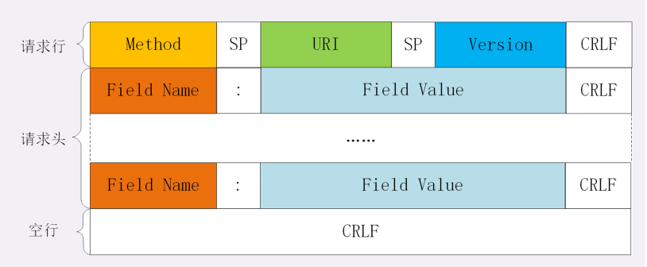
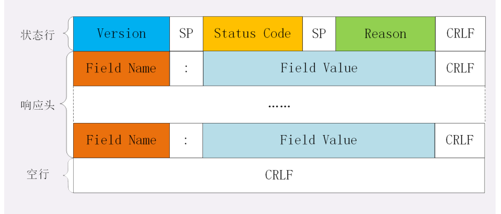
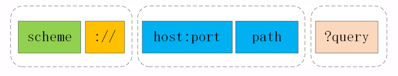

# 计算机网络

TCP三次握手 
TCP 四次挥手 
为什么建立三次、断开是四次 
四次挥手套接字的状态转移 
输入url的流程 
http的request、response的具体格式

## HTTP 和 HTTPS 有哪些区别

## HTTP

### HTTP协议是什么?

http协议是一个计算机世界中专门在两点之间传输(所以不能用于广播,寻址或路由)文字,图片,视频,音频等超文本数据的约定和规范

严格的讲:协议包括 **语法,语义,同步规则,错误处理**

http并不孤立,在互联网世界里，HTTP 通常跑在 TCP/IP 协议栈之上，依靠 IP 协议实现寻址和路由、TCP 协议实现可靠数据传输、DNS 协议实现域名查找、SSL/TLS 协议实现安全通信。此外，还 有一些协议依赖于 HTTP，例如 WebSocket、HTTPDNS 等。这些协议相互交织，构成了 一个协议网，而 HTTP 则处于中心地位。

HTTP又是什么?

与 HTTP 协议相关的所有应用层技术的总和

服务器能当客户端,但浏览器只能是客户端

### 互联网

我们通常所说的“上 网”实际上访问的只是互联网的一个子集“万维网”（World Wide Web），它基于 HTTP 协议，传输 HTML 等超文本资源，能力也就被限制在 HTTP 协议之内。

互联网上还有许多万维网之外的资源，例如常用的电子邮件、BT 和 Magnet 点对点下载、 FTP 文件下载、SSH 安全登录、各种即时通信服务等等，它们需要用各自的专有协议来访 问。

### Web服务器

刚才说的浏览器是 HTTP 里的请求方，那么在协议另一端的应答方（响应方）又是什么 呢？ 这个你一定也很熟悉，答案就是服务器，Web Server。

Web 服务器是一个很大也很重要的概念，它是 HTTP 协议里响应请求的主体，通常也把控 着绝大多数的网络资源，在网络世界里处于强势地位。

当我们谈到“Web 服务器”时有两个层面的含义：硬件和软件。

### CDN

CDN，全称是“Content Delivery Network”，翻译过来就是“内容分发网络”。它应用 了 HTTP 协议里的缓存和代理技术，代替源站响应客户端的请求。

CDN 有什么好处呢？ 简单来说，它可以缓存源站的数据，让浏览器的请求不用“千里迢迢”地到达源站服务器， 直接在“半路”就可以获取响应。如果 CDN 的调度算法很优秀，更可以找到离用户最近的 节点，大幅度缩短响应时间。

CDN 位于浏览器和服务器之间，主要起到缓存加速的作用；

CDN，实际上就是一种代理，它代替源站服务器响应客户端的请求，通常扮 演着透明代理和反向代理的角色。

### IP协议

IP 协议是“Internet Protocol”的缩写，主要目的是解决寻址和路由问题，以及如何在两 点间传送数据包。IP 协议使用“IP 地址”的概念来定位互联网上的每一台计算机。

### TCP协议

TCP 协议是“Transmission Control Protocol”的缩写，意思是“传输控制协议”，它位 于 IP 协议之上，基于 IP 协议提供可靠的、字节流形式的通信，是 HTTP 协议得以实现的 基础。

“可靠”是指保证数据不丢失，“字节流”是指保证数据完整，所以在 TCP 协议的两端可 以如同操作文件一样访问传输的数据，就像是读写在一个密闭的管道里“流动”的字节。

### DNS

在 DNS 中，“域名”（Domain Name）又称为“主机名”（Host），为了更好地标记不 同国家或组织的主机，让名字更好记，所以被设计成了一个有层次的结构。 域名用“.”分隔成多个单词，级别从左到右逐级升高，最右边的被称为“顶级域名”。

HTTP 协议中并没有明确要求必须使用 DNS，但实际上为了方便访问互联网上的 Web 服 务器，通常都会使用 DNS 来定位或标记主机名，间接地把 DNS 与 HTTP 绑在了一起。

#### 有了 TCP/IP 和 DNS，是不是我们就可以任意访问网络上的资源了呢?

还不行，DNS 和 IP 地址只是标记了互联网上的主机，但主机上有那么多文本、图片、页 面，到底要找哪一个呢？就像小明管理了一大堆文档，你怎么告诉他是哪个呢？ 所以就出现了 URI（Uniform Resource Identifier），中文名称是 统一资源标识符，使用 它就能够唯一地标记互联网上资源。 URI 另一个更常用的表现形式是 URL（Uniform Resource Locator）， 统一资源定位 符，也就是我们俗称的“网址”，它实际上是 URI 的一个子集，不过因为这两者几乎是相 同的，差异不大，所以通常不会做严格的区分。

URI 主要有三个基本的部分构成：

1. 协议名：即访问该资源应当使用的协议，在这里是“http”； 
2.  主机名：即互联网上主机的标记，可以是域名或 IP 地址，在这里是“nginx.org”； 
3. 路径：即资源在主机上的位置，使用“/”分隔多级目录，在这里 是“/en/download.html”。

URI 是用来标记互联网上资源的一个名字，由“协议名 + 主机名 + 路径”构成，俗称 URL；

### 代理

代理（Proxy）是 HTTP 协议中请求方和应答方中间的一个环节，作为“中转站”，既可以 转发客户端的请求，也可以转发服务器的应答。

代理有很多的种类，常见的有： 

1. 匿名代理：完全“隐匿”了被代理的机器，外界看到的只是代理服务器； 
2.  透明代理：顾名思义，它在传输过程中是“透明开放”的，外界既知道代理，也知道客 户端
3.  正向代理：靠近客户端，代表客户端向服务器发送请求； 
4.  反向代理：靠近服务器端，代表服务器响应客户端的请求；

1. 负载均衡：把访问请求均匀分散到多台机器，实现访问集群化； 
2. 内容缓存：暂存上下行的数据，减轻后端的压力； 
3. 安全防护：隐匿 IP, 使用 WAF 等工具抵御网络攻击，保护被代理的机器； 
4. 数据处理：提供压缩、加密等额外的功能。

## 传输层

TCP和UDP,两个协议的另一个重要区别在于数据的形式。TCP 的数据是连 续的“字节流”，有先后顺序，而 UDP 则是分散的小数据包，是顺序发，乱序收。

 TCP/IP 实际应用时的会话管理、编码转换、压缩 等和具体应用经常联系的很紧密，很难分开。例如，HTTP 协议就同时包含了连接管理和数 据格式定义。

所谓的“四层负载均衡”就是指工作在传输层上，基于 TCP/IP 协议的特性，例如 IP 地 址、端口号等实现对后端服务器的负载均衡。 

所谓的“七层负载均衡”就是指工作在应用层上，看到的是 HTTP 协议，解析 HTTP 报文 里的 URI、主机名、资源类型等数据，再用适当的策略转发给后端服务器。

### 二层转发

设备工作在链路层，帧在经过交换机设备时，检查帧的头部信息，拿到目标 mac地址，进行本地转发和广播

### 三层路由

设备工作在ip层，报文经过有路由功能的设备时，设备分析报文中的头部信 息，拿到ip地址，根据网段范围，进行本地转发或选择下一个网关

## 域名的解析

就像 IP 地址必须转换成 MAC 地址才能访问主机一样，域名也必须要转换成 IP 地址，这个 过程就是“域名解析”。

DNS 的核心系统是一个三层的树状、分布式服务，基本对应域名的结构： 

1. 根域名服务器（Root DNS Server）：管理顶级域名服务器，返 回“com”“net”“cn”等顶级域名服务器的 IP 地址； 
2. 顶级域名服务器（Top-level DNS Server）：管理各自域名下的权威域名服务器，比如 com 顶级域名服务器可以返回 apple.com 域名服务器的 IP 地址； 
3. 权威域名服务器（Authoritative DNS Server）：管理自己域名下主机的 IP 地址，比如 apple.com 权威域名服务器可以返回 www.apple.com 的 IP 地址。

例如，你要访问“www.apple.com”，就要进行下面的三次查询： 

1. 访问根域名服务器，它会告诉你“com”顶级域名服务器的地址；
2. 访问“com”顶级域名服务器，它再告诉你“apple.com”域名服务器的地址； 
3. 最后访问“apple.com”域名服务器，就得到了“www.apple.com”的地址。

虽然核心的 DNS 系统遍布全球，服务能力很强也很稳定，但如果全世界的网民都往这个系 统里挤，即使不挤瘫痪了，访问速度也会很慢。 所以在核心 DNS 系统之外，还有两种手段用来减轻域名解析的压力，并且能够更快地获取 结果，基本思路就是“缓存”。 首先，许多大公司、网络运行商都会建立自己的 DNS 服务器，作为用户 DNS 查询的代 理，**代替用户访问核心 DNS 系统**。这些“野生”服务器被称为“非权威域名服务器”，可 以缓存之前的查询结果，如果已经有了记录，就无需再向根服务器发起查询，直接返回对应 的 IP 地址。

其次，操作系统里也会对 DNS 解析结果做缓存，如果你之前访问 过“www.apple.com”，那么下一次在浏览器里再输入这个网址的时候就不会再跑到 DNS 那里去问了，直接在操作系统里就可以拿到 IP 地址。

操作系统里还有一个特殊的“主机映射”文件，通常是一个可编辑的文本，在 Linux 里是“/etc/hosts”，在 Window是“C:\WINDOWS\system32\drivers\etc\hosts”，如果操作系统在缓存里找不到 DNS 记录，就会找这个文件。

 **浏览器缓存->操作系统缓存->hosts->dns**

##  键入网址再按下回车，后面究竟发生了什么？

1. 浏览器从地址栏的输入中获得服务器的 IP 地址和端口号；
2. 浏览器用 TCP 的三次握手与服务器建立连接； 
3. 浏览器向服务器发送拼好的报文；
4. 服务器收到报文后处理请求，同样拼好报文再发给浏览器； 
5. 浏览器解析报文，渲染输出页面。

HTTP 协议是运行在 TCP/IP 基础上的，依靠 TCP/IP 协议来实现数据的可靠传输。所以浏览器要用 HTTP 协议收发数据，首先要做的就 是建立 TCP 连接。

服务器使用 的端口是 80，经过 SYN、SYN/ACK、ACK 的三个包之后，浏览器与服务器的 TCP 连接就 建立起来了。

互联网上还有另外一个重要的角色 CDN，它也会在 DNS 的解析过程中“插上一 脚”。DNS 解析可能会给出 CDN 服务器的 IP 地址，这样你拿到的就会是 CDN 服务器而 不是目标网站的实际地址。

因为 CDN 会缓存网站的大部分资源，比如图片、CSS 样式表，所以有的 HTTP 请求就不 需要再发到 Apple，CDN 就可以直接响应你的请求，把数据发给你。

目标网站的服务器对外表现的是一个 IP 地址，但为了能够扛住高并发，在内部也是一套复 杂的架构。通常在入口是负载均衡设备，例如四层的 LVS 或者七层的 Nginx，在后面是许 多的服务器，构成一个更强更稳定的集群。 

负载均衡设备会先访问系统里的缓存服务器，通常有 memory 级缓存 Redis 和 disk 级缓 存 Varnish，它们的作用与 CDN 类似，不过是工作在内部网络里，把最频繁访问的数据缓 存几秒钟或几分钟，减轻后端应用服务器的压力。 

如果缓存服务器里也没有，那么负载均衡设备就要把请求转发给应用服务器了。这里就是各 种开发框架大显神通的地方了，例如 Java 的 Tomcat/Netty/Jetty，Python 的 Django， 还有 PHP、Node.js、Golang 等等。它们又会再访问后面的 MySQL、PostgreSQL、 MongoDB 等数据库服务，实现用户登录、商品查询、购物下单、扣款支付等业务操作， 然后把执行的结果返回给负载均衡设备，同时也可能给缓存服务器里也放一份。 

应用服务器的输出到了负载均衡设备这里，请求的处理就算是完成了，就要按照原路再走回 去，还是要经过许多的路由器、网关、代理。如果这个资源允许缓存，那么经过 CDN 的时 候它也会做缓存，这样下次同样的请求就不会到达源站了。 

最后网站的响应数据回到了你的设备，它可能是 HTML、JSON、图片或者其他格式的数 据，需要由浏览器解析处理才能显示出来，如果数据里面还有超链接，指向别的资源，那么 就又要重走一遍整个流程，直到所有的资源都下载完。

## 在浏览器里点击页面链接后发生了哪些事情

浏览器判断是不是ip地址，不是就进行域名解析，依次通过浏览器缓存，系统缓存，host文件，还是没找到的请求DNS服务器获取IP解析(解析失败的浏览器尝试换别的DNS服务器，最终失败的进入错误页面)，有可能获取到CDN服务器IP地址，访问CDN时先看是否缓存了，缓存了响应用户，无法缓存，缓存失效或者无缓存，回源到服务器。经过防火墙外网网管路由到nginx接入层。ng缓存中存在的直接放回，不存在的负载到web服务器。web服务器接受到请后处理，路径不存在404。存在的返回结果(服务器中也会有redis,ehcache(堆内外缓存)，disk等缓存策略)。原路返回，CDN加入缓存响应用户。

1、如果域名不是ip，需要走域名解析成ip的逻辑，优先级顺序为: 1 浏览器缓存 > 2 本地hosts > 3 系统缓存 > 4 根域名 > 5 顶级dns服务器(如 com) > 6 二级dns服务器(baidu.com) > 7 三级dns服务器(www.baidu.com)，如果客户端指向的dns服务器为非官方的如 8.8.8.8，那在第4步之前可能还有一层cache,当然最后解析的ip有可能是cdn的，如果cdn失效了就直接穿透到源ip，当然这个服务器这一部分可能做了四层负载均衡的设置，所以有可能每次获取的服务器ip都不一祥，也有可能到了服务器ngx层做了七层转发，所以虽然获得的ip一样，但是内部可能转发给了很多内网服务器

2、通过中间各种路由器的转发，找到了最终服务器，进行tcp三次握手，数据请求，请求分两种一种是uri请求，一种是浏览器咸吃萝卜淡操心的请求网站图标ico的资源请求，然后服务端收到请求后进行请求分析，最终返回http报文，再通过tcp这个连接隧道返回给用户端，用户端收到后再告诉服务端已经收到结果的信号(ack)，然后客户端有一套解析规则，如果是html，可能还有额外的外部连接请求，是跟刚才的请求流程是同理的(假设是http1.1)，只不过没有了tcp三次握手的过程，最终用户看到了百度的搜索页面。当然如果dns没解析成功，浏览器直接就报错了，不会继续请求接下来的资源

## HTTP报文

HTTP 协议的请求报文和响应报文的结构基本相同，由三大 部分组成： 

1. 起始行（start line）：描述请求或响应的基本信息； 
2. 头部字段集合（header）：使用 key-value 形式更详细 地说明报文； 
3. 消息正文（entity）：实际传输的数据，它不一定是纯文 本，可以是图片、视频等二进制数据。 

这其中前两部分起始行和头部字段经常又合称为**“请求 头”或“响应头”**，消息正文又称为“实体”，但 与“header”对应，很多时候就直接称为“body”。 HTTP 协议规定报文必须有 header，但可以没有 body，而 且在 header 之后必须要有一个“空行”，也就 是“CRLF”，十六进制的“0D0A”。

在很多时候，特别是浏览器发送 GET 请求的时候都是这 样，HTTP 报文经常是只有 header 而没 body，相当于只 发了一个超级“大头”过来，你可以想象的出来：每时每刻 网络上都会有数不清的“大头儿子”在跑来跑去。 不过这个“大头”也不能太大，虽然 HTTP 协议对 header 的大小没有做限制，但各个 Web 服务器都不允许过大的请 求头，因为头部太大可能会占用大量的服务器资源，影响运 行效率。

**为什么请求头太大会占用服务器资源呢？**

因为服务器必须分配内存存储请求头，然后才能 处理，如果头很大，比如说16k，那么几万个请求就会占用 非常多的内存。 Nginx里限制头不超过4k，就是为了节约内存资源。

### 请求行

简要地描述了客 户端想要如何操作服务器端的资源。

<u>**请求行的版本号后 面要加一个CRLF，是个回车换行，不是空行**</u>

GET / HTTP/1.1

GET /favicon.ico HTTP/1.1

请求行由三部分构成： 

1. 请求方法：是一个动词，如 GET/POST，表示对资源的 操作； 
2. 请求目标：通常是一个 URI，标记了请求方法要操作的资 源； 
3. 版本号：表示报文使用的 HTTP 协议版本。 这三个部分通常使用空格（space）来分隔，最后要用 CRLF 换行表示结束。

### 状态行

看完了请求行，我们再看响应报文里的起始行，在这里它不 叫“响应行”，而是叫“状态行”（status line），意思是 服务器响应的状态。

HTTP/1.1 200 OK

 HTTP/1.1 404 Not Found

1. 版本号：表示报文使用的 HTTP 协议版本； 
2. 状态码：一个三位数，用代码的形式表示处理的结果，比 如 200 是成功，500 是服务器错误； 
3. 原因：作为数字状态码补充，是更详细的解释文字，帮助 人理解原因。

### 请求头 和 响应头

请求行或状态行再加上头部字段集合就构成了 HTTP 报文里 完整的请求头或响应头

请求头和响应头的结构是基本一样的，唯一的区别是起始 行

头部字段是 key-value 的形式，key 和 value 之间 用“:”分隔，最后用 CRLF 换行表示字段结束。比如 在“Host: 127.0.0.1”这一行里 key 就是“Host”，value 就是“127.0.0.1”。

HTTP 头字段非常灵活，不仅可以使用标准里的 Host、 Connection 等已有头，也可以任意添加自定义头，这就给 HTTP 协议带来了无限的扩展可能。

不过使用头字段需要注意下面几点： 

1. 字段名不区分大小写，例如“Host”也可以写 成“host”，但首字母大写的可读性更好； 
2. 字段名里不允许出现空格，可以使用连字符“-”，但不 能使用下划线“_”。例如，“test-name”是合法的字 段名，而“test name”“test_name”是不正确的字段 名；
3. 字段名后面必须紧接着“:”，不能有空格，而“:”后的 字段值前可以有多个空格； 
4. 字段的顺序是没有意义的，可以任意排列不影响语义； 
5. 字段原则上不能重复，除非这个字段本身的语义允许，例 如 Set-Cookie。

### 常用头字段

HTTP 协议规定了非常多的头部字段，实现各种各样的功 能，但基本上可以分为四大类： 

1. 通用字段：在请求头和响应头里都可以出现； 

2. 请求字段：仅能出现在请求头里，进一步说明请求信息或 者额外的附加条件； 

3.  响应字段：仅能出现在响应头里，补充说明响应报文的信 息； 

4. 实体字段：它实际上属于通用字段，但专门描述 body 的 额外信息。 

   

对 HTTP 报文的解析和处理实际上主要就是对头字段的处 理，理解了头字段也就理解了 HTTP 报文。

#### Host字段

它属于请求字段，只能出现在请 求头里，它同时也是唯一一个 HTTP/1.1 规范里要求必须出 现的字段，也就是说，如果请求头里没有 Host，那这就是 一个错误的报文。

Host 字段告诉服务器这个请求应该由哪个主机来处理，当 一台计算机上托管了多个虚拟主机的时候，服务器端就需要 用 Host 字段来选择，有点像是一个简单的“路由重定 向”。

例如我们的试验环境，在 127.0.0.1 上有三个虚拟主 机：“www.chrono.com”“www.metroid.net”和“ori gin.io”。那么当使用域名的方式访问时，就必须要用 Host 字段来区分这三个 IP 相同但域名不同的网站，否则服务器 就会找不到合适的虚拟主机，无法处理。

#### User-Agent

请求字段，只出现在请求头里。它使用一个 字符串来描述发起 HTTP 请求的客户端，服务器可以依据它 来返回最合适此浏览器显示的页面。 

但由于历史的原因，User-Agent 非常混乱，每个浏览器都 自称是“Mozilla”“Chrome”“Safari”，企图使用这个 字段来互相“伪装”，导致 User-Agent 变得越来越长，最 终变得毫无意义。 不过有的比较“诚实”的爬虫会在 User-Agent 里 用“spider”标明自己是爬虫，所以可以利用这个字段实现 简单的反爬虫策略。

#### Date

是一个通用字段，但通常出现在响应头里，表示 HTTP 报文创建的时间，客户端可以使用这个时间再搭配其 他字段决定缓存策略。

#### Server

响应字段，只能出现在响应头里。它告诉客户 端当前正在提供 Web 服务的软件名称和版本号，例如在我 们的实验环境里它就是“Server: openresty/1.15.8.1”， 即使用的是 OpenResty 1.15.8.1。

Server 字段也不是必须要出现的，因为这会把服务器的一 部分信息暴露给外界，如果这个版本恰好存在 bug，那么黑 客就有可能利用 bug 攻陷服务器。所以，有的网站响应头 里要么没有这个字段，要么就给出一个完全无关的描述信 息。比如 GitHub，它的 Server 字段里就看不出是使用了 Apache 还是 Nginx，只是显示为“GitHub.com”。

#### Content-Length

表示报文里 body 的长度，也就是请求头或响应头空行后面数据的长 度。服务器看到这个字段，就知道了后续有多少数据，可以 直接接收。如果没有这个字段，那么 body 就是不定长的， 需要使用 chunked 方式分段传输。

### 请求方法

目前 HTTP/1.1 规定了八种方法，单词都必须是大写的形 式

请求方法是一个“指示”，那么客户端自然就没有决定 权，服务器掌控着所有资源，也就有绝对的决策权力。它收 到 HTTP 请求报文后，看到里面的请求方法，可以执行也可 以拒绝，或者改变动作的含义，毕竟 HTTP 是一个“协 议”，两边都要“商量着来”。

比如，你发起了一个 GET 请求，想获取“/orders”这个文 件，但这个文件保密级别比较高，不是谁都能看的，服务器 就可以有如下的几种响应方式： 

1. 假装这个文件不存在，直接返回一个 404 Not found 报 文； 
2. 稍微友好一点，明确告诉你有这个文件，但不允许访问， 返回一个 403 Forbidden； 
3. 再宽松一些，返回 405 Method Not Allowed，然后用 Allow 头告诉你可以用 HEAD 方法获取文件的元信息。

HEAD 方法可以看做是 GET 方法的一个“简化版”或 者“轻量版”。因为它的响应头与 GET 完全相同，所以可 以用在很多并不真正需要资源的场合，避免传输 body 数据 的浪费。 比如，想要检查一个文件是否存在，只要发个 HEAD 请求 就可以了

在 HTTP 协议里，所谓的“安全”是指请求方法不会“破 坏”服务器上的资源，即不会对服务器上的资源造成实质的 修改。

“幂等”实际上是一个数学用语，被借用到了 HTTP 协议里，意思是多次执行相同的操作，结果也都是相同的， 即多次“幂”后结果“相等”。

POST 是“新增或提交数据”，多次 提交数据会创建多个资源，所以不是幂等的；而 PUT 是“替换或更新数据”，多次更新一个资源，资源还是会第 一次更新的状态，所以是幂等的。

## 正确的网址

URI，也就 是统一资源标识符（Uniform Resource Identifier）

URI 不完全等同于网址，它包含有 URL 和 URN 两个部分，在 HTTP 世界里用的网址实际上是 URL——统 一资源定位符（Uniform Resource Locator）。

URI 本质上是一个字符串，这个字符串的作用是唯一地标记 资源的位置或者名字。

URI 最常用的形式，由 scheme、 host:port、path 和 query 四个部分组成，但有的部分可以 视情况省略。

### URI 的基本组成

URI 第一个组成部分叫scheme，翻译成中文叫“方案 名”或者“协议名”，表示资源应该使用哪种协议来访问。

在“://”之后，是被称为“authority”的部分，表示资源 所在的主机名，通常的形式是“host:port”，即主机名加 端口号

有了协议名和主机地址、端口号，再加上后面标记资源所在 位置的path，浏览器就可以连接服务器访问资源了

在 HTTP 报文里的 URI“/11-1”与浏览器里输入 的“http://www.chrono.com/11-1”有很大的不同，协议 名和主机名都不见了，只剩下了后面的部分

这是因为协议名和主机名已经分别出现在了请求行的版本号 和请求头的 Host 字段里，没有必要再重复。当然，在请求 行里使用完整的 URI 也是可以的

**客户端和服务器 看到的 URI 是不一样的。客户端看到的必须是完整的 URI， 使用特定的协议去连接特定的主机，而服务器看到的只是报 文请求行里被删除了协议名和主机名的 URI。**

## 响应状态码

用数字的第一位表示分类， 而 0~99 不用，这样状态码的实际可用范围就大大缩小了， 由 000~999 变成了 100~599。

这五类的具体含义是： 

​	1××：提示信息，表示目前是协议处理的中间状态，还需 要后续的操作； 

​	2××：成功，报文已经收到并被正确处理； 

​	3××：重定向，资源位置发生变动，需要客户端重新发送 请求

​	4××：客户端错误，请求报文有误，服务器无法处理； 

​	5××：服务器错误，服务器在处理请求时内部发生了错 误。

[12丨响应状态码该怎么用？.pdf](file:///C:/Users/ZJF/Desktop/52-透视HTTP协议/03-基础篇 (1讲)/12丨响应状态码该怎么用？.pdf)

## HTTP协议特点

1.  HTTP 协议是一个“灵活可扩展”的传输协议

2. HTTP 协议是一个“可靠”的传输协议

   HTTP 协议是基于 TCP/IP 的，而 TCP 本身是一个“可靠”的传 输协议，所以 HTTP 自然也就继承了这个特性，能够在请求方和应答方之间“可靠”地传 输数据。 

   它的具体做法与 TCP/UDP 差不多，都是对实际传输的数据（entity）做了一层包装，加上 一个头，然后调用 Socket API，通过 TCP/IP 协议栈发送或者接收。 

   不过我们必须正确地理解“可靠”的含义，HTTP 并不能 100% 保证数据一定能够发送到 另一端，在网络繁忙、连接质量差等恶劣的环境下，也有可能收发失败。“可靠”只是向使 用者提供了一个“承诺”，会在下层用多种手段“尽量”保证数据的完整送达。

   如果要100%保证数据收发成功就不能使用HTTP或TCP协议，而是用各种消息中间件（MQ）

3. HTTP 协议是一个应用层的协议。

4. HTTP 协议使用的是请求 - 应答通信模式

5. HTTP 协议是无状态的

   好处：

   因为服务器没有“记忆能力”，所以就不需要额外的资源来记录状态信息，不仅实现上会简 单一些，而且还能减轻服务器的负担，能够把更多的 CPU 和内存用来对外提供服务。

   而且，“无状态”也表示服务器都是相同的，没有“状态”的差异，所以可以很容易地组成 集群，让负载均衡把请求转发到任意一台服务器，不会因为状态不一致导致处理出错，使 用“堆机器”的“笨办法”轻松实现高并发高可用。

   坏处：

   既然服务器没有“记忆能力”，它就无法支持需要连续多个步骤的“事务”操作。例如电商 购物，首先要登录，然后添加购物车，再下单、结算、支付，这一系列操作都需要知道用户 的身份才行，但“无状态”服务器是不知道这些请求是相互关联的，每次都得问一遍身份信 息，不仅麻烦，而且还增加了不必要的数据传输量。

   所以，HTTP 协议最好是既“无状态”又“有状态”，不过还真有“鱼和熊掌”两者兼得这 样的好事，这就是“小甜饼”Cookie 技术（第 19 讲）。

6. 明文

   明文传输是一把双刃剑

   “明文”意思就是协议里的报文（准确地说是 header 部分）不使用二进制数据，而是用简 单可阅读的文本形式。

   对比 TCP、UDP 这样的二进制协议，它的优点显而易见，不需要借助任何外部工具，用浏 览器、Wireshark 或者 tcpdump 抓包后，直接用肉眼就可以很容易地查看或者修改，为 我们的开发调试工作带来极大的便利。

   当然，明文的缺点也是一样显而易见，HTTP 报文的所有信息都会暴露在“光天化日之 下”，在漫长的传输链路的每一个环节上都毫无隐私可言，不怀好意的人只要侵入了这个链 路里的某个设备，简单地“旁路”一下流量，就可以实现对通信的窥视。

7. 不安全

   与“明文”缺点相关但不完全等同的另一个缺点是“不安全”。

   安全有很多的方面，明文只是“机密”方面的一个缺点，在“身份认证”和“完整性校 验”这两方面 HTTP 也是欠缺的。
