# 计算机网络


TCP三次握手 
TCP 四次挥手 
为什么建立三次、断开是四次 
四次挥手套接字的状态转移 
输入url的流程 
http的request、response的具体格式


## HTTP 和 HTTPS 有哪些区别


## HTTP

### HTTP协议是什么?

http协议是一个计算机世界中专门在两点之间传输(所以不能用于广播,寻址或路由)文字,图片,视频,音频等超文本数据的约定和规范

严格的讲:协议包括 **语法,语义,同步规则,错误处理**


http并不孤立,在互联网世界里，HTTP 通常跑在 TCP/IP 协议栈之上，依靠 IP 协议实现寻址和路由、TCP 协议实现可靠数据传输、DNS 协议实现域名查找、SSL/TLS 协议实现安全通信。此外，还 有一些协议依赖于 HTTP，例如 WebSocket、HTTPDNS 等。这些协议相互交织，构成了 一个协议网，而 HTTP 则处于中心地位。


HTTP又是什么?

与 HTTP 协议相关的所有应用层技术的总和


服务器能当客户端,但浏览器只能是客户端


### 互联网

我们通常所说的“上 网”实际上访问的只是互联网的一个子集“万维网”（World Wide Web），它基于 HTTP 协议，传输 HTML 等超文本资源，能力也就被限制在 HTTP 协议之内。

互联网上还有许多万维网之外的资源，例如常用的电子邮件、BT 和 Magnet 点对点下载、 FTP 文件下载、SSH 安全登录、各种即时通信服务等等，它们需要用各自的专有协议来访 问。


### Web服务器

刚才说的浏览器是 HTTP 里的请求方，那么在协议另一端的应答方（响应方）又是什么 呢？ 这个你一定也很熟悉，答案就是服务器，Web Server。

Web 服务器是一个很大也很重要的概念，它是 HTTP 协议里响应请求的主体，通常也把控 着绝大多数的网络资源，在网络世界里处于强势地位。

当我们谈到“Web 服务器”时有两个层面的含义：硬件和软件。


### CDN

CDN，全称是“Content Delivery Network”，翻译过来就是“内容分发网络”。它应用 了 HTTP 协议里的缓存和代理技术，代替源站响应客户端的请求。

CDN 有什么好处呢？ 简单来说，它可以缓存源站的数据，让浏览器的请求不用“千里迢迢”地到达源站服务器， 直接在“半路”就可以获取响应。如果 CDN 的调度算法很优秀，更可以找到离用户最近的 节点，大幅度缩短响应时间。

CDN 位于浏览器和服务器之间，主要起到缓存加速的作用；

CDN，实际上就是一种代理，它代替源站服务器响应客户端的请求，通常扮 演着透明代理和反向代理的角色。

### IP协议

IP 协议是“Internet Protocol”的缩写，主要目的是解决寻址和路由问题，以及如何在两 点间传送数据包。IP 协议使用“IP 地址”的概念来定位互联网上的每一台计算机。


### TCP协议

TCP 协议是“Transmission Control Protocol”的缩写，意思是“传输控制协议”，它位 于 IP 协议之上，基于 IP 协议提供可靠的、字节流形式的通信，是 HTTP 协议得以实现的 基础。

“可靠”是指保证数据不丢失，“字节流”是指保证数据完整，所以在 TCP 协议的两端可 以如同操作文件一样访问传输的数据，就像是读写在一个密闭的管道里“流动”的字节。


### DNS

在 DNS 中，“域名”（Domain Name）又称为“主机名”（Host），为了更好地标记不 同国家或组织的主机，让名字更好记，所以被设计成了一个有层次的结构。 域名用“.”分隔成多个单词，级别从左到右逐级升高，最右边的被称为“顶级域名”。

HTTP 协议中并没有明确要求必须使用 DNS，但实际上为了方便访问互联网上的 Web 服 务器，通常都会使用 DNS 来定位或标记主机名，间接地把 DNS 与 HTTP 绑在了一起。


#### 有了 TCP/IP 和 DNS，是不是我们就可以任意访问网络上的资源了呢?

还不行，DNS 和 IP 地址只是标记了互联网上的主机，但主机上有那么多文本、图片、页 面，到底要找哪一个呢？就像小明管理了一大堆文档，你怎么告诉他是哪个呢？ 所以就出现了 URI（Uniform Resource Identifier），中文名称是 统一资源标识符，使用 它就能够唯一地标记互联网上资源。 URI 另一个更常用的表现形式是 URL（Uniform Resource Locator）， 统一资源定位 符，也就是我们俗称的“网址”，它实际上是 URI 的一个子集，不过因为这两者几乎是相 同的，差异不大，所以通常不会做严格的区分。


URI 主要有三个基本的部分构成：

1. 协议名：即访问该资源应当使用的协议，在这里是“http”； 
2.  主机名：即互联网上主机的标记，可以是域名或 IP 地址，在这里是“nginx.org”； 
3. 路径：即资源在主机上的位置，使用“/”分隔多级目录，在这里 是“/en/download.html”。


URI 是用来标记互联网上资源的一个名字，由“协议名 + 主机名 + 路径”构成，俗称 URL；


### 代理

代理（Proxy）是 HTTP 协议中请求方和应答方中间的一个环节，作为“中转站”，既可以 转发客户端的请求，也可以转发服务器的应答。


代理有很多的种类，常见的有： 

1. 匿名代理：完全“隐匿”了被代理的机器，外界看到的只是代理服务器； 
2.  透明代理：顾名思义，它在传输过程中是“透明开放”的，外界既知道代理，也知道客 户端
3.  正向代理：靠近客户端，代表客户端向服务器发送请求； 
4.  反向代理：靠近服务器端，代表服务器响应客户端的请求；


1. 负载均衡：把访问请求均匀分散到多台机器，实现访问集群化； 
2. 内容缓存：暂存上下行的数据，减轻后端的压力； 
3. 安全防护：隐匿 IP, 使用 WAF 等工具抵御网络攻击，保护被代理的机器； 
4. 数据处理：提供压缩、加密等额外的功能。


## 传输层

TCP和UDP,两个协议的另一个重要区别在于数据的形式。TCP 的数据是连 续的“字节流”，有先后顺序，而 UDP 则是分散的小数据包，是顺序发，乱序收。

 TCP/IP 实际应用时的会话管理、编码转换、压缩 等和具体应用经常联系的很紧密，很难分开。例如，HTTP 协议就同时包含了连接管理和数 据格式定义。


所谓的“四层负载均衡”就是指工作在传输层上，基于 TCP/IP 协议的特性，例如 IP 地 址、端口号等实现对后端服务器的负载均衡。 

所谓的“七层负载均衡”就是指工作在应用层上，看到的是 HTTP 协议，解析 HTTP 报文 里的 URI、主机名、资源类型等数据，再用适当的策略转发给后端服务器。


### 二层转发

设备工作在链路层，帧在经过交换机设备时，检查帧的头部信息，拿到目标 mac地址，进行本地转发和广播

### 三层路由

设备工作在ip层，报文经过有路由功能的设备时，设备分析报文中的头部信 息，拿到ip地址，根据网段范围，进行本地转发或选择下一个网关


## 域名的解析

就像 IP 地址必须转换成 MAC 地址才能访问主机一样，域名也必须要转换成 IP 地址，这个 过程就是“域名解析”。


DNS 的核心系统是一个三层的树状、分布式服务，基本对应域名的结构： 

1. 根域名服务器（Root DNS Server）：管理顶级域名服务器，返 回“com”“net”“cn”等顶级域名服务器的 IP 地址； 
2. 顶级域名服务器（Top-level DNS Server）：管理各自域名下的权威域名服务器，比如 com 顶级域名服务器可以返回 apple.com 域名服务器的 IP 地址； 
3. 权威域名服务器（Authoritative DNS Server）：管理自己域名下主机的 IP 地址，比如 apple.com 权威域名服务器可以返回 www.apple.com 的 IP 地址。


例如，你要访问“www.apple.com”，就要进行下面的三次查询： 

1. 访问根域名服务器，它会告诉你“com”顶级域名服务器的地址；
2. 访问“com”顶级域名服务器，它再告诉你“apple.com”域名服务器的地址； 
3. 最后访问“apple.com”域名服务器，就得到了“www.apple.com”的地址。


虽然核心的 DNS 系统遍布全球，服务能力很强也很稳定，但如果全世界的网民都往这个系 统里挤，即使不挤瘫痪了，访问速度也会很慢。 所以在核心 DNS 系统之外，还有两种手段用来减轻域名解析的压力，并且能够更快地获取 结果，基本思路就是“缓存”。 首先，许多大公司、网络运行商都会建立自己的 DNS 服务器，作为用户 DNS 查询的代 理，**代替用户访问核心 DNS 系统**。这些“野生”服务器被称为“非权威域名服务器”，可 以缓存之前的查询结果，如果已经有了记录，就无需再向根服务器发起查询，直接返回对应 的 IP 地址。


其次，操作系统里也会对 DNS 解析结果做缓存，如果你之前访问 过“www.apple.com”，那么下一次在浏览器里再输入这个网址的时候就不会再跑到 DNS 那里去问了，直接在操作系统里就可以拿到 IP 地址。


操作系统里还有一个特殊的“主机映射”文件，通常是一个可编辑的文本，在 Linux 里是“/etc/hosts”，在 Window是“C:\WINDOWS\system32\drivers\etc\hosts”，如果操作系统在缓存里找不到 DNS 记录，就会找这个文件。


 **浏览器缓存->操作系统缓存->hosts->dns**


##  键入网址再按下回车，后面究竟发生了什么？

1. 浏览器从地址栏的输入中获得服务器的 IP 地址和端口号；
2. 浏览器用 TCP 的三次握手与服务器建立连接； 
3. 浏览器向服务器发送拼好的报文；
4. 服务器收到报文后处理请求，同样拼好报文再发给浏览器； 
5. 浏览器解析报文，渲染输出页面。


HTTP 协议是运行在 TCP/IP 基础上的，依靠 TCP/IP 协议来实现数据的可靠传输。所以浏览器要用 HTTP 协议收发数据，首先要做的就 是建立 TCP 连接。

服务器使用 的端口是 80，经过 SYN、SYN/ACK、ACK 的三个包之后，浏览器与服务器的 TCP 连接就 建立起来了。


互联网上还有另外一个重要的角色 CDN，它也会在 DNS 的解析过程中“插上一 脚”。DNS 解析可能会给出 CDN 服务器的 IP 地址，这样你拿到的就会是 CDN 服务器而 不是目标网站的实际地址。

因为 CDN 会缓存网站的大部分资源，比如图片、CSS 样式表，所以有的 HTTP 请求就不 需要再发到 Apple，CDN 就可以直接响应你的请求，把数据发给你。


目标网站的服务器对外表现的是一个 IP 地址，但为了能够扛住高并发，在内部也是一套复 杂的架构。通常在入口是负载均衡设备，例如四层的 LVS 或者七层的 Nginx，在后面是许 多的服务器，构成一个更强更稳定的集群。 

负载均衡设备会先访问系统里的缓存服务器，通常有 memory 级缓存 Redis 和 disk 级缓 存 Varnish，它们的作用与 CDN 类似，不过是工作在内部网络里，把最频繁访问的数据缓 存几秒钟或几分钟，减轻后端应用服务器的压力。 

如果缓存服务器里也没有，那么负载均衡设备就要把请求转发给应用服务器了。这里就是各 种开发框架大显神通的地方了，例如 Java 的 Tomcat/Netty/Jetty，Python 的 Django， 还有 PHP、Node.js、Golang 等等。它们又会再访问后面的 MySQL、PostgreSQL、 MongoDB 等数据库服务，实现用户登录、商品查询、购物下单、扣款支付等业务操作， 然后把执行的结果返回给负载均衡设备，同时也可能给缓存服务器里也放一份。 

应用服务器的输出到了负载均衡设备这里，请求的处理就算是完成了，就要按照原路再走回 去，还是要经过许多的路由器、网关、代理。如果这个资源允许缓存，那么经过 CDN 的时 候它也会做缓存，这样下次同样的请求就不会到达源站了。 

最后网站的响应数据回到了你的设备，它可能是 HTML、JSON、图片或者其他格式的数 据，需要由浏览器解析处理才能显示出来，如果数据里面还有超链接，指向别的资源，那么 就又要重走一遍整个流程，直到所有的资源都下载完。


## 在浏览器里点击页面链接后发生了哪些事情

浏览器判断是不是ip地址，不是就进行域名解析，依次通过浏览器缓存，系统缓存，host文件，还是没找到的请求DNS服务器获取IP解析(解析失败的浏览器尝试换别的DNS服务器，最终失败的进入错误页面)，有可能获取到CDN服务器IP地址，访问CDN时先看是否缓存了，缓存了响应用户，无法缓存，缓存失效或者无缓存，回源到服务器。经过防火墙外网网管路由到nginx接入层。ng缓存中存在的直接放回，不存在的负载到web服务器。web服务器接受到请后处理，路径不存在404。存在的返回结果(服务器中也会有redis,ehcache(堆内外缓存)，disk等缓存策略)。原路返回，CDN加入缓存响应用户。


1、如果域名不是ip，需要走域名解析成ip的逻辑，优先级顺序为: 1 浏览器缓存 > 2 本地hosts > 3 系统缓存 > 4 根域名 > 5 顶级dns服务器(如 com) > 6 二级dns服务器(baidu.com) > 7 三级dns服务器(www.baidu.com)，如果客户端指向的dns服务器为非官方的如 8.8.8.8，那在第4步之前可能还有一层cache,当然最后解析的ip有可能是cdn的，如果cdn失效了就直接穿透到源ip，当然这个服务器这一部分可能做了四层负载均衡的设置，所以有可能每次获取的服务器ip都不一祥，也有可能到了服务器ngx层做了七层转发，所以虽然获得的ip一样，但是内部可能转发给了很多内网服务器

2、通过中间各种路由器的转发，找到了最终服务器，进行tcp三次握手，数据请求，请求分两种一种是uri请求，一种是浏览器咸吃萝卜淡操心的请求网站图标ico的资源请求，然后服务端收到请求后进行请求分析，最终返回http报文，再通过tcp这个连接隧道返回给用户端，用户端收到后再告诉服务端已经收到结果的信号(ack)，然后客户端有一套解析规则，如果是html，可能还有额外的外部连接请求，是跟刚才的请求流程是同理的(假设是http1.1)，只不过没有了tcp三次握手的过程，最终用户看到了百度的搜索页面。当然如果dns没解析成功，浏览器直接就报错了，不会继续请求接下来的资源


## HTTP报文

HTTP 协议的请求报文和响应报文的结构基本相同，由三大 部分组成： 

1. 起始行（start line）：描述请求或响应的基本信息； 
2. 头部字段集合（header）：使用 key-value 形式更详细 地说明报文； 
3. 消息正文（entity）：实际传输的数据，它不一定是纯文 本，可以是图片、视频等二进制数据。 


这其中前两部分起始行和头部字段经常又合称为**“请求 头”或“响应头”**，消息正文又称为“实体”，但 与“header”对应，很多时候就直接称为“body”。 HTTP 协议规定报文必须有 header，但可以没有 body，而 且在 header 之后必须要有一个“空行”，也就 是“CRLF”，十六进制的“0D0A”。


在很多时候，特别是浏览器发送 GET 请求的时候都是这 样，HTTP 报文经常是只有 header 而没 body，相当于只 发了一个超级“大头”过来，你可以想象的出来：每时每刻 网络上都会有数不清的“大头儿子”在跑来跑去。 不过这个“大头”也不能太大，虽然 HTTP 协议对 header 的大小没有做限制，但各个 Web 服务器都不允许过大的请 求头，因为头部太大可能会占用大量的服务器资源，影响运 行效率。


**为什么请求头太大会占用服务器资源呢？**

因为服务器必须分配内存存储请求头，然后才能 处理，如果头很大，比如说16k，那么几万个请求就会占用 非常多的内存。 Nginx里限制头不超过4k，就是为了节约内存资源。

### 请求行

简要地描述了客 户端想要如何操作服务器端的资源。

<u>**请求行的版本号后 面要加一个CRLF，是个回车换行，不是空行**</u>

GET / HTTP/1.1

GET /favicon.ico HTTP/1.1

请求行由三部分构成： 

1. 请求方法：是一个动词，如 GET/POST，表示对资源的 操作； 
2. 请求目标：通常是一个 URI，标记了请求方法要操作的资 源； 
3. 版本号：表示报文使用的 HTTP 协议版本。 这三个部分通常使用空格（space）来分隔，最后要用 CRLF 换行表示结束。


### 状态行

看完了请求行，我们再看响应报文里的起始行，在这里它不 叫“响应行”，而是叫“状态行”（status line），意思是 服务器响应的状态。

HTTP/1.1 200 OK

 HTTP/1.1 404 Not Found

1. 版本号：表示报文使用的 HTTP 协议版本； 
2. 状态码：一个三位数，用代码的形式表示处理的结果，比 如 200 是成功，500 是服务器错误； 
3. 原因：作为数字状态码补充，是更详细的解释文字，帮助 人理解原因。


### 请求头 和 响应头

请求行或状态行再加上头部字段集合就构成了 HTTP 报文里 完整的请求头或响应头


请求头和响应头的结构是基本一样的，唯一的区别是起始 行

头部字段是 key-value 的形式，key 和 value 之间 用“:”分隔，最后用 CRLF 换行表示字段结束。比如 在“Host: 127.0.0.1”这一行里 key 就是“Host”，value 就是“127.0.0.1”。

HTTP 头字段非常灵活，不仅可以使用标准里的 Host、 Connection 等已有头，也可以任意添加自定义头，这就给 HTTP 协议带来了无限的扩展可能。

不过使用头字段需要注意下面几点： 

1. 字段名不区分大小写，例如“Host”也可以写 成“host”，但首字母大写的可读性更好； 
2. 字段名里不允许出现空格，可以使用连字符“-”，但不 能使用下划线“_”。例如，“test-name”是合法的字 段名，而“test name”“test_name”是不正确的字段 名；
3. 字段名后面必须紧接着“:”，不能有空格，而“:”后的 字段值前可以有多个空格； 
4. 字段的顺序是没有意义的，可以任意排列不影响语义； 
5. 字段原则上不能重复，除非这个字段本身的语义允许，例 如 Set-Cookie。


### 常用头字段

HTTP 协议规定了非常多的头部字段，实现各种各样的功 能，但基本上可以分为四大类： 

1. 通用字段：在请求头和响应头里都可以出现； 

2. 请求字段：仅能出现在请求头里，进一步说明请求信息或 者额外的附加条件； 

3.  响应字段：仅能出现在响应头里，补充说明响应报文的信 息； 

4. 实体字段：它实际上属于通用字段，但专门描述 body 的 额外信息。 

   

对 HTTP 报文的解析和处理实际上主要就是对头字段的处 理，理解了头字段也就理解了 HTTP 报文。


#### Host字段

它属于请求字段，只能出现在请 求头里，它同时也是唯一一个 HTTP/1.1 规范里要求必须出 现的字段，也就是说，如果请求头里没有 Host，那这就是 一个错误的报文。

Host 字段告诉服务器这个请求应该由哪个主机来处理，当 一台计算机上托管了多个虚拟主机的时候，服务器端就需要 用 Host 字段来选择，有点像是一个简单的“路由重定 向”。

例如我们的试验环境，在 127.0.0.1 上有三个虚拟主 机：“www.chrono.com”“www.metroid.net”和“ori gin.io”。那么当使用域名的方式访问时，就必须要用 Host 字段来区分这三个 IP 相同但域名不同的网站，否则服务器 就会找不到合适的虚拟主机，无法处理。

#### User-Agent

请求字段，只出现在请求头里。它使用一个 字符串来描述发起 HTTP 请求的客户端，服务器可以依据它 来返回最合适此浏览器显示的页面。 

但由于历史的原因，User-Agent 非常混乱，每个浏览器都 自称是“Mozilla”“Chrome”“Safari”，企图使用这个 字段来互相“伪装”，导致 User-Agent 变得越来越长，最 终变得毫无意义。 不过有的比较“诚实”的爬虫会在 User-Agent 里 用“spider”标明自己是爬虫，所以可以利用这个字段实现 简单的反爬虫策略。


#### Date

是一个通用字段，但通常出现在响应头里，表示 HTTP 报文创建的时间，客户端可以使用这个时间再搭配其 他字段决定缓存策略。


#### Server

响应字段，只能出现在响应头里。它告诉客户 端当前正在提供 Web 服务的软件名称和版本号，例如在我 们的实验环境里它就是“Server: openresty/1.15.8.1”， 即使用的是 OpenResty 1.15.8.1。

Server 字段也不是必须要出现的，因为这会把服务器的一 部分信息暴露给外界，如果这个版本恰好存在 bug，那么黑 客就有可能利用 bug 攻陷服务器。所以，有的网站响应头 里要么没有这个字段，要么就给出一个完全无关的描述信 息。比如 GitHub，它的 Server 字段里就看不出是使用了 Apache 还是 Nginx，只是显示为“GitHub.com”。


#### Content-Length

表示报文里 body 的长度，也就是请求头或响应头空行后面数据的长 度。服务器看到这个字段，就知道了后续有多少数据，可以 直接接收。如果没有这个字段，那么 body 就是不定长的， 需要使用 chunked 方式分段传输。


### 请求方法

目前 HTTP/1.1 规定了八种方法，单词都必须是大写的形 式


请求方法是一个“指示”，那么客户端自然就没有决定 权，服务器掌控着所有资源，也就有绝对的决策权力。它收 到 HTTP 请求报文后，看到里面的请求方法，可以执行也可 以拒绝，或者改变动作的含义，毕竟 HTTP 是一个“协 议”，两边都要“商量着来”。


比如，你发起了一个 GET 请求，想获取“/orders”这个文 件，但这个文件保密级别比较高，不是谁都能看的，服务器 就可以有如下的几种响应方式： 

1. 假装这个文件不存在，直接返回一个 404 Not found 报 文； 
2. 稍微友好一点，明确告诉你有这个文件，但不允许访问， 返回一个 403 Forbidden； 
3. 再宽松一些，返回 405 Method Not Allowed，然后用 Allow 头告诉你可以用 HEAD 方法获取文件的元信息。


HEAD 方法可以看做是 GET 方法的一个“简化版”或 者“轻量版”。因为它的响应头与 GET 完全相同，所以可 以用在很多并不真正需要资源的场合，避免传输 body 数据 的浪费。 比如，想要检查一个文件是否存在，只要发个 HEAD 请求 就可以了


在 HTTP 协议里，所谓的“安全”是指请求方法不会“破 坏”服务器上的资源，即不会对服务器上的资源造成实质的 修改。

“幂等”实际上是一个数学用语，被借用到了 HTTP 协议里，意思是多次执行相同的操作，结果也都是相同的， 即多次“幂”后结果“相等”。

POST 是“新增或提交数据”，多次 提交数据会创建多个资源，所以不是幂等的；而 PUT 是“替换或更新数据”，多次更新一个资源，资源还是会第 一次更新的状态，所以是幂等的。


## 正确的网址

URI，也就 是统一资源标识符（Uniform Resource Identifier）

URI 不完全等同于网址，它包含有 URL 和 URN 两个部分，在 HTTP 世界里用的网址实际上是 URL——统 一资源定位符（Uniform Resource Locator）。

URI 本质上是一个字符串，这个字符串的作用是唯一地标记 资源的位置或者名字。

URI 最常用的形式，由 scheme、 host:port、path 和 query 四个部分组成，但有的部分可以 视情况省略。


### URI 的基本组成

URI 第一个组成部分叫scheme，翻译成中文叫“方案 名”或者“协议名”，表示资源应该使用哪种协议来访问。

在“://”之后，是被称为“authority”的部分，表示资源 所在的主机名，通常的形式是“host:port”，即主机名加 端口号

有了协议名和主机地址、端口号，再加上后面标记资源所在 位置的path，浏览器就可以连接服务器访问资源了


在 HTTP 报文里的 URI“/11-1”与浏览器里输入 的“http://www.chrono.com/11-1”有很大的不同，协议 名和主机名都不见了，只剩下了后面的部分

这是因为协议名和主机名已经分别出现在了请求行的版本号 和请求头的 Host 字段里，没有必要再重复。当然，在请求 行里使用完整的 URI 也是可以的

**客户端和服务器 看到的 URI 是不一样的。客户端看到的必须是完整的 URI， 使用特定的协议去连接特定的主机，而服务器看到的只是报 文请求行里被删除了协议名和主机名的 URI。**


## 响应状态码

用数字的第一位表示分类， 而 0~99 不用，这样状态码的实际可用范围就大大缩小了， 由 000~999 变成了 100~599。


这五类的具体含义是： 

​	1××：提示信息，表示目前是协议处理的中间状态，还需 要后续的操作； 

​	2××：成功，报文已经收到并被正确处理； 

​	3××：重定向，资源位置发生变动，需要客户端重新发送 请求

​	4××：客户端错误，请求报文有误，服务器无法处理； 

​	5××：服务器错误，服务器在处理请求时内部发生了错 误。


[12丨响应状态码该怎么用？.pdf](file:///C:/Users/ZJF/Desktop/52-透视HTTP协议/03-基础篇 (1讲)/12丨响应状态码该怎么用？.pdf)


## HTTP协议特点

1.  HTTP 协议是一个“灵活可扩展”的传输协议

2. HTTP 协议是一个“可靠”的传输协议

   HTTP 协议是基于 TCP/IP 的，而 TCP 本身是一个“可靠”的传 输协议，所以 HTTP 自然也就继承了这个特性，能够在请求方和应答方之间“可靠”地传 输数据。 

   它的具体做法与 TCP/UDP 差不多，都是对实际传输的数据（entity）做了一层包装，加上 一个头，然后调用 Socket API，通过 TCP/IP 协议栈发送或者接收。 

   不过我们必须正确地理解“可靠”的含义，HTTP 并不能 100% 保证数据一定能够发送到 另一端，在网络繁忙、连接质量差等恶劣的环境下，也有可能收发失败。“可靠”只是向使 用者提供了一个“承诺”，会在下层用多种手段“尽量”保证数据的完整送达。

   如果要100%保证数据收发成功就不能使用HTTP或TCP协议，而是用各种消息中间件（MQ）

3. HTTP 协议是一个应用层的协议。

4. HTTP 协议使用的是请求 - 应答通信模式

5. HTTP 协议是无状态的

   好处：

   因为服务器没有“记忆能力”，所以就不需要额外的资源来记录状态信息，不仅实现上会简 单一些，而且还能减轻服务器的负担，能够把更多的 CPU 和内存用来对外提供服务。

   而且，“无状态”也表示服务器都是相同的，没有“状态”的差异，所以可以很容易地组成 集群，让负载均衡把请求转发到任意一台服务器，不会因为状态不一致导致处理出错，使 用“堆机器”的“笨办法”轻松实现高并发高可用。

   坏处：

   既然服务器没有“记忆能力”，它就无法支持需要连续多个步骤的“事务”操作。例如电商 购物，首先要登录，然后添加购物车，再下单、结算、支付，这一系列操作都需要知道用户 的身份才行，但“无状态”服务器是不知道这些请求是相互关联的，每次都得问一遍身份信 息，不仅麻烦，而且还增加了不必要的数据传输量。

   所以，HTTP 协议最好是既“无状态”又“有状态”，不过还真有“鱼和熊掌”两者兼得这 样的好事，这就是“小甜饼”Cookie 技术（第 19 讲）。

6. 明文

   明文传输是一把双刃剑

   “明文”意思就是协议里的报文（准确地说是 header 部分）不使用二进制数据，而是用简 单可阅读的文本形式。

   对比 TCP、UDP 这样的二进制协议，它的优点显而易见，不需要借助任何外部工具，用浏 览器、Wireshark 或者 tcpdump 抓包后，直接用肉眼就可以很容易地查看或者修改，为 我们的开发调试工作带来极大的便利。

   当然，明文的缺点也是一样显而易见，HTTP 报文的所有信息都会暴露在“光天化日之 下”，在漫长的传输链路的每一个环节上都毫无隐私可言，不怀好意的人只要侵入了这个链 路里的某个设备，简单地“旁路”一下流量，就可以实现对通信的窥视。

7. 不安全

   与“明文”缺点相关但不完全等同的另一个缺点是“不安全”。

   安全有很多的方面，明文只是“机密”方面的一个缺点，在“身份认证”和“完整性校 验”这两方面 HTTP 也是欠缺的。
   
8. 性能

   HTTP 协议基于 TCP/IP，并且使用了“请求 - 应答”的通信模式，所以性能的关键就在这 两点上。

   “请求 - 应答”模式则加剧了 HTTP 的性能问题，这就是著名的“队头阻塞”（Headof-line blocking），当顺序发送的请求序列中的一个请求因为某种原因被阻塞时，在后面 排队的所有请求也一并被阻塞，会导致客户端迟迟收不到数据。


## HTTP实体数据

### 数据类型与编码

在 TCP/IP 协议栈里，传输数据基本上都 是“header+body”的格式。

 HTTP 协议则不同，它是应用层的协议，数据到达之后工 作只能说是完成了一半，还必须要告诉上层应用这是什么数 据才行。所以引入了MIME。

MIME 是一个很大的标准规范，但 HTTP 只“顺手牵羊”取 了其中的一部分，用来标记 body 的数据类型，这就是我们 平常总能听到的“MIME type”。

MIME 把数据分成了八大类，每个大类下再细分出多个子 类，形式是“type/subtype”的字符串

> 1. text：即文本格式的可读数据，我们最熟悉的应该就是 text/html 了，表示超文本文档，此外还有纯文本 text/plain、样式表 text/css 等。 
> 2. image：即图像文件，有 image/gif、image/jpeg、 image/png 等。 
> 3. audio/video：音频和视频数据，例如 audio/mpeg、 video/mp4 等。
> 4. application：数据格式不固定，可能是文本也可能是二 进制，必须由上层应用程序来解释。常见的有 application/json，application/javascript、 application/pdf 等，另外，如果实在是不知道数据是什 么类型，像刚才说的“黑盒”，就会是 application/octet-stream，即不透明的二进制数据。

但仅有 MIME type 还不够，因为 HTTP 在传输时为了节约 带宽，有时候还会压缩数据，为了不要让浏览器继 续“猜”，还需要有一个“Encoding type”，告诉数据是 用的什么编码格式，这样对方才能正确解压缩，还原出原始 的数据。

Encoding type 只有以下三种

> 1. gzip：GNU zip 压缩格式，也是互联网上最流行的压缩 格式； 
> 2. deflate：zlib（deflate）压缩格式，流行程度仅次于 gzip； 
> 3. br：一种专门为 HTTP 优化的新压缩算法（Brotli）。


### 数据类型使用的头字段

有了 MIME type 和 Encoding type，无论是浏览器还是服 务器就都可以轻松识别出 body 的类型，也就能够正确处理 数据了。 

HTTP 协议为此定义了两个 Accept 请求头字段和两个 Content 实体头字段，用于客户端和服务器进行“内容协 商”。也就是说，客户端用 Accept 头告诉服务器希望接收 什么样的数据，而服务器用 Content 头告诉客户端实际发 送了什么样的数据。	


Accept字段标记的是客户端可理解的 MIME type，可以 用“,”做分隔符列出多个类型，让服务器有更多的选择余 地，

服务器会在响应报文里用头字段Content-Type告 诉实体数据的真实类型


Accept-Encoding字段标记的是客户端支持的压缩格式， 例如上面说的 gzip、deflate 等，同样也可以用“,”列出多 个，服务器可以选择其中一种来压缩数据，实际使用的压缩 格式放在响应头字段Content-Encoding里。

不过这两个字段是可以省略的，如果请求报文里没有 Accept-Encoding 字段，就表示客户端不支持压缩数据； 如果响应报文里没有 Content-Encoding 字段，就表示响 应数据没有被压缩。


### 语言类型与编码

语言类型与字符集

“语言类型”就是人类使用的自然语言，例如英语、 汉语、日语等，而这些自然语言可能还有下属的地区性方 言，所以在需要明确区分的时候也要使用“typesubtype”的形式，不过这里的格式与数据类型不同，分隔 符不是“/”，而是“-”。

Unicode 和 UTF-8，把世界上所有的语 言都容纳在一种编码方案里，UTF-8 也成为了互联网上的标 准字符集。


**语言类型使用的头字段**

Accept-Language字段标记了客户端可理解的自然语言， 也允许用“,”做分隔符列出多个类型

服务器应该在响应报文里用头字段Content-Language告诉客户端实体数据使用的实际语言类型


**字符集**

字符集在 HTTP 里使用的请求头字段是Accept-Charset， 但响应头里却没有对应的 Content-Charset，而是在 **Content-Type字段的数据类型后面用“charset=xxx**”来 表示，这点需要特别注意。

不过现在的浏览器都支持多种字符集，通常不会发送 Accept-Charset，而服务器也不会发送 ContentLanguage，因为使用的语言完全可以由字符集推断出来， 所以在请求头里一般只会有 Accept-Language 字段，响应 头里只会有 Content-Type 字段。


### 小总结

accept 表达的是你想要的 而你发送 post请求时，你发送的数据是给服务器的，这 时候就需要像 服务器会用 content-type 标明它给你的数 据类型一样，你也需要用 content- 来表明你给别人的数 据的一些属性


## HTTP大文件传输

有限宽带传输大文件


### 数据压缩

这个解决方法也有个缺点，gzip 等压缩算法通常只对 文本文件有较好的压缩率，而图片、音频视频等多媒体数据 本身就已经是高度压缩的，再用 gzip 处理也不会变小（甚 至还有可能会增大一点），所以它就失效了。不过数据压缩在处理文本的时候效果还是很好的，所以各大 网站的服务器都会使用这个手段作为“保底”。例如，在 Nginx 里就会使用“gzip on”指令，启用 对“text/html”的压缩


### 分块传输

如果大文 件整体不能变小，那就把它“拆开”，分解成多个小块，把 这些小块分批发给浏览器，浏览器收到后再组装复原。这样浏览器和服务器都不用在内存里保存文件的全部，每次 只收发一小部分，网络也不会被大文件长时间占用，内存、 带宽等资源也就节省下来了。

这种“**化整为零**”的思路在 HTTP 协议里就 是“chunked”分块传输编码，在响应报文里用头字 段“**Transfer-Encoding: chunked**”来表示，意思是报文 里的 body 部分不是一次性发过来的，而是分成了许多的块 （chunk）逐个发送。


分块传输也可以用于“**流式数据**”，例如由数据库动态生成 的表单页面，这种情况下 body 数据的长度是未知的，无法 在头字段“**Content-Length**”里给出确切的长度，所以也 只能用 chunked 方式分块发送。

“Transfer-Encoding: chunked”和“ContentLength”这两个字段是互斥的，也就是说响应报文里这两个字段不能同时出现，一个响应报文的传输要么是长度已 知，要么是长度未知（chunked）


下面我们来看一下分块传输的编码规则，其实也很简单，同 样采用了明文的方式，很类似响应头。

1. 每个分块包含两个部分，长度头和数据块； 
2. 长度头是以 CRLF（回车换行，即\r\n）结尾的一行明 文，用 16 进制数字表示长度； 
3. 数据块紧跟在长度头后，最后也用 CRLF 结尾，但数据不 包含 CRLF； 
4. 最后用一个长度为 0 的块表示结束，即“0\r\n\r\n”。

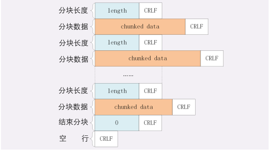


### 范围请求

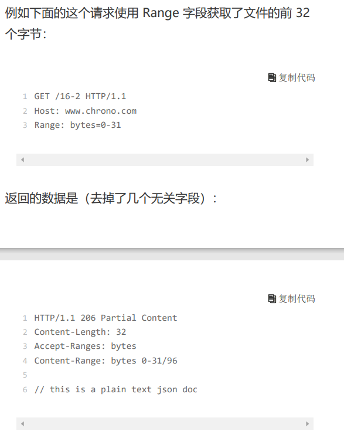

有了分块传输编码，服务器就可以轻松地收发大文件了，但 对于上 G 的超大文件，还有一些问题需要考虑。

比如，你在看当下正热播的某穿越剧，想跳过片头，直接看 正片，或者有段剧情很无聊，想拖动进度条快进几分钟，这 实际上是想获取一个大文件其中的片段数据，而分块传输并 没有这个能力

HTTP 协议为了满足这样的需求，提出了“范围请 求”（range requests）的概念，允许客户端在请求头里使 用专用字段来表示只获取文件的一部分，相当于是客户端 的“化整为零”。

范围请求不是 Web 服务器必备的功能，可以实现也可以不 实现，所以服务器必须在响应头里使用字段“**AcceptRanges: bytes**”明确告知客户端：“我是支持范围请求 的”。

如果不支持的话该怎么办呢？服务器可以发送“Accept-Ranges: none”，或者干脆不发送“Accept-Ranges”字 段，这样客户端就认为服务器没有实现范围请求功能，只能 老老实实地收发整块文件了。

请求头Range是 HTTP 范围请求的专用字段，格式 是“bytes=x-y”，其中的 x 和 y 是以字节为单位的数据 范围。

要注意 x、y 表示的是“偏移量”，范围必须从 0 计数

Range 的格式也很灵活，起点 x 和终点 y 可以省略，能够 很方便地表示正数或者倒数的范围。假设文件是 100 个字 节，那么：

“0-”表示从文档起点到文档终点，相当于“0-99”，即 整个文件； “10-”是从第 10 个字节开始到文档末尾，相当于“10- 99”； “-1”是文档的最后一个字节，相当于“99-99”； “-10”是从文档末尾倒数 10 个字节，相当于“90- 99”。


服务器收到 Range 字段后，需要做四件事。

1. 它必须检查范围是否合法，比如文件只有 100 个字 节，但请求“200-300”，这就是范围越界了。服务器就会 返回**状态码416**，意思是“你的范围请求有误，我无法处 理，请再检查一下”。
2. 如果范围正确，服务器就可以根据 Range 头计算偏 移量，读取文件的片段了，返回状态码“**206 Partial Content**”，和 200 的意思差不多，但表示 body 只是原 数据的一部分。
3. 服务器要添加一个响应头字段**Content-Range**，告 诉片段的实际偏移量和资源的总大小，格式是“bytes x-y/length”，与 Range 头区别在没有“=”，范围后多了 总长度。例如，对于“0-10”的范围请求，值就是“bytes 0-10/100”。
4. 最后剩下的就是发送数据了，直接把片段用 TCP 发给客户 端，一个范围请求就算是处理完了。


有了范围请求之后，HTTP 处理大文件就更加轻松了，看视 频时可以根据时间点计算出文件的 Range，不用下载整个 文件，直接精确获取片段所在的数据内容。

不仅看视频的拖拽进度需要范围请求，常用的下载工具里的 多段下载、断点续传也是基于它实现的，要点是：

先发个 HEAD，看服务器是否支持范围请求，同时获取文 件的大小； 

开 N 个线程，每个线程使用 Range 字段划分出各自负责 下载的片段，发请求传输数据； 

下载意外中断也不怕，不必重头再来一遍，只要根据上次 的下载记录，用 Range 请求剩下的那一部分就可以了。


### 多段数据

刚才说的范围请求一次只获取一个片段，其实它还支持在 Range 头里使用多个“x-y”，一次性获取多个片段数据

这种情况需要使用一种特殊的 MIME 类 型：“**multipart/byteranges**”，表示报文的 body 是由 多段字节序列组成的，并且还要用一个参 数“**boundary=xxx**”给出段之间的分隔标记。

多段数据的格式与分块传输也比较类似，但它需要用分隔标 记 boundary 来区分不同的片段，可以通过图来对比一下。

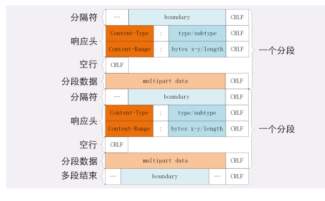

每一个分段必须以“- -boundary”开始（前面加两 个“-”），之后要用“Content-Type”和“ContentRange”标记这段数据的类型和所在范围，然后就像普通的响应头一样以回车换行结束，再加上分段数据，最后用一 个“- -boundary- -”（前后各有两个“-”）表示所有的 分段结束。


### 问答

分块传输数据的时候，如果数据里含有回车换行（\r\n） 是否会影响分块的处理呢？

```
分块传输中数据里含有回车换行（\r\n）不影响分块处
理，因为分块前有数据长度说明
```


如果对一个被 gzip 的文件执行范围请求，比如“Range: bytes=10-19”，那么这个范围是应用于原文件还是压缩 后的文件呢？

```
range是针对原文的还是压缩后的，可以想象
一下看视频的时候，我们拖拽进度条请求的range范围是
针对原视频长度的，如果针对压缩后的，那么我们实际拖
拽的范围和响应的数据范围就不一致了

需要分情况，看原文件是什么形式。如果原来的文件是
gzip的，那就正确。如果原文件是文本，而是在传输过程中
被压缩，那么就应用于压缩前的数据.
总之，range是针对原文件的。
```


## 排队也要讲效率：HTTP的连接管理


### 短连接

HTTP 协议最初（0.9/1.0）是个非常简单的协议，通信过程 也采用了简单的“请求 - 应答”方式。 它底层的数据传输基于 TCP/IP，每次发送请求前需要先与 服务器建立连接，收到响应报文后会立即关闭连接。 因为客户端与服务器的整个连接过程很短暂，不会与服务器 保持长时间的连接状态，所以就被称为“短连接”（shortlived connections）。早期的 HTTP 协议也被称为是“无 连接”的协议。


**短连接的缺点**相当严重，因为在 TCP 协议里，建立连接和 关闭连接都是非常“昂贵”的操作。TCP 建立连接要有“三 次握手”，发送 3 个数据包，**需要 1 个 RTT**；关闭连接 是“四次挥手”，4 个数据包需要 2 个 RTT。

> RTT 是往返时间 ，三次握手实际是的消耗只有1个RTT而已 ，因为直接收到对方的握手的ACK后，自己就可以直接发数据了，根本不用等待。
>
> 很明显虽然是3次握手，不过第3次是没有阻断业务数据的发送的（就是说所谓的第3次握手实际上是没有额外消耗时间的），所以您描述的2次握手在现实是没有意义的，因为他实际省不下来任何时间（当然也可能是我没有理解LZ说的2次握手）
>
> 
>
> 
> 那有没有只用0.5个RTT的情况，这个明显也是不合逻辑的，因为正常情况下首先发送业务数据的一定是发起连接的一方，不可能让服务收到SYN后就直接发业务数据（因为他也不知道客户端要什么），所以要么就先握手，要1个RTT；要么就不要提前握手直接发，0RTT（现在是有这种协议的）
>
> 
>
> 
> 现实中的第3次握手也主要是应对异常情况，比如恶意的客户的连接。（这个又好像与LZ描述的2次握手应对异常又好像是类似的，所以我也不能确认自己是不是理解了LZ的表述）所以虽然一个完整的握手是1.5个RTT（每个方向是1个RTT），不过对于连接来说他只阻塞了1个RTT。
>
> 
>
>
> 然后LZ说的考虑超时“频率”，及连接“耗时”，可能在指定特殊环境下有收益，对于要适用于尽可能多网络条件的标准协议不太使用，比如作为服务方可能收到世界各地的连接请求，他很难预测不同地方来的连接超时概率，所谓的耗时也一样，耗时其实就是靠RTT来衡量的，RTT的测算也是TCP的一部分，它是发生在连接建立后的。


### 长连接

针对短连接暴露出的缺点，HTTP 协议就提出了“长连 接”的通信方式，也叫“持久连接”（persistent connections）、“连接保活”（keep alive）、“连接复 用”（connection reuse）。

其实解决办法也很简单，用的就是“成本均摊”的思路，既 然 TCP 的连接和关闭非常耗时间，那么就把这个时间成本 由原来的一个“请求 - 应答”均摊到多个“请求 - 应 答”上。这样虽然不能改善 TCP 的连接效率，但基于“分母效 应”，每个“请求 - 应答”的无效时间就会降低不少，整体 传输效率也就提高了。


**连接相关的头字段**

由于长连接对性能的改善效果非常显著，所以在 HTTP/1.1 中的连接都会默认启用长连接。不需要用什么特殊的头字段 指定，只要向服务器发送了第一次请求，后续的请求都会重 复利用第一次打开的 TCP 连接，也就是长连接，在这个连 接上收发数据。

当然，我们也可以在请求头里明确地要求使用长连接机制， 使用的字段是Connection，值是“keep-alive”。

不过不管客户端是否显式要求长连接，如果服务器支持长连 接，它总会在响应报文里放一个“Connection: keepalive”字段，告诉客户端：“我是支持长连接的，接下来 就用这个 TCP 一直收发数据吧”。


不过长连接也有一些小缺点，问题就出在它的“长”字上。

因为 TCP 连接长时间不关闭，服务器必须在内存里保存它 的状态，这就占用了服务器的资源。如果有大量的空闲长连 接只连不发，就会很快耗尽服务器的资源，导致服务器无法 为真正有需要的用户提供服务。

所以，长连接也需要在恰当的时间关闭，不能永远保持与服 务器的连接，这在客户端或者服务器都可以做到。

在客户端，可以在请求头里加上“Connection: close”字 段，告诉服务器：“这次通信后就关闭连接”。服务器看到 这个字段，就知道客户端要主动关闭连接，于是在响应报文 里也加上这个字段，发送之后就调用 Socket API 关闭 TCP 连接。

> 服务器端通常不会主动关闭连接，但也可以使用一些策略。 拿 Nginx 来举例，它有两种方式：\1. 使用“keepalive_timeout”指令，设置长连接的超时时 间，如果在一段时间内连接上没有任何数据收发就主动断 开连接，避免空闲连接占用系统资源。 2. 使用“keepalive_requests”指令，设置长连接上可发送 的最大请求次数。比如设置成 1000，那么当 Nginx 在这 个连接上处理了 1000 个请求后，也会主动断开连接。 另外，客户端和服务器都可以在报文里附加通用头字 段“Keep-Alive: timeout=value”，限定长连接的超时时 间。但这个字段的约束力并不强，通信的双方可能并不会遵 守，所以不太常见。


### 队头阻塞

“队头阻塞”与短连接和长连接无关，而是由 HTTP 基本 的“请求 - 应答”模型所导致的。

因为 HTTP 规定报文必须是“一发一收”，这就形成了一个 先进先出的“串行”队列。队列里的请求没有轻重缓急的优 先级，只有入队的先后顺序，排在最前面的请求被最优先处 理。如果队首的请求因为处理的太慢耽误了时间，那么队列里后 面的所有请求也不得不跟着一起等待，结果就是其他的请求 承担了不应有的时间成本


### 性能优化

因为“请求 - 应答”模型不能变，所以“队头阻塞”问题在 HTTP/1.1 里无法解决，只能缓解，有什么办法呢？

这在 HTTP 里就是“**并发连接**”（concurrent connections），也就是同时对一个域名发起多个长连接， 用数量来解决质量的问题。

但这种方式也存在缺陷。如果每个客户端都想自己快，建立 很多个连接，用户数×并发数就会是个天文数字。服务器的 资源根本就扛不住，或者被服务器认为是恶意攻击，反而会 造成“拒绝服务”。


这个就是“域名分片”（domain sharding）技术，还是用 数量来解决质量的思路。

HTTP 协议和浏览器不是限制并发连接数量吗？好，那我就 多开几个域名，比如 shard1.chrono.com、 shard2.chrono.com，而这些域名都指向同一台服务器 www.chrono.com，这样实际长连接的数量就又上去了， 真是“美滋滋”。不过实在是有点“上有政策，下有对 策”的味道。


### 总结和问答

1. 早期的 HTTP 协议使用短连接，收到响应后就立即关闭 连接，效率很低； 
2. HTTP/1.1 默认启用长连接，在一个连接上收发多个请求 响应，提高了传输效率；
3. 服务器会发送“Connection: keep-alive”字段表示启用 了长连接； 
4. 报文头里如果有“Connection: close”就意味着长连接 即将关闭； 
5. 过多的长连接会占用服务器资源，所以服务器会用一些策 略有选择地关闭长连接； 
6.  “队头阻塞”问题会导致性能下降，可以用“并发连 接”和“域名分片”技术缓解。
7. http是“半双工”，只能一来一回收发 数据，这就是队头阻塞的根源
8. 域名分片其实很简单，就是申请多个域名，但这些域名最 后都映射到同一个网站服务器，这样就可以突破浏览器的限 制，让连接数是8*域名的个数。域名也可以解析成别名（cname），用于cdn负载均衡， 后面会讲到。


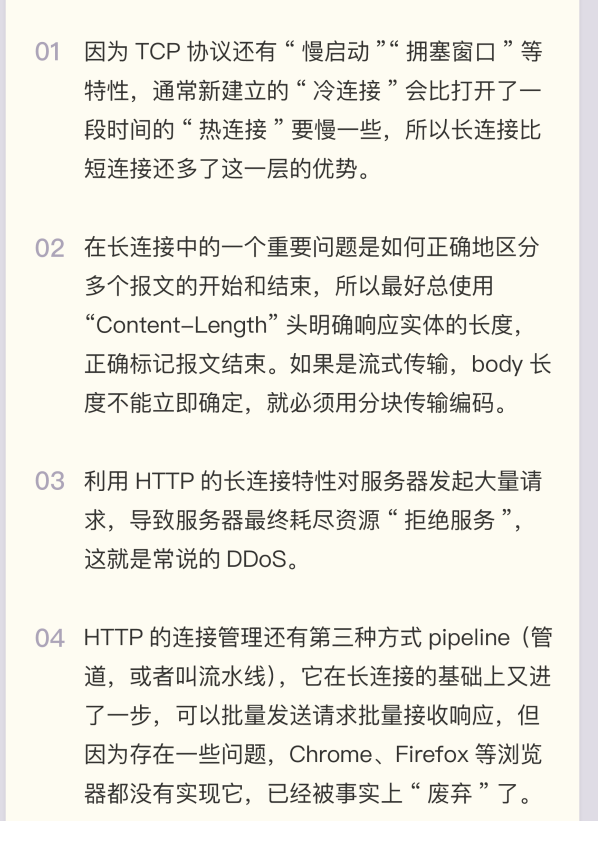

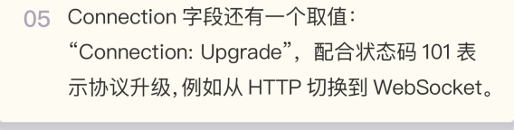


请问一下老师域名分片技术是不是让一个浏览器跟不同的 域名都建立长连接, 而这些域名都指向同一个服务器集群?

> 前半句对，后半句不一定，也可能是镜像集群。


1. 在开发基于 HTTP 协议的客户端时应该如何选择使用的 连接模式呢？短连接还是长连接？ 

	2. 应当如何降低长连接对服务器的负面影响呢？


## 四通八达：HTTP的重定向和跳转

点击页面“链接”时的跳转是怎样的呢？具体一点， 比如在 Nginx 的主页上点了一下“download”链接，会发 生什么呢？

浏览器首 先要解析链接文字里的 URI。再用这个 URI 发起一个新的 HTTP 请求，获取响应报文后 就会切换显示内容，渲染出新 URI 指向的页面。这样的跳转动作是由浏览器的使用者主动发起的，可以称 为“主动跳转”，但还有一类跳转是由服务器来发起的，浏 览器使用者无法控制，相对地就可以称为“被动跳转”，这 在 HTTP 协议里有个专门的名词，叫做“重定 向”（Redirection）。


**重定向的过程**

 3××状态 码时就说过，301 是“永久重定向”，302 是“临时重定 向”，浏览器收到这两个状态码就会跳转到新的 URI

这一次“重定向”实际上发送了两次 HTTP 请求，第一个请求返回了 302，然后第二个请求就被 重定向到了“/index.html”。


我们再来看看第一个请求返回的响应报文：出现了一个新的头字段“Location: /index.html”，它 就是 301/302 重定向跳转的秘密所在。

**Location”字段属于响应字段，必须出现在响应报文里。但只有配合 301/302 状态码才有意义**，它标记了服务器要求重定向的 URI，这里就是要求浏览器跳转 到“index.html

浏览器收到 301/302 报文，会检查响应头里有没有“Location”。如果有，就从字段值里提取出 URI，发出新的HTTP 请求，相当于自动替我们点击了这个链接。在“Location”里的 URI 既可以使用绝对 URI，也可以使用相对 URI。所谓“绝对 URI”，就是完整形式的 URI，包 括 scheme、host:port、path 等。所谓“相对 URI”，就是省略了 scheme 和 host:port，只有 path 和 query 部 分，是不完整的，但可以从请求上下文里计算得到。

注意，在重定向时如果只是在站内跳转，你可以放心地使用 相对 URI。但如果要跳转到站外，就必须用绝对 URI。

如果 301/302 跳转时没有 Location 字段会怎么样呢？


**重定向状态码**

* 301俗称“永久重定向”（Moved Permanently），意思 是原 URI 已经“永久”性地不存在了，今后的所有请求都必 须改用新的 URI。

  浏览器看到 301，就知道原来的 URI“过时”了，就会做适 当的优化。比如历史记录、更新书签，下次可能就会直接用 新的 URI 访问，省去了再次跳转的成本。搜索引擎的爬虫看 到 301，也会更新索引库，不再使用老的 URI。

* 302俗称“临时重定向”（“Moved Temporarily”），意 思是原 URI 处于“临时维护”状态，新的 URI 是起“顶 包”作用的“临时工”。 浏览器或者爬虫看到 302，会认为原来的 URI 仍然有效， 但暂时不可用，所以只会执行简单的跳转页面，不记录新的 URI，也不会有其他的多余动作，下次访问还是用原 URI。


**重定向的应用场景**

理解了重定向的工作原理和状态码的含义，我们就可以在服 务器端拥有主动权，控制浏览器的行为，不过要怎么利用重 定向才好呢？

使用重定向跳转，核心是要理解<font color='red'>“重定向”</font>和<font color='red'>“永久 / 临 时”</font>这两个关键词。


先来看什么时候需要重定向。

一个最常见的原因就是“**资源不可用**”，需要用另一个新的 URI 来代替。

至于不可用的原因那就很多了。例如域名变更、服务器变 更、网站改版、系统维护，这些都会导致原 URI 指向的资源 无法访问，为了避免出现 404，就需要用重定向跳转到新的 URI，继续为网民提供服务


另一个原因就是“**避免重复**”，让多个网址都跳转到一个 URI，增加访问入口的同时还不会增加额外的工作量

例如，有的网站都会申请多个名称类似的域名，然后把它们 再重定向到主站上。比如，你可以访问一 下“qq.com”“github.com ”“bing.com”（记得事先 清理缓存），看看它是如何重定向的。


决定要实行重定向后接下来要考虑的就是“永久”和“临 时”的问题了，也就是选择 301 还是 302。


301 的含义是“永久”的。

如果域名、服务器、网站架构发生了大幅度的改变，比如启 用了新域名、服务器切换到了新机房、网站目录层次重构， 这些都算是“永久性”的改变。原来的 URI 已经不能用了， 必须用 301“永久重定向”，通知浏览器和搜索引擎更新到 新地址，这也是搜索引擎优化（SEO）要考虑的因素之一。


302 的含义是“临时”的

原来的 URI 在将来的某个时间点还会恢复正常，常见的应用 场景就是系统维护，把网站重定向到一个通知页面，告诉用 户过一会儿再来访问。另一种用法就是“服务降级”，比如 在双十一促销的时候，把订单查询、领积分等不重要的功能 入口暂时关闭，保证核心服务能够正常运行。


**重定向的相关问题**

重定向的用途很多，掌握了重定向，就能够在架设网站时获 得更多的灵活性，不过在使用时还需要注意两个问题。

第一个问题是“**性能损耗**”。很明显，重定向的机制决定了 一个跳转会有两次请求 - 应答，比正常的访问多了一次。

虽然 301/302 报文很小，但大量的跳转对服务器的影响也 是不可忽视的。站内重定向还好说，可以长连接复用，站外 重定向就要开两个连接，如果网络连接质量差，那成本可就 高多了，会严重影响用户的体验。

第二个问题是“**循环跳转**”。如果重定向的策略设置欠考 虑，可能会出现“A=>B=>C=>A”的无限循环，不停地在 这个链路里转圈圈，后果可想而知。所以 HTTP 协议特别规定，浏览器必须具有检测“循环跳 转”的能力，在发现这种情况时应当停止发送请求并给出错 误提示。


### 总结与问答

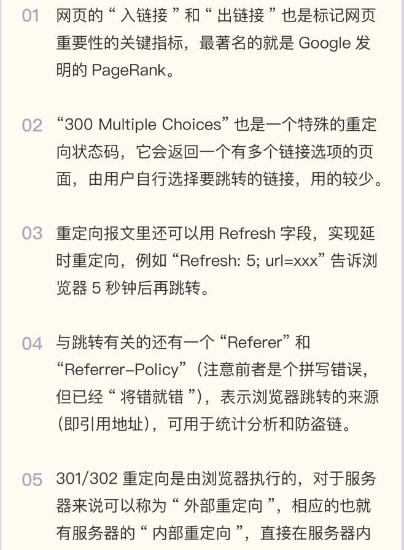

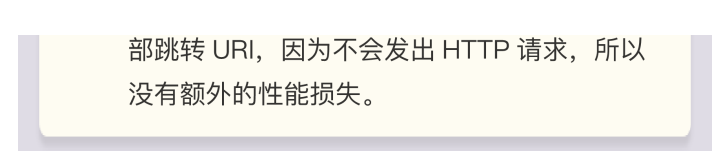


## HTTP的Cookie机制

HTTP 是“无状态”的，这既是优点也是缺点。优 点是服务器没有状态差异，可以很容易地组成集群，而缺点就是无法支持需要记录状态的事务操作。

**什么是 Cookie？**

HTTP 的 Cookie 机制也是一样的道理，既然服务器记不住，那就在外部想办法记住。相当 于是服务器给每个客户端都贴上一张小纸条，上面写了一些只有服务器才能理解的数据，需 要的时候客户端把这些信息发给服务器，服务器看到 Cookie，就能够认出对方是谁了。


**Cookie 的工作过程**

要用到两个字段：响应头字段Set-Cookie和请求头字段Cookie。 

当用户通过浏览器第一次访问服务器的时候，服务器肯定是不知道他的身份的。所以，就要**创建一个独特的身份标识数据，格式是“key=value”，然后放进 Set-Cookie 字段里， 随着响应报文一同发给浏览器。** 

**浏览器收到响应报文，看到里面有 Set-Cookie，知道这是服务器给的身份标识，于是就保存起来，下次再请求的时候就自动把这个值放进 Cookie 字段里发给服务器。** 

因为第二次请求里面有了 Cookie 字段，服务器就知道这个用户不是新人，之前来过，就可 以**拿出 Cookie 里的值，识别出用户的身份，然后提供个性化的服务**。 

不过因为服务器的“记忆能力”实在是太差，一张小纸条经常不够用。所以，服务器有时会 在响应头里添加多个 Set-Cookie，存储多个“key=value”。但浏览器这边发送时不需要 用多个 Cookie 字段，只要在一行里用“;”隔开就行


**Cookie 是由浏览器负责存储的，而不是操作系统。所以，它 是“浏览器绑定”的，只能在本浏览器内生效。**


**Cookie 的属性**

Cookie 就是服务器委托浏览器存储在客户端里的一些数据，而 这些数据通常都会记录用户的关键识别信息。所以，就需要在“key=value”外再用一些手段来保护，防止外泄或窃取，这些手段就是 Cookie 的属性。


首先，我们应该**设置 Cookie 的生存周期**，也就是它的有效期，让它只能在一段时间内可 用，就像是食品的“保鲜期”，一旦超过这个期限浏览器就认为是 Cookie 失效，在存储里删除，也不会发送给服务器。


**Cookie 的有效期可以使用 Expires 和 Max-Age 两个属性来设置。**

“Expires”俗称“过期时间”，用的是绝对时间点，可以理解为“截止日 期”（deadline）。“Max-Age”用的是相对时间，单位是秒，浏览器用收到报文的时间 点再加上 Max-Age，就可以得到失效的绝对时间。

Expires 和 Max-Age 可以同时出现，两者的失效时间可以一致，也可以不一致，但浏览器会**优先采用 Max-Age 计算失效期**。


其次，我们需要**设置 Cookie 的作用域**，让浏览器仅发送给特定的服务器和 URI，避免被其他网站盗用。

作用域的设置比较简单，“**Domain”和“Path”指定了 Cookie 所属的域名和路径**，浏 览器在发送 Cookie前会从 URI 中提取出 host 和 path 部分，对比 Cookie 的属性。如果不满足条件，就不会在请求头里发送 Cookie。

使用这两个属性可以为不同的域名和路径分别设置各自的 Cookie，比如“/19-1”用一个 Cookie，“/19-2”再用另外一个 Cookie，两者互不干扰。不过现实中为了省事，通常 Path 就用一个“/”或者直接省略，表示域名下的任意路径都允许使用 Cookie，让服务器自己去挑。


最后要考虑的就是**Cookie 的安全性**了，尽量不要让服务器以外的人看到。

在 JS 脚本里可以用 document.cookie 来读写 Cookie 数据， 这就带来了安全隐患，有可能会导致“跨站脚本”（XSS）攻击窃取数据。**属性“HttpOnly”会告诉浏览器，此 Cookie 只能通过浏览器 HTTP 协议传输，禁止其他 方式访问**，浏览器的 JS 引擎就会禁用 document.cookie 等一切相关的 API，脚本攻击也就无从谈起了。

**另一个属性“SameSite”可以防范“跨站请求伪造”（XSRF）攻击**，设置 成“SameSite=Strict”可以严格限定 Cookie 不能随着跳转链接跨站发送， 而“SameSite=Lax”则略宽松一点，允许 GET/HEAD 等安全方法，但禁止 POST 跨站发送。

**还有一个属性叫“Secure”，表示这个 Cookie 仅能用 HTTPS 协议加密传输，明文的 HTTP 协议会禁止发送**。但 Cookie本身不是加密的，浏览器里还是以明文的形式存在。

Chrome 开发者工具是查看 Cookie 的有力工具，在“Network-Cookies”里可以看到单 个页面 Cookie 的各种属性，另一个“Application”面板里则能够方便地看到全站的所有 Cookie。


**Cookie 的应用**

现在回到我们最开始的话题，有了 Cookie，服务器就有了“记忆能力”，能够保存“状 态”，那么应该如何使用 Cookie 呢？ 

**Cookie 最基本的一个用途就是身份识别，保存用户的登录信息，实现会话事务。**

比如，你用账号和密码登录某电商，登录成功后网站服务器就会发给浏览器一个 Cookie， 内容大概是“name=yourid”，这样就成功地把身份标签贴在了你身上。之后你在网站里随便访问哪件商品的页面，浏览器都会自动把身份 Cookie 发给服务器，所 以服务器总会知道你的身份，一方面免去了重复登录的麻烦，另一方面也能够自动记录你的 浏览记录和购物下单（在后台数据库或者也用 Cookie），实现了“状态保持”。


**Cookie 的另一个常见用途是广告跟踪。**

你上网的时候肯定看过很多的广告图片，这些图片背后都是广告商网站（例如 Google）， 它会“偷偷地”给你贴上 Cookie 小纸条，这样你上其他的网站，别的广告就能用 Cookie 读出你的身份，然后做行为分析，再推给你广告。

这种 Cookie 不是由访问的主站存储的，所以又叫“第三方 Cookie”（third-party cookie）。如果广告商势力很大，广告到处都是，那么就比较“恐怖”了，无论你走到哪 里它都会通过 Cookie 认出你来，实现广告“精准打击”。

为了防止滥用 Cookie 搜集用户隐私，互联网组织相继提出了 DNT（Do Not Track）和 P3P（Platform for Privacy Preferences Project），但实际作用不大。


### 总结与问答

1. Cookie 是服务器委托浏览器存储的一些数据，让服务器有了“记忆能力”； 
2. 响应报文使用 Set-Cookie 字段发送“key=value”形式的 Cookie 值； 
3. 请求报文里用 Cookie 字段发送多个 Cookie 值； 
4. 为了保护 Cookie，还要给它设置有效期、作用域等属性，常用的有 Max-Age、 Expires、Domain、HttpOnly 等； 
5. Cookie 最基本的用途是身份识别，实现有状态的会话事务。

还要提醒你一点，因为 Cookie 并不属于 HTTP 标准（RFC6265，而不是 RFC2616/7230），所以语法上与其他字段不太一致，使用的分隔符是“;”，与 Accept 等字段的“,”不同，小心不要弄错了。


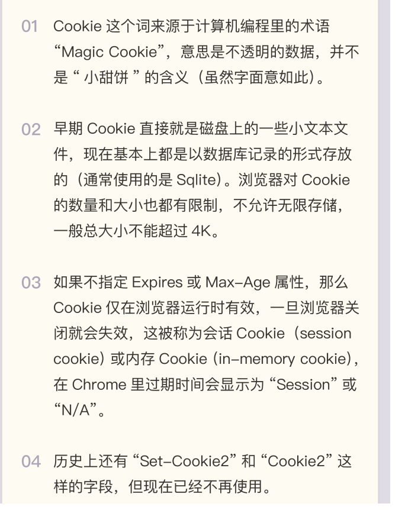


1. 如果 Cookie 的 Max-Age 属性设置为 0，会有什么效果呢？ 设置为0，服务器0秒就让Cookie失效，即立即失效，服务器不存Cookie。 
2. Cookie 的好处已经很清楚了，你觉得它有什么缺点呢？ 好处：方便了市民 缺点：方便了黑客:


1. （我修改 Lua 文件测试了一下）如果 Max-Age 设置为0，浏览器中该 Cookie 失效， 即便这个 Cookie 已存在于浏览器中，且尚未过期。另外 Web 应用开发中，可以通过这种 方式消除掉用户的登陆状态，此外记得在服务器的 session 中移除该 cookie 和其对应的用 户信息。


挺好的，cookie存放在流浪器端，不太安全。我是用java的现在用户数据大多存储在服务 器缓存里了。一些不重要的数据可以放在cookie，cookie安全的那些参数，有利有弊吧。 设置了设置了domain就没法跨越了，有些场景需要跨越的就不能设了，path太大全局可 见不好，太小上级路径取不到就丢了。HttpOnly和SameSite过安全测评的时候都会要求加 上。加了肯定会有不方便的地方，前端不怎么会


## HTTP的缓存控制

由于链路漫长，网络时延不可控，浏览器使用 HTTP 获取资源的成本较高。所以，非常有 必要把“来之不易”的数据缓存起来，下次再请求的时候尽可能地复用。这样，就可以避免 多次请求 - 应答的通信成本，节约网络带宽，也可以加快响应速度。


HTTP 传输的每一个环节基本上都会有缓存

基于“请求 - 应答”模式的特点，可以大致分为客户端缓存和服务器端缓存，因为服务器 端缓存经常与代理服务“混搭”在一起，所以今天我先讲客户端——也就是浏览器的缓 存。


### 服务器的缓存控制

1. 浏览器发现缓存无数据，于是发送请求，向服务器获取资源；
2. 服务器响应请求，返回资源，同时标记资源的有效期； 
3. 浏览器缓存资源，等待下次重用。


服务器标记资源有效期使用的头字段是“Cache-Control”，里面的值“max-age=30”就是资源的有效时间，相当于告诉浏览器，“这个页面只能缓存 30 秒，之后就 算是过期，不能用。”


让浏览器直接缓存数据就好了，为什么要加个有效期呢？

“Cache-Control”字段里的“max-age”和上一讲里 Cookie 有点像，都是标记资源的有效期。

这里的 **max-age 是“生存时间”**（又叫“新鲜度”“缓存寿命”， 类似 TTL，Time-To-Live），时间的计算起点是响应报文的创建时刻（即 Date 字段，也 就是离开服务器的时刻），而不是客户端收到报文的时刻，也就是说包含了在链路传输过程 中所有节点所停留的时间。

“max-age”是 HTTP 缓存控制最常用的属性，此外在响应报文里还可以用其他的属性来更精确地指示浏览器应该如何使用缓存：

* no_store：不允许缓存，用于某些变化非常频繁的数据，例如秒杀页面； 
* no_cache：它的字面含义容易与 no_store 搞混，实际的意思并不是不允许缓存，而是 可以缓存，但在使用之前必须要去服务器验证是否过期，是否有最新的版本； 
* must-revalidate：又是一个和 no_cache 相似的词，它的意思是如果缓存不过期就可以 继续使用，但过期了如果还想用就必须去服务器验证。


### 客户端的缓存控制

你可以在 Chrome 里点几次“刷新”按钮，估计你会失望，页面上的 ID 一直在变，根本 不是缓存的结果，明明说缓存 30 秒，怎么就不起作用呢？

其实不止服务器可以发“Cache-Control”头，浏览器也可以发“Cache-Control”，也就是说**请求 - 应答的双方都可以用这个字段进行缓存控制，互相协商缓存的使用策略。**


当你点“刷新”按钮的时候，浏览器会在请求头里加一个“Cache-Control: max-age=0”。因为 max-age 是“生存时间”，max-age=0 的意思就是“我要一个最最新鲜 的西瓜”，而本地缓存里的数据至少保存了几秒钟，所以浏览器就不会使用缓存，而是向服 务器发请求。服务器看到 max-age=0，也就会用一个最新生成的报文回应浏览器。


Ctrl+F5 的“强制刷新”又是什么样的呢？

它其实是发了一个“Cache-Control: no-cache”，含义和“max-age=0”基本一样，就 看后台的服务器怎么理解，通常两者的效果是相同的。


那么，浏览器的缓存究竟什么时候才能生效呢？

别着急，试着点一下浏览器的“前进”“后退”按钮，再看开发者工具，你就会惊喜地发 现“from disk cache”的字样，意思是没有发送网络请求，而是读取的磁盘上的缓存

另外，如果用第 18 讲里的重定向跳转功能，也可以发现浏览器使用了缓存：


这几个操作与刷新有什么区别呢？

其实也很简单，在“前进”“后退”“跳转”这些重定向动作中浏览器不会“夹带私货”， 只用最基本的请求头，没有“Cache-Control”，所以就会检查缓存，直接利用之前的资 源，不再进行网络通信。


**条件请求**

浏览器用“Cache-Control”做缓存控制只能是刷新数据，不能很好地利用缓存数据，又因 为缓存会失效，使用前还必须要去服务器验证是否是最新版。

那么该怎么做呢？

浏览器可以用两个连续的请求组成“验证动作”：先是一个 HEAD，获取资源的修改时间等元信息，然后与缓存数据比较，如果没有改动就使用缓存，节省网络流量，否则就再发一 个 GET 请求，获取最新的版本。

但这样的**两个请求网络成本太高了**，所以 HTTP 协议就定义了一系列“If”开头的“条件请 求”字段，专门用来检查验证资源是否过期，把两个请求才能完成的工作合并在一个请求里 做。而且，**验证的责任也交给服务器**，浏览器只需“坐享其成”。

条件请求一共有 5 个头字段，我们最常用的是“if-Modified-Since”和“If-None-Match”这两个。**需要第一次的响应报文预先提供“Last-modified”和“ETag”，然后 第二次请求时就可以带上缓存里的原值，验证资源是否是最新的。**

如果资源没有变，服务器就回应一个“304 Not Modified”，表示缓存依然有效，浏览器 就可以更新一下有效期，然后放心大胆地使用缓存了。

“Last-modified”很好理解，就是文件的最后修改时间。ETag 是什么呢？

**ETag 是“实体标签”（Entity Tag）的缩写，是资源的一个唯一标识，主要是用来解决修改时间无法准确区分文件变化的问题。**

比如，一个文件在一秒内修改了多次，但因为修改时间是秒级，所以这一秒内的新版本无法 区分。 再比如，一个文件定期更新，但有时会是同样的内容，实际上没有变化，用修改时间就会误以为发生了变化，传送给浏览器就会浪费带宽。 使**用 ETag 就可以精确地识别资源的变动情况**，让浏览器能够更有效地利用缓存。

> ETag 还有“强”“弱”之分。 强 ETag 要求资源在字节级别必须完全相符，弱 ETag 在值前有个“W/”标记，只要求资 源在语义上没有变化，但内部可能会有部分发生了改变（例如 HTML 里的标签顺序调整， 或者多了几个空格）。


条件请求里其他的三个头字段是“If-Unmodified-Since”“If-Match”和“If-Range”， 其实只要你掌握了“if-Modified-Since”和“If-None-Match”，可以轻易地“举一反 三”。


```markdown
Etag的工作原理 Etag在服务器上生成后,客户端通过If-Match或者说If-None-Match这个条件判断请求来验证资源是否修改.我们常见的是使用If-None-Match.请求一个文件的流程可能如下： 新的请求 客户端发起HTTP GET请求一个文件(css ,image,js)；服务器处理请求,返回文件内容和一堆Header(包括Etag,例如"2e681a-6-5d044840"),http头状态码为为200. 同一个用户第二次这个文件的请求 客户端在一次发起HTTP GET请求一个文件,注意这个时候客户端同时发送一个If-None-Match头,这个头中会包括上次这个文件的Etag(例如"2e681a- 6-5d044840"),这时服务器判断发送过来的Etag和自己计算出来的Etag,因此If-None-Match为False,不返回200,返 回304,客户端继续使用本地缓存； 注意.服务器又设置了Cache-Control:max-age和Expires时,会同时使用,也就是说在完全匹配If-Modified-Since和If-None-Match即检查完修改时间和Etag之后,服务器才能返回304. 对于 "if-Modified-Since"应该也是一样的，只不过里面存的是这个文件上次被修改的时间，服务器拿到后进行比对，只是没有 Etag 那么精确。
```


### 总结与问答

1. 缓存是优化系统性能的重要手段，HTTP 传输的每一个环节中都可以有缓存； 
2. 服务器使用“Cache-Control”设置缓存策略，常用的是“max-age”，表示资源的有 效期； 
3. 浏览器收到数据就会存入缓存，如果没过期就可以直接使用，过期就要去服务器验证是 否仍然可用； 
4. 验证资源是否失效需要使用“条件请求”，常用的是“if-Modified-Since”和“IfNone-Match”，收到 304 就可以复用缓存里的资源； 
5. 验证资源是否被修改的条件有两个：“Last-modified”和“ETag”，需要服务器预先 在响应报文里设置，搭配条件请求使用； 
6. 浏览器也可以发送“Cache-Control”字段，使用“max-age=0”或“no_cache”刷 新数据

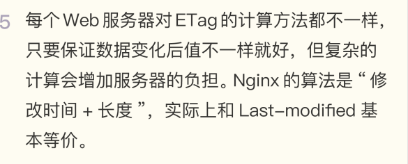


1. Cache 和 Cookie 都是服务器发给客户端并存储的数据，你能比较一下两者的异同吗？ 
2. 即使有“Last-modified”和“ETag”，强制刷新（Ctrl+F5）也能够从服务器获取最新数据（返回 200 而不是 304），请你在实验环境里试一下，观察请求头和响应头，解释 原因。


```markdown
Cache 和 Cookie 的相同点是：都会保存到浏览器中，并可以设置过期时间。
不同点：
1. Cookie 会随请求报文发送到服务器，而 Cache 不会，但可能会携带 if-Modified-Since（保存资源的最后修改时间）和 If-None-Match（保存资源唯一标识） 字段来验证资源是否过期。
2. Cookie 在浏览器可以通过脚本获取（如果 cookie 没有设置 HttpOnly），Cache 则无法在浏览器中获取（出于安全原因）。
3. Cookie 通过响应报文的 Set-Cookie 字段获得，Cache 则是位于 body 中。(第三点感觉有点问题，cache缓存的是完整的报文，不单单是body。)
4. 用途不同。Cookie 常用于身份识别，Cache 则是由浏览器管理，用于节省带宽和加快响应速度。
5. Cookie 的 max-age 是从浏览器拿到响应报文时开始计算的，而 Cache 的 max-age 是从响应报文的生成时间（Date 头字段）开始计算。


1. cookie是方便进行身份识，cache是为了减少网络请求。
2. 强制刷新是因为请求头里的 If-Modified-Since 和 If-None-Match 会被清空所以会返回最新数据


老师我有几个问题想问一下：
1. F5刷新的时候，请求头加上"Cache-Control: max-age=0"，您文章里说，服务器用一个最新生成的报文回应浏览器，那这时候响应返回的应该是"200 OK"吗？为什么我在极客网页版的这个页面刷新后，有个叫"106804"的资源返回的是"304"，但是强制刷新是"200 ok"，产生的效果好像不同呀。这里是不是应该换一种方式说？感觉强制刷新说的有些简单了。
2. F5刷新发送的请求头是固定的吗？还是会根据浏览器不同而产生变化？
3. 200（from memory cache）和200(from disk cache)是针对内存和硬盘的，他们出现的场景分别是什么呢？
4. HTTP缓存有标准性的流程吗？比如说从我输入URL开始，到后续刷新或者强制刷新等？
5.对于"must-revalidate"我有疑问，本身存储机制不就是如果不过期的话可以继续使用，过期的话去请求服务器吗？那这个属性还有什么意义呢？
6. no-cache,no-store,max-age等属性可以共存吗？
问题有点多，因为网上资料质量参差不齐，解释有些也不全相同，所以在这里咨询下老师，希望老师可以解答一下，或者有推荐的讲述HTTP缓存的文章也可以，谢谢老师


作者回复: 1.强制刷新请求最新的资源，没有条件请求，所以不会有304，都是200。

2.每个浏览器可能会有不同，但基本的字段是一样的。

3.缓存的位置不一样，浏览器会分别存放到内存或者硬盘上，所以会显示来源不同。

4.http只规定了缓存的用法，具体如何存放如何使用就是客户端自己灵活实现了，怎么方便怎么来。

5.过期后去验证，如果服务器返回304，那么就可以继续重用缓存，而不用下载整个资源。

6.可以看一下流程图，不是所以的属性都能共存的。当然如果你要是都写上也不是不可以，那浏览器就会“精神错乱”了。


cookie是服务端为了快速辨识客户端身份，保存在客户端的键值对缓存；
cache是客户端为了避免不必要网络请求，加快响应速度，存储在本地的服务端内容。


1.cache的作用为定义浏览器对静态文件如何进行缓存控制，目的是为了有效利用可复用的资源，尽可能减少客户端的请求，优化用户体验减轻服务器响应压力。常用字段值就那么一些，并有各自的含义。cookie的作用是增加了http请求的状态性，让服务器‘认识’当前访问的用户是谁，字段key,value值都可以自定义，比较灵活。
2.看了下天猫首页的css., js文件，普通的刷新（F5）操作中，不会在请求头中包含cache-control、if-none-match，if-Modified-Since,刷新会命中缓存文件，属于强缓存。强制刷新（ctrl + f5）在请求头中附加了cache-control: no-cache，为协商缓存，相当于设置max-age=0;所以此时不会使用本地缓存，当前页面所有的请求均是如此


1、cookie主要用于保存会话状态，会作为字段发送给服务端，用于身份认证。而cache是整个资源，也就是整个报文，不作为字段，但是要使用缓存需要设置相应字段。
2、强制刷新后：Cache-Control：no-cache，且没有If-None-Match和If-Modified-Since字段，这样就不能命中缓存了，所以会返回200；而普通刷新有这些字段，Cache-Control为max-age=0，存在If-None-Match或If-Modified-Since字段，根据情况使用强缓存协商缓存。


cache-control是管理缓存，不是决定验证的。
验证的条件是modified-date和etag，由条件请求发起验证。
```


## HTTP的代理服务

在前面讲 HTTP 协议的时候，我们严格遵循了 HTTP 的“请求 - 应答”模型，协议中只有 两个互相通信的角色，分别是“请求方”浏览器（客户端）和“应答方”服务器。引入 HTTP 代理后，原来简单的双方通信就变复杂了一些，加入了一个或者多个中间人， 但整体上来看，还是一个有顺序关系的链条，而且链条里相邻的两个角色仍然是简单的一对 一通信，不会出现越级的情况

链条的起点还是客户端（也就是浏览器），中间的角色被称为代理服务器（proxy server），链条的终点被称为源服务器（origin server），意思是数据的“源头”“起 源”。


**代理服务**

所谓的“代理服务”就是指服务本身不生产内容，而是处于中间位置转发上下游的请求和响 应，具有双重身份：面向下游的用户时，表现为服务器，代表源服务器响应客户端的请求； 而面向上游的源服务器时，又表现为客户端，代表客户端发送请求。

反向代理，它在传输链路中更靠近源服务器，为源服 务器提供代理服务


**代理的作用**

“计算机科学领域里的任何问题，都可以通过引入一个中间 层来解决”（在这句话后面还可以再加上一句“如果一个中间层解决不了问题，那就再加一 个中间层”）。TCP/IP 协议栈是这样，而代理也是这样。

由于代理处在 HTTP 通信过程的中间位置，相应地就对上屏蔽了真实客户端，对下屏蔽了 真实服务器，简单的说就是“欺上瞒下”。在这个中间层的“小天地”里就可以做很多的事 情，为 HTTP 协议增加更多的灵活性，实现客户端和服务器的“双赢”

代理最基本的一个功能是负载均衡。因为在面向客户端时屏蔽了源服务器，客户端看到的只 是代理服务器，源服务器究竟有多少台、是哪些 IP 地址都不知道。于是代理服务器就可以 掌握请求分发的“大权”，决定由后面的哪台服务器来响应请求

代理中常用的负载均衡算法你应该也有所耳闻吧，比如轮询、一致性哈希等等，这些算法的 目标都是尽量把外部的流量合理地分散到多台源服务器，提高系统的整体资源利用率和性 能。

在负载均衡的同时，代理服务还可以执行更多的功能，比如：

* 健康检查：使用“心跳”等机制监控后端服务器，发现有故障就及时“踢出”集群，保证 服务高可用； 
* 安全防护：保护被代理的后端服务器，限制 IP 地址或流量，抵御网络攻击和过载； 
* 加密卸载：对外网使用 SSL/TLS 加密通信认证，而在安全的内网不加密，消除加解密成 本； 
* 数据过滤：拦截上下行的数据，任意指定策略修改请求或者响应； 
* 内容缓存：暂存、复用服务器响应，这个与第 20 讲密切相关，我们稍后再说。


**代理相关头字段**

代理的好处很多，但因为它“欺上瞒下”的特点，隐藏了真实客户端和服务器，如果双方想 要获得这些“丢失”的原始信息，该怎么办呢？

首先，代理服务器需要用字段“Via”标明代理的身份。

Via 是一个通用字段，请求头或响应头里都可以出现。每当报文经过一个代理节点，代理服 务器就会把自身的信息追加到字段的末尾，就像是经手人盖了一个章。

如果通信链路中有很多中间代理，就会在 Via 里形成一个链表，这样就可以知道报文究竟 走过了多少个环节才到达了目的地。

> 例如下图中有两个代理：proxy1 和 proxy2，客户端发送请求会经过这两个代理，依次添 加就是“Via: proxy1, proxy2”，等到服务器返回响应报文的时候就要反过来走，头字段 就是“Via: proxy2, proxy1”。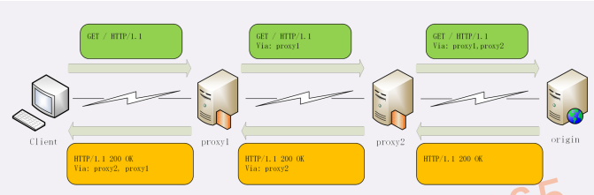


Via 字段只解决了客户端和源服务器判断是否存在代理的问题，还不能知道对方的真实信 息。

但服务器的 IP 地址应该是保密的，关系到企业的内网安全，所以一般不会让客户端知道。 不过反过来，**通常服务器需要知道客户端的真实 IP 地址**，方便做访问控制、用户画像、统 计分析。

可惜的是 HTTP 标准里并没有为此定义头字段，但已经出现了很多“事实上的标准”，最 常用的两个头字段是“X-Forwarded-For”和“X-Real-IP”。

“X-Forwarded-For”的字面意思是“为谁而转发”，形式上和“Via”差不多，也是每经 过一个代理节点就会在字段里追加一个信息。但“Via”追加的是代理主机名（或者域 名），而“X-Forwarded-For”追加的是请求方的 IP 地址。所以，在字段里最左边的 IP 地址就客户端的地址。

“X-Real-IP”是另一种获取客户端真实 IP 的手段，它的作用很简单，就是记录客户端 IP 地址，没有中间的代理信息，相当于是“X-Forwarded-For”的简化版。如果客户端和源 服务器之间只有一个代理，那么这两个字段的值就是相同的。“X-Forwarded-Host”和“X-Forwarded-Proto”，它们的作用与“X-Real-IP”类 似，只记录客户端的信息，分别是客户端请求的原始域名和原始协议名。

> 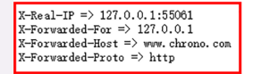


单从浏览器的页面上很难看出代理做了哪些工作，因为代理的转发都在后台不可见，所以我 把这个过程用 Wireshark 抓了一个包：

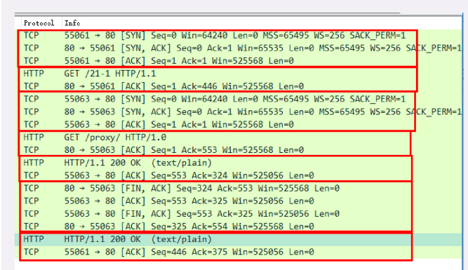


从抓包里就可以清晰地看出代理与客户端、源服务器的通信过程： 

1. 客户端 55061 先用三次握手连接到代理的 80 端口，然后发送 GET 请求； 
2. 代理不直接生产内容，所以就代表客户端，用 55063 端口连接到源服务器，也是三次握 手； 
3. 代理成功连接源服务器后，发出了一个 HTTP/1.0 的 GET 请求； 
4. 因为 HTTP/1.0 默认是短连接，所以源服务器发送响应报文后立即用四次挥手关闭连 接； 
5. 代理拿到响应报文后再发回给客户端，完成了一次代理服务。


**代理协议**

有了“X-Forwarded-For”等头字段，源服务器就可以拿到准确的客户端信息了。但对于 代理服务器来说它并不是一个最佳的解决方案。

因为通过“X-Forwarded-For”操作代理信息必须要解析 HTTP 报文头，这对于代理来说 成本比较高，原本只需要简单地转发消息就好，而现在却必须要费力解析数据再修改数据， 会降低代理的转发性能。

另一个问题是“X-Forwarded-For”等头必须要修改原始报文，而有些情况下是不允许甚 至不可能的（比如使用 HTTPS 通信被加密）。

所以就出现了一个专门的“代理协议”（The PROXY protocol），它由知名的代理软件 HAProxy 所定义，也是一个“事实标准”，被广泛采用（注意并不是 RFC）。

“代理协议”有 v1 和 v2 两个版本，v1 和 HTTP 差不多，也是明文，而 v2 是二进制格 式。今天只介绍比较好理解的 v1，它**在 HTTP 报文前增加了一行 ASCII 码文本，相当于又 多了一个头**。

这一行文本其实非常简单，开头必须是“PROXY”五个大写字母，然后是“TCP4”或 者“TCP6”，表示客户端的 IP 地址类型，再后面是请求方地址、应答方地址、请求方端口 号、应答方端口号，最后用一个回车换行（\r\n）结束。

> 例如下面的这个例子，在 GET 请求行前多出了 PROXY 信息行，客户端的真实 IP 地址 是“1.1.1.1”，端口号是 55555。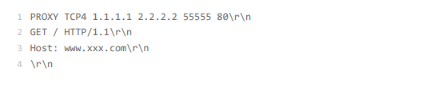

服务器看到这样的报文，只要解析第一行就可以拿到客户端地址，不需要再去理会后面的 HTTP 数据，省了很多事情。

不过代理协议并不支持“X-Forwarded-For”的链式地址形式，所以拿到客户端地址后再 如何处理就需要代理服务器与后端自行约定。


### 总结与问答

专门的“代理协议”可以在不改动原始报文的情况下传递客户端的真实 IP

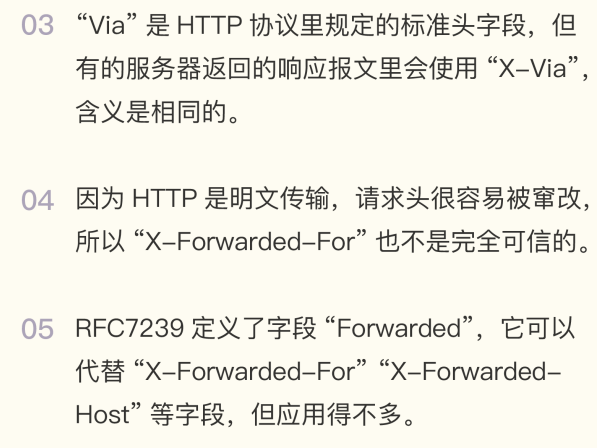


1. 你觉得代理有什么缺点？实际应用时如何避免？ 
2. 2. 你知道多少反向代理中使用的负载均衡算法？它们有什么优缺点？


